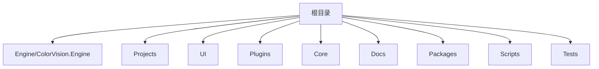

# AR/VR 测试算法


# AR/VR 测试算法

## 目录
1. [介绍](#介绍)
2. [项目结构](#项目结构)
3. [核心组件](#核心组件)
4. [架构概述](#架构概述)
5. [详细组件分析](#详细组件分析)
6. [依赖分析](#依赖分析)
7. [性能考虑](#性能考虑)
8. [故障排查指南](#故障排查指南)
9. [结论](#结论)

## 介绍
本项目旨在提供一套用于AR/VR设备测试的算法模板，涵盖了畸变（Distortion）、MTF（调制传递函数）、FOV（视场）、SFR（空间频率响应）、鬼影（Ghost）、双目融合（Binocular Fusion）等关键算法。通过这些算法，用户可以对AR/VR设备的图像质量和显示性能进行全面评估。项目采用模块化设计，支持灵活的算法扩展和设备接入，适用于多种测试场景。

## 项目结构
项目整体采用模块化分层架构，代码按功能和技术层次划分，便于维护和扩展。主要目录及说明如下：



1. **Engine/ColorVision.Engine**  
   - 这是核心引擎模块，包含算法模板、设备服务、消息传递、数据库访问等核心逻辑。  
   - 其中`Templates/ARVR`子目录存放AR/VR相关算法实现，如畸变、MTF、FOV等。  
   - `Services/Devices`包含设备相关服务和配置管理。  
   - `Messages`负责消息通信和事件处理。  
   - 此目录是项目的业务逻辑核心。

2. **Projects**  
   - 包含多个具体项目实现，如`ProjectARVR`，即AR/VR测试项目。  
   - 每个项目目录包含项目配置、窗口UI、业务逻辑等，负责具体的应用层实现。

3. **UI**  
   - 用户界面相关代码和主题资源。  
   - 包括控件、主题样式、视图模型等。

4. **Plugins**  
   - 插件模块，支持扩展功能，如事件查看器、屏幕录制等。

5. **Core**  
   - 基础库和底层实现，如OpenCV封装、CUDA支持等。

6. **Docs**  
   - 项目相关文档。

7. **Packages**  
   - 第三方依赖库和头文件。

8. **Scripts**  
   - 构建、配置和辅助脚本。

9. **Tests**  
   - 测试代码。

整体上，项目采用MVVM设计模式，界面与业务逻辑分离，算法模块独立，设备服务和消息通信模块解耦，保证系统灵活性和可维护性。

## 核心组件
根据AR/VR测试算法的需求，核心组件主要集中在`Engine/ColorVision.Engine/Templates/ARVR`目录，包含以下算法模块：

- **畸变算法（Distortion）**  
  负责评估图像的几何畸变，检测图像中因透镜或显示器引起的形变。

- **MTF算法（Modulation Transfer Function）**  
  用于测量系统对不同空间频率的响应，反映图像的清晰度。

- **FOV算法（Field of View）**  
  测量设备的视场大小，评估显示区域范围。

- **SFR算法（Spatial Frequency Response）**  
  评估图像的空间频率响应特性，与MTF相似。

- **鬼影算法（Ghost）**  
  检测图像中的重影现象，影响视觉体验。

- **双目融合算法（Binocular Fusion）**  
  评估双目视觉效果，确保左右眼图像融合自然。

每个算法模块通常包含以下核心类：

- 算法实现类（如`AlgorithmDistortion`、`AlgorithmMTF`、`AlgorithmFOV`等）  
  负责算法逻辑封装，提供命令发送、模板打开、结果显示等功能。

- 参数类（如`DistortionParam`、`MTFParam`、`FOVParam`）  
  用于存储算法配置参数。

- 视图显示控件（如`DisplayDistortion`、`DisplayMTF`、`DisplayFOV`）  
  用于UI显示结果。

- 数据访问对象（DAO）  
  负责结果数据的存储和管理。

## 架构概述
项目采用分层架构，主要分为以下层次：

1. **界面层（UI）**  
   提供用户交互界面，基于WPF，使用MVVM模式设计。界面层调用算法层和设备服务层完成功能。

2. **算法层（Engine.Templates.ARVR）**  
   封装各类AR/VR测试算法，独立实现，支持模板配置和结果展示。

3. **设备服务层（Engine.Services.Devices）**  
   管理硬件设备和算法服务的通信，采用MQTT协议实现消息异步传递。

4. **消息层（Engine.Messages）**  
   负责事件和消息的封装与传递，支持异步通信和历史数据管理。

5. **数据访问层（Engine.MySql）**  
   负责持久化存储，包括算法结果、配置参数等。

6. **核心库层（Core）**  
   提供底层图像处理、OpenCV集成、CUDA加速等支持。

整体架构支持模块解耦和扩展，便于新增算法和设备类型。

## 详细组件分析

### 1. AlgorithmDistortion.cs（畸变算法实现）

功能：  
该类封装了畸变评价算法的核心逻辑，负责打开畸变模板编辑窗口，发送畸变测试命令，并管理算法显示控件。

关键代码片段：

```csharp
public class AlgorithmDistortion : DisplayAlgorithmBase
{
    public DeviceAlgorithm Device { get; set; }
    public MQTTAlgorithm DService { get => Device.DService; }

    public RelayCommand OpenTemplateCommand { get; set; }

    public AlgorithmDistortion(DeviceAlgorithm deviceAlgorithm)
    {
        Name = "畸变评价";
        Order = 55;
        Group = "AR/VR算法";
        Device = deviceAlgorithm;
        OpenTemplateCommand = new RelayCommand(a => OpenTemplate());
    }

    public void OpenTemplate()
    {
        new TemplateEditorWindow(new TemplateDistortionParam(), TemplateSelectedIndex)
        {
            Owner = Application.Current.GetActiveWindow(),
            WindowStartupLocation = WindowStartupLocation.CenterOwner
        }.Show();
    }

    public MsgRecord SendCommand(DistortionParam param, string deviceCode, string deviceType, string fileName, FileExtType fileExtType, string serialNumber)
    {
        string sn = string.IsNullOrWhiteSpace(serialNumber) ? DateTime.Now.ToString("yyyyMMdd'T'HHmmss.fffffff") : serialNumber;
        if (DService.HistoryFilePath.TryGetValue(fileName, out string fullpath))
            fileName = fullpath;

        var Params = new Dictionary<string, object>()
        {
            { "ImgFileName", fileName },
            { "FileType", fileExtType },
            { "DeviceCode", deviceCode },
            { "DeviceType", deviceType },
            { "TemplateParam", new CVTemplateParam() { ID = param.Id, Name = param.Name } }
        };

        MsgSend msg = new()
        {
            EventName = "Distortion",
            SerialNumber = sn,
            Params = Params
        };

        return DService.PublishAsyncClient(msg);
    }
}
```

说明：  
- 该类继承自`DisplayAlgorithmBase`，实现了算法的显示和命令发送功能。  
- `SendCommand`方法构建消息参数并通过MQTT协议异步发送命令，触发畸变测试。  
- `OpenTemplate`方法打开模板编辑窗口，方便用户配置畸变参数。

### 2. AlgorithmMTF.cs（MTF算法实现）

功能：  
实现MTF算法逻辑，支持打开MTF模板和POI模板，发送MTF测试命令。

关键代码片段：

```csharp
public class AlgorithmMTF : DisplayAlgorithmBase
{
    public DeviceAlgorithm Device { get; set; }
    public MQTTAlgorithm DService { get => Device.DService; }

    public RelayCommand OpenTemplateCommand { get; set; }
    public RelayCommand OpenTemplatePoiCommand { get; set; }

    public AlgorithmMTF(DeviceAlgorithm deviceAlgorithm)
    {
        Name = "MTF";
        Order = 50;
        Group = "AR/VR算法";
        Device = deviceAlgorithm;
        OpenTemplateCommand = new RelayCommand(a => OpenTemplate());
        OpenTemplatePoiCommand = new RelayCommand(a => OpenTemplatePoi());
    }

    public void OpenTemplate()
    {
        new TemplateEditorWindow(new TemplateMTF(), TemplateSelectedIndex)
        {
            Owner = Application.Current.GetActiveWindow(),
            WindowStartupLocation = WindowStartupLocation.CenterOwner
        }.Show();
    }

    public void OpenTemplatePoi()
    {
        new TemplateEditorWindow(new TemplatePoi(), _TemplatePoiSelectedIndex)
        {
            Owner = Application.Current.GetActiveWindow(),
            WindowStartupLocation = WindowStartupLocation.CenterOwner
        }.ShowDialog();
    }

    public MsgRecord SendCommand(string deviceCode, string deviceType, string fileName, FileExtType fileExtType, int pid, string tempName, string serialNumber, int poiId, string poiTempName)
    {
        string sn = string.IsNullOrWhiteSpace(serialNumber) ? DateTime.Now.ToString("yyyyMMdd'T'HHmmss.fffffff") : serialNumber;
        if (DService.HistoryFilePath.TryGetValue(fileName, out string fullpath))
            fileName = fullpath;

        var Params = new Dictionary<string, object>()
        {
            { "ImgFileName", fileName },
            { "FileType", fileExtType },
            { "DeviceCode", deviceCode },
            { "DeviceType", deviceType },
            { "TemplateParam", new CVTemplateParam() { ID = pid, Name = tempName } },
            { "POITemplateParam", new CVTemplateParam() { ID = poiId, Name = poiTempName } }
        };

        MsgSend msg = new()
        {
            EventName = MQTTAlgorithmEventEnum.Event_MTF_GetData,
            SerialNumber = sn,
            Params = Params
        };

        return DService.PublishAsyncClient(msg);
    }
}
```

说明：  
- 除了基础模板外，MTF算法支持POI（感兴趣点）模板配置，方便细粒度检测。  
- `SendCommand`方法发送包含模板和POI模板的参数消息，触发MTF数据获取。

### 3. AlgorithmFOV.cs（FOV算法实现）

功能：  
封装FOV算法，支持模板编辑和命令发送。

关键代码片段：

```csharp
public class AlgorithmFOV : DisplayAlgorithmBase
{
    public DeviceAlgorithm Device { get; set; }
    public MQTTAlgorithm DService { get => Device.DService; }

    public RelayCommand OpenTemplateCommand { get; set; }

    public AlgorithmFOV(DeviceAlgorithm deviceAlgorithm)
    {
        Name = "FOV";
        Order = 53;
        Group = "AR/VR算法";
        Device = deviceAlgorithm;
        OpenTemplateCommand = new RelayCommand(a => OpenTemplate());
    }

    public void OpenTemplate()
    {
        new TemplateEditorWindow(new TemplateFOV(), TemplateSelectedIndex)
        {
            Owner = Application.Current.GetActiveWindow(),
            WindowStartupLocation = WindowStartupLocation.CenterOwner
        }.Show();
    }

    public MsgRecord SendCommand(string deviceCode, string deviceType, string fileName, FileExtType fileExtType, int pid, string tempName, string serialNumber)
    {
        string sn = string.IsNullOrWhiteSpace(serialNumber) ? DateTime.Now.ToString("yyyyMMdd'T'HHmmss.fffffff") : serialNumber;
        if (DService.HistoryFilePath.TryGetValue(fileName, out string fullpath))
            fileName = fullpath;

        var Params = new Dictionary<string, object>()
        {
            { "ImgFileName", fileName },
            { "FileType", fileExtType },
            { "DeviceCode", deviceCode },
            { "DeviceType", deviceType },
            { "TemplateParam", new CVTemplateParam() { ID = pid, Name = tempName } }
        };

        MsgSend msg = new()
        {
            EventName = MQTTAlgorithmEventEnum.Event_FOV_GetData,
            SerialNumber = sn,
            Params = Params
        };

        return DService.PublishAsyncClient(msg);
    }
}
```

说明：  
- 负责视场(FOV)测试，支持模板配置和结果展示。  
- 通过MQTT发送命令请求FOV数据。

## 依赖分析
- 算法类依赖`DeviceAlgorithm`和`MQTTAlgorithm`，后者负责与设备通信。  
- 消息传递基于MQTT协议，支持异步命令和结果回传。  
- 模板编辑窗口统一由`TemplateEditorWindow`承载，支持多种算法模板。  
- 参数类如`DistortionParam`、`TemplateMTF`等，封装算法配置细节。  
- UI显示控件如`DisplayDistortion`、`DisplayMTF`等用于结果交互。

## 性能考虑
- 异步消息发送减少界面阻塞，提高用户体验。  
- 通过模板参数复用，减少重复配置开销。  
- 设备通信采用MQTT，适合实时和分布式环境。  
- 可能存在网络延迟，需考虑超时和重试机制。

## 故障排查指南
- 确保设备连接正常，MQTT服务可用。  
- 检查模板参数配置是否正确，避免无效命令。  
- 关注消息发送返回的`MsgRecord`状态，定位异常。  
- UI界面异常时，可尝试重启应用或重新加载模板。

## 结论
本项目通过模块化设计，实现了多种AR/VR设备测试算法模板，涵盖畸变、MTF、FOV等关键指标。算法类封装了模板管理、命令发送和结果显示，支持灵活配置和设备通信。采用MQTT异步消息机制，保证系统响应性和扩展性。整体架构清晰，便于维护和功能扩展，适合AR/VR设备质量评估应用。

