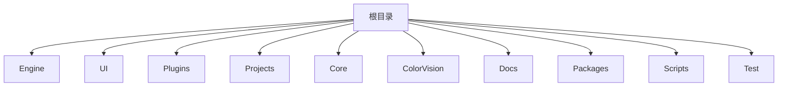

# 颜色与光学算法


# 颜色与光学算法

## Table of Contents
1. [Introduction](#introduction)
2. [Project Structure](#project-structure)
3. [Core Components](#core-components)
4. [Architecture Overview](#architecture-overview)
5. [Detailed Component Analysis](#detailed-component-analysis)
6. [Dependency Analysis](#dependency-analysis)
7. [Performance Considerations](#performance-considerations)
8. [Troubleshooting Guide](#troubleshooting-guide)
9. [Conclusion](#conclusion)

## Introduction
本项目旨在提供与颜色科学和光学测量相关的算法模板，涵盖了 JND（Just Noticeable Difference，最小可觉差）分析、色域覆盖、白点校正、均匀性分析、符合性验证等关键算法。通过这些算法，用户可以进行高精度的颜色测量和质量控制，满足工业和科研领域对颜色及光学性能的严格需求。

项目基于 C# 语言，采用模块化设计，支持设备驱动、算法处理、数据管理和界面交互等多层功能，确保系统的扩展性和维护性。

## Project Structure

项目目录结构清晰，主要按功能模块和技术层次进行划分，主要目录及其职责如下：



1. **Engine**  
   包含核心引擎代码和算法模板。  
   - `ColorVision.Engine/Templates`：存放算法模板，如 JND、Compliance（符合性验证）、POI（兴趣点）等。  
   - `ColorVision.Engine/Services`：设备服务管理，如摄像头、光谱仪、算法设备等。  
   - `ColorVision.Engine/MySql`：数据库操作相关，ORM（对象关系映射）实现。  
   - `ColorVision.Engine/MQTT`：MQTT 消息通信相关，用于设备和算法间的数据交互。  

2. **UI**  
   用户界面相关代码，包括主题、控件、视图和热键管理等，主要负责用户交互和界面展示。

3. **Plugins**  
   各种插件模块，例如事件查看器、屏幕录制、系统监控等，扩展系统功能。

4. **Projects**  
   不同的项目示例或子系统，如 ProjectKB、ProjectARVR 等，可能代表不同的应用场景或客户定制版本。

5. **Core**  
   核心库和辅助功能，如 OpenCV 辅助、CUDA 支持、图像处理等。

6. **ColorVision**  
   主程序入口及其配置，包含主窗口、启动配置、插件管理和更新机制。

7. **Docs**  
   文档资料目录，包括许可协议、API 文档及解决方案说明。

8. **Packages**  
   第三方库和依赖，如 OpenCV、spdlog、nlohmann JSON 等。

9. **Scripts**  
   构建、配置和部署脚本，自动化工具支持。

10. **Test**  
    测试代码和测试项目。

整体架构体现了分层设计，算法模板集中在 Engine 层，UI 层负责界面交互，Plugins 提供扩展功能，Projects 为具体应用，Core 支持底层计算和硬件加速。

## Core Components

### 1. AlgorithmJND (最小可觉差分析算法)

该类实现了 JND 算法的核心逻辑，负责算法参数管理、模板编辑和命令发送。

关键类和方法：

```csharp
public class AlgorithmJND : DisplayAlgorithmBase
{
    public DeviceAlgorithm Device { get; set; }
    public MQTTAlgorithm DService { get => Device.DService; }

    public RelayCommand OpenTemplateCommand { get; set; }
    public RelayCommand OpenTemplatePoiCommand { get; set; }

    public AlgorithmJND(DeviceAlgorithm deviceAlgorithm) 
    {
        Name = "JND";
        Order = 3;
        Group = "数据提取算法";
        Device = deviceAlgorithm;
        OpenTemplateCommand = new RelayCommand(a => OpenTemplate());
        OpenTemplatePoiCommand = new RelayCommand(a => OpenTemplatePoi());
    }

    public void OpenTemplate()
    {
        new TemplateEditorWindow(new TemplateJND(), TemplateSelectedIndex)
        {
            Owner = Application.Current.GetActiveWindow(),
            WindowStartupLocation = WindowStartupLocation.CenterOwner
        }.Show();
    }

    public void OpenTemplatePoi()
    {
        new TemplateEditorWindow(new TemplatePoi(), TemplatePoiSelectedIndex)
        {
            Owner = Application.Current.GetActiveWindow(),
            WindowStartupLocation = WindowStartupLocation.CenterOwner
        }.ShowDialog();
    }

    public override UserControl GetUserControl()
    {
        UserControl ??= new DisplayJND(this);
        return UserControl;
    }

    public MsgRecord SendCommand(JNDParam param, string deviceCode, string deviceType, string fileName, FileExtType fileExtType, string serialNumber)
    {
        string sn = string.IsNullOrWhiteSpace(serialNumber) ? DateTime.Now.ToString("yyyyMMdd'T'HHmmss.fffffff") : serialNumber;
        if (DService.HistoryFilePath.TryGetValue(fileName, out string fullpath))
            fileName = fullpath;

        var Params = new Dictionary<string, object>()
        {
            { "ImgFileName", fileName },
            { "FileType", fileExtType },
            { "DeviceCode", deviceCode },
            { "DeviceType", deviceType },
            { "TemplateParam", new CVTemplateParam() { ID = param.Id, Name = param.Name } },
            { "POITemplateParam", new CVTemplateParam() { ID = TemplatePoi.Params[TemplatePoiSelectedIndex].Value.Id, Name = TemplatePoi.Params[TemplatePoiSelectedIndex].Value.Name } }
        };

        MsgSend msg = new()
        {
            EventName = MQTTAlgorithmEventEnum.Event_OLED_JND_CalVas_GetData,
            SerialNumber = sn,
            Params = Params
        };

        return DService.PublishAsyncClient(msg);
    }
}
```

说明：
- 该类继承自 `DisplayAlgorithmBase`，表示它是一个可显示的算法模块。
- 通过 MQTT 协议与设备通信，发送算法执行命令。
- 支持打开算法模板和兴趣点(POI)模板的编辑窗口。
- 维护模板选择索引和对应的界面控件。
- 发送命令时会检查文件路径历史，确保文件路径正确。

### 2. ComplianceXYZDao (符合性验证数据访问对象)

```csharp
public class ComplianceXYZDao : BaseTableDao<ComplianceXYZModel>
{
    public static ComplianceXYZDao Instance { get; set; } = new ComplianceXYZDao();
    public ComplianceXYZDao() : base("t_scgd_algorithm_result_detail_compliance_xyz")
    {
    }
}
```

说明：
- 继承自 ORM 框架的基础数据访问类 `BaseTableDao`，专门用于访问符合性验证的 XYZ 颜色数据表。
- 采用单例模式，方便全局访问。
- 负责数据库中符合性验证结果的读取和写入。

## Architecture Overview

项目架构采用典型的分层设计，主要包括：

- **设备服务层**：负责硬件设备的管理和数据采集，支持多种设备如摄像头、光谱仪、传感器等。
- **算法模板层**：实现各种颜色与光学算法，封装算法参数、处理逻辑及结果展示。
- **消息通信层**：基于 MQTT 协议，实现设备与算法模块间的异步消息传递。
- **数据访问层**：基于 ORM 框架，管理数据库操作，支持数据持久化。
- **用户界面层**：基于 WPF，提供友好的人机交互界面，支持模板编辑、结果展示和设备管理。
- **插件扩展层**：支持多种插件，增强系统功能，如事件查看、屏幕录制等。

各层通过接口和消息机制解耦，提高系统灵活性和可维护性。

## Detailed Component Analysis

### AlgorithmJND 类分析

- **职责**：实现 JND 算法的业务逻辑，包括模板管理、命令发送和界面交互。
- **关键属性**：
  - `Device`：关联的算法设备实例。
  - `DService`：设备的 MQTT 服务接口。
  - `OpenTemplateCommand` 和 `OpenTemplatePoiCommand`：用于打开模板编辑界面的命令。
- **关键方法**：
  - `OpenTemplate`：打开 JND 算法模板编辑窗口。
  - `OpenTemplatePoi`：打开兴趣点模板编辑窗口。
  - `GetUserControl`：获取用于显示该算法的用户控件实例。
  - `SendCommand`：构造并发送执行算法的消息命令，包含参数和文件信息。

该类使用了 MVVM 模式中的命令绑定（RelayCommand），使界面操作与业务逻辑解耦。通过 MQTT 消息发送算法执行请求，实现设备与算法模块的异步通信。

### ComplianceXYZDao 类分析

- **职责**：操作数据库中符合性验证的 XYZ 颜色数据表。
- **设计模式**：单例模式，确保全局唯一实例。
- **继承结构**：继承自 `BaseTableDao`，利用通用 ORM 功能简化数据库访问。
- **用途**：用于存储和查询符合性验证的详细结果数据，支持数据持久化和后续分析。

## Dependency Analysis

- **MQTTMessageLib**：用于消息通信，支持算法与设备间的异步消息传递。
- **ColorVision.Common.MVVM**：实现 MVVM 模式基础设施，如 `RelayCommand`。
- **ColorVision.Engine.Interfaces**：定义算法和设备的接口契约。
- **ColorVision.Engine.Templates.POI**：兴趣点模板模块，JND 算法依赖其模板参数。
- **ORM 框架**：简化数据库操作，支持数据访问对象模式。

依赖关系清晰，模块间通过接口和消息机制解耦，方便扩展和维护。

## Performance Considerations

- MQTT 异步消息机制减少了设备和算法模块间的阻塞，提高响应速度。
- 模板索引和参数的缓存避免重复加载，提升界面响应效率。
- ORM 框架简化数据库访问，支持批量操作，提升数据处理性能。
- 设备服务层支持多线程和异步操作，保障硬件交互的实时性。

## Troubleshooting Guide

- **模板加载失败**：检查模板索引是否越界，确保模板文件存在且格式正确。
- **消息发送异常**：确认 MQTT 服务是否正常运行，设备连接是否稳定。
- **数据库访问错误**：检查数据库连接配置，确保表结构与 ORM 映射一致。
- **界面显示异常**：确认 WPF 控件绑定正确，相关资源文件是否完整。

## Conclusion

本项目基于模块化和分层设计，系统地实现了颜色与光学测量的核心算法模板，重点支持 JND 分析和符合性验证等关键功能。通过 MQTT 消息机制实现设备和算法的高效通信，结合 ORM 框架保障数据持久化，提供了稳定且易扩展的解决方案。

文档详细解析了核心算法类和数据访问对象，帮助用户理解系统结构和关键实现，便于后续开发和维护。

