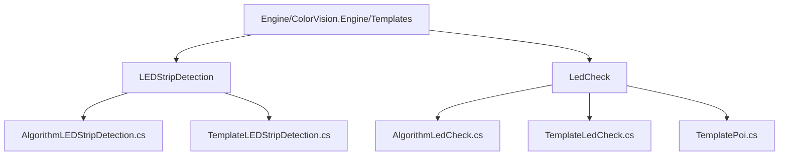

# LED 分析算法


# LED 分析算法

## 目录
1. [介绍](#介绍)
2. [项目结构](#项目结构)
3. [核心组件](#核心组件)
4. [架构概览](#架构概览)
5. [详细组件分析](#详细组件分析)
6. [依赖关系分析](#依赖关系分析)
7. [性能考量](#性能考量)
8. [故障排查指南](#故障排查指南)
9. [结论](#结论)
10. [附录](#附录)

## 介绍
本项目旨在提供一套用于 LED 灯带检测及 LED 灯珠像素级检测的算法模板。通过对图像进行分析，检测 LED 灯带的完整性及灯珠的坏点、亮度和色度等缺陷，从而实现自动化的质量检测。项目基于 ColorVision 引擎，利用 MQTT 通信机制与设备交互，支持模板的配置与管理，适用于工业视觉检测场景。

---

## 项目结构

项目采用模块化设计，代码主要分布在 `Engine/ColorVision.Engine/Templates` 目录下的多个子模块，分别对应不同的检测算法模板。整体结构清晰，按照功能进行分类，便于维护和扩展。



- **Engine/ColorVision.Engine/Templates/LEDStripDetection**  
  负责灯带检测算法的实现，包括算法逻辑、参数配置和界面展示。

- **Engine/ColorVision.Engine/Templates/LedCheck**  
  实现像素级灯珠检测算法，支持灯珠坏点、亮度及色度的检查，同时集成了 POI（点位）模板，用于更细粒度的定位和分析。

- **其他目录**  
  包含底层服务、设备接口、消息通信等支持模块，确保算法模板与硬件设备及上层应用的有效协作。

---

## 核心组件

本节重点介绍两大核心算法组件：

### 1. 灯带检测算法（AlgorithmLEDStripDetection）

- **功能**：实现对 LED 灯带的完整性检测，识别灯带缺陷。
- **关键类**：`AlgorithmLEDStripDetection`  
- **主要职责**：管理设备算法实例，处理模板打开命令，发送检测命令至服务端。

### 2. 像素级灯珠检测算法（AlgorithmLedCheck）

- **功能**：对单个 LED 灯珠进行像素级检测，判断坏点、亮度及色度异常。
- **关键类**：`AlgorithmLedCheck`  
- **主要职责**：支持模板及 POI 模板的编辑和调用，构造检测任务参数并发送。

---

## 架构概览

项目架构基于 MVVM 设计模式，结合 MQTT 消息机制实现设备通信和算法调用。

- **MVVM 模式**  
  视图（View）与业务逻辑（ViewModel）分离，便于界面与逻辑解耦。

- **MQTT 消息通信**  
  通过 MQTT 协议异步发送检测命令，支持设备间的高效通信。

- **模板机制**  
  通过模板编辑器管理检测参数，实现算法的灵活配置和复用。

---

## 详细组件分析

### 1. AlgorithmLEDStripDetection.cs

该文件实现了灯带检测算法的核心逻辑，主要功能包括模板管理、命令发送及界面交互。

```csharp
public class AlgorithmLEDStripDetection : DisplayAlgorithmBase
{
    public DeviceAlgorithm Device { get; set; }
    public MQTTAlgorithm DService { get => Device.DService; }
    public RelayCommand OpenTemplateCommand { get; set; }
    public int TemplateSelectedIndex { get; set; }
    public bool IsInversion { get; set; }

    public AlgorithmLEDStripDetection(DeviceAlgorithm deviceAlgorithm)
    {
        Name = "灯带检测";
        Order = 10;
        Group = "定位算法";
        Device = deviceAlgorithm;
        OpenTemplateCommand = new RelayCommand(a => OpenTemplate());
    }

    public void OpenTemplate()
    {
        new TemplateEditorWindow(new TemplateLEDStripDetection(), TemplateSelectedIndex)
        {
            Owner = Application.Current.GetActiveWindow(),
            WindowStartupLocation = WindowStartupLocation.CenterOwner
        }.Show();
    }

    public MsgRecord SendCommand(LEDStripDetectionParam param, string deviceCode, string deviceType, string fileName, FileExtType fileExtType, string serialNumber)
    {
        string sn = string.IsNullOrWhiteSpace(serialNumber) ? DateTime.Now.ToString("yyyyMMdd'T'HHmmss.fffffff") : serialNumber;
        if (DService.HistoryFilePath.TryGetValue(fileName, out string fullpath))
            fileName = fullpath;

        var Params = new Dictionary<string, object>()
        {
            { "ImgFileName", fileName },
            { "FileType", fileExtType },
            { "DeviceCode", deviceCode },
            { "DeviceType", deviceType },
            { "TemplateParam", new CVTemplateParam() { ID = param.Id, Name = param.Name } },
            { "IsInversion", IsInversion }
        };

        MsgSend msg = new()
        {
            EventName = MQTTAlgorithmEventEnum.Event_LED_StripDetection,
            SerialNumber = sn,
            Params = Params
        };

        return DService.PublishAsyncClient(msg);
    }
}
```

- **主要方法**：
  - `OpenTemplate()`：打开灯带检测模板编辑窗口，方便用户配置检测参数。
  - `SendCommand()`：构造并发送检测命令，包含图像文件路径、设备信息、模板参数及反转标识。

- **属性说明**：
  - `Device`：当前设备算法实例。
  - `DService`：MQTT 服务接口，用于消息发布。
  - `IsInversion`：图像是否反转的配置参数。

---

### 2. AlgorithmLedCheck.cs

该文件实现了像素级灯珠检测算法，支持模板和 POI 模板的管理及命令发送。

```csharp
public class AlgorithmLedCheck : DisplayAlgorithmBase
{
    public DeviceAlgorithm Device { get; set; }
    public MQTTAlgorithm DService { get => Device.DService; }
    public RelayCommand OpenTemplateCommand { get; set; }
    public RelayCommand OpenTemplatePoiCommand { get; set; }
    public int TemplateSelectedIndex { get; set; }
    public int TemplatePoiSelectedIndex { get; set; }

    public AlgorithmLedCheck(DeviceAlgorithm deviceAlgorithm)
    {
        Name = "像素级灯珠检测";
        Order = 20;
        Group = "定位算法";
        Device = deviceAlgorithm;
        OpenTemplateCommand = new RelayCommand(a => OpenTemplate());
        OpenTemplatePoiCommand = new RelayCommand(a => OpenTemplatePoi());
    }

    public void OpenTemplate()
    {
        new TemplateEditorWindow(new TemplateLedCheck(), TemplateSelectedIndex)
        {
            Owner = Application.Current.GetActiveWindow(),
            WindowStartupLocation = WindowStartupLocation.CenterOwner
        }.Show();
    }

    public void OpenTemplatePoi()
    {
        new TemplateEditorWindow(new TemplatePoi(), TemplatePoiSelectedIndex)
        {
            Owner = Application.Current.GetActiveWindow(),
            WindowStartupLocation = WindowStartupLocation.CenterOwner
        }.ShowDialog();
    }

    public MsgRecord SendCommand(LedCheckParam param, PoiParam poiParam, string deviceCode, string deviceType, string fileName, FileExtType fileExtType, string serialNumber)
    {
        string sn = string.IsNullOrWhiteSpace(serialNumber) ? DateTime.Now.ToString("yyyyMMdd'T'HHmmss.fffffff") : serialNumber;
        if (DService.HistoryFilePath.TryGetValue(fileName, out string fullpath))
            fileName = fullpath;

        var Params = new Dictionary<string, object>()
        {
            { "ImgFileName", fileName },
            { "FileType", fileExtType },
            { "DeviceCode", deviceCode },
            { "DeviceType", deviceType },
            { "TemplateParam", new CVTemplateParam() { ID = param.Id, Name = param.Name } }
        };

        if (poiParam.Id == -1)
        {
            Params.Add("POITemplateParam", new CVTemplateParam() { ID = poiParam.Id, Name = string.Empty });
        }
        else
        {
            Params.Add("POITemplateParam", new CVTemplateParam() { ID = poiParam.Id, Name = poiParam.Name });
        }

        MsgSend msg = new()
        {
            EventName = MQTTAlgorithmEventEnum.Event_LED_Check_GetData,
            SerialNumber = sn,
            Params = Params
        };

        return DService.PublishAsyncClient(msg);
    }
}
```

- **主要方法**：
  - `OpenTemplate()`：打开灯珠检测模板编辑窗口。
  - `OpenTemplatePoi()`：打开 POI 模板编辑窗口，支持点位的精细配置。
  - `SendCommand()`：构造并发送检测命令，包括图像文件、设备信息、模板及 POI 参数。

- **属性说明**：
  - `TemplateSelectedIndex` 和 `TemplatePoiSelectedIndex`：分别用于管理当前选中的模板索引。
  - `Device` 和 `DService`：与设备算法和消息服务相关联。

---

## 依赖关系分析

- 两个算法类均依赖于 `DeviceAlgorithm` 和 `MQTTAlgorithm`，通过 `DService` 发送消息。
- 使用 `RelayCommand` 实现命令绑定，符合 MVVM 模式。
- 模板编辑通过 `TemplateEditorWindow` 实现，支持用户交互配置。
- 发送的消息包含事件名称（如 `Event_LED_StripDetection`、`Event_LED_Check_GetData`），用于服务端识别处理。

---

## 性能考量

- 采用异步消息发布 `PublishAsyncClient`，提升系统响应性。
- 通过模板参数传递，避免硬编码，提高算法灵活性和复用性。
- 图像文件路径缓存机制（`HistoryFilePath`）减少重复文件查找开销。

---

## 故障排查指南

- **模板无法打开**：确认 `TemplateSelectedIndex` 是否正确，检查 `TemplateEditorWindow` 初始化参数。
- **消息发送失败**：检查 MQTT 服务连接状态，确认 `DService` 实例有效。
- **图像文件路径异常**：确保传入的文件名在 `HistoryFilePath` 中有对应的完整路径。
- **参数配置错误**：验证模板参数 `Id` 和 `Name` 是否正确，避免空值导致异常。

---

## 结论

本项目通过模块化的算法模板设计，实现了 LED 灯带及灯珠的自动检测功能。利用 MVVM 架构和 MQTT 通信机制，确保系统具备良好的扩展性和实时性。模板编辑功能提供灵活配置手段，适应多样化检测需求。整体设计合理，代码结构清晰，适合工业视觉检测应用。

---

## 附录

### 相关源码链接

- [AlgorithmLEDStripDetection.cs](https://github.com/xincheng213618/scgd_general_wpf/blob/master/Engine/ColorVision.Engine/Templates/LEDStripDetection/AlgorithmLEDStripDetection.cs)
- [AlgorithmLedCheck.cs](https://github.com/xincheng213618/scgd_general_wpf/blob/master/Engine/ColorVision.Engine/Templates/LedCheck/AlgorithmLedCheck.cs)

