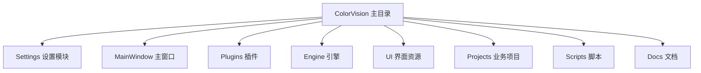
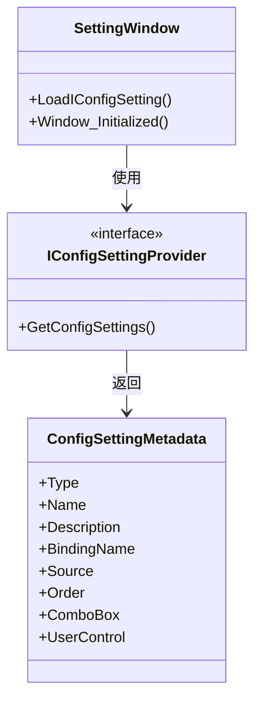

# 应用设置


# 应用设置

## 目录
1. [介绍](#介绍)
2. [项目结构](#项目结构)
3. [核心组件](#核心组件)
4. [架构概览](#架构概览)
5. [详细组件分析](#详细组件分析)
6. [依赖关系分析](#依赖关系分析)
7. [性能考虑](#性能考虑)
8. [故障排除指南](#故障排除指南)
9. [结论](#结论)

## 介绍
本文档旨在详细描述 ColorVision 应用程序中全局设置的访问与修改方式，涵盖默认行为、路径配置、更新设置等内容。文档面向不同技术背景的用户，尤其关注代码结构和功能实现，帮助用户理解和使用 ColorVision 的应用设置功能。

ColorVision 是一个复杂的视觉处理应用，其设置管理涉及多模块、多配置项的动态加载与界面绑定，本文将深入解析其设置窗口的实现原理和关键代码细节。

## 项目结构

### 1. 主要目录说明

根据仓库目录结构，ColorVision 项目主要分为以下几个部分：

- `/ColorVision/`  
  这是主应用程序目录，包含核心界面（如 `MainWindow.xaml`）、应用入口（`App.xaml`）、配置和设置相关代码（`Settings` 子目录）以及插件管理和更新模块。  
  其中，`Settings` 目录专门负责应用设置的界面与逻辑，是本文档重点分析的部分。

- `/Engine/`  
  包含 ColorVision 的核心引擎实现，如图像处理、算法模板、设备服务等。此部分负责实现视觉算法和设备交互，是系统功能的核心。

- `/UI/`  
  包含主题、控件、界面扩展等用户界面相关资源，提供统一的界面风格和交互控件支持。

- `/Plugins/`  
  存放各种插件模块，扩展应用功能，如事件查看器、屏幕录制等。

- `/Projects/`  
  包含不同项目的具体实现，如 `ProjectKB`、`ProjectHeyuan` 等，体现应用在不同业务场景下的定制。

- `/Scripts/`  
  构建、配置、更新等自动化脚本。

- `/docs/`  
  文档资源目录。

### 2. 代码组织方式

- 按功能模块划分，主应用与引擎、UI、插件分开，便于维护和扩展。
- 设置相关代码集中在 `/ColorVision/Settings/`，实现设置界面和配置绑定。
- 采用 MVVM 设计模式（如 `ViewModelBase`），实现界面与数据分离。
- 使用 WPF（Windows Presentation Foundation）技术，界面文件以 `.xaml` 结尾，逻辑代码以 `.xaml.cs` 命名。



## 核心组件

### 1. SettingWindow.xaml.cs

该文件实现了应用设置窗口的主要逻辑，负责动态加载和展示各种配置项，支持多种配置类型（布尔值、下拉框、文本框、Tab页等），并绑定对应的数据源，实现用户对全局设置的访问和修改。

主要功能包括：

- 初始化窗口，根据操作系统版本调整窗口效果（如是否启用模糊背景）。
- 通过反射动态加载所有实现了 `IConfigSettingProvider` 接口的配置提供者，收集所有配置项。
- 根据配置项类型动态生成对应的 UI 控件（如开关、组合框、文本框、Tab页等）。
- 将所有配置项按照类型和顺序排序后添加到界面对应区域，支持分组和分类展示。

### 2. App.config

简单的应用配置文件，指定了 .NET Framework 版本（4.6.2），保证应用在指定的运行时环境下启动。

## 架构概览

ColorVision 的设置架构采用模块化设计，设置项由不同模块提供实现，统一通过接口 `IConfigSettingProvider` 暴露配置项集合。设置窗口通过反射机制动态加载所有模块的配置，实现高度扩展性。

设置界面采用 MVVM 模式，视图层（XAML）与数据层（ViewModel）解耦，通过数据绑定机制实现自动同步。UI 控件根据配置项类型动态生成，支持多样化的配置交互。

窗口背景和主题管理由 `ThemeManager` 控制，支持根据操作系统版本和主题变更调整视觉效果。



## 详细组件分析

### SettingWindow.xaml.cs 分析

#### 1. 类和方法说明

- `SettingWindow : BaseWindow`  
  继承自基础窗口类，表示设置窗口。

- 构造函数 `SettingWindow()`  
  初始化窗口组件，判断系统版本调整背景模糊效果，绑定主题更改事件。

- 事件方法 `Window_Initialized`  
  窗口初始化完成后调用，触发加载配置项。

- 方法 `LoadIConfigSetting()`  
  核心方法，动态加载所有配置项并生成对应 UI 控件。

#### 2. LoadIConfigSetting 实现细节

- 内部函数 `Add(ConfigSettingMetadata configSetting)`  
  根据配置项类型动态创建界面元素：

  - `Bool` 类型：使用 `ToggleSwitch` 开关控件，绑定配置属性。
  - `ComboBox` 类型：直接使用配置项提供的组合框控件。
  - `TabItem` 类型：创建标签页，嵌入自定义用户控件。
  - `Text` 类型：创建文本框，绑定配置属性。
  - `Class` 类型：创建标签页，使用属性编辑器控件显示复杂对象属性。

- 通过反射获取所有程序集中的 `IConfigSettingProvider` 实现，调用其 `GetConfigSettings()` 方法收集配置项。

- 对配置项按类型分组，再按顺序排序，保证界面展示的逻辑性和美观性。

- 将排序后的配置项逐个调用 `Add` 方法添加到界面。

#### 3. 代码示例

```csharp
if (configSetting.Type == ConfigSettingType.Bool)
{
    DockPanel dockPanel = new DockPanel() { Margin = new Thickness(5) };
    Wpf.Ui.Controls.ToggleSwitch toggleSwitch = new() { ToolTip = configSetting.Description };
    toggleSwitch.SetBinding(System.Windows.Controls.Primitives.ToggleButton.IsCheckedProperty, new Binding(configSetting.BindingName));
    toggleSwitch.DataContext = configSetting.Source;
    DockPanel.SetDock(toggleSwitch, Dock.Right);
    dockPanel.Children.Add(toggleSwitch);
    dockPanel.Children.Add(new TextBlock() { Text = configSetting.Name });
    UniversalStackPanel.Children.Add(dockPanel);
}
```

此代码动态创建一个开关控件，并绑定到对应配置数据，实现开关状态和配置属性同步。

#### 4. 设计模式和原则

- **反射与接口回调**：通过接口和反射动态发现配置提供者，实现模块解耦和扩展。
- **MVVM 数据绑定**：UI 控件绑定数据模型，实现界面与数据同步。
- **单一职责**：`SettingWindow` 负责界面展示和配置加载，具体配置由各模块提供。
- **模板方法**：根据配置类型选择不同控件模板生成界面。

#### 5. 可能的改进

- 对大量配置项时，界面加载性能可优化，采用异步加载或分页展示。
- 增加配置项校验和错误提示，提升用户体验。
- 支持配置项搜索和快速定位功能。

## 依赖关系分析

- `SettingWindow` 依赖 `IConfigSettingProvider` 接口实现，耦合度低，支持多模块配置扩展。
- 依赖 `ThemeManager` 管理主题和视觉效果。
- 使用 WPF 标准控件和第三方控件库（如 `Wpf.Ui.Controls.ToggleSwitch`）。
- 配置项数据源由各模块提供，界面动态绑定。

## 性能考虑

- 界面动态生成控件，需注意控件数量对性能影响。
- 反射调用存在一定性能开销，适合启动时或配置变更时调用。
- 主题变更事件绑定合理，避免重复绑定导致性能下降。

## 故障排除指南

- **界面不显示配置项**  
  检查配置提供者是否正确实现 `IConfigSettingProvider` 并返回配置项。

- **配置项绑定无效**  
  确认配置项的 `BindingName` 和数据源属性名称一致，且数据源实现了通知机制。

- **主题背景异常**  
  检查 `ThemeManager` 主题切换事件是否正常触发，及背景资源是否存在。

- **模糊背景效果失效**  
  根据操作系统版本调整模糊效果相关设置，Win10 可能默认禁用。

## 结论

ColorVision 的应用设置模块设计灵活，采用反射和接口机制实现配置项的动态加载与展示，支持多种配置类型和自定义控件。通过 MVVM 模式实现界面与数据的高效绑定，结合主题管理提供良好的用户体验。该设计方便扩展和维护，适合复杂应用的全局配置管理需求。

本文件详细解析了设置窗口的实现逻辑，帮助用户理解如何访问和修改 ColorVision 的全局应用程序设置，支持用户根据需求自定义和扩展配置项。

---

**参考源码链接：**

- SettingWindow.xaml.cs  
  [https://github.com/xincheng213618/scgd_general_wpf/blob/master/ColorVision/Settings/SettingWindow.xaml.cs](https://github.com/xincheng213618/scgd_general_wpf/blob/master/ColorVision/Settings/SettingWindow.xaml.cs)

- App.config  
  [https://github.com/xincheng213618/scgd_general_wpf/blob/master/ColorVision/App.config](https://github.com/xincheng213618/scgd_general_wpf/blob/master/ColorVision/App.config)

