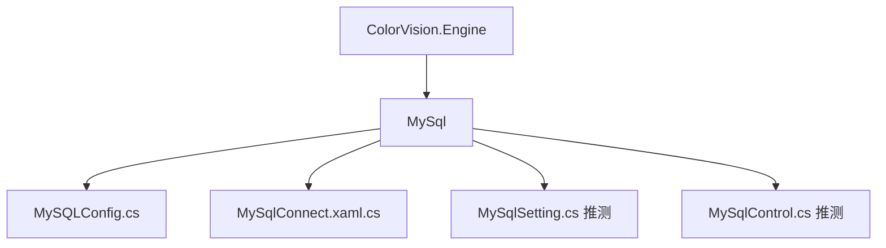
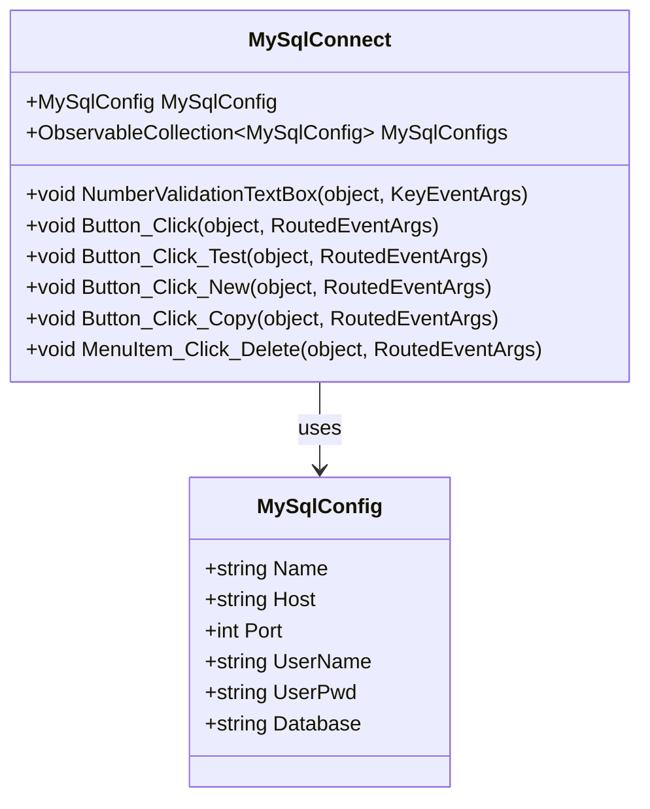

# 数据库配置


# 数据库配置

## 目录
1. [介绍](#介绍)
2. [项目结构](#项目结构)
3. [核心组件](#核心组件)
4. [架构概述](#架构概述)
5. [详细组件分析](#详细组件分析)
6. [依赖分析](#依赖分析)
7. [性能考虑](#性能考虑)
8. [故障排除指南](#故障排除指南)
9. [总结](#总结)

## 介绍
本文档旨在详细说明 ColorVision 软件中如何配置连接到 MySQL 数据库。内容涵盖服务器地址、数据库名称、用户名、密码等设置的配置方法。通过对相关代码的分析，为用户和开发者提供清晰、易懂的指导，帮助理解系统如何管理和使用数据库连接配置。

## 项目结构
ColorVision 项目的代码库结构庞大且模块化，主要按照功能和技术层次划分，方便维护和扩展。针对数据库配置相关功能，主要涉及以下目录：



- **/Engine/ColorVision.Engine/MySql/**: 该目录包含所有与 MySQL 数据库连接相关的代码文件。
  - `MySQLConfig.cs`：定义了 MySQL 连接的配置数据结构，包含服务器地址、端口、用户名、密码和数据库名称等属性。
  - `MySqlConnect.xaml.cs`：实现了数据库连接配置的界面逻辑，支持用户输入和管理多个数据库连接配置。
  - 其他相关文件如 `MySqlSetting.cs` 和 `MySqlControl.cs`（目录中存在，推测与配置管理和连接控制相关）负责配置的保存、加载及连接的具体实现。

整体架构采用 MVVM（Model-View-ViewModel）设计模式，界面与数据逻辑分离，方便维护和扩展。

## 核心组件

### 1. MySqlConfig 类
定义 MySQL 数据库连接的配置数据模型，继承自 `ViewModelBase`，支持属性变更通知，便于界面绑定更新。

```csharp
public class MySqlConfig : ViewModelBase
{
    public string Name { get; set; }          // 连接名称
    public string Host { get; set; } = "127.0.0.1";  // 服务器IP地址
    public int Port { get; set; } = 3306;     // 端口号，范围0-65535
    public string UserName { get; set; } = "root";   // 用户名
    public string UserPwd { get; set; } = string.Empty; // 密码
    public string Database { get; set; } = string.Empty; // 数据库名称
}
```

### 2. MySqlConnect 窗口类
实现 MySQL 配置界面交互逻辑，支持：
- 输入服务器地址、端口、用户名、密码、数据库名等信息
- 管理多个连接配置（新增、删除、复制）
- 测试连接功能，异步验证数据库连接是否成功
- UI 输入校验（如端口号只能输入数字）

关键方法示例：

```csharp
private void Button_Click_Test(object sender, RoutedEventArgs e)
{
    MySqlConfig.UserPwd = PasswordBox1.Password;
    Task.Run(() =>
    {
        bool IsConnect = MySqlControl.TestConnect(MySqlConfig);
        Dispatcher.BeginInvoke(() => MessageBox.Show($"连接{(IsConnect ? "成功" : "失败")}", "ColorVision"));
    });
}
```

此方法异步测试数据库连接，结果通过弹窗反馈给用户。

## 架构概述
ColorVision 的 MySQL 配置模块基于 MVVM 模式设计：

- **Model（模型）**：`MySqlConfig` 类封装数据库连接配置数据。
- **View（视图）**：`MySqlConnect.xaml` 提供用户界面，用户可输入和管理数据库连接信息。
- **ViewModel（视图模型）**：`MySqlConnect.xaml.cs` 处理界面逻辑，如数据绑定、事件响应、连接测试等。

该模块通过菜单项 `ExportMySqlMenuItem` 和 `ExportMySqlConnect` 集成到整体应用的菜单系统，方便用户访问配置窗口。

## 详细组件分析

### MySqlConfig.cs
- 继承 `ViewModelBase`，支持属性变更通知，确保界面数据实时更新。
- 属性包括连接名称、IP地址、端口号（限制范围0-65535）、用户名、密码和数据库名。
- 端口属性设置逻辑保证输入值在有效范围内。
- 代码简洁明了，符合标准的属性封装和通知模式。

### MySqlConnect.xaml.cs
- 继承自 `Window`，实现数据库连接配置窗口逻辑。
- 包含事件处理函数：
  - `NumberValidationTextBox`：限制端口输入为数字。
  - `Button_Click`：保存配置并触发连接尝试。
  - `Button_Click_Test`：异步测试连接，反馈连接状态。
  - `Button_Click_New`、`Button_Click_Copy`、`MenuItem_Click_Delete`：管理数据库配置列表。
- 使用 `ObservableCollection<MySqlConfig>` 维护多个连接配置，支持界面列表绑定。
- 使用异步任务避免界面阻塞，提升用户体验。
- 通过 `PasswordBox` 安全输入密码，密码不直接绑定显示。
- 通过事件如 `ListView1_SelectionChanged` 同步选中配置与界面显示。

#### 代码结构示意



## 依赖分析
- `MySqlConnect` 依赖于 `MySqlConfig` 作为数据模型。
- 依赖 `MySqlControl` 提供数据库连接和测试功能（代码中调用但未展示具体实现）。
- 使用 `MySqlSetting` 管理配置的持久化存储和集合管理。
- 继承自 `ViewModelBase` 和 `MenuItemBase`，体现 MVVM 和菜单扩展设计模式。
- 依赖 WPF 框架提供 UI 控件和事件处理。

## 性能考虑
- 异步任务执行数据库连接测试，避免阻塞 UI 线程。
- 端口输入限制减少无效输入，提升输入效率。
- 使用 `ObservableCollection` 支持动态数据绑定，界面响应快速。
- 密码输入使用 `PasswordBox`，避免明文绑定，提高安全性。

## 故障排除指南
- **连接失败**：确认服务器地址、端口、用户名、密码和数据库名称正确。
- **端口输入异常**：确保只输入数字，端口范围为0-65535。
- **密码显示为空**：密码通过安全控件输入，不直接显示。
- **配置未保存**：点击“保存”按钮后配置才会生效。
- **测试连接无响应**：检查网络连接和数据库服务状态。

## 总结
ColorVision 的 MySQL 数据库配置模块设计简洁，采用 MVVM 模式分离界面与数据逻辑，支持多配置管理和连接测试。通过安全的密码输入和异步操作提升用户体验。本文档详细介绍了配置类结构、界面交互逻辑及其实现方式，帮助用户正确配置数据库连接，确保系统正常运行。

---

Source:
- [https://github.com/xincheng213618/scgd_general_wpf/blob/master/Engine/ColorVision.Engine/MySql/MySQLConfig.cs](Engine/ColorVision.Engine/MySql/MySQLConfig.cs)
- [https://github.com/xincheng213618/scgd_general_wpf/blob/master/Engine/ColorVision.Engine/MySql/MySqlConnect.xaml.cs](Engine/ColorVision.Engine/MySql/MySqlConnect.xaml.cs)

