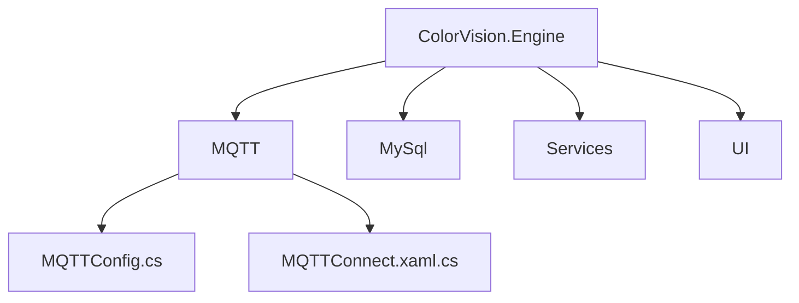
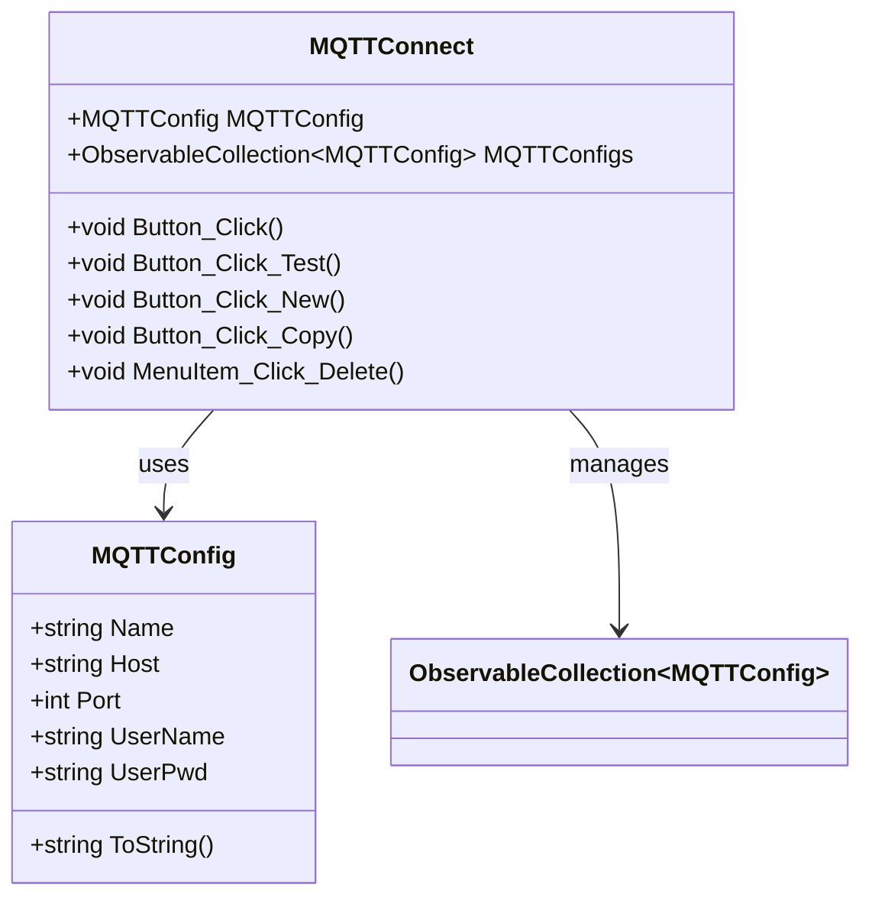

# MQTT 配置


# MQTT 配置

## 目录
1. [介绍](#介绍)
2. [项目结构](#项目结构)
3. [核心组件](#核心组件)
4. [架构概述](#架构概述)
5. [详细组件分析](#详细组件分析)
6. [依赖关系分析](#依赖关系分析)
7. [性能考虑](#性能考虑)
8. [故障排除指南](#故障排除指南)
9. [总结](#总结)

## 介绍
本项目中的 MQTT 配置模块主要指导用户如何配置 MQTT 连接参数，包括 Broker 地址（Host）、端口（Port）、认证信息（用户名和密码）等。MQTT 是一种轻量级的消息传输协议，广泛应用于物联网设备通信。通过合理配置 MQTT 参数，用户可以确保设备与服务器之间的消息传递安全、稳定和高效。

本文档将详细介绍 MQTT 配置相关的代码结构、核心类、功能实现及其相互关系，帮助用户理解如何使用和扩展该模块。

## 项目结构
项目采用模块化设计，代码按功能和层次进行组织。与 MQTT 相关的代码主要位于：

```
/Engine/ColorVision.Engine/MQTT/
```

该目录下包含与 MQTT 配置和连接相关的多个文件，例如：

- `MQTTConfig.cs`：定义 MQTT 连接配置的数据模型。
- `MQTTConnect.xaml.cs`：实现 MQTT 连接窗口的交互逻辑和界面控制。

整体项目结构分为多个子系统，如引擎层（Engine）、界面层（UI）、插件（Plugins）等。每个子系统又细分为功能模块，如设备服务、数据库连接、消息处理等。模块间通过接口和事件机制解耦，提升系统的可维护性和扩展性。



## 核心组件

### 1. MQTTConfig.cs
这是 MQTT 配置的核心数据类，继承自 `ViewModelBase`，支持属性变更通知，方便界面数据绑定。

主要属性：
- `Name`：连接名称，便于区分不同的 MQTT 配置。
- `Host`：MQTT Broker 的 IP 地址，默认值为 `127.0.0.1`。
- `Port`：端口号，范围限定在 0 到 65535，默认 1883（MQTT 默认端口）。
- `UserName`：连接认证的用户名。
- `UserPwd`：连接认证的密码。

该类重写了 `ToString()` 方法，方便输出连接信息的字符串表示。

示例代码片段：

```csharp
public class MQTTConfig : ViewModelBase
{
    public string Name { get => _Name; set { _Name = value; NotifyPropertyChanged(); } }
    private string _Name;

    public string Host { get => _Host; set { _Host = value; NotifyPropertyChanged(); } }
    private string _Host = "127.0.0.1";

    public int Port
    {
        get => _Port; set
        {
            _Port = value <= 0 ? 0 : value >= 65535 ? 65535 : value;
            NotifyPropertyChanged();
        }
    }
    private int _Port = 1883;

    public string UserName { get => _UserName; set { _UserName = value; NotifyPropertyChanged(); } }
    private string _UserName = string.Empty;

    public string UserPwd { get => _UserPwd; set { _UserPwd = value; NotifyPropertyChanged(); } }
    private string _UserPwd = string.Empty;

    public override string ToString()
    {
        return $"Host={Host};Port={Port};UserName={UserName};UserPwd={UserPwd}";
    }
}
```

### 2. MQTTConnect.xaml.cs
这是 MQTT 连接配置界面的后台代码，实现了用户交互逻辑和配置管理。

主要功能：
- 初始化界面并绑定当前 MQTT 配置数据。
- 支持对端口输入的数字校验，防止非法字符输入。
- 提供连接测试功能，异步测试 MQTT 连接是否成功，并反馈结果。
- 支持新增、复制、删除不同的 MQTT 配置，方便用户管理多个连接。
- 提交连接配置时，会调用底层 MQTT 控制器进行连接操作。
- 界面支持显示或隐藏配置列表，调整窗口宽度适应显示需求。

关键方法说明：
- `Button_Click`：保存当前配置并发起连接请求。
- `Button_Click_Test`：异步测试连接是否成功，并显示提示信息。
- `Button_Click_New`、`Button_Click_Copy`、`MenuItem_Click_Delete`：管理配置列表的增删改。

示例代码片段（连接按钮处理）：

```csharp
private void Button_Click(object sender, RoutedEventArgs e)
{
    if (string.IsNullOrEmpty(MQTTConfig.Name))
    {
        MQTTConfig.Name = MQTTConfig.Host + "_" + MQTTConfig.Port;
    }
    MQTTConfigs.Remove(MQTTConfig);
    FlowEngineLib.MQTTHelper.SetDefaultCfg(MQTTConfig.Host, MQTTConfig.Port, MQTTConfig.UserName, MQTTConfig.UserPwd, false, null);
    Task.Run(() => MQTTControl.GetInstance().Connect(MQTTConfig));
    Close();
}
```

界面与数据绑定示意：



## 架构概述
MQTT 配置模块作为系统设备服务的一部分，负责管理与 MQTT Broker 的连接参数，支持多配置管理和动态切换。它通过 MVVM 设计模式实现界面与数据的解耦，`MQTTConfig` 作为数据模型，界面通过数据绑定实时反映配置状态。

连接操作委托给 `MQTTControl` 类（未详细展示），该类负责具体的 MQTT 协议通信和连接管理。模块还集成了连接测试功能，确保配置正确性。

整体架构特点：
- 分层设计：UI 层、配置数据层、控制层分离。
- 事件驱动和异步处理，提升用户体验和系统响应速度。
- 配置数据支持通知机制，方便界面自动更新。

## 详细组件分析

### MQTTConfig.cs
- 继承 `ViewModelBase`，支持属性变化通知。
- 属性封装私有字段，保证数据有效性（如端口范围限制）。
- 方便界面绑定和数据序列化。

### MQTTConnect.xaml.cs
- 继承 `Window`，实现 WPF 界面交互。
- 绑定 `MQTTConfig` 对象到界面控件，实现实时数据同步。
- 实现输入校验，防止非法端口输入。
- 提供多配置管理功能，配置列表通过 `ObservableCollection` 实现动态更新。
- 连接测试采用异步任务，避免界面阻塞。
- 通过调用 `MQTTControl.GetInstance().Connect()` 发起连接。

## 依赖关系分析
- 依赖 `ColorVision.Common.MVVM` 提供基础 MVVM 支持。
- 依赖 `FlowEngineLib.MQTTHelper` 和 `MQTTControl` 进行底层 MQTT 连接控制。
- 依赖 WPF 框架实现界面和事件响应。
- 依赖 `MQTTSetting` 单例管理配置集合，实现配置持久化和共享。

## 性能考虑
- 连接和测试操作均采用异步任务执行，避免阻塞 UI 线程。
- 使用 `ObservableCollection` 实现配置列表动态响应，提升界面刷新效率。
- 属性变化通知机制减少不必要的界面刷新。

## 故障排除指南
- 连接失败时，建议检查 Host 和 Port 是否正确，用户名密码是否匹配 Broker 认证。
- 端口输入框限制了非数字输入，确保端口号有效。
- 连接测试按钮可用于快速验证配置有效性。
- 删除配置时需确认，防止误删重要配置。

## 总结
MQTT 配置模块设计简洁，功能完备，支持多连接配置管理和实时连接测试。通过 MVVM 模式实现界面与数据的分离，提升代码可维护性。异步操作保证用户体验流畅。用户可通过该模块方便地配置和管理 MQTT 连接参数，确保设备通信的稳定性和安全性。

---

Source:
- [GitHub/Engine/ColorVision.Engine/MQTT/MQTTConfig.cs](https://github.com/xincheng213618/scgd_general_wpf/blob/master/Engine/ColorVision.Engine/MQTT/MQTTConfig.cs)
- [GitHub/Engine/ColorVision.Engine/MQTT/MQTTConnect.xaml.cs](https://github.com/xincheng213618/scgd_general_wpf/blob/master/Engine/ColorVision.Engine/MQTT/MQTTConnect.xaml.cs)

