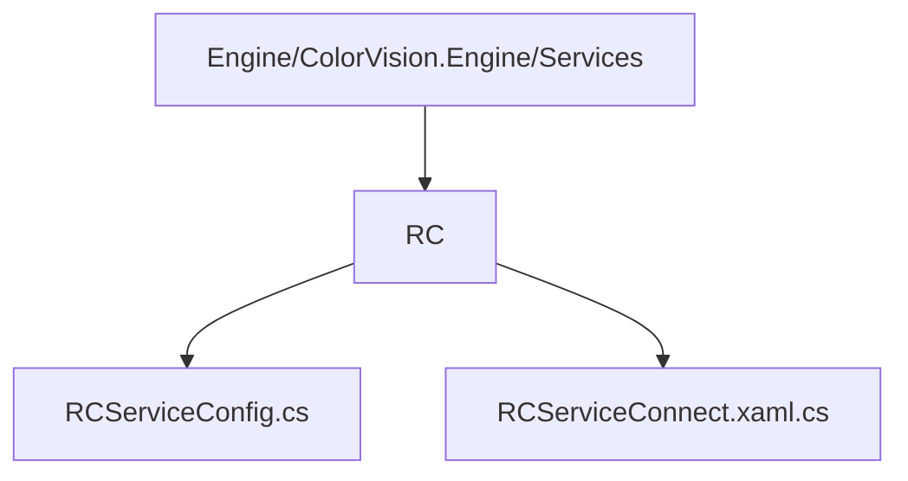
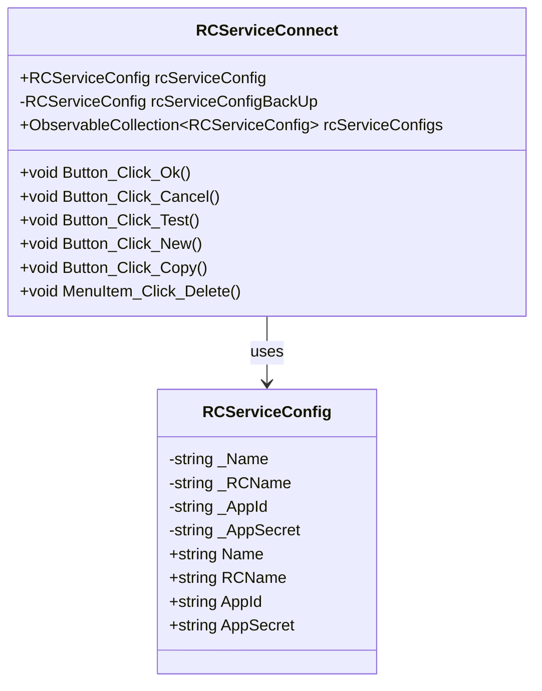

# RC 服务配置


# RC 服务配置

## 目录
1. [介绍](#介绍)
2. [项目结构](#项目结构)
3. [核心组件](#核心组件)
4. [架构概览](#架构概览)
5. [详细组件分析](#详细组件分析)
6. [依赖关系分析](#依赖关系分析)
7. [性能考虑](#性能考虑)
8. [故障排查指南](#故障排查指南)
9. [总结](#总结)
10. [附录](#附录)

## 介绍
本文件详细介绍了 RC（Remote Control，远程控制）服务的用途和配置方法。RC服务主要用于远程控制或服务发现功能，支持通过配置注册中心与远程服务进行连接、注册和管理。文档将从项目结构、核心组件、架构设计、详细代码分析等多方面展开，帮助用户理解RC服务的实现机制及如何配置和使用该服务。

---

## 项目结构
RC服务相关代码位于仓库路径：

```
/Engine/ColorVision.Engine/Services/RC/
```

该目录下主要有以下关键文件：

- `RCServiceConfig.cs`：定义了RC服务的配置类，包含连接名称、注册中心名称、AppId和AppSecret等属性。
- `RCServiceConnect.xaml.cs`：实现了RC服务配置窗口的交互逻辑，提供用户界面用于配置和管理RC服务连接。

### 目录结构解析示意图



---

## 核心组件

### 1. RCServiceConfig 类
- 作用：封装RC服务的配置信息，包括连接名称、注册中心名称、AppId和AppSecret。
- 继承：继承自 `ViewModelBase` 以支持数据绑定通知，接口实现 `IConfig`。
- 关键属性：
  - `Name`：连接名称，用户可自定义。
  - `RCName`：注册中心名称，默认值为 `"RC_local"`。
  - `AppId`：应用标识，默认值为 `"app1"`。
  - `AppSecret`：应用密钥，默认值为 `"123456"`。

### 2. RCServiceConnect 窗口类
- 作用：为用户提供图形界面配置RC服务参数，支持新建、复制、删除配置，测试连接等操作。
- 主要成员：
  - `rcServiceConfig`：当前编辑的配置对象。
  - `rcServiceConfigBackUp`：配置备份，用于取消操作时恢复。
  - `rcServiceConfigs`：配置集合，支持多配置管理。
- 关键功能：
  - 初始化加载配置，绑定UI。
  - 支持新增、复制、删除配置。
  - 测试连接功能，异步尝试注册服务。
  - 保存配置时触发重新注册。

---

## 架构概览
RC服务作为系统的远程控制或服务发现模块，主要负责与注册中心通信，实现服务的注册与管理。其配置通过界面交互完成，配置数据通过 `RCServiceConfig` 类管理。服务连接和注册操作则通过后台服务（如 `MqttRCService`）实现异步通信。

整体架构中，RC服务模块位于服务层（Services），与UI层交互，且依赖MQTT协议实现消息传递，支持动态配置和远程控制。

---

## 详细组件分析

### 1. RCServiceConfig.cs

该文件定义了RC服务的配置类，代码简洁明了，采用了属性封装和通知机制，方便界面绑定和数据更新。

```csharp
public class RCServiceConfig : ViewModelBase, IConfig
{
    public string Name { get => _Name; set { _Name = value; NotifyPropertyChanged(); } }
    private string _Name;

    public string RCName { get => _RCName; set { _RCName = value; NotifyPropertyChanged(); } }
    private string _RCName = "RC_local";

    public string AppId { get => _AppId; set { _AppId = value; NotifyPropertyChanged(); } }
    private string _AppId = "app1";

    public string AppSecret { get => _AppSecret; set { _AppSecret = value; NotifyPropertyChanged(); } }
    private string _AppSecret = "123456";
}
```

- `NotifyPropertyChanged()` 是MVVM模式中用于通知UI属性变化的方法，确保界面数据同步更新。
- 默认值提供了初始配置，用户可根据需求修改。

### 2. RCServiceConnect.xaml.cs

该文件实现了RC服务配置窗口的交互逻辑，关键点如下：

- **初始化**：窗口初始化时加载当前配置和配置列表，绑定到UI控件。
- **配置管理**：支持新增（`Button_Click_New`）、复制（`Button_Click_Copy`）、删除（`MenuItem_Click_Delete`）配置。
- **连接测试**：`Button_Click_Test` 异步调用 `MqttRCService` 的注册尝试方法，结果通过消息框反馈。
- **保存配置**：`Button_Click_Ok` 保存修改，更新配置并触发后台重新注册。
- **取消操作**：`Button_Click_Cancel` 恢复备份配置，关闭窗口。
- **UI响应**：根据用户操作调整窗口宽度显示配置列表。

部分关键代码示例：

```csharp
private void Button_Click_Test(object sender, RoutedEventArgs e)
{
    rcServiceConfig.AppSecret = PasswordBox1.Password;
    Task.Run(async () =>
    {
        bool IsConnect = await MqttRCService.GetInstance().TryRegist(rcServiceConfig);
        _= Dispatcher.BeginInvoke(() => MessageBox.Show($"连接{(IsConnect ? "成功" : "失败")}", "ColorVision"));
    });
}
```

该代码展示了异步测试连接的实现，避免阻塞界面线程。



---

## 依赖关系分析
- `RCServiceConfig` 依赖于 `ViewModelBase` 和 `IConfig` 接口，实现数据绑定和配置接口。
- `RCServiceConnect` 依赖于 `RCServiceConfig`，并通过 `RCSetting` 单例管理配置集合。
- 连接测试和注册功能依赖外部服务类 `MqttRCService`，实现MQTT通信协议的远程控制服务注册。

---

## 性能考虑
- 异步操作（如连接测试、重新注册）通过 `Task.Run` 实现，避免阻塞UI线程，保证界面响应流畅。
- 配置集合使用 `ObservableCollection`，支持动态更新UI，提升用户体验。
- 目前配置类属性较少，性能开销较低，适合实时修改和快速响应。

---

## 故障排查指南
- **连接失败**：确保 `AppId` 和 `AppSecret` 正确，且注册中心可达。
- **配置未保存**：点击取消按钮会恢复备份配置，确认是否误操作。
- **UI异常**：检查是否因异步操作未正确同步UI线程，查看日志或调试信息。
- **配置丢失**：配置集合管理中，删除操作会即时移除配置，注意误删。

---

## 总结
RC服务模块提供了远程控制服务的配置和管理功能，支持多配置管理和动态注册。通过MVVM模式实现界面与数据的分离，异步操作保障性能和用户体验。用户可通过配置窗口方便地管理连接参数，测试连接状态，确保远程服务的正常运行。

---

## 附录

### 参考代码文件
- [RCServiceConfig.cs](https://github.com/xincheng213618/scgd_general_wpf/blob/master/Engine/ColorVision.Engine/Services/RC/RCServiceConfig.cs)
- [RCServiceConnect.xaml.cs](https://github.com/xincheng213618/scgd_general_wpf/blob/master/Engine/ColorVision.Engine/Services/RC/RCServiceConnect.xaml.cs)

