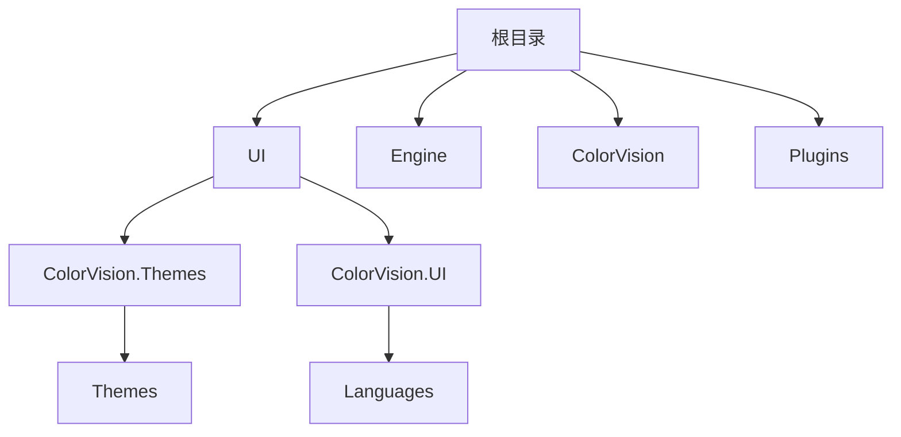
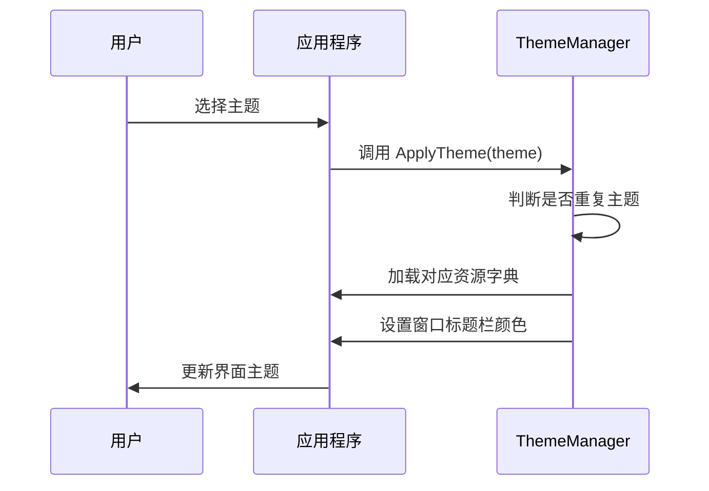

# 主题与语言设置


# 主题与语言设置

## 目录
1. [简介](#简介)
2. [项目结构](#项目结构)
3. [核心组件](#核心组件)
4. [架构概述](#架构概述)
5. [详细组件分析](#详细组件分析)
    - 5.1 [主题管理器 (ThemeManager.cs)](#主题管理器-themeManagercs)
    - 5.2 [语言管理器 (LanguageManager.cs)](#语言管理器-languageManagercs)
6. [依赖分析](#依赖分析)
7. [性能考虑](#性能考虑)
8. [故障排除指南](#故障排除指南)
9. [总结](#总结)
10. [附录](#附录)

---

## 简介
本文档旨在指导用户如何更改应用程序的界面主题和显示语言。通过详细分析源码中的主题和语言管理相关模块，列出可用的主题和语言选项，帮助用户理解和使用这些功能。本文档面向不同技术水平的用户，力求以通俗易懂的语言阐述代码架构和实现细节。

---

## 项目结构
本项目采用模块化设计，目录结构清晰，主要根据功能和技术层次划分。以下为关键目录及其说明：



- **/UI/**：包含用户界面相关代码，分为主题（ColorVision.Themes）和UI逻辑（ColorVision.UI）两大部分。
- **/Engine/**：核心业务逻辑和算法实现。
- **/ColorVision/**：应用程序的主入口及配置相关代码。
- **/Plugins/**：扩展插件模块。
- **/UI/ColorVision.Themes/**：负责界面主题的定义和管理。
- **/UI/ColorVision.UI/Languages/**：负责多语言支持和语言切换功能。

整体架构体现了界面与业务逻辑分离的设计思想，便于维护和扩展。

---

## 核心组件
针对主题与语言设置，核心组件主要包括：

1. **ThemeManager.cs**（/UI/ColorVision.Themes/ThemeManager.cs）
   - 负责应用程序主题的加载、切换和系统主题的同步。
   - 管理多种主题资源字典，如深色、浅色、粉色、青色等。
   - 支持系统主题感知，自动响应系统主题变化。

2. **LanguageManager.cs**（/UI/ColorVision.UI/Languages/LanguageManager.cs）
   - 管理应用支持的语言列表。
   - 实现语言切换逻辑，包括提示用户重启应用以应用新语言。
   - 通过扫描资源目录动态识别可用语言。

---

## 架构概述
应用程序采用典型的WPF MVVM架构，界面主题和语言作为用户界面层的配置独立管理，确保业务逻辑与界面显示解耦。

- 主题通过资源字典（ResourceDictionary）实现样式的动态切换。
- 语言通过资源文件 (.resources.dll) 实现多语言支持，语言管理器负责加载和切换。
- 系统主题变更通过系统事件监听实现自动同步，提升用户体验。

此设计保证用户可以灵活选择界面风格和语言，且对系统环境变化具备良好适应性。

---

## 详细组件分析

### 5.1 主题管理器 (ThemeManager.cs)

#### 文件位置
[UI/ColorVision.Themes/ThemeManager.cs](https://github.com/xincheng213618/scgd_general_wpf/blob/master/UI/ColorVision.Themes/ThemeManager.cs)

#### 作用概述
负责管理和应用程序主题相关的功能，包括主题资源加载、系统主题监听、主题切换以及窗口标题栏颜色设置。

#### 关键类与方法

| 序号 | 类/方法名             | 功能描述                                                  |
|-------|---------------------|---------------------------------------------------------|
| 1     | ThemeManager        | 单例模式管理主题，维护当前主题状态，监听系统主题变化。          |
| 2     | ApplyTheme          | 应用指定主题，避免重复应用同一主题。                          |
| 3     | ApplyThemeChanged   | 根据主题加载对应的资源字典，实现界面样式切换。                   |
| 4     | AppsUseLightTheme   | 读取注册表判断应用主题是否为浅色。                             |
| 5     | SystemUsesLightTheme| 读取注册表判断系统主题是否为浅色。                             |
| 6     | SetWindowTitleBarColor | 设置窗口标题栏颜色，支持深色、粉色、青色等主题。                |

#### 代码片段示例

```csharp
public void ApplyTheme(Application app, Theme theme) 
{
    if (CurrentTheme == theme)
        return;
    CurrentTheme = theme;
    if (theme == Theme.UseSystem)
        theme = AppsTheme;
    ApplyActTheme(app,theme);
}
```
该方法避免重复设置相同主题，若选择使用系统主题，则自动切换为当前应用主题。

#### 主题资源字典示例

- Base主题资源：
  - `/ColorVision.Themes;component/Themes/Base.xaml`
  - `/ColorVision.Themes;component/Themes/Menu.xaml`
- 深色主题资源：
  - `/HandyControl;component/themes/basic/colors/colorsdark.xaml`
  - `/ColorVision.Themes;component/Themes/Dark.xaml`
- 粉色主题资源：
  - `/ColorVision.Themes;component/Themes/HPink.xaml`
  - `/ColorVision.Themes;component/Themes/Pink.xaml`

#### 主题应用流程示意图



#### 特殊处理
- 监听系统主题变化事件，自动切换应用主题，提升用户体验。
- 通过调用Windows API（`DwmSetWindowAttribute`）实现标题栏颜色动态设置。

---

### 5.2 语言管理器 (LanguageManager.cs)

#### 文件位置
[UI/ColorVision.UI/Languages/LanguageManager.cs](https://github.com/xincheng213618/scgd_general_wpf/blob/master/UI/ColorVision.UI/Languages/LanguageManager.cs)

#### 作用概述
管理应用程序的多语言支持，动态加载语言资源，支持语言切换并提示重启应用以生效。

#### 关键类与方法

| 序号 | 类/方法名            | 功能描述                                                   |
|-------|--------------------|----------------------------------------------------------|
| 1     | LanguageManager    | 单例管理语言列表和语言切换逻辑。                               |
| 2     | GetLanguages       | 扫描程序目录，动态获取支持的语言列表。                            |
| 3     | LanguageChange     | 切换语言，提示用户重启应用。                                    |

#### 代码片段示例

```csharp
public bool LanguageChange(string lang)
{
    if (Thread.CurrentThread.CurrentUICulture.Name != lang)
    {
        if (MessageBox.Show(Properties.Resources.LanguageResartSign, DefalutProcessName, MessageBoxButton.OKCancel) == MessageBoxResult.OK)
        {
            Thread.CurrentThread.CurrentUICulture = new System.Globalization.CultureInfo(lang);
            Process.Start(Application.ResourceAssembly.Location.Replace(".dll",".exe"),"-r");
            Application.Current.Shutdown();
            return true;
        }
    }
    return false;
}
```
该方法判断是否需要切换语言，若需要则提示用户重启，完成语言切换。

#### 语言获取逻辑
- 根据当前执行程序目录，遍历子目录查找对应的资源DLL文件（如`ColorVision.resources.dll`）。
- 动态构建语言列表，保证包含简体中文（zh-Hans）和系统安装语言。

---

## 依赖分析

- 主题管理依赖于Wpf.Ui库提供的主题和控件字典。
- 语言管理依赖于.NET的资源管理机制，利用资源文件实现多语言支持。
- 主题切换和系统主题监听依赖Windows注册表和系统事件。
- 语言切换通过重启应用实现，依赖系统进程管理。

---

## 性能考虑

- 主题管理中，资源字典加载耗时较长，故采用延迟初始化（延迟10秒）以减少启动时间影响。
- 系统主题监听事件采用异步处理，避免阻塞UI线程。
- 语言切换需重启应用，避免运行时复杂资源切换带来的性能问题。

---

## 故障排除指南

| 问题描述                             | 可能原因                             | 解决方案                                  |
|----------------------------------|--------------------------------|---------------------------------------|
| 主题切换无效或界面未更新                   | 主题资源未正确加载或主题未应用           | 确认调用了`ApplyTheme`方法并传入正确主题         |
| 语言切换后界面仍为旧语言                   | 应用未重启或资源文件缺失                 | 按提示重启应用，确认资源文件存在对应语言目录       |
| 系统主题变化后应用未自动切换                 | 系统事件监听未生效或延迟初始化未完成        | 等待延迟初始化完成或手动调用主题切换方法            |
| 标题栏颜色异常                         | Windows版本不支持或DwmSetWindowAttribute调用失败 | 确认系统版本支持，检查权限和调用参数                 |

---

## 总结
本文档详细介绍了ColorVision应用程序中主题与语言设置的实现机制。通过ThemeManager和LanguageManager两个核心组件，实现了丰富的主题风格切换和多语言支持，增强了用户界面的灵活性和国际化能力。文档中提供了代码示例、流程图和故障排除建议，帮助用户和开发者深入理解和高效使用这些功能。

---

## 附录

### 可用主题列表

| 主题名    | 说明        |
|---------|-----------|
| Light   | 浅色主题      |
| Dark    | 深色主题      |
| Pink    | 粉色主题      |
| Cyan    | 青色主题      |
| UseSystem | 跟随系统主题   |

### 可用语言示例

- zh-Hans（简体中文）
- en（英语）
- ja（日语）
- fr（法语）
- ru（俄语）
- ko（韩语）
- zh-Hant（繁体中文）

---

