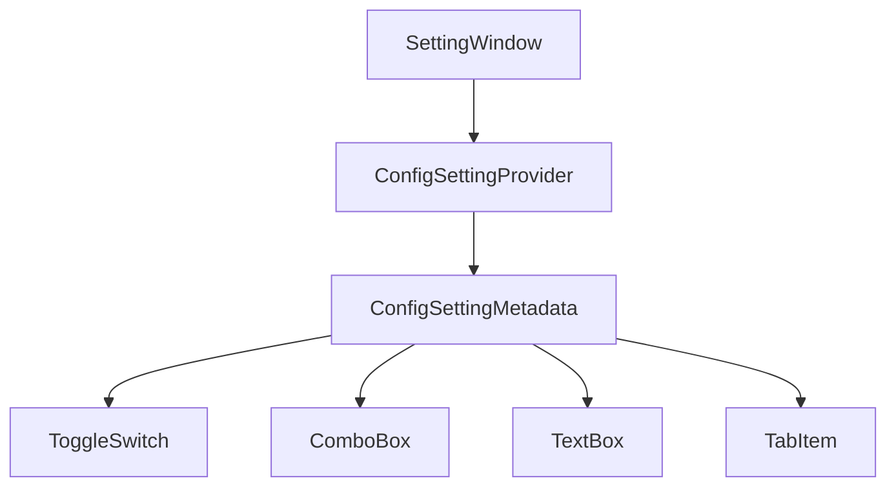

# 系统配置


# 系统配置

## 目录
1. [介绍](#介绍)
2. [项目结构](#项目结构)
3. [核心组件](#核心组件)
4. [架构概述](#架构概述)
5. [详细组件分析](#详细组件分析)
6. [依赖关系分析](#依赖关系分析)
7. [性能考虑](#性能考虑)
8. [故障排查指南](#故障排查指南)
9. [结论](#结论)
10. [附录](#附录)

## 介绍
本文件档旨在提供 ColorVision 系统各项配置的详细指南，特别涵盖全局应用设置、通信设置（如 MQTT、RC 服务）、数据库连接配置等内容。文档面向不同技术水平的用户，确保用户能够根据自身环境正确配置系统，保障系统稳定高效运行。

ColorVision 是由 ColrVision Inc 开发的 Windows WPF 应用程序，专注于色彩管理及光电技术解决方案。系统支持多种操作环境和多语言，提供丰富的设备管理和任务调度功能。

---

## 项目结构
ColorVision 项目采用模块化结构，文件组织清晰，主要按功能和技术层次划分。以下为主要目录及其说明：

```mermaid
graph TD
    A[根目录] --> B[ColorVision]
    A --> C[Engine]
    A --> D[UI]
    A --> E[Plugins]
    A --> F[Projects]
    A --> G[Docs]
    A --> H[Scripts]

    B --> B1[Settings]
    B --> B2[Plugins]
    B --> B3[Update]
    B --> B4[Projects]
    B --> B5[Wizards]
    B --> B6[FloatingBall]

    C --> C1[ColorVision.Engine]
    C --> C2[ColorVision.Net]
    C --> C3[CVImageChannelLib]
    C --> C4[opencv相关]
    
    E --> E1[EventVWR]
    E --> E2[ScreenRecorder]
    E --> E3[WindowsServicePlugin]
    E --> E4[SystemMonitor]
    E --> E5[ColorVisonChat]

    F --> F1[ProjectKB]
    F --> F2[ProjectHeyuan]
    F --> F3[ProjectBase]
    F --> F4[CV_Spectrometer]
    F --> F5[ProjectARVR]
    F --> F6[ProjectBlackMura]
    F --> F7[ProjectShiyuan]

    UI --> UI1[ColorVision.Themes]
    UI --> UI2[ColorVision.Scheduler]
    UI --> UI3[ColorVision.Common]
    UI --> UI4[ColorVision.ImageEditor]
    UI --> UI5[ColorVision.Core]
    UI --> UI6[ColorVision.UI]
    UI --> UI7[ColorVision.Solution]
```



### 主要目录说明
1. **ColorVision**  
   该目录为主程序代码，包含应用的核心设置 (`Settings`)、插件管理 (`Plugins`)、更新模块 (`Update`)、项目管理 (`Projects`) 等。  
   - `Settings` 目录下包含系统配置界面及相关逻辑，实现用户配置界面交互。  
   - `Plugins` 管理各种插件扩展，支持系统功能扩展。  
   - `Update` 负责软件自动更新相关功能。  
   - `Projects` 管理用户项目及其配置。  

2. **Engine**  
   包含系统核心引擎代码，如设备驱动、通信协议实现（MQTT、数据库连接）、图像处理等。  
   - `ColorVision.Engine` 是核心引擎模块，负责任务调度、设备管理、数据处理等。  
   - `ColorVision.Net` 和 `CVImageChannelLib` 提供网络和视频流相关支持。  
   - 还有大量 OpenCV 相关代码支持图像处理功能。  

3. **UI**  
   UI 层代码，包含主题管理、调度器界面、通用控件库、图像编辑器、核心 UI 组件等。  
   - `ColorVision.Themes` 实现多主题支持。  
   - `ColorVision.Scheduler` 负责任务调度界面。  
   - `ColorVision.Common` 提供通用接口和工具类。  
   - `ColorVision.UI` 为界面逻辑和控件实现。  

4. **Plugins**  
   各类功能插件模块，支持事件查看、屏幕录像、系统监控、聊天等功能。  

5. **Projects**  
   不同子项目代码，针对不同硬件或业务需求的实现。  

6. **Docs**  
   文档资料，包括用户手册、API 文档、许可协议等。  

7. **Scripts**  
   构建、部署、配置脚本，辅助项目自动化管理。  

此结构体现了清晰的分层设计，界面(UI)、业务逻辑(Engine)、插件扩展(Plugins)、项目定制(Projects)分离，便于维护和扩展。

---

## 核心组件
根据配置相关需求，以下为核心配置相关组件：

1. **SettingWindow.xaml.cs**  
   位于 `/ColorVision/Settings/`，实现系统配置窗口的交互逻辑，动态加载配置项，支持布尔型、下拉框、文本框、复杂控件等多种配置类型。  
   通过接口 `IConfigSettingProvider` 动态收集各模块配置元数据，统一呈现于界面。  

2. **MQTTConfig.cs**  
   位于 `/Engine/ColorVision.Engine/MQTT/`，定义 MQTT 连接配置类，包括主机地址、端口、用户名、密码等属性，支持数据绑定。  

3. **MySQLConfig.cs**  
   位于 `/Engine/ColorVision.Engine/MySql/`，定义 MySQL 数据库连接配置类，包含连接名称、主机、端口、用户名、密码及数据库名，支持属性变更通知。  

这些组件构成了系统配置的基础，支持用户灵活配置通信和数据库连接参数。

---

## 架构概述
ColorVision 系统架构基于 Windows WPF 技术，采用 MVVM 设计模式分离界面与业务逻辑。系统核心由 Engine 层负责设备管理、任务调度及数据处理，UI 层负责界面显示和用户交互，插件机制支持功能扩展。

配置系统通过统一接口抽象，动态加载各模块配置，实现灵活的配置界面。通信采用 MQTT 协议，数据库连接支持 MySQL，满足系统数据存储和远程通信需求。

任务调度模块支持多种执行模式，保证系统自动化和可扩展性。多语言支持及主题切换提升用户体验。

---

## 详细组件分析

### 1. SettingWindow.xaml.cs - 系统配置窗口

该文件实现了系统配置窗口的交互逻辑，支持多种配置类型动态加载。

关键功能点：

- 构造函数中根据操作系统版本控制窗口模糊效果和主题背景。
- `LoadIConfigSetting` 方法动态加载所有实现 `IConfigSettingProvider` 接口的配置项，按类型和顺序排序后添加到界面。
- 支持的配置类型包括布尔开关（ToggleSwitch）、下拉框（ComboBox）、文本框（TextBox）、Tab 页和复杂类类型。
- 利用数据绑定实现界面与配置数据的同步。

代码示例：

```csharp
void Add(ConfigSettingMetadata configSetting)
{
    if (configSetting.Type == ConfigSettingType.Bool)
    {
        DockPanel dockPanel = new DockPanel() { Margin = new Thickness(5) };
        Wpf.Ui.Controls.ToggleSwitch toggleSwitch = new() { ToolTip = configSetting.Description };
        toggleSwitch.SetBinding(System.Windows.Controls.Primitives.ToggleButton.IsCheckedProperty, new Binding(configSetting.BindingName));
        toggleSwitch.DataContext = configSetting.Source;
        DockPanel.SetDock(toggleSwitch, Dock.Right);
        dockPanel.Children.Add(toggleSwitch);
        dockPanel.Children.Add(new TextBlock() { Text = configSetting.Name });
        UniversalStackPanel.Children.Add(dockPanel);
    }
    // 其他类型处理省略...
}
```

界面动态构建示意图：



---

### 2. MQTTConfig.cs - MQTT 连接配置类

该类定义 MQTT 连接参数，支持属性变更通知，方便绑定界面元素。

属性说明：

- `Name`：连接名称，便于区分多个连接配置。
- `Host`：MQTT 服务器 IP 地址，默认本地 `127.0.0.1`。
- `Port`：端口号，默认 `1883`，有效范围 0-65535。
- `UserName` 和 `UserPwd`：连接认证账号和密码。

代码片段：

```csharp
public class MQTTConfig : ViewModelBase
{
    public string Name { get => _Name; set { _Name = value; NotifyPropertyChanged(); } }
    private string _Name;

    public string Host { get => _Host; set { _Host = value; NotifyPropertyChanged(); } }
    private string _Host = "127.0.0.1";

    public int Port
    {
        get => _Port; set
        {
            _Port = value <= 0 ? 0 : value >= 65535 ? 65535 : value;
            NotifyPropertyChanged();
        }
    }
    private int _Port = 1883;

    public string UserName { get => _UserName; set { _UserName = value; NotifyPropertyChanged(); } }
    private string _UserName = string.Empty;

    public string UserPwd { get => _UserPwd; set { _UserPwd = value; NotifyPropertyChanged(); } }
    private string _UserPwd = string.Empty;

    public override string ToString()
    {
        return $"Host={Host};Port={Port};UserName={UserName};UserPwd={UserPwd}";
    }
}
```

---

### 3. MySQLConfig.cs - MySQL 数据库连接配置类

该类定义数据库连接参数，结构与 MQTTConfig 类似，支持属性变更通知。

属性说明：

- `Name`：连接名称。
- `Host`：数据库服务器 IP 地址，默认 `127.0.0.1`。
- `Port`：端口号，默认 `3306`。
- `UserName` 和 `UserPwd`：数据库账号和密码。
- `Database`：使用的数据库名称。

示例代码：

```csharp
public class MySqlConfig : ViewModelBase
{
    public string Name { get => _Name; set { _Name = value; NotifyPropertyChanged(); } }
    private string _Name;

    public string Host { get => _Host; set { _Host = value; NotifyPropertyChanged(); } }
    private string _Host = "127.0.0.1";

    public int Port
    {
        get => _Port; set
        {
            _Port = value <= 0 ? 0 : value >= 65535 ? 65535 : value;
            NotifyPropertyChanged();
        }
    }
    private int _Port = 3306;

    public string UserName { get => _UserName; set { _UserName = value; NotifyPropertyChanged(); } }
    private string _UserName = "root";

    public string UserPwd { get => _UserPwd; set { _UserPwd = value; NotifyPropertyChanged(); } }
    private string _UserPwd = string.Empty;

    public string Database { get => _Database; set { _Database = value; NotifyPropertyChanged(); } }
    private string _Database = string.Empty;
}
```

---

## 依赖关系分析
- `SettingWindow` 依赖于所有实现 `IConfigSettingProvider` 的配置提供者，通过反射动态加载。
- `MQTTConfig` 和 `MySQLConfig` 继承自 `ViewModelBase`，支持数据绑定和属性通知，确保配置界面和数据同步。
- 配置系统与通信模块（MQTT）、数据库模块（MySQL）紧密结合，确保系统可通过配置灵活切换连接参数。
- 主题管理和操作系统版本检测影响配置窗口的视觉效果，体现了良好的用户体验设计。

---

## 性能考虑
- 配置加载采用动态反射机制，启动时收集所有配置项，排序后统一加载，保证界面响应速度和扩展性。
- 属性变更通知机制（INotifyPropertyChanged）确保界面实时更新，避免冗余刷新，提高交互性能。
- 端口号等关键字段设置限制范围，防止非法输入导致系统异常。

---

## 故障排查指南
- 若配置界面无法正常加载，检查是否所有配置模块正确实现了 `IConfigSettingProvider` 接口。
- MQTT 或 MySQL 连接失败时，确认配置参数（IP、端口、账号密码）是否正确，网络是否通畅。
- 主题切换无效或窗口显示异常，确认操作系统版本和主题配置是否匹配。
- 配置保存异常，检查绑定路径和数据上下文是否正确。

---

## 结论
ColorVision 系统配置模块设计灵活，支持多种配置类型动态加载，覆盖全局应用设置、通信（MQTT）及数据库连接（MySQL）配置。系统采用 MVVM 模式，界面与数据分离，提升了扩展性和维护性。通过统一接口抽象，配置项可由各模块独立实现，便于后续功能扩展和定制。用户可通过配置窗口方便地管理系统参数，确保系统适应不同运行环境。

---

## 附录

### 参考文件
- [ColorVision/Settings/SettingWindow.xaml.cs](https://github.com/xincheng213618/scgd_general_wpf/blob/master/ColorVision/Settings/SettingWindow.xaml.cs)
- [Engine/ColorVision.Engine/MQTT/MQTTConfig.cs](https://github.com/xincheng213618/scgd_general_wpf/blob/master/Engine/ColorVision.Engine/MQTT/MQTTConfig.cs)
- [Engine/ColorVision.Engine/MySql/MySQLConfig.cs](https://github.com/xincheng213618/scgd_general_wpf/blob/master/Engine/ColorVision.Engine/MySql/MySQLConfig.cs)

