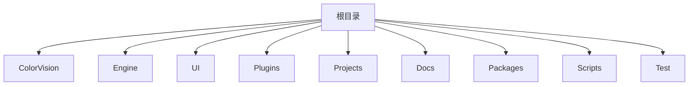
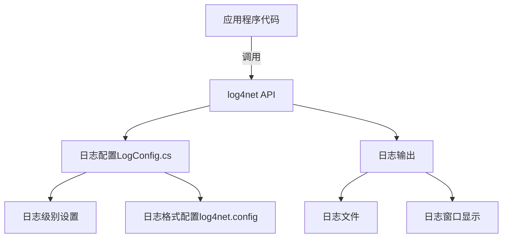

# 解读日志文件


# 解读日志文件

## 目录
1. [引言](#引言)
2. [项目结构](#项目结构)
3. [核心组件](#核心组件)
4. [架构概述](#架构概述)
5. [日志系统详细分析](#日志系统详细分析)
6. [依赖分析](#依赖分析)
7. [性能考虑](#性能考虑)
8. [故障排查指南](#故障排查指南)
9. [总结](#总结)
10. [附录](#附录)

## 引言
ColorVision 是一个功能丰富的视觉处理软件系统，具有多模块和插件支持。日志系统是软件开发和维护的重要组成部分，能够帮助开发人员和运维人员监控软件运行状态、定位问题和进行性能调优。本文档旨在详细解读 ColorVision 中的日志系统，介绍其日志文件的位置、格式，以及如何通过日志信息高效定位问题，帮助用户和技术人员更好地理解和使用日志。

## 项目结构
ColorVision 项目结构庞大且模块化，目录划分清晰，主要分为以下部分：



1. **ColorVision**  
   包含 ColorVision 主程序代码和配置文件，如 `MainWindow.xaml`、`App.xaml`、`log4net.config` 等。这里是程序的主要入口和核心界面实现。

2. **Engine**  
   负责核心算法、设备通讯、数据处理等底层逻辑。包含多个子模块如 `cvColorVision`、`ColorVision.Engine`，实现视觉算法、设备管理、消息处理和数据库访问等功能。

3. **UI**  
   包含用户界面相关代码，如主题管理、控件定义、日志界面实现（`LogImp` 目录），以及各种辅助工具和扩展。

4. **Plugins**  
   插件相关代码，支持扩展系统功能，如事件查看器、屏幕录制、系统监控等。

5. **Projects**  
   各个独立项目的实现目录，可能是针对不同硬件或功能的子系统。

6. **Docs**  
   项目文档，包括协议、API说明、解决方案等。

7. **Packages**  
   第三方库和依赖包，如 OpenCV、spdlog、nlohmann JSON 等。

8. **Scripts**  
   构建、配置和安装脚本。

9. **Test**  
   测试代码和测试项目。

整体架构采用分层和模块化设计，UI 层与 Engine 层分离，插件机制支持灵活扩展，日志系统集成于 UI 层的 `LogImp` 模块。

## 核心组件
针对日志系统，核心组件主要集中在以下几个文件和目录：

- `/UI/ColorVision.UI/LogImp/LogConfig.cs`  
  日志配置核心类，负责日志级别设置、日志系统初始化和配置界面绑定。

- `/ColorVision/log4net.config`  
  log4net 配置文件，定义日志输出格式、文件位置、日志级别等。

- `/UI/ColorVision.UI/LogImp/WindowLog.xaml` 和对应的 `.cs`  
  日志查看窗口界面，实现日志的显示和交互。

- 其他相关辅助类和配置。

## 架构概述
ColorVision 采用 log4net 作为日志框架，log4net 是 .NET 平台广泛使用的日志库，支持多种日志输出目标（文件、控制台、数据库等），支持灵活的日志级别和格式配置。

日志系统的架构简述如下：



- 应用程序通过 log4net API 记录日志。
- `LogConfig` 类负责读取和设置日志级别，动态调整日志输出行为。
- `log4net.config` 文件定义日志文件路径和格式。
- 日志既写入文件，也通过 UI 界面实时显示，方便用户监控。

## 日志系统详细分析

### 1. LogConfig.cs 文件分析

Source:  
- [https://github.com/xincheng213618/scgd_general_wpf/blob/master/UI/ColorVision.UI/LogImp/LogConfig.cs](UI/ColorVision.UI/LogImp/LogConfig.cs)

该文件定义了 `LogConfig` 类，核心职责是管理日志配置，包括日志级别设置、日志系统初始化和配置界面交互。

主要内容如下：

- 使用 `log4net` 命名空间，结合 `ViewModelBase` 实现 MVVM 模式，支持数据绑定和界面交互。
- 定义静态日志对象 `log` 用于内部日志记录。
- 提供单例访问 `Instance`，通过配置服务获取实例。
- 提供日志级别列表和对应的 log4net `Level` 枚举。
- `LogLevel` 属性用于设置当前日志级别，修改时会触发日志系统重新配置。
- `SetLog()` 方法根据当前日志级别动态配置 log4net 的根日志级别。
- 支持自动滚动和自动刷新日志显示的开关属性。
- 实现 `IConfigSettingProvider` 接口，提供日志级别配置的界面控件（ComboBox）绑定和显示。

代码示例片段：

```csharp
public Level LogLevel
{
    get => _LogLevel; 
    set
    {
        _LogLevel = value;
        NotifyPropertyChanged();
        LogLevelName = value.Name;
        SetLog();
    }
}

public void SetLog()
{
    var hierarchy = (Hierarchy)LogManager.GetRepository();
    hierarchy.Root.Level = LogLevel;
    log4net.Config.BasicConfigurator.Configure(hierarchy);
}
```

此处通过 `SetLog` 方法动态调整日志级别，`BasicConfigurator.Configure` 重新应用配置。

配置界面部分：

```csharp
public IEnumerable<ConfigSettingMetadata> GetConfigSettings()
{
    ComboBox cmlog = new ComboBox() { SelectedValuePath = "Key", DisplayMemberPath = "Value" };
    cmlog.SetBinding(System.Windows.Controls.Primitives.Selector.SelectedValueProperty, new Binding(nameof(LogLevel)));
    cmlog.ItemsSource = GetAllLevels().Select(level => new KeyValuePair<Level, string>(level, level.Name));
    cmlog.DataContext = Instance;

    return new List<ConfigSettingMetadata>
    {
        new ConfigSettingMetadata
        {
            Name = Properties.Resources.LogLevel,
            Description = Properties.Resources.LogLevel,
            Order = 15,
            Type = ConfigSettingType.ComboBox,
            ComboBox = cmlog,
        },
    };
}
```

该方法提供日志级别选择下拉框，供用户在界面调整日志输出详细程度。

### 2. 日志文件位置与格式

日志文件的具体位置和格式由 `log4net.config` 文件定义，该文件位于 `/ColorVision/log4net.config`。通常配置中会指定日志文件路径、文件名格式、日志内容格式（如时间戳、日志级别、消息内容等）。

日志格式一般包含：

- 时间戳（记录日志发生时间）
- 线程信息（多线程环境下区分日志来源）
- 日志级别（DEBUG, INFO, WARN, ERROR 等）
- 日志消息（具体日志内容）
- 异常信息（如果有异常发生）

### 3. 如何通过日志定位问题

- 根据日志级别筛选日志内容，通常问题定位关注 WARN、ERROR 及以上级别。
- 查找时间戳对应的异常或错误日志，结合上下文信息理解问题发生背景。
- 使用日志查看窗口（`WindowLog.xaml`）可实时监控日志输出，方便调试。
- 日志文件保存历史日志，支持回溯分析系统运行情况。
- 日志系统支持自动刷新和自动滚动，确保最新日志实时显示。

## 依赖分析
日志系统依赖于：

1. **log4net** 库  
   负责日志的核心记录和管理。

2. **Newtonsoft.Json**  
   用于日志配置对象的序列化和反序列化。

3. **MVVM 框架支持**  
   `ViewModelBase` 和 `RelayCommand` 支持界面绑定和命令。

4. **UI 框架**  
   WPF 控件（如 ComboBox）用于日志配置界面。

这些依赖保证了日志系统的灵活配置和良好的用户交互体验。

## 性能考虑
- 日志级别动态调整避免了不必要的日志记录，减少磁盘和 CPU 资源消耗。
- 自动刷新和自动滚动功能对性能影响较小，但在高频日志写入时应合理配置。
- 日志文件采用滚动或归档策略（由 log4net.config 控制），避免日志文件过大影响性能。

## 故障排查指南
1. **日志不输出或输出异常**  
   - 检查 `log4net.config` 配置文件路径和格式是否正确。
   - 确认日志级别设置是否允许输出当前日志。
   - 查看日志目录权限，确保程序有写入权限。

2. **日志级别调整无效**  
   - 确认 `LogConfig` 的 `SetLog()` 方法被正确调用。
   - 检查是否有其他配置覆盖了日志级别。

3. **日志文件过大**  
   - 调整 log4net 配置，启用文件滚动和归档。
   - 降低日志级别，减少详细日志输出。

4. **日志查看窗口无日志显示**  
   - 确认自动刷新和自动滚动设置。
   - 检查日志写入是否正常。

## 总结
ColorVision 日志系统基于成熟的 log4net 框架，结合 MVVM 模式实现灵活配置和友好界面。日志文件位置和格式由配置文件控制，支持多级日志输出和实时查看。通过合理使用日志系统，用户和开发者可以高效定位问题，保障系统稳定运行。

## 附录
- 代码示例和配置文件位置  
- 相关类和方法详细说明  
- 参考资料和日志系统使用建议

