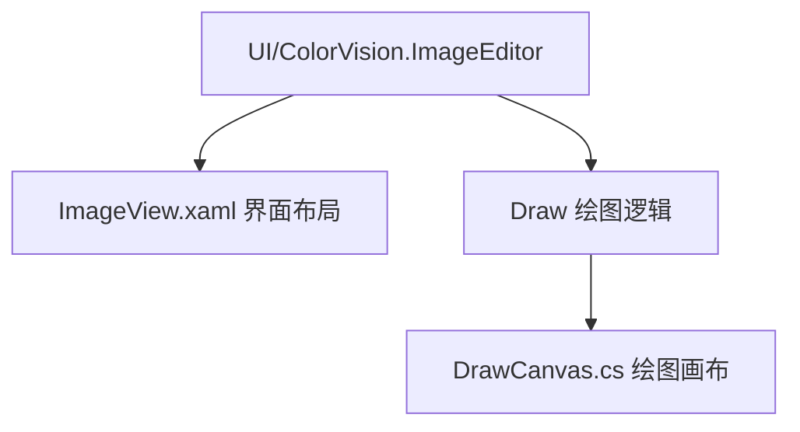

# 图像编辑器


# 图像编辑器

## 目录
1. [介绍](#介绍)
2. [项目结构](#项目结构)
3. [核心组件](#核心组件)
4. [架构概述](#架构概述)
5. [详细组件分析](#详细组件分析)
    - [ImageView.xaml](#imageviewxaml)
    - [DrawCanvas.cs](#drawcanvascs)
6. [依赖分析](#依赖分析)
7. [性能考虑](#性能考虑)
8. [故障排除指南](#故障排除指南)
9. [总结](#总结)

---

## 介绍
本文档介绍了内置图像编辑器的功能，包括图像显示、缩放、ROI（感兴趣区域）选择、绘图工具、伪彩色处理、直方图显示、3D视图等功能。文档详细解析了图像编辑器的代码结构、核心组件及其实现细节，帮助用户理解其工作原理和使用方法。

---

## 项目结构
该图像编辑器属于一个较大的软件项目，位于 `/UI/ColorVision.ImageEditor` 目录下。项目采用模块化设计，代码按照功能划分，界面使用WPF（Windows Presentation Foundation）技术实现，结合了WinForms控件和自定义绘图组件。

主要目录结构说明：
- `/UI/ColorVision.ImageEditor/`：图像编辑器的主界面和相关控件实现。
- `/UI/ColorVision.ImageEditor/Draw/`：绘图相关的核心逻辑实现，如绘图画布、绘图工具等。
- 资源文件和XAML布局文件，定义了界面布局、样式和交互控件。

该结构清晰分离了界面布局与绘图逻辑，便于维护和扩展。



---

## 核心组件
图像编辑器的核心组件包括：

1. **ImageView.xaml**  
   负责图像显示的界面布局，集成了图像显示控件、工具栏、属性面板、缩放控件、伪彩色调节、绘图工具按钮等。它是用户与图像交互的主要界面。

2. **DrawCanvas.cs**  
   作为绘图画布控件，继承自 `Image`，负责图像上的绘图操作管理，包括绘图元素的添加、删除、撤销重做、鼠标事件处理等。实现了丰富的绘图命令管理和事件处理机制。

---

## 架构概述
图像编辑器基于WPF技术，采用MVVM设计模式，界面与逻辑分离。界面通过XAML定义，绑定到ViewModel，实现数据驱动的UI更新。绘图逻辑封装在自定义控件中，支持多种绘图操作和撤销重做功能。

主要交互流程：
- 用户通过ImageView界面操作图像和绘图工具。
- DrawCanvas负责捕获鼠标事件，管理绘图元素。
- 属性面板动态显示所选绘图元素的属性，支持编辑。
- 工具栏提供缩放、伪彩色调整、绘图工具选择等功能。

---

## 详细组件分析

### ImageView.xaml
Source:
 - [https://github.com/xincheng213618/scgd_general_wpf/blob/master/UI/ColorVision.ImageEditor/ImageView.xaml](ImageView.xaml)

#### 组件目的
`ImageView.xaml` 是图像编辑器的主用户控件，定义了图像显示区域及其辅助工具界面。它集成了图像显示、缩放、绘图工具栏、属性显示、伪彩色调节、3D视图按钮等。

#### 主要功能区域
1. **图像显示区域**  
   使用自定义控件 `DrawCanvas` 包裹在 `ZoomboxSub` 中，支持高质量缩放显示。

2. **工具栏**  
   包含顶部、底部、左右多组工具栏，分别用于图像缩放控制、绘图工具选择（圆形、矩形、多边形、贝塞尔曲线）、图像操作（打开、保存、清除）、伪彩色调节、直方图、3D视图等。

3. **属性面板**  
   通过WinForms的 `PropertyGrid` 显示选中绘图元素的属性，支持动态显示和编辑。

4. **伪彩色调节**  
   使用 `RangeSlider` 控件调整伪彩色的起止值，配合色彩图像显示。

5. **等待控件**  
   加载数据时显示进度环和进度条，提升用户体验。

6. **高级设置面板**  
   包含白平衡调节（红绿蓝通道）、伽马、亮度、对比度、阈值调整以及滤除摩尔纹功能。

#### 重要控件示例
```xml
<draw:ZoomboxSub x:Name="Zoombox1" MaxZoom="{Binding MaxZoom}" MinZoom="{Binding MinZoom}">
    <draw:DrawCanvas x:Name="ImageShow" Initialized="ImageShow_Initialized" />
</draw:ZoomboxSub>
```
这里 `ZoomboxSub` 是缩放容器，`DrawCanvas` 是实际绘图画布。

#### 交互绑定
界面控件大量采用绑定（Binding）机制连接ViewModel属性，实现界面与数据同步更新。

---

### DrawCanvas.cs
Source:
 - [https://github.com/xincheng213618/scgd_general_wpf/blob/master/UI/ColorVision.ImageEditor/Draw/DrawCanvas.cs](DrawCanvas.cs)

#### 组件目的
`DrawCanvas` 是一个继承自WPF `Image` 控件的自定义绘图画布，负责管理绘图元素的显示、添加、删除和用户交互事件（如鼠标点击、双击）。

#### 关键功能
1. **绘图元素管理**  
   内部维护一个 `List<Visual>` 存储所有绘图元素。支持添加和移除绘图元素，同时更新视觉和逻辑树。

2. **撤销与重做**  
   通过两个 `ObservableCollection<ActionCommand>` 分别管理撤销栈和重做栈，实现绘图操作的撤销和重做功能。

3. **鼠标双击事件**  
   自定义实现鼠标双击事件，判断两次点击间隔小于300毫秒触发双击事件。

4. **命令绑定**  
   绑定系统命令 `Undo` 和 `Redo`，以及自定义命令 `UndoHistory`，实现快捷键操作和菜单绑定。

5. **命中测试**  
   支持通过点和区域检测绘图元素，方便实现选中和编辑功能。

#### 重要方法示例
```csharp
public void AddVisual(Visual visual, bool recordAction = true)
{
    visuals.Add(visual);
    AddVisualChild(visual);
    AddLogicalChild(visual);
    VisualsAdd?.Invoke(visual, EventArgs.Empty);
    VisualsChanged?.Invoke(visual, EventArgs.Empty);

    if (recordAction)
    {
        Action undoaction = () => RemoveVisual(visual, false);
        Action redoaction = () => AddVisual(visual, false);
        AddActionCommand(new ActionCommand(undoaction, redoaction) { Header = "添加" });
    }
}
```
该方法添加绘图元素，并记录撤销操作。

#### 事件示例
```csharp
private void OnMouseLeftButtonDown(object sender, MouseButtonEventArgs e)
{
    DateTime now = DateTime.Now;
    if ((now - lastClickTime).TotalMilliseconds <= DoubleClickTime)
    {
        RaiseEvent(new RoutedEventArgs(MouseDoubleClickEvent));
    }
    lastClickTime = now;
}
```
实现鼠标左键双击事件检测。

#### 视觉树相关
重写 `GetVisualChild` 和 `VisualChildrenCount`，管理自定义视觉元素。

---

## 依赖分析
- `ImageView.xaml` 依赖 `DrawCanvas` 作为核心绘图控件。
- `DrawCanvas` 使用 `ActionCommand` 管理撤销重做，依赖 `ColorVision.Common.MVVM` 命令模型。
- 控件间通过数据绑定和事件机制解耦，符合MVVM设计模式。
- 使用 `WindowsFormsHost` 集成WinForms控件 `PropertyGrid`，实现属性编辑功能。
- 伪彩色调节依赖第三方控件 `HandyControl` 的 `RangeSlider`。

---

## 性能考虑
- 绘图元素使用 `Visual` 对象管理，减少UI元素数量，提升渲染性能。
- 撤销重做通过命令封装，避免重复渲染。
- 缩放控件使用高质量位图缩放，保证图像清晰。
- 命中测试使用WPF视觉树的HitTest，效率较高。

---

## 故障排除指南
- 若图像不显示，检查 `DrawCanvas` 是否正确初始化及添加绘图元素。
- 缩放异常时，确认 `ZoomboxSub` 的最大最小缩放绑定值是否合理。
- 属性面板不显示，确认 `PropertyIsChecked` 绑定状态及 `WindowsFormsHost` 是否加载。
- 撤销重做无效，检查 `UndoStack` 和 `RedoStack` 是否正确维护。

---

## 总结
本图像编辑器模块通过WPF强大的数据绑定和自定义控件机制，实现了丰富的图像显示和编辑功能。核心的 `DrawCanvas` 控件支持灵活的绘图操作和撤销重做管理，`ImageView` 界面集成了多种工具栏和属性面板，满足用户多样化的图像操作需求。整体设计符合现代软件架构理念，易于扩展和维护。

