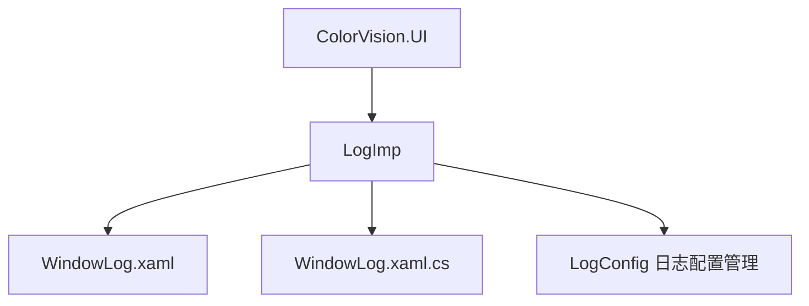
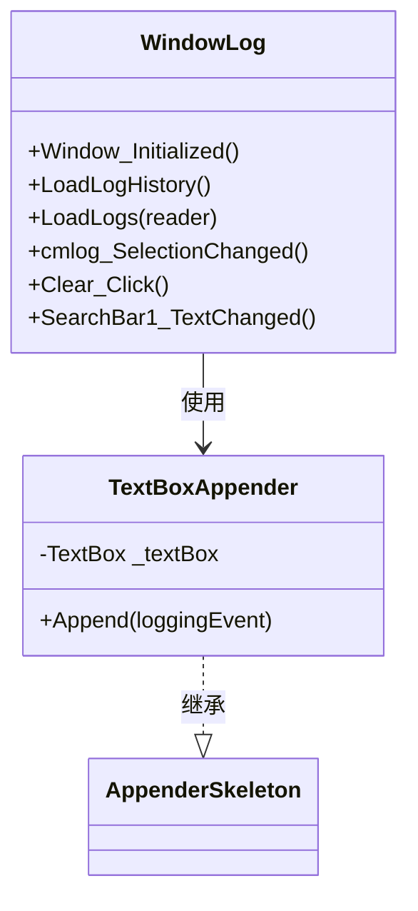

# 日志查看器


# 日志查看器

## 目录
1. [简介](#简介)
2. [项目结构](#项目结构)
3. [核心组件](#核心组件)
4. [架构概览](#架构概览)
5. [详细组件分析](#详细组件分析)
6. [依赖关系分析](#依赖关系分析)
7. [性能考虑](#性能考虑)
8. [故障排查指南](#故障排查指南)
9. [结论](#结论)
10. [附录](#附录)

## 简介
本日志查看器是一个用于监控系统运行状态和诊断问题的重要工具。它基于 log4net 日志框架，实现了日志的实时显示、日志级别筛选、内容搜索（支持正则表达式）、日志清理以及日志文件历史加载等功能。用户可以通过该查看器便捷地监控系统日志，快速定位和分析系统异常，提升维护效率。

本文档详细介绍了日志查看器的项目结构、核心组件、架构设计和关键功能的实现细节，特别针对日志级别管理、过滤和导出功能进行了深入剖析，旨在帮助技术人员和非技术用户全面理解和使用该日志查看器。

## 项目结构
日志查看器作为 ColorVision 系统的一个插件，主要代码集中在路径 `/UI/ColorVision.UI/LogImp/` 下。该目录包含：

- `WindowLog.xaml`：日志查看器的界面布局定义，使用 WPF XAML 编写，定义了搜索栏、日志显示区、日志级别选择、自动滚动和刷新开关等UI元素。
- `WindowLog.xaml.cs`：对应的后台代码文件，实现了日志加载、日志过滤、日志级别切换、清理及日志追加显示的逻辑。
- 其他相关日志配置类如 `LogConfig`（未包含在当前文件，但在代码中引用，负责日志配置状态管理）。

项目整体采用分层设计，UI层负责界面交互，日志处理逻辑通过 log4net 框架实现，日志数据通过文件和内存文本框双重管理。UI与日志框架解耦，便于维护和扩展。



## 核心组件

### 1. WindowLog.xaml (界面布局)
- 定义了日志查看窗口的整体布局
- 包含搜索栏（支持实时搜索及正则表达式）
- 日志级别下拉选择框
- 自动滚动和自动刷新开关按钮
- 日志显示区（文本框控件）

### 2. WindowLog.xaml.cs (功能实现)
- 初始化日志系统，添加自定义日志追加器 `TextBoxAppender`
- 绑定日志级别选择，动态调整 log4net 日志级别
- 实现日志文件加载（支持加载当天日志或程序启动以来日志）
- 实现日志内容搜索功能，支持多关键词和正则表达式
- 实现日志清理功能
- 自动滚动日志显示，保证最新日志可见
- 通过 `TextBoxAppender` 实现日志实时追加到文本框

### 3. TextBoxAppender (日志追加器)
- 继承自 log4net 的 `AppenderSkeleton`
- 重写 `Append` 方法，将日志事件渲染为文本追加到 UI 的日志文本框中
- 根据配置决定是否保留旧日志和是否自动滚动

## 架构概览
日志查看器基于 log4net 作为日志框架核心，设计了一个自定义的日志追加器 `TextBoxAppender`，将日志实时推送到界面文本框显示。日志级别可通过界面选择动态修改，影响日志输出行为。日志内容支持从日志文件加载历史数据，并能根据时间和启动时间过滤。搜索功能支持关键词和正则表达式，方便用户快速定位日志信息。

整体架构体现了典型的观察者模式：log4net 作为日志事件源，`TextBoxAppender` 作为观察者将日志事件推送给 UI，UI 控件负责展示和交互。日志文件作为持久化存储，支持历史数据加载。



## 详细组件分析

### WindowLog.xaml
该文件定义了日志查看窗口的 UI 结构。主要元素包括：

- `SearchBar1`：搜索栏，支持实时文本变更事件，触发日志过滤。
- `cmlog`：日志级别选择下拉框，绑定所有日志级别，用户切换时修改日志输出级别。
- `ToggleButton`：自动滚动和自动刷新开关，绑定配置属性。
- `logTextBox`：主日志显示文本框，显示完整日志。
- `logTextBoxSerch`：搜索结果显示文本框，切换显示以支持搜索过滤。

界面设计简洁，操作直观，支持用户高效查看和筛选日志。

### WindowLog.xaml.cs

#### 主要功能函数

1. `Window_Initialized`
   - 初始化 log4net 日志系统，添加 `TextBoxAppender` 追加器到根日志器。
   - 绑定日志级别数据源到下拉框。
   - 加载历史日志文件内容。
   - 设置自动滚动到最新日志。

2. `LoadLogHistory`
   - 根据配置决定是否加载日志文件。
   - 读取日志文件，调用 `LoadLogs` 解析并加载日志内容。

3. `LoadLogs`
   - 逐行读取日志文件，解析时间戳。
   - 根据配置过滤日志（当天日志或程序启动后日志）。
   - 追加符合条件的日志内容到文本框。

4. `cmlog_SelectionChanged`
   - 用户切换日志级别时，更新 log4net 根日志器的日志级别。
   - 记录日志级别变更信息。

5. `Clear_Click`
   - 清空日志显示文本框。

6. `SearchBar1_TextChanged`
   - 实时响应搜索框文本变化。
   - 支持正则表达式和多关键词搜索。
   - 根据搜索结果切换显示主日志或搜索结果文本框。

#### 关键代码示例

```csharp
private void cmlog_SelectionChanged(object sender, SelectionChangedEventArgs e)
{
    var selectedLevel = (KeyValuePair<Level, string>)cmlog.SelectedItem;
    var hierarchy = (Hierarchy)LogManager.GetRepository();
    if (selectedLevel.Key != hierarchy.Root.Level)
    {
        hierarchy.Root.Level = selectedLevel.Key;
        log4net.Config.BasicConfigurator.Configure(hierarchy);
        log.Info("更新Log4Net 日志级别：" + selectedLevel.Value);
    }
}
```

该函数实现了日志级别动态切换，确保日志输出符合用户需求。

### TextBoxAppender

这是日志查看器的核心日志追加器类，继承自 log4net 的 `AppenderSkeleton`。其重写的 `Append` 方法将日志事件文本追加到 UI 的日志文本框中，并支持自动刷新和滚动。

```csharp
protected override void Append(LoggingEvent loggingEvent)
{
    if (!LogConfig.Instance.AutoRefresh) return;
    var renderedMessage = RenderLoggingEvent(loggingEvent);
    Application.Current.Dispatcher.BeginInvoke(() =>
    {
        if (LogConfig.Instance.LogReserve)
        {
            _textBox.Text = renderedMessage + _textBox.Text;
        }
        else
        {
            _textBox.AppendText(renderedMessage);
            if (LogConfig.Instance.AutoScrollToEnd)  
                _textBox.ScrollToEnd();
        }
    });
}
```

此处通过调度器确保线程安全地更新 UI。

## 依赖关系分析
- 依赖 log4net 作为日志框架，利用其日志级别和追加器机制实现日志管理。
- 依赖 WPF 框架实现界面交互和展示。
- 依赖系统文件读写API加载日志文件。
- 依赖正则表达式库实现高级搜索功能。

组件之间耦合度低，设计清晰。日志追加器与 UI 分离，便于单独测试和维护。

## 性能考虑
- 日志追加采用异步调度，避免界面阻塞。
- 日志文件读取支持共享读写，避免文件锁定。
- 搜索功能支持限制关键词和正则表达式，提升搜索效率。
- 支持配置日志保留策略，避免日志显示区域过大导致性能下降。

## 故障排查指南
- 日志文件读取异常时，界面弹出错误提示，提示用户检查文件权限或路径。
- 正则表达式错误时，搜索栏边框变红提示输入格式错误。
- 日志级别切换失败时，检查 log4net 配置是否正确加载。
- 日志显示异常时，确认日志追加器是否正确挂载。

## 结论
日志查看器通过结合 log4net 框架和 WPF 界面技术，实现了功能强大且用户友好的日志监控工具。它支持日志级别动态调整、丰富的搜索过滤和历史日志加载，方便用户实时监控系统运行状态和快速定位问题。清晰的架构设计和低耦合度保证了扩展性和维护性。

## 附录

### 相关文件链接
- [WindowLog.xaml](https://github.com/xincheng213618/scgd_general_wpf/blob/master/UI/ColorVision.UI/LogImp/WindowLog.xaml)
- [WindowLog.xaml.cs](https://github.com/xincheng213618/scgd_general_wpf/blob/master/UI/ColorVision.UI/LogImp/WindowLog.xaml.cs)

