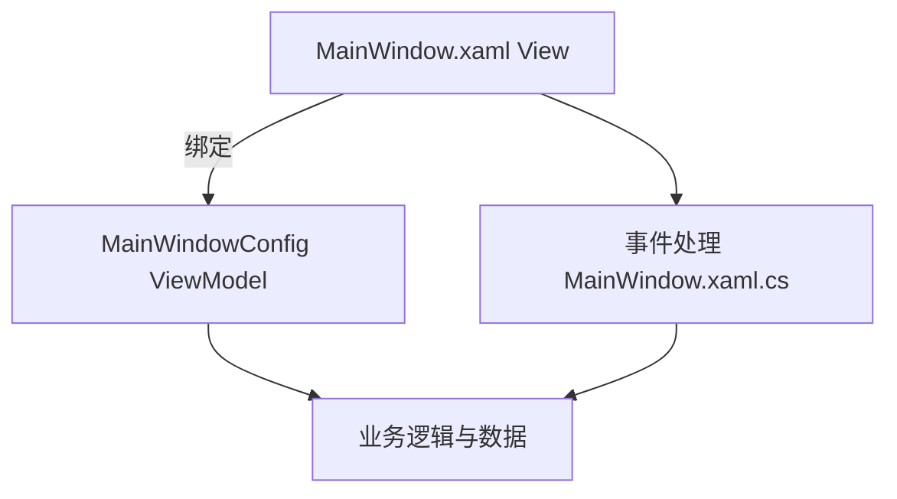
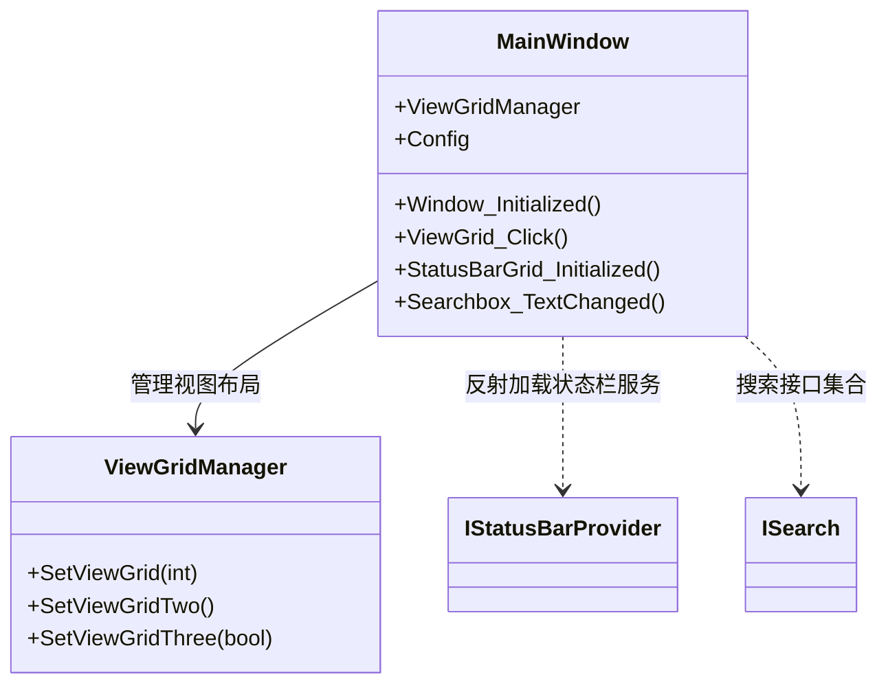

# 主窗口导览


# 主窗口导览

## 目录
1. [介绍](#介绍)
2. [项目结构](#项目结构)
3. [核心组件](#核心组件)
4. [架构概览](#架构概览)
5. [详细组件分析](#详细组件分析)
6. [依赖关系分析](#依赖关系分析)
7. [性能考虑](#性能考虑)
8. [故障排除指南](#故障排除指南)
9. [结论](#结论)
10. [附录](#附录)

## 介绍
本篇文档详细介绍了ColorVision项目的主窗口布局与功能实现，聚焦于主窗口的菜单栏、工具栏、状态栏以及主要视图区域的结构与用途。文档旨在帮助读者，尤其是对技术细节了解有限的用户，理解主窗口的设计理念及基本操作方式。

主窗口作为应用程序的核心界面，承载了用户交互的主要部分，包括项目管理、视图切换、搜索功能和状态信息展示。通过对主窗口的深入分析，读者能够全面了解其组成及工作机制。

## 项目结构

### 1. 目录结构概览
ColorVision项目的主窗口相关文件主要位于 `/ColorVision/` 目录下，关键文件包括：

- `MainWindow.xaml`：主窗口的XAML布局文件，定义了窗口的UI结构，如菜单栏、工具栏、视图区域及状态栏。
- `MainWindow.xaml.cs`：主窗口的后台代码，实现了窗口的逻辑处理、事件响应及功能实现。

### 2. 文件职责说明
- **MainWindow.xaml**：采用WPF（Windows Presentation Foundation）技术定义界面布局，使用了多种控件（Grid、Menu、TabControl、StatusBar等）构建主窗口的视觉结构。
- **MainWindow.xaml.cs**：包含主窗口的交互逻辑，包括初始化、菜单管理、视图布局管理、搜索功能、状态栏图标动态加载及快捷键绑定等。

### 3. 设计模式与架构
主窗口采用MVVM（Model-View-ViewModel）架构思想，`DataContext`绑定了配置类 `MainWindowConfig`，实现界面与数据的分离。通过事件和命令绑定实现用户操作与后台逻辑的解耦。



## 核心组件

### 1. 菜单栏（Menu）
- 位于窗口顶部，使用 `Menu` 控件定义，绑定于 `MenuManager` 管理的菜单集合。
- 提供应用程序的主要操作入口，如文件操作、编辑、视图切换、帮助等。

### 2. 工具栏与搜索区
- 搜索框 (`Searchbox`) 位于菜单栏右侧，支持输入关键词进行快速搜索。
- 搜索结果通过弹出框 (`Popup`) 展示，支持键盘导航和双击执行搜索命令。
- 搜索功能集成了外部工具（如Everything搜索），提升搜索效率。

### 3. 视图区域（ContentGrid）
- 主体分为左右两部分：
  - 左侧为 `LeftMainContent`，包含标签页控件 (`TabControl`)，用于项目浏览（`SolutionTab1`）和数据采集视图（`ViewTab`）。
  - 右侧为主内容区，包含两个 `Grid`（`ViewGrid` 和 `SolutionGrid`），用于不同视图的展示和切换。
- 视图布局通过 `ViewGridManager` 动态管理，支持多种窗口布局模式（单窗口、双窗口、三窗口、四窗口等）。

### 4. 状态栏（StatusBar）
- 位于窗口底部，显示应用状态信息和快捷操作按钮。
- 状态栏图标和文本项通过实现 `IStatusBarProvider` 的组件动态加载。
- 支持状态栏项的显示与隐藏控制，提供上下文菜单用于快速切换显示项。

## 架构概览

主窗口架构设计基于模块化思想，核心模块包括：

- **菜单管理模块**：负责加载和管理菜单项，支持插件扩展。
- **视图管理模块**：通过 `ViewGridManager` 管理多视图布局，支持动态切换。
- **搜索模块**：管理搜索数据源，处理搜索输入，展示搜索结果。
- **状态栏模块**：动态加载状态栏元素，展示系统状态和快捷操作。
- **配置管理模块**：通过 `MainWindowConfig` 维护窗口状态和用户设置。

整体架构体现了职责分离和组件解耦，便于维护和扩展。

## 详细组件分析

### 1. MainWindow.xaml 结构解析

主窗口采用三行布局：

- 第一行：菜单栏及搜索框区域，使用 `DockPanel` 布局，左侧为菜单，右侧为搜索框。
- 第二行：主内容区域，左右分栏，左栏为项目和视图标签页，右栏为主视图显示区。
- 第三行：状态栏，显示状态信息和操作按钮。

关键控件说明：

```xml
<Grid.RowDefinitions>
  <RowDefinition Height="auto"/>
  <RowDefinition Height="*"/>
  <RowDefinition Height="auto"/>
</Grid.RowDefinitions>
```

- `Menu1`：主菜单控件。
- `Searchbox`：搜索输入框，绑定搜索事件。
- `LeftTabControl`：左侧标签页，含项目和采集视图。
- `ViewGrid` 和 `SolutionGrid`：右侧视图区域，动态显示不同内容。
- `StatusBarGrid`：状态栏，包含图标和文本区域。

### 2. MainWindow.xaml.cs 逻辑解析

#### 关键类与方法

- `MainWindow` 类：主窗口类，继承自 `Window`。
- `Window_Initialized`：窗口初始化事件，完成菜单绑定、视图管理器初始化、插件加载、快捷键绑定等。
- `ViewGrid_Click`：视图布局切换事件，根据按钮Tag切换不同视图布局。
- `StatusBarGrid_Initialized`：状态栏初始化，动态加载状态栏图标和文本项。
- 搜索相关事件：`Searchbox_TextChanged`、`Searchbox_PreviewKeyDown`、`ListView1_MouseDoubleClick` 实现搜索输入响应和结果执行。

#### 代码示例：视图布局切换

```csharp
private void ViewGrid_Click(object sender, RoutedEventArgs e)
{
    if (sender is Button button && int.TryParse(button.Tag.ToString(), out int nums))
    {
        switch (nums)
        {
            case 20:
                ViewGridManager.SetViewGridTwo();
                break;
            case 21:
                ViewGridManager.SetViewGrid(2);
                break;
            case 30:
                ViewGridManager.SetViewGridThree();
                break;
            case 31:
                ViewGridManager.SetViewGridThree(false);
                break;
            default:
                ViewGridManager.SetViewGrid(nums);
                break;
        }
    }
}
```

#### 代码示例：搜索框文本变化处理

```csharp
private void Searchbox_TextChanged(object sender, TextChangedEventArgs e)
{
    if (sender is TextBox textBox)
    {
        string searchtext = textBox.Text;
        if (string.IsNullOrWhiteSpace(searchtext))
        {
            SearchPopup.IsOpen = false;
        }
        else
        {
            SearchPopup.IsOpen = true;
            var keywords = searchtext.Split(new[] { ' ' }, StringSplitOptions.RemoveEmptyEntries);
            filteredResults = Searches
                .Where(template => keywords.All(keyword =>
                    template.Header.Contains(keyword, StringComparison.OrdinalIgnoreCase) ||
                    template.GuidId.ToString().Contains(keyword, StringComparison.OrdinalIgnoreCase)))
                .ToList();

            // 集成Everything搜索工具
            string everythingpath = @"C:\Program Files\Everything\Everything.exe";
            if (File.Exists(everythingpath))
            {
                void Search()
                {
                    ProcessStartInfo startInfo = new()
                    {
                        UseShellExecute = true,
                        WorkingDirectory = Environment.CurrentDirectory,
                        FileName = everythingpath,
                        Arguments = $"-s {searchtext}"
                    };
                    try
                    {
                        Process.Start(startInfo);
                    }
                    catch (Exception ex)
                    {
                        MessageBox.Show(Application.Current.GetActiveWindow(), ex.Message);
                    }
                }

                SearchMeta search = new()
                {
                    GuidId = Guid.NewGuid().ToString(),
                    Header = $"{Properties.Resources.Search} {searchtext}",
                    Command = new Common.MVVM.RelayCommand(a => Search())
                };

                filteredResults.Add(search);
            }

            ListView1.ItemsSource = filteredResults;
            if (filteredResults.Count > 0)
            {
                ListView1.SelectedIndex = 0;
            }
        }
    }
}
```

### 3. 事件与命令绑定

- 使用WPF命令机制绑定快捷键（Ctrl+F）聚焦搜索框。
- 通过事件处理实现菜单操作、视图切换、搜索结果执行等。

### 4. 状态栏动态加载机制

- 通过反射加载实现 `IStatusBarProvider` 接口的组件，获取状态栏元数据。
- 根据元数据动态创建状态栏图标和文本项，支持绑定显示与隐藏。
- 提供上下文菜单控制状态栏项的可见性。



## 依赖关系分析

- 主窗口依赖多个管理类，如 `MenuManager`（菜单管理）、`ViewGridManager`（视图布局管理）、`DisPlayManager`（显示管理）。
- 通过反射机制加载插件和状态栏提供者，实现高度模块化和可扩展性。
- 使用WPF数据绑定和命令模式实现界面与逻辑解耦。
- 依赖外部搜索工具（Everything）提升搜索体验。

## 性能考虑

- 视图布局动态切换避免重复创建UI，提升响应速度。
- 搜索结果过滤使用LINQ和内存集合，适合中小规模数据，复杂场景可考虑异步和分页优化。
- 状态栏动态加载采用懒加载和事件驱动，减少启动时性能开销。

## 故障排除指南

- 若菜单项未加载，确认插件是否正确加载及菜单管理器是否初始化。
- 搜索无结果时，确认搜索关键词是否正确输入，且搜索数据源已加载。
- 状态栏图标不显示，检查对应 `IStatusBarProvider` 实现是否存在异常。
- 快捷键无响应，确认快捷键绑定代码是否执行，且无冲突。

## 结论

ColorVision主窗口设计结构清晰，功能模块划分合理，采用现代WPF技术实现动态布局和丰富交互。通过菜单栏、工具栏、状态栏及视图区域的有机结合，提供了灵活且高效的用户操作体验。文档详细解读了主窗口的布局结构及核心实现逻辑，帮助用户和开发者深入理解和使用该系统。

## 附录

### 相关源码链接
- 主窗口布局定义  
  Source: [https://github.com/xincheng213618/scgd_general_wpf/blob/master/ColorVision/MainWindow.xaml](ColorVision/MainWindow.xaml)
- 主窗口逻辑实现  
  Source: [https://github.com/xincheng213618/scgd_general_wpf/blob/master/ColorVision/MainWindow.xaml.cs](ColorVision/MainWindow.xaml.cs)

