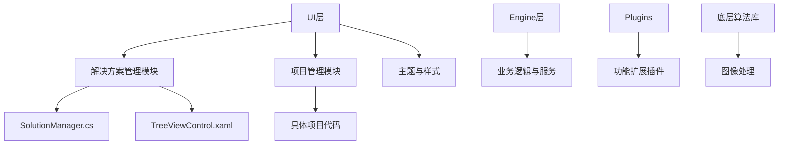
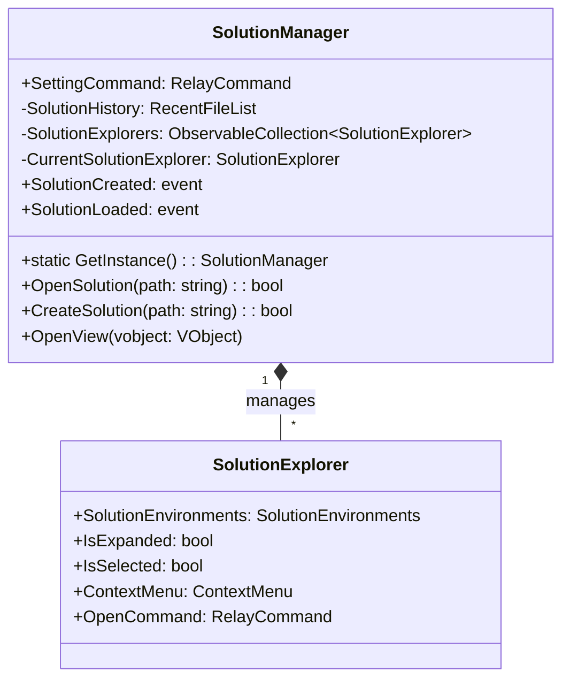

# 解决方案与项目管理


# 解决方案与项目管理

## 目录
1. [引言](#引言)
2. [项目结构](#项目结构)
3. [核心组件](#核心组件)
4. [架构概览](#架构概览)
5. [详细组件分析](#详细组件分析)
6. [依赖分析](#依赖分析)
7. [性能考量](#性能考量)
8. [故障排除指南](#故障排除指南)
9. [总结](#总结)

## 引言
本篇文档旨在详细介绍如何使用解决方案浏览器来创建、打开及管理项目和解决方案，并解释项目文件的结构及不同类型项的含义。通过对代码库的深入分析，帮助用户理解解决方案与项目管理模块的架构与实现细节，即使是技术基础较弱的用户，也能轻松掌握相关操作与功能。

## 项目结构

项目整体采用模块化设计，代码组织清晰，主要围绕“解决方案管理”、“项目管理”、“插件扩展”、“UI界面”等核心功能模块划分。目录结构体现了按功能和技术层次分离的设计思路，便于维护和扩展。

主要目录说明：

1. **/UI/ColorVision.Solution/**  
   该目录包含解决方案管理模块的核心代码，负责解决方案的创建、打开、管理及UI交互。包括`SolutionManager.cs`（解决方案控制中心）和`TreeViewControl.xaml`（解决方案树视图控件）等文件。

2. **/ColorVision/**  
   主程序入口及核心应用逻辑，涵盖主窗口、启动窗口、插件管理、更新机制等。

3. **/Engine/ColorVision.Engine/**  
   业务逻辑层，包含算法、服务、消息处理、数据库交互等核心功能实现。

4. **/Plugins/**  
   各类插件实现，扩展系统功能，如事件查看器、屏幕录制、系统监控等。

5. **/Projects/**  
   各具体项目实现目录，包含不同业务线的项目代码和配置。

6. **/UI/ColorVision.Themes/**  
   主题和界面样式资源，负责界面美化和用户体验。

7. **/Engine/ColorVision.Net/** 和 **/Engine/cvColorVision/**  
   底层图像处理及算法库，提供图像相关功能支持。

整体架构采用MVVM设计模式，UI与业务逻辑分离，便于维护和测试。代码中使用了命令模式（RelayCommand）、观察者模式（事件通知）等设计模式。



## 核心组件

### 1. SolutionManager.cs
- **功能**：解决方案模块的控制中心，负责解决方案的创建、打开、历史管理及事件通知。
- **关键属性**：
  - `SolutionHistory`：管理最近打开的解决方案列表。
  - `SolutionExplorers`：当前打开的解决方案浏览器集合。
  - `CurrentSolutionExplorer`：当前活动的解决方案浏览器。
- **关键方法**：
  - `OpenSolution(string FullPath)`：打开指定路径的解决方案文件。
  - `CreateSolution(string SolutionDirectoryPath)`：创建新的解决方案文件。
  - `OpenView(VObject vobject)`：打开指定的视图对象。
- **设计模式**：
  - 单例模式保证`SolutionManager`唯一实例。
  - 事件机制通知解决方案创建和加载。
  - 使用命令模式绑定设置命令。

### 2. TreeViewControl.xaml
- **功能**：解决方案树形视图控件，展示解决方案结构，支持新建、打开等操作。
- **UI元素**：
  - 按钮（新建、打开、设置）
  - 搜索栏（实时过滤项目文件）
  - 树形视图（展示解决方案文件结构）
- **交互**：
  - 双击命令绑定，支持打开文件。
  - 上下文菜单支持右键操作。
- **样式**：
  - 自定义ToggleButton用于展开/折叠节点。
  - 主题资源动态绑定，支持深色模式。

## 架构概览

解决方案管理模块作为系统的核心部分，主要职责是管理解决方案文件（以`.cvsln`为扩展名），包括创建、打开、维护解决方案环境及其视图。它与UI层紧密结合，通过树形控件展现解决方案结构，支持用户交互。

模块采用单例模式保证全局唯一的管理实例，事件驱动机制实现模块间解耦。解决方案历史管理使用注册表持久化，方便快速访问最近使用的解决方案。

UI部分采用WPF技术，利用MVVM模式将视图与业务逻辑分离，通过命令绑定和数据绑定实现响应式界面。



## 详细组件分析

### SolutionManager.cs 分析

#### 目的
负责管理解决方案的生命周期，包括创建、打开、历史记录管理及事件通知。通过单例模式保证唯一实例，方便全局访问。

#### 关键函数

1. `GetInstance()`  
   单例获取方法，线程安全，确保全局唯一实例。

2. `OpenSolution(string FullPath)`  
   - 检查路径是否存在且扩展名为`.cvsln`。  
   - 更新解决方案历史列表。  
   - 解析解决方案路径信息，更新`SolutionEnvironments`。  
   - 清空并重建解决方案浏览器集合。  
   - 触发`SolutionLoaded`事件通知。

3. `CreateSolution(string SolutionDirectoryPath)`  
   - 确保目录存在。  
   - 生成默认解决方案配置文件（JSON格式）。  
   - 触发`SolutionCreated`事件。  
   - 自动调用`OpenSolution`打开新建的解决方案。

4. `OpenView(VObject vobject)`  
   - 触发`OpenFilePath`事件，通知UI打开指定文件视图。

#### 代码示例

```csharp
public bool OpenSolution(string FullPath)
{
    if (File.Exists(FullPath) && FullPath.EndsWith("cvsln", StringComparison.OrdinalIgnoreCase))
    {
        FileInfo fileInfo = new FileInfo(FullPath);
        SolutionHistory.InsertFile(FullPath);
        SolutionLoaded?.Invoke(FullPath, new EventArgs());
        SolutionEnvironments.SolutionDir = Directory.GetParent(fileInfo.FullName).FullName;
        SolutionEnvironments.SolutionPath = fileInfo.FullName;
        SolutionEnvironments.SolutionExt = fileInfo.Extension;
        SolutionEnvironments.SolutionName = fileInfo.Name;
        SolutionEnvironments.SolutionFileName = Path.GetFileName(FullPath);
        SolutionExplorers.Clear();
        CurrentSolutionExplorer = new SolutionExplorer(SolutionEnvironments);
        SolutionExplorers.Add(CurrentSolutionExplorer);
        return true;
    }
    else
    {
        SolutionHistory.RemoveFile(FullPath);
        return false;
    }
}
```

#### 设计亮点
- 使用事件机制实现模块间解耦，方便扩展和维护。
- 通过`ObservableCollection`实现UI自动更新。
- 利用`RelayCommand`实现命令绑定，简化UI操作逻辑。

---

### TreeViewControl.xaml 分析

#### 目的
提供用户交互界面，展示解决方案的项目结构，支持新建、打开、搜索和设置操作。

#### 关键控件
- `Button`：绑定命令，实现新建、打开及设置操作。
- `SearchBar`：实时过滤解决方案中的文件。
- `TreeView`：展示解决方案树形结构，支持节点展开、选择和双击打开。

#### 样式与交互
- 自定义`ToggleButton`样式用于节点展开折叠，提升用户体验。
- 通过`DoubleClickCommandBehavior`绑定双击命令，用户双击节点即可打开文件。
- 使用资源字典统一管理样式，支持主题切换。

#### XAML片段示例

```xml
<TreeView x:Name="SolutionTreeView" Style="{StaticResource TreeView.Small}" BorderThickness="0" Padding="0" Margin="3,3,3,0" Background="{DynamicResource GlobalBackground}" ScrollViewer.HorizontalScrollBarVisibility="Visible">
    <TreeView.ItemContainerStyle>
        <Style TargetType="TreeViewItem" BasedOn="{StaticResource TreeViewItemBaseStyle}">
            <Setter Property="IsExpanded" Value="{Binding IsExpanded, Mode=TwoWay}"/>
            <Setter Property="IsSelected" Value="{Binding IsSelected, Mode=TwoWay}" />
            <Setter Property="ContextMenu" Value="{Binding ContextMenu}"/>
            <Setter Property="local:DoubleClickCommandBehavior.DoubleClickCommand" Value="{Binding OpenCommand}" />
        </Style>
    </TreeView.ItemContainerStyle>
</TreeView>
```

## 依赖分析

- **SolutionManager**依赖于：
  - `SolutionSetting`单例配置管理。
  - `RecentFileList`用于管理最近打开的解决方案。
  - `SolutionExplorer`用于展示解决方案结构。
  - `ArgumentParser`支持命令行参数解析，支持启动时自动打开指定解决方案。
  - `JumpListManager`集成Windows跳转列表，提升用户体验。

- **UI层**通过数据绑定与命令绑定与`SolutionManager`交互，实现界面与逻辑分离。

- 事件机制减少模块耦合，利于维护和功能扩展。

## 性能考量

- 解决方案文件的打开操作采用异步调度（`Application.Current.Dispatcher.BeginInvoke`），避免阻塞UI线程，提升用户体验。
- 通过`ObservableCollection`实现UI自动响应数据变化，减少手动刷新工作。
- 搜索栏支持实时过滤，结合高效的绑定机制，保证大规模项目时的响应速度。

## 故障排除指南

- **无法打开解决方案文件**  
  确认文件路径正确且扩展名为`.cvsln`，文件存在且格式有效。

- **解决方案历史记录丢失**  
  检查注册表路径`Software\ColorVision\SolutionHistory`是否存在权限问题。

- **UI树视图无响应或显示异常**  
  确认绑定的数据上下文是否正确，检查`SolutionExplorer`实例是否正常生成。

## 总结

本模块通过`SolutionManager`实现了解决方案的核心管理功能，结合WPF强大的数据绑定和命令机制，提供了用户友好的解决方案浏览器界面。设计上采用单例模式、事件驱动和MVVM架构，既保证了系统的稳定性，也易于扩展和维护。通过对项目文件结构的清晰划分和功能模块的合理组织，使得用户能够高效地创建、打开和管理项目解决方案，满足不同业务需求。

