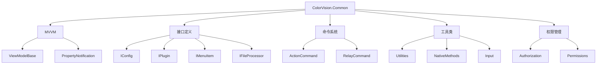

# ColorVision.Common

## 目录
1. [概述](#概述)
2. [核心功能](#核心功能)
3. [架构组件](#架构组件)
4. [接口定义](#接口定义)
5. [MVVM支持](#mvvm支持)
6. [使用示例](#使用示例)

## 概述

**ColorVision.Common** 是整个 ColorVision 系统的基础组件库，提供了通用的框架基础设施。它定义了系统的核心抽象接口、MVVM 架构支持、命令模式实现以及各种通用工具类。

### 基本信息

- **版本**: 1.3.8.1
- **目标框架**: .NET 8.0 / .NET 6.0 Windows
- **技术栈**: WPF, Windows Forms
- **包类型**: NuGet 包支持

## 核心功能

### 1. MVVM 架构支持
- 提供完整的 MVVM 模式基础设施
- ViewModelBase 基类实现
- 属性变更通知机制
- 命令绑定支持

### 2. 命令模式实现
- ActionCommand 实现
- RelayCommand 支持
- 参数化命令处理

### 3. 接口定义系统
- 配置管理接口
- 插件系统接口
- UI 组件接口
- 文件处理接口

### 4. 通用工具类
- 输入处理工具
- 权限管理系统
- 本地化方法集合
- 算法工具类

## 架构组件



## 接口定义

### 配置管理接口

#### IConfig
```csharp
public interface IConfig
{
    // 配置项管理
    void Load();
    void Save();
    void Reset();
}
```

#### IConfigSetting
```csharp
public interface IConfigSetting
{
    // 设置项管理
    string SettingName { get; }
    object DefaultValue { get; }
    void ApplySettings();
}
```

### 插件系统接口

#### IPlugin
```csharp
public interface IPlugin
{
    string Name { get; }
    string Version { get; }
    string Description { get; }
    bool IsEnabled { get; set; }
    
    void Initialize();
    void Shutdown();
}
```

#### IInitializer
```csharp
public interface IInitializer
{
    int Order { get; }
    void Initialize();
}
```

### UI 组件接口

#### IMenuItem
```csharp
public interface IMenuItem
{
    string Header { get; }
    string Icon { get; }
    ICommand Command { get; }
    int Order { get; }
}
```

#### IDisPlayControl
```csharp
public interface IDisPlayControl
{
    string Name { get; }
    UserControl CreateControl();
    void RefreshData();
}
```

### 文件处理接口

#### IFileProcessor
```csharp
public interface IFileProcessor
{
    string[] SupportedExtensions { get; }
    bool CanProcess(string fileName);
    void ProcessFile(string fileName);
}
```

#### IWizardStep
```csharp
public interface IWizardStep
{
    string Title { get; }
    string Description { get; }
    UserControl StepContent { get; }
    bool CanGoNext { get; }
    bool CanGoPrevious { get; }
}
```

## MVVM支持

### ViewModelBase 基类

```csharp
public abstract class ViewModelBase : INotifyPropertyChanged
{
    public event PropertyChangedEventHandler PropertyChanged;
    
    protected virtual void OnPropertyChanged([CallerMemberName] string propertyName = null)
    {
        PropertyChanged?.Invoke(this, new PropertyChangedEventArgs(propertyName));
    }
    
    protected virtual bool SetProperty<T>(ref T field, T value, [CallerMemberName] string propertyName = null)
    {
        if (EqualityComparer<T>.Default.Equals(field, value))
            return false;
            
        field = value;
        OnPropertyChanged(propertyName);
        return true;
    }
}
```

### 命令实现

#### ActionCommand
```csharp
public class ActionCommand : ICommand
{
    private readonly Action<object> _execute;
    private readonly Predicate<object> _canExecute;
    
    public ActionCommand(Action<object> execute, Predicate<object> canExecute = null)
    {
        _execute = execute ?? throw new ArgumentNullException(nameof(execute));
        _canExecute = canExecute;
    }
    
    public bool CanExecute(object parameter) => _canExecute?.Invoke(parameter) ?? true;
    
    public void Execute(object parameter) => _execute(parameter);
    
    public event EventHandler CanExecuteChanged
    {
        add => CommandManager.RequerySuggested += value;
        remove => CommandManager.RequerySuggested -= value;
    }
}
```

#### RelayCommand
```csharp
public class RelayCommand : ICommand
{
    private readonly Action _execute;
    private readonly Func<bool> _canExecute;
    
    public RelayCommand(Action execute, Func<bool> canExecute = null)
    {
        _execute = execute ?? throw new ArgumentNullException(nameof(execute));
        _canExecute = canExecute;
    }
    
    public bool CanExecute(object parameter) => _canExecute?.Invoke() ?? true;
    
    public void Execute(object parameter) => _execute();
    
    public event EventHandler CanExecuteChanged
    {
        add => CommandManager.RequerySuggested += value;
        remove => CommandManager.RequerySuggested -= value;
    }
}
```

## 使用示例

### 1. 创建 ViewModel

```csharp
public class MyViewModel : ViewModelBase
{
    private string _title;
    public string Title
    {
        get => _title;
        set => SetProperty(ref _title, value);
    }
    
    private bool _isEnabled;
    public bool IsEnabled
    {
        get => _isEnabled;
        set => SetProperty(ref _isEnabled, value);
    }
    
    public ICommand SaveCommand { get; }
    public ICommand CancelCommand { get; }
    
    public MyViewModel()
    {
        SaveCommand = new RelayCommand(Save, CanSave);
        CancelCommand = new ActionCommand(Cancel);
    }
    
    private void Save()
    {
        // 保存逻辑
    }
    
    private bool CanSave() => !string.IsNullOrEmpty(Title);
    
    private void Cancel(object parameter)
    {
        // 取消逻辑
    }
}
```

### 2. 实现插件接口

```csharp
public class MyPlugin : IPlugin
{
    public string Name => "My Custom Plugin";
    public string Version => "1.0.0";
    public string Description => "示例插件";
    public bool IsEnabled { get; set; } = true;
    
    public void Initialize()
    {
        // 初始化逻辑
        Console.WriteLine($"插件 {Name} 已初始化");
    }
    
    public void Shutdown()
    {
        // 清理逻辑
        Console.WriteLine($"插件 {Name} 已关闭");
    }
}
```

### 3. 实现配置管理

```csharp
public class MyConfig : IConfig
{
    public string DatabaseConnection { get; set; }
    public int TimeoutSeconds { get; set; } = 30;
    
    public void Load()
    {
        // 从文件或注册表加载配置
        var config = ConfigurationManager.AppSettings;
        DatabaseConnection = config["DatabaseConnection"];
        if (int.TryParse(config["TimeoutSeconds"], out int timeout))
            TimeoutSeconds = timeout;
    }
    
    public void Save()
    {
        // 保存配置到文件
        var config = ConfigurationManager.OpenExeConfiguration(ConfigurationUserLevel.None);
        config.AppSettings.Settings["DatabaseConnection"].Value = DatabaseConnection;
        config.AppSettings.Settings["TimeoutSeconds"].Value = TimeoutSeconds.ToString();
        config.Save();
    }
    
    public void Reset()
    {
        DatabaseConnection = string.Empty;
        TimeoutSeconds = 30;
    }
}
```

### 4. 文件处理器示例

```csharp
public class ImageFileProcessor : IFileProcessor
{
    public string[] SupportedExtensions => new[] { ".jpg", ".png", ".bmp", ".tiff" };
    
    public bool CanProcess(string fileName)
    {
        var extension = Path.GetExtension(fileName).ToLowerInvariant();
        return SupportedExtensions.Contains(extension);
    }
    
    public void ProcessFile(string fileName)
    {
        if (!CanProcess(fileName))
            throw new NotSupportedException($"不支持的文件类型: {fileName}");
            
        // 处理图像文件
        Console.WriteLine($"正在处理图像文件: {fileName}");
    }
}
```

## 项目结构

```
ColorVision.Common/
├── Algorithms/           # 算法相关工具
├── Assets/              # 资源文件
├── Authorizations/      # 权限管理
├── Commands.cs          # 命令定义
├── Input/              # 输入处理
├── Interfaces/         # 接口定义
│   ├── Assembly/       # 程序集接口
│   ├── Config/         # 配置接口
│   ├── ConfigSetting/  # 配置设置接口
│   ├── Menus/          # 菜单接口
│   ├── Serach/         # 搜索接口
│   ├── StatusBar/      # 状态栏接口
│   ├── Views/          # 视图接口
│   └── Window/         # 窗口接口
├── MVVM/               # MVVM 支持
│   ├── ActionCommand.cs
│   ├── RelayCommand.cs
│   ├── ViewModelBase.cs
│   └── ViewModelBaseExtensions.cs
├── NativeMethods/      # 本地方法
└── Utilities/          # 工具类
```

## 最佳实践

1. **接口优先**: 优先使用接口定义，便于扩展和测试
2. **MVVM 模式**: 使用 ViewModelBase 作为所有视图模型的基类
3. **命令模式**: 使用 RelayCommand 和 ActionCommand 处理用户交互
4. **配置管理**: 实现 IConfig 接口统一配置管理
5. **插件开发**: 实现 IPlugin 接口创建可插拔组件

---

*ColorVision.Common 是整个系统的基石，为其他组件提供了统一的架构基础和接口契约。*