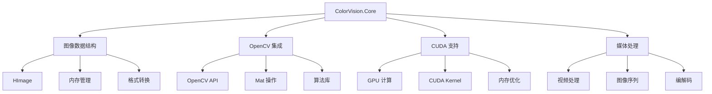

# ColorVision.Core

## 目录
1. [概述](#概述)
2. [核心功能](#核心功能)
3. [架构设计](#架构设计)
4. [核心组件](#核心组件)
5. [API 接口](#api-接口)
6. [使用示例](#使用示例)
7. [性能优化](#性能优化)

## 概述

**ColorVision.Core** 是 ColorVision 系统的核心图像处理模块，提供了与底层 C++ 库的接口封装，主要包括 OpenCV 集成、CUDA 硬件加速支持以及高性能图像处理功能。

### 基本信息

- **主要功能**: C++ 接口封装，图像处理算法
- **技术栈**: C++/CLI，OpenCV，CUDA
- **性能特点**: 硬件加速，内存优化
- **平台支持**: Windows x64

## 核心功能

### 1. 图像数据结构
- **HImage**: 高性能图像数据结构
- **内存管理**: 自动内存分配与释放
- **多通道支持**: RGB, RGBA, 灰度等格式
- **深度支持**: 8位、16位、32位精度

### 2. OpenCV 集成
- **Mat 转换**: OpenCV Mat 与 HImage 互转
- **算法调用**: 集成 OpenCV 核心算法
- **图像操作**: 基础图像处理功能
- **格式转换**: 多种图像格式支持

### 3. CUDA 硬件加速
- **GPU 计算**: 利用 CUDA 进行并行计算
- **内存优化**: GPU 内存管理
- **算法加速**: 图像处理算法 GPU 实现
- **性能提升**: 相比 CPU 处理提升数倍性能

### 4. 媒体处理支持
- **视频处理**: 视频帧提取和处理
- **音频支持**: 基础音频处理功能
- **编解码**: 多媒体格式支持

## 架构设计



## 核心组件

### HImage 结构

HImage 是核心的图像数据结构，提供了高效的内存管理和类型转换功能：

```csharp
public struct HImage : IDisposable
{
    // 图像尺寸
    public int rows;        // 行数（高度）
    public int cols;        // 列数（宽度）
    public int channels;    // 通道数
    
    // 数据格式
    public int depth;       // 像素深度（位数）
    public int stride;      // 行跨距
    
    // 计算属性
    public readonly int Type => (((depth & ((1 << 3) - 1)) + ((channels - 1) << 3)));
    public readonly uint Size { get => (uint)(rows * cols * channels * (depth / 8)); }
    
    // 数据指针
    public IntPtr pData;
    
    // 内存管理
    public void Dispose()
    {
        if (pData != IntPtr.Zero)
        {
            Marshal.FreeHGlobal(pData);
            pData = IntPtr.Zero;
        }
        GC.SuppressFinalize(this);
    }
}
```

### OpenCV CUDA 接口

提供了与 OpenCV CUDA 模块的直接接口：

```csharp
public static class OpenCVCuda
{
    private const string LibPath = "opencv_cuda.dll";
    
    // 图像融合算法
    [DllImport(LibPath)]
    public static extern int CM_Fusion(string fusionjson, out HImage hImage);
    
    // 更多 CUDA 加速算法...
}
```

### HImage 扩展方法

HImageExtension 提供了便捷的操作方法：

```csharp
public static class HImageExtension
{
    // 创建空白图像
    public static HImage CreateEmpty(int rows, int cols, int channels, int depth)
    {
        var image = new HImage
        {
            rows = rows,
            cols = cols,
            channels = channels,
            depth = depth,
            stride = cols * channels * (depth / 8)
        };
        
        image.pData = Marshal.AllocHGlobal((int)image.Size);
        return image;
    }
    
    // 从 OpenCV Mat 创建
    public static HImage FromMat(IntPtr matPtr)
    {
        // 从 OpenCV Mat 转换为 HImage
        // 实现细节...
    }
    
    // 转换为 OpenCV Mat
    public static IntPtr ToMat(this HImage image)
    {
        // 转换为 OpenCV Mat
        // 实现细节...
    }
    
    // 复制图像数据
    public static HImage Clone(this HImage source)
    {
        var clone = CreateEmpty(source.rows, source.cols, source.channels, source.depth);
        // 复制数据
        unsafe
        {
            Buffer.MemoryCopy(source.pData.ToPointer(), clone.pData.ToPointer(), 
                            clone.Size, source.Size);
        }
        return clone;
    }
}
```

### OpenCV 媒体辅助类

```csharp
public static class OpenCVMediaHelper
{
    // 视频帧提取
    public static HImage[] ExtractFrames(string videoPath, int maxFrames = -1)
    {
        // 实现视频帧提取
        // 使用 OpenCV VideoCapture
    }
    
    // 图像序列处理
    public static void ProcessImageSequence(HImage[] images, 
                                          Func<HImage, HImage> processor)
    {
        for (int i = 0; i < images.Length; i++)
        {
            var processed = processor(images[i]);
            images[i].Dispose();
            images[i] = processed;
        }
    }
    
    // 保存为视频
    public static bool SaveAsVideo(HImage[] frames, string outputPath, 
                                  double fps = 30.0)
    {
        // 实现图像序列保存为视频
        // 使用 OpenCV VideoWriter
    }
}
```

## API 接口

### 图像创建和操作

```csharp
// 创建图像
var image = HImageExtension.CreateEmpty(480, 640, 3, 8);  // 640x480 RGB8

// 从文件加载
var loadedImage = HImageExtension.LoadFromFile("image.jpg");

// 复制图像
var clonedImage = image.Clone();

// 格式转换
var grayImage = image.ConvertToGray();
var rgbImage = grayImage.ConvertToRGB();
```

### CUDA 加速处理

```csharp
// 使用 CUDA 加速的图像融合
string fusionConfig = @"{
    ""algorithm"": ""exposure_fusion"",
    ""images"": [""img1.jpg"", ""img2.jpg"", ""img3.jpg""],
    ""parameters"": {
        ""contrast_weight"": 1.0,
        ""saturation_weight"": 1.0,
        ""exposure_weight"": 1.0
    }
}";

int result = OpenCVCuda.CM_Fusion(fusionConfig, out HImage fusedImage);
if (result == 0)
{
    // 处理成功
    // 使用 fusedImage...
    fusedImage.Dispose();
}
```

### 内存管理最佳实践

```csharp
// 使用 using 语句自动释放内存
using (var image = HImageExtension.CreateEmpty(480, 640, 3, 8))
{
    // 图像处理操作
    ProcessImage(image);
}  // 自动调用 Dispose()

// 批量处理时的内存管理
public void ProcessImages(string[] imagePaths)
{
    foreach (var path in imagePaths)
    {
        using var image = HImageExtension.LoadFromFile(path);
        using var processed = ApplyFilters(image);
        
        var outputPath = Path.ChangeExtension(path, ".processed.jpg");
        processed.SaveToFile(outputPath);
    }  // 每次循环后自动释放内存
}
```

## 使用示例

### 1. 基础图像处理

```csharp
public void BasicImageProcessing()
{
    // 创建图像
    using var image = HImageExtension.CreateEmpty(480, 640, 3, 8);
    
    // 填充纯色
    image.Fill(new byte[] { 255, 0, 0 });  // 红色
    
    // 获取图像信息
    Console.WriteLine($"图像尺寸: {image.cols}x{image.rows}");
    Console.WriteLine($"通道数: {image.channels}");
    Console.WriteLine($"数据大小: {image.Size} 字节");
    
    // 保存图像
    image.SaveToFile("output.jpg");
}
```

### 2. OpenCV 集成使用

```csharp
public void OpenCVIntegration()
{
    using var sourceImage = HImageExtension.LoadFromFile("input.jpg");
    
    // 转换为 OpenCV Mat
    var matPtr = sourceImage.ToMat();
    
    try
    {
        // 在这里可以使用任何 OpenCV 算法
        // 例如：高斯模糊、边缘检测、形态学操作等
        
        // 创建结果图像
        using var resultImage = HImageExtension.FromMat(matPtr);
        resultImage.SaveToFile("result.jpg");
    }
    finally
    {
        // 释放 Mat 内存（如果需要）
        // OpenCV.ReleaseMat(matPtr);
    }
}
```

### 3. CUDA 加速图像处理

```csharp
public void CudaAcceleratedProcessing()
{
    // 检查 CUDA 是否可用
    if (!CudaHelper.IsCudaAvailable())
    {
        Console.WriteLine("CUDA 不可用，使用 CPU 处理");
        return;
    }
    
    // 批量图像处理
    var imagePaths = Directory.GetFiles("input/", "*.jpg");
    var processed = new List<HImage>();
    
    foreach (var path in imagePaths)
    {
        using var image = HImageExtension.LoadFromFile(path);
        
        // 使用 CUDA 加速处理
        var config = $@"{{
            ""algorithm"": ""bilateral_filter"",
            ""d"": 9,
            ""sigmaColor"": 75,
            ""sigmaSpace"": 75
        }}";
        
        int result = OpenCVCuda.CM_Filter(config, image, out HImage filtered);
        if (result == 0)
        {
            processed.Add(filtered);
        }
    }
    
    // 清理资源
    foreach (var img in processed)
    {
        img.Dispose();
    }
}
```

### 4. 视频处理

```csharp
public void VideoProcessing()
{
    var videoPath = "input.mp4";
    var outputDir = "frames/";
    
    // 提取视频帧
    var frames = OpenCVMediaHelper.ExtractFrames(videoPath, maxFrames: 100);
    
    try
    {
        // 处理每一帧
        for (int i = 0; i < frames.Length; i++)
        {
            // 应用图像处理
            using var processed = ApplyImageEnhancement(frames[i]);
            
            // 保存处理后的帧
            var framePath = Path.Combine(outputDir, $"frame_{i:D4}.jpg");
            processed.SaveToFile(framePath);
        }
        
        // 将处理后的帧重新合成视频
        var processedFrames = LoadFramesFromDirectory(outputDir);
        OpenCVMediaHelper.SaveAsVideo(processedFrames, "output.mp4", fps: 30.0);
    }
    finally
    {
        // 释放所有帧内存
        foreach (var frame in frames)
        {
            frame.Dispose();
        }
    }
}
```

## 性能优化

### 1. 内存管理优化

```csharp
// 避免频繁的内存分配
public class ImagePool
{
    private readonly Queue<HImage> _pool = new();
    private readonly object _lock = new();
    
    public HImage Rent(int rows, int cols, int channels, int depth)
    {
        lock (_lock)
        {
            if (_pool.Count > 0)
            {
                var image = _pool.Dequeue();
                if (image.rows == rows && image.cols == cols && 
                    image.channels == channels && image.depth == depth)
                {
                    return image;
                }
                image.Dispose();
            }
        }
        
        return HImageExtension.CreateEmpty(rows, cols, channels, depth);
    }
    
    public void Return(HImage image)
    {
        lock (_lock)
        {
            _pool.Enqueue(image);
        }
    }
}
```

### 2. CUDA 性能优化

```csharp
public class CudaContext : IDisposable
{
    private IntPtr _context;
    
    public CudaContext()
    {
        // 初始化 CUDA 上下文
        _context = CudaHelper.CreateContext();
    }
    
    public void ProcessBatch(HImage[] images, Func<HImage, HImage> processor)
    {
        // 批量处理，减少 GPU 内存传输开销
        var gpuImages = CudaHelper.UploadToGpu(images);
        
        try
        {
            // GPU 上批量处理
            var processedGpuImages = CudaHelper.ProcessBatch(gpuImages, processor);
            
            // 下载结果
            CudaHelper.DownloadFromGpu(processedGpuImages, images);
        }
        finally
        {
            CudaHelper.FreeGpuMemory(gpuImages);
        }
    }
    
    public void Dispose()
    {
        if (_context != IntPtr.Zero)
        {
            CudaHelper.DestroyContext(_context);
            _context = IntPtr.Zero;
        }
    }
}
```

## 依赖要求

### 运行时依赖

- **opencv_cuda.dll**: OpenCV CUDA 模块
- **cudart64_XX.dll**: CUDA 运行时库
- **cublas64_XX.dll**: CUDA 基础线性代数库
- **Visual C++ Redistributable**: MSVC 运行时

### 硬件要求

- **GPU**: 支持 CUDA 计算能力 3.5+
- **内存**: 推荐 8GB+ 系统内存
- **显存**: 推荐 4GB+ GPU 显存

### 开发环境

- **CUDA SDK**: 版本 11.0+
- **OpenCV**: 版本 4.5+ 带 CUDA 支持
- **Visual Studio**: 2019+ 带 C++/CLI 支持

---

*ColorVision.Core 提供了高性能的图像处理基础设施，通过 CUDA 加速和优化的内存管理，为整个系统提供了强大的图像处理能力。*