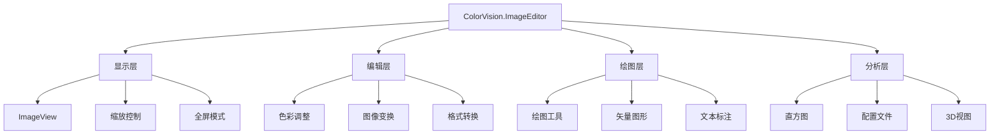

# ColorVision.ImageEditor

## 目录
1. [概述](#概述)
2. [核心功能](#核心功能)
3. [架构设计](#架构设计)
4. [主要组件](#主要组件)
5. [绘图工具](#绘图工具)
6. [图像处理功能](#图像处理功能)
7. [使用示例](#使用示例)
8. [扩展开发](#扩展开发)

## 概述

**ColorVision.ImageEditor** 是一个功能完整的 WPF 图像编辑控件库，提供了专业级的图像显示、编辑、标注和分析功能。它支持多种图像格式，包括高精度的 RGB48 格式，并提供了丰富的绘图工具和图像处理算法。

### 基本信息

- **版本**: 1.3.8.1
- **目标框架**: .NET 8.0 / .NET 6.0 Windows
- **UI 框架**: WPF
- **特色功能**: RGB48 支持、矢量绘图、图像分析

## 核心功能

### 1. 图像显示与交互
- **多格式支持**: 支持常见图像格式和 RGB48 高精度格式
- **缩放与平移**: 流畅的缩放、平移和适配功能
- **全屏显示**: 沉浸式图像浏览体验
- **网格显示**: 像素级精确定位辅助

### 2. 图像编辑功能
- **色彩调整**: 对比度、Gamma、色调、饱和度调整
- **伪彩色显示**: 科学数据可视化支持
- **直方图分析**: 实时直方图显示和分析
- **配置文件剖析**: 像素数据分析工具

### 3. 绘图与标注工具
- **几何图形**: 矩形、圆形、线条、多边形
- **文本标注**: 自定义字体、颜色和样式
- **贝塞尔曲线**: 复杂路径绘制
- **测量工具**: 距离和角度测量

### 4. 3D 可视化
- **3D 图像视图**: 立体数据展示
- **CIE 色彩空间**: 色彩科学分析工具
- **深度数据处理**: 点云和深度图支持

## 架构设计



## 主要组件

### ImageView 主控件

ImageView 是核心的图像显示控件，提供了完整的图像交互功能：

```xml
<local:ImageView x:Name="MainImageView"
                 ImageSource="{Binding CurrentImage}"
                 ZoomMode="Fit"
                 ShowGrid="True"
                 AllowDrop="True">
    <!-- 工具栏 -->
    <local:ImageView.ToolBar>
        <StackPanel Orientation="Horizontal">
            <Button Content="放大" Command="{Binding ZoomInCommand}"/>
            <Button Content="缩小" Command="{Binding ZoomOutCommand}"/>
            <Button Content="适应" Command="{Binding FitToScreenCommand}"/>
            <Button Content="1:1" Command="{Binding ActualSizeCommand}"/>
        </StackPanel>
    </local:ImageView.ToolBar>
    
    <!-- 绘图工具 -->
    <local:ImageView.DrawingTools>
        <local:DrawingToolCollection>
            <local:RectangleTool Name="rectangle"/>
            <local:CircleTool Name="circle"/>
            <local:LineTool Name="line"/>
            <local:TextTool Name="text"/>
        </local:DrawingToolCollection>
    </local:ImageView.DrawingTools>
</local:ImageView>
```

### ImageViewModel

图像视图模型提供了数据绑定和命令处理：

```csharp
public class ImageViewModel : ViewModelBase
{
    private BitmapSource _imageSource;
    public BitmapSource ImageSource
    {
        get => _imageSource;
        set => SetProperty(ref _imageSource, value);
    }
    
    private double _zoomFactor = 1.0;
    public double ZoomFactor
    {
        get => _zoomFactor;
        set => SetProperty(ref _zoomFactor, value);
    }
    
    // 图像调整属性
    private double _contrast = 1.0;
    public double Contrast
    {
        get => _contrast;
        set
        {
            SetProperty(ref _contrast, value);
            UpdateImageAdjustments();
        }
    }
    
    private double _gamma = 1.0;
    public double Gamma
    {
        get => _gamma;
        set
        {
            SetProperty(ref _gamma, value);
            UpdateImageAdjustments();
        }
    }
    
    // 命令定义
    public ICommand ZoomInCommand { get; }
    public ICommand ZoomOutCommand { get; }
    public ICommand FitToScreenCommand { get; }
    public ICommand SaveImageCommand { get; }
    public ICommand LoadImageCommand { get; }
    
    public ImageViewModel()
    {
        ZoomInCommand = new RelayCommand(ZoomIn, CanZoomIn);
        ZoomOutCommand = new RelayCommand(ZoomOut, CanZoomOut);
        FitToScreenCommand = new RelayCommand(FitToScreen);
        SaveImageCommand = new RelayCommand(SaveImage, CanSaveImage);
        LoadImageCommand = new RelayCommand(LoadImage);
    }
    
    private void UpdateImageAdjustments()
    {
        if (ImageSource != null)
        {
            var adjusted = ImageProcessor.ApplyAdjustments(ImageSource, 
                                                         Contrast, Gamma);
            ImageSource = adjusted;
        }
    }
}
```

## 绘图工具

### 基础绘图接口

所有绘图工具都实现 IDrawingVisual 接口：

```csharp
public interface IDrawingVisual
{
    string Name { get; }
    bool IsVisible { get; set; }
    bool IsSelected { get; set; }
    Rect Bounds { get; }
    
    void Draw(DrawingContext context);
    bool HitTest(Point point);
    void Move(Vector offset);
    void Resize(Point anchorPoint, Vector delta);
}
```

### 矩形绘图工具

```csharp
public class RectangleVisual : DrawingVisualBase, IDrawingVisual
{
    private Point _startPoint;
    private Point _endPoint;
    private Brush _fill = Brushes.Transparent;
    private Pen _stroke = new Pen(Brushes.Red, 2);
    
    public override void Draw(DrawingContext context)
    {
        var rect = new Rect(_startPoint, _endPoint);
        context.DrawRectangle(_fill, _stroke, rect);
        
        if (IsSelected)
        {
            DrawSelectionHandles(context, rect);
        }
    }
    
    public override bool HitTest(Point point)
    {
        var rect = new Rect(_startPoint, _endPoint);
        return rect.Contains(point) || IsOnBorder(point, rect, _stroke.Thickness);
    }
    
    protected override void OnMouseDown(MouseButtonEventArgs e)
    {
        _startPoint = e.GetPosition(this);
        _endPoint = _startPoint;
        CaptureMouse();
    }
    
    protected override void OnMouseMove(MouseEventArgs e)
    {
        if (IsMouseCaptured)
        {
            _endPoint = e.GetPosition(this);
            InvalidateVisual();
        }
    }
    
    protected override void OnMouseUp(MouseButtonEventArgs e)
    {
        ReleaseMouseCapture();
        OnDrawingComplete();
    }
}
```

### 圆形绘图工具

```csharp
public class CircleVisual : DrawingVisualBase, IDrawingVisual
{
    private Point _center;
    private double _radius;
    
    public override void Draw(DrawingContext context)
    {
        context.DrawEllipse(_fill, _stroke, _center, _radius, _radius);
        
        if (IsSelected)
        {
            DrawSelectionHandles(context, GetBounds());
        }
    }
    
    public override Rect Bounds => new Rect(
        _center.X - _radius, _center.Y - _radius,
        _radius * 2, _radius * 2);
}
```

### 文本标注工具

```csharp
public class TextVisual : DrawingVisualBase, IDrawingVisual, ITextProperties
{
    private Point _position;
    private string _text;
    private Typeface _typeface;
    private double _fontSize = 12;
    private Brush _foreground = Brushes.Black;
    
    public string Text
    {
        get => _text;
        set
        {
            _text = value;
            InvalidateVisual();
        }
    }
    
    public double FontSize
    {
        get => _fontSize;
        set
        {
            _fontSize = value;
            InvalidateVisual();
        }
    }
    
    public override void Draw(DrawingContext context)
    {
        if (string.IsNullOrEmpty(_text)) return;
        
        var formattedText = new FormattedText(_text,
            CultureInfo.CurrentUICulture,
            FlowDirection.LeftToRight,
            _typeface,
            _fontSize,
            _foreground,
            1.0);
            
        context.DrawText(formattedText, _position);
        
        if (IsSelected)
        {
            var bounds = new Rect(_position, 
                new Size(formattedText.Width, formattedText.Height));
            DrawSelectionHandles(context, bounds);
        }
    }
}
```

### 贝塞尔曲线工具

```csharp
public class BezierCurveVisual : DrawingVisualBase, IDrawingVisual
{
    private readonly List<Point> _points = new();
    private PathGeometry _geometry;
    
    public void AddPoint(Point point)
    {
        _points.Add(point);
        UpdateGeometry();
    }
    
    private void UpdateGeometry()
    {
        if (_points.Count < 2) return;
        
        _geometry = new PathGeometry();
        var figure = new PathFigure { StartPoint = _points[0] };
        
        for (int i = 1; i < _points.Count; i += 3)
        {
            if (i + 2 < _points.Count)
            {
                // 三次贝塞尔曲线
                var segment = new BezierSegment(
                    _points[i], _points[i + 1], _points[i + 2], true);
                figure.Segments.Add(segment);
            }
            else if (i < _points.Count)
            {
                // 直线段
                var segment = new LineSegment(_points[i], true);
                figure.Segments.Add(segment);
            }
        }
        
        _geometry.Figures.Add(figure);
    }
    
    public override void Draw(DrawingContext context)
    {
        if (_geometry != null)
        {
            context.DrawGeometry(null, _stroke, _geometry);
        }
        
        // 绘制控制点
        if (IsSelected)
        {
            foreach (var point in _points)
            {
                context.DrawEllipse(Brushes.Blue, new Pen(Brushes.DarkBlue, 1),
                                  point, 3, 3);
            }
        }
    }
}
```

## 图像处理功能

### 色彩调整

```csharp
public class ImageProcessor
{
    public static BitmapSource ApplyAdjustments(BitmapSource source, 
                                              double contrast, 
                                              double gamma,
                                              double brightness = 0.0,
                                              double saturation = 1.0)
    {
        var transform = new FormatConvertedBitmap();
        transform.BeginInit();
        transform.Source = source;
        transform.DestinationFormat = PixelFormats.Bgra32;
        transform.EndInit();
        
        var stride = transform.PixelWidth * (transform.Format.BitsPerPixel / 8);
        var pixels = new byte[stride * transform.PixelHeight];
        transform.CopyPixels(pixels, stride, 0);
        
        ApplyColorAdjustments(pixels, contrast, gamma, brightness, saturation);
        
        return BitmapSource.Create(transform.PixelWidth, transform.PixelHeight,
                                 transform.DpiX, transform.DpiY,
                                 PixelFormats.Bgra32, null, pixels, stride);
    }
    
    private static void ApplyColorAdjustments(byte[] pixels, 
                                            double contrast, 
                                            double gamma,
                                            double brightness, 
                                            double saturation)
    {
        var contrastFactor = (259.0 * (contrast * 255 + 255)) / 
                           (255.0 * (259 - contrast * 255));
        var gammaCorrection = 1.0 / gamma;
        
        for (int i = 0; i < pixels.Length; i += 4)
        {
            // BGRA 格式
            var b = pixels[i];
            var g = pixels[i + 1];
            var r = pixels[i + 2];
            var a = pixels[i + 3];
            
            // 应用调整
            r = ApplyContrast(r, contrastFactor);
            g = ApplyContrast(g, contrastFactor);
            b = ApplyContrast(b, contrastFactor);
            
            r = ApplyGamma(r, gammaCorrection);
            g = ApplyGamma(g, gammaCorrection);
            b = ApplyGamma(b, gammaCorrection);
            
            r = ApplyBrightness(r, brightness);
            g = ApplyBrightness(g, brightness);
            b = ApplyBrightness(b, brightness);
            
            // 饱和度调整
            if (Math.Abs(saturation - 1.0) > 0.01)
            {
                ApplySaturation(ref r, ref g, ref b, saturation);
            }
            
            pixels[i] = b;
            pixels[i + 1] = g;
            pixels[i + 2] = r;
            pixels[i + 3] = a;
        }
    }
}
```

### 伪彩色映射

```csharp
public class ColormapProcessor
{
    public static BitmapSource ApplyColormap(BitmapSource source, ColormapType type)
    {
        var grayImage = ConvertToGrayscale(source);
        var colormap = GetColormap(type);
        
        return ApplyColormapToGrayscale(grayImage, colormap);
    }
    
    private static Color[] GetColormap(ColormapType type)
    {
        return type switch
        {
            ColormapType.Jet => GenerateJetColormap(),
            ColormapType.Hot => GenerateHotColormap(),
            ColormapType.Cool => GenerateCoolColormap(),
            ColormapType.Rainbow => GenerateRainbowColormap(),
            _ => GenerateGrayscaleColormap()
        };
    }
    
    private static Color[] GenerateJetColormap()
    {
        var colors = new Color[256];
        for (int i = 0; i < 256; i++)
        {
            double value = i / 255.0;
            colors[i] = JetColorFunction(value);
        }
        return colors;
    }
    
    private static Color JetColorFunction(double value)
    {
        // Jet 颜色映射算法
        double r, g, b;
        
        if (value < 0.125)
        {
            r = 0;
            g = 0;
            b = 0.5 + 4 * value;
        }
        else if (value < 0.375)
        {
            r = 0;
            g = 4 * value - 0.5;
            b = 1;
        }
        else if (value < 0.625)
        {
            r = 4 * value - 1.5;
            g = 1;
            b = 2.5 - 4 * value;
        }
        else if (value < 0.875)
        {
            r = 1;
            g = 3.5 - 4 * value;
            b = 0;
        }
        else
        {
            r = 4.5 - 4 * value;
            g = 0;
            b = 0;
        }
        
        return Color.FromArgb(255, 
                            (byte)(Math.Max(0, Math.Min(1, r)) * 255),
                            (byte)(Math.Max(0, Math.Min(1, g)) * 255),
                            (byte)(Math.Max(0, Math.Min(1, b)) * 255));
    }
}
```

## 使用示例

### 1. 基础图像显示

```csharp
// 创建图像编辑器控件
var imageEditor = new ImageView();

// 设置图像源
imageEditor.ImageSource = new BitmapImage(new Uri("sample.jpg", UriKind.Relative));

// 配置显示选项
imageEditor.ZoomMode = ZoomMode.Fit;
imageEditor.ShowGrid = true;
imageEditor.GridSize = 10;

// 添加到窗口
mainGrid.Children.Add(imageEditor);
```

### 2. 色彩调整功能

```csharp
// 创建调整面板
var adjustmentPanel = new StackPanel();

// 对比度滑块
var contrastSlider = new Slider
{
    Minimum = 0,
    Maximum = 2,
    Value = 1,
    TickFrequency = 0.1
};
contrastSlider.ValueChanged += (s, e) =>
{
    imageEditor.Contrast = e.NewValue;
};

// Gamma 滑块
var gammaSlider = new Slider
{
    Minimum = 0.1,
    Maximum = 3,
    Value = 1,
    TickFrequency = 0.1
};
gammaSlider.ValueChanged += (s, e) =>
{
    imageEditor.Gamma = e.NewValue;
};

adjustmentPanel.Children.Add(new TextBlock { Text = "对比度" });
adjustmentPanel.Children.Add(contrastSlider);
adjustmentPanel.Children.Add(new TextBlock { Text = "Gamma" });
adjustmentPanel.Children.Add(gammaSlider);
```

### 3. 绘图工具使用

```csharp
// 启用矩形绘制工具
imageEditor.SetActiveTool("rectangle");

// 处理绘图完成事件
imageEditor.DrawingCompleted += (sender, args) =>
{
    var visual = args.DrawingVisual;
    Console.WriteLine($"绘制完成: {visual.Name}, 边界: {visual.Bounds}");
    
    // 可以修改绘图属性
    if (visual is RectangleVisual rect)
    {
        rect.Stroke = new Pen(Brushes.Blue, 3);
        rect.Fill = new SolidColorBrush(Color.FromArgb(50, 0, 0, 255));
    }
};

// 添加文本标注
var textTool = new TextVisual
{
    Text = "测量区域",
    Position = new Point(100, 100),
    FontSize = 14,
    Foreground = Brushes.Red
};
imageEditor.AddDrawingVisual(textTool);
```

### 4. 直方图分析

```csharp
// 创建直方图窗口
var histogramWindow = new HistogramChartWindow();

// 计算直方图
var histogram = ImageAnalyzer.ComputeHistogram(imageEditor.ImageSource);

// 显示直方图
histogramWindow.SetHistogramData(histogram);
histogramWindow.Show();

// 实时更新直方图
imageEditor.ImageChanged += (sender, args) =>
{
    var newHistogram = ImageAnalyzer.ComputeHistogram(args.NewImage);
    histogramWindow.UpdateHistogram(newHistogram);
};
```

### 5. 3D 可视化

```csharp
// 创建 3D 视图窗口
var window3D = new Window3D();

// 从灰度图像创建高度图
var heightData = ImageAnalyzer.ExtractHeightData(imageEditor.ImageSource);
window3D.SetHeightMap(heightData);

// 配置 3D 显示参数
window3D.ZScale = 0.1;  // Z 轴缩放
window3D.ColorMap = ColormapType.Jet;
window3D.Show();
```

## 扩展开发

### 自定义绘图工具

```csharp
public class CustomArrowTool : DrawingVisualBase, IDrawingVisual
{
    private Point _startPoint;
    private Point _endPoint;
    private double _arrowheadSize = 10;
    
    public override void Draw(DrawingContext context)
    {
        // 绘制箭头主线
        context.DrawLine(_stroke, _startPoint, _endPoint);
        
        // 计算箭头头部
        var angle = Math.Atan2(_endPoint.Y - _startPoint.Y, 
                              _endPoint.X - _startPoint.X);
        var arrowAngle = Math.PI / 6; // 30 度
        
        var arrowP1 = new Point(
            _endPoint.X - _arrowheadSize * Math.Cos(angle - arrowAngle),
            _endPoint.Y - _arrowheadSize * Math.Sin(angle - arrowAngle));
            
        var arrowP2 = new Point(
            _endPoint.X - _arrowheadSize * Math.Cos(angle + arrowAngle),
            _endPoint.Y - _arrowheadSize * Math.Sin(angle + arrowAngle));
        
        // 绘制箭头头部
        context.DrawLine(_stroke, _endPoint, arrowP1);
        context.DrawLine(_stroke, _endPoint, arrowP2);
    }
    
    // 注册自定义工具
    public static void RegisterTool()
    {
        DrawingToolRegistry.Register("arrow", typeof(CustomArrowTool));
    }
}
```

### 自定义图像滤镜

```csharp
public class CustomFilter : IImageFilter
{
    public string Name => "自定义滤镜";
    public string Description => "应用自定义图像处理算法";
    
    public BitmapSource Apply(BitmapSource source, Dictionary<string, object> parameters)
    {
        var intensity = (double)(parameters["intensity"] ?? 1.0);
        
        // 实现自定义滤镜算法
        return ProcessImage(source, intensity);
    }
    
    private BitmapSource ProcessImage(BitmapSource source, double intensity)
    {
        // 自定义图像处理实现
        // ...
        return source;
    }
}

// 注册滤镜
FilterRegistry.Register(new CustomFilter());
```

### 扩展配置选项

```csharp
public class ImageEditorConfig : IConfigSetting
{
    public string SettingName => "ImageEditor";
    
    [Setting("默认缩放模式")]
    public ZoomMode DefaultZoomMode { get; set; } = ZoomMode.Fit;
    
    [Setting("显示网格")]
    public bool ShowGridByDefault { get; set; } = false;
    
    [Setting("网格大小")]
    public int DefaultGridSize { get; set; } = 10;
    
    [Setting("自动保存间隔(秒)")]
    public int AutoSaveInterval { get; set; } = 300;
    
    public void ApplySettings()
    {
        // 应用设置到所有图像编辑器实例
        ImageView.DefaultZoomMode = DefaultZoomMode;
        ImageView.ShowGridByDefault = ShowGridByDefault;
        ImageView.DefaultGridSize = DefaultGridSize;
    }
}
```

## 性能优化建议

1. **图像缓存**: 对处理后的图像进行缓存，避免重复计算
2. **异步处理**: 将耗时的图像处理操作放在后台线程
3. **内存管理**: 及时释放大图像资源，使用弱引用缓存
4. **GPU 加速**: 利用 ColorVision.Core 的 CUDA 支持进行加速
5. **渐进加载**: 对大图像采用渐进加载和显示策略

---

*ColorVision.ImageEditor 提供了专业级的图像编辑功能，支持高精度图像处理和丰富的绘图工具，是构建图像分析应用的理想选择。*