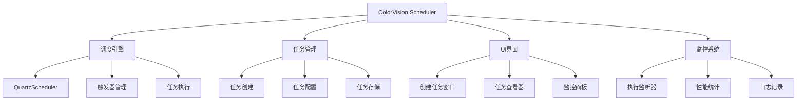

# ColorVision.Scheduler

## 目录
1. [概述](#概述)
2. [核心功能](#核心功能)
3. [架构设计](#架构设计)
4. [主要组件](#主要组件)
5. [任务管理](#任务管理)
6. [使用示例](#使用示例)
7. [高级功能](#高级功能)

## 概述

**ColorVision.Scheduler** 是基于 Quartz.NET 框架构建的定时任务管理组件，为 ColorVision 系统提供了强大的任务调度功能。它支持创建、管理和监控各种类型的定时任务，包括简单的周期性任务和复杂的 Cron 表达式任务。

### 基本信息

- **基础框架**: Quartz.NET 3.x+
- **主要功能**: 任务调度、任务监控、任务管理界面
- **UI 框架**: WPF
- **特色功能**: 可视化任务配置、实时状态监控、任务执行历史

## 核心功能

### 1. 任务调度管理
- **多种触发器**: Simple、Cron、Calendar 触发器支持
- **任务持久化**: 数据库存储任务配置和状态
- **集群支持**: 多实例环境下的任务协调
- **故障恢复**: 应用重启后任务自动恢复

### 2. 可视化管理界面
- **任务创建向导**: 分步式任务配置流程
- **任务监控面板**: 实时查看任务状态和执行情况
- **执行历史**: 任务执行日志和统计信息
- **性能监控**: 任务执行时间和成功率统计

### 3. 扩展性支持
- **自定义任务类型**: 支持插件化任务扩展
- **事件监听器**: 任务生命周期事件处理
- **多种执行上下文**: 支持不同类型的任务执行环境

## 架构设计



## 主要组件

### QuartzSchedulerManager 调度管理器

```csharp
public class QuartzSchedulerManager : IDisposable
{
    private IScheduler _scheduler;
    private readonly ISchedulerFactory _schedulerFactory;
    
    public QuartzSchedulerManager()
    {
        // 配置调度器
        var properties = new NameValueCollection
        {
            ["quartz.scheduler.instanceName"] = "ColorVisionScheduler",
            ["quartz.scheduler.instanceId"] = "AUTO",
            ["quartz.threadPool.threadCount"] = "10",
            ["quartz.jobStore.type"] = "Quartz.Impl.AdoJobStore.JobStoreTX, Quartz",
            ["quartz.jobStore.connectionString"] = MySQLConfig.Instance.ConnectionString,
            ["quartz.jobStore.tablePrefix"] = "QRTZ_",
            ["quartz.jobStore.driverDelegateType"] = "Quartz.Impl.AdoJobStore.MySQLDelegate, Quartz"
        };
        
        _schedulerFactory = new StdSchedulerFactory(properties);
    }
    
    public async Task<bool> StartAsync()
    {
        try
        {
            _scheduler = await _schedulerFactory.GetScheduler();
            
            // 添加全局监听器
            _scheduler.ListenerManager.AddJobListener(new TaskExecutionListener());
            _scheduler.ListenerManager.AddTriggerListener(new TriggerListener());
            
            await _scheduler.Start();
            
            Console.WriteLine("任务调度器启动成功");
            return true;
        }
        catch (Exception ex)
        {
            Console.WriteLine($"任务调度器启动失败：{ex.Message}");
            return false;
        }
    }
    
    public async Task<bool> StopAsync()
    {
        try
        {
            if (_scheduler != null && !_scheduler.IsShutdown)
            {
                await _scheduler.Shutdown(waitForJobsToComplete: true);
                Console.WriteLine("任务调度器已停止");
            }
            return true;
        }
        catch (Exception ex)
        {
            Console.WriteLine($"停止任务调度器时出错：{ex.Message}");
            return false;
        }
    }
    
    public async Task<bool> ScheduleJobAsync(IJobDetail job, ITrigger trigger)
    {
        try
        {
            await _scheduler.ScheduleJob(job, trigger);
            Console.WriteLine($"任务 {job.Key.Name} 已成功调度");
            return true;
        }
        catch (Exception ex)
        {
            Console.WriteLine($"调度任务失败：{ex.Message}");
            return false;
        }
    }
    
    public async Task<bool> DeleteJobAsync(JobKey jobKey)
    {
        try
        {
            var result = await _scheduler.DeleteJob(jobKey);
            if (result)
            {
                Console.WriteLine($"任务 {jobKey.Name} 已删除");
            }
            return result;
        }
        catch (Exception ex)
        {
            Console.WriteLine($"删除任务失败：{ex.Message}");
            return false;
        }
    }
    
    public async Task<bool> PauseJobAsync(JobKey jobKey)
    {
        try
        {
            await _scheduler.PauseJob(jobKey);
            Console.WriteLine($"任务 {jobKey.Name} 已暂停");
            return true;
        }
        catch (Exception ex)
        {
            Console.WriteLine($"暂停任务失败：{ex.Message}");
            return false;
        }
    }
    
    public async Task<bool> ResumeJobAsync(JobKey jobKey)
    {
        try
        {
            await _scheduler.ResumeJob(jobKey);
            Console.WriteLine($"任务 {jobKey.Name} 已恢复");
            return true;
        }
        catch (Exception ex)
        {
            Console.WriteLine($"恢复任务失败：{ex.Message}");
            return false;
        }
    }
    
    public async Task<List<SchedulerInfo>> GetSchedulerInfoAsync()
    {
        var jobInfos = new List<SchedulerInfo>();
        
        try
        {
            var jobGroupNames = await _scheduler.GetJobGroupNames();
            
            foreach (var groupName in jobGroupNames)
            {
                var jobKeys = await _scheduler.GetJobKeys(GroupMatcher<JobKey>.GroupEquals(groupName));
                
                foreach (var jobKey in jobKeys)
                {
                    var jobDetail = await _scheduler.GetJobDetail(jobKey);
                    var triggers = await _scheduler.GetTriggersOfJob(jobKey);
                    
                    var info = new SchedulerInfo
                    {
                        JobKey = jobKey,
                        JobType = jobDetail.JobType.Name,
                        Description = jobDetail.Description,
                        JobDataMap = jobDetail.JobDataMap,
                        Triggers = triggers.ToList(),
                        State = await _scheduler.GetTriggerState(triggers.First().Key)
                    };
                    
                    jobInfos.Add(info);
                }
            }
        }
        catch (Exception ex)
        {
            Console.WriteLine($"获取调度器信息失败：{ex.Message}");
        }
        
        return jobInfos;
    }
    
    public void Dispose()
    {
        _scheduler?.Shutdown(waitForJobsToComplete: true);
    }
}
```

### SchedulerInfo 信息类

```csharp
public class SchedulerInfo
{
    public JobKey JobKey { get; set; }
    public string JobType { get; set; }
    public string Description { get; set; }
    public JobDataMap JobDataMap { get; set; }
    public List<ITrigger> Triggers { get; set; } = new();
    public TriggerState State { get; set; }
    
    public string JobName => JobKey?.Name ?? "";
    public string GroupName => JobKey?.Group ?? "";
    
    public DateTime? NextFireTime => Triggers.FirstOrDefault()?.GetNextFireTimeUtc()?.ToLocalTime();
    public DateTime? PreviousFireTime => Triggers.FirstOrDefault()?.GetPreviousFireTimeUtc()?.ToLocalTime();
    
    public string StateDescription => State switch
    {
        TriggerState.Normal => "正常",
        TriggerState.Paused => "已暂停",
        TriggerState.Complete => "已完成",
        TriggerState.Error => "错误",
        TriggerState.Blocked => "阻塞",
        TriggerState.None => "无状态",
        _ => "未知"
    };
    
    public string TriggerDescription
    {
        get
        {
            if (Triggers.Count == 0) return "无触发器";
            
            var trigger = Triggers.First();
            return trigger switch
            {
                ISimpleTrigger simple => $"简单触发器 - 间隔: {simple.RepeatInterval}",
                ICronTrigger cron => $"Cron触发器 - 表达式: {cron.CronExpressionString}",
                _ => trigger.GetType().Name
            };
        }
    }
}
```

### TaskExecutionListener 执行监听器

```csharp
public class TaskExecutionListener : IJobListener
{
    public string Name => "TaskExecutionListener";
    
    public async Task JobToBeExecuted(IJobExecutionContext context, CancellationToken cancellationToken = default)
    {
        var jobKey = context.JobDetail.Key;
        Console.WriteLine($"任务开始执行: {jobKey.Name} at {DateTime.Now}");
        
        // 记录任务开始执行
        await LogTaskExecution(jobKey, "Started", context.FireTimeUtc.ToLocalTime());
    }
    
    public async Task JobExecutionVetoed(IJobExecutionContext context, CancellationToken cancellationToken = default)
    {
        var jobKey = context.JobDetail.Key;
        Console.WriteLine($"任务执行被否决: {jobKey.Name}");
        
        await LogTaskExecution(jobKey, "Vetoed", context.FireTimeUtc.ToLocalTime());
    }
    
    public async Task JobWasExecuted(IJobExecutionContext context, JobExecutionException jobException, CancellationToken cancellationToken = default)
    {
        var jobKey = context.JobDetail.Key;
        var duration = context.JobRunTime;
        
        if (jobException == null)
        {
            Console.WriteLine($"任务执行成功: {jobKey.Name}, 耗时: {duration}");
            await LogTaskExecution(jobKey, "Completed", context.FireTimeUtc.ToLocalTime(), duration);
        }
        else
        {
            Console.WriteLine($"任务执行失败: {jobKey.Name}, 错误: {jobException.Message}");
            await LogTaskExecution(jobKey, "Failed", context.FireTimeUtc.ToLocalTime(), duration, jobException.Message);
        }
    }
    
    private async Task LogTaskExecution(JobKey jobKey, string status, DateTime? fireTime, TimeSpan? duration = null, string error = null)
    {
        try
        {
            var log = new TaskExecutionLog
            {
                JobName = jobKey.Name,
                JobGroup = jobKey.Group,
                Status = status,
                FireTime = fireTime,
                Duration = duration,
                ErrorMessage = error,
                LogTime = DateTime.Now
            };
            
            // 保存到数据库或日志文件
            await SaveExecutionLog(log);
        }
        catch (Exception ex)
        {
            Console.WriteLine($"记录任务执行日志失败: {ex.Message}");
        }
    }
    
    private async Task SaveExecutionLog(TaskExecutionLog log)
    {
        // 实现日志保存逻辑
        // 可以保存到数据库、文件或其他存储介质
        var sql = @"INSERT INTO task_execution_logs 
                   (job_name, job_group, status, fire_time, duration, error_message, log_time)
                   VALUES (@JobName, @JobGroup, @Status, @FireTime, @Duration, @ErrorMessage, @LogTime)";
        
        var parameters = new Dictionary<string, object>
        {
            ["@JobName"] = log.JobName,
            ["@JobGroup"] = log.JobGroup,
            ["@Status"] = log.Status,
            ["@FireTime"] = log.FireTime,
            ["@Duration"] = log.Duration?.TotalMilliseconds,
            ["@ErrorMessage"] = log.ErrorMessage,
            ["@LogTime"] = log.LogTime
        };
        
        MySqlControl.ExecuteNonQuery(sql, parameters);
    }
}

public class TaskExecutionLog
{
    public string JobName { get; set; }
    public string JobGroup { get; set; }
    public string Status { get; set; }
    public DateTime? FireTime { get; set; }
    public TimeSpan? Duration { get; set; }
    public string ErrorMessage { get; set; }
    public DateTime LogTime { get; set; }
}
```

## 任务管理

### CreateTask 创建任务窗口

```csharp
public partial class CreateTask : Window
{
    public IJobDetail JobDetail { get; private set; }
    public ITrigger Trigger { get; private set; }
    
    public CreateTask()
    {
        InitializeComponent();
        LoadJobTypes();
        LoadTriggerTypes();
    }
    
    private void LoadJobTypes()
    {
        var jobTypes = new List<JobTypeInfo>
        {
            new("数据备份任务", typeof(DataBackupJob)),
            new("文件清理任务", typeof(FileCleanupJob)),
            new("系统监控任务", typeof(SystemMonitorJob)),
            new("报告生成任务", typeof(ReportGenerationJob)),
            new("邮件发送任务", typeof(EmailSendJob))
        };
        
        JobTypeComboBox.ItemsSource = jobTypes;
        JobTypeComboBox.DisplayMemberPath = "DisplayName";
        JobTypeComboBox.SelectedValuePath = "JobType";
    }
    
    private void LoadTriggerTypes()
    {
        var triggerTypes = new List<string> { "简单触发器", "Cron表达式", "日历触发器" };
        TriggerTypeComboBox.ItemsSource = triggerTypes;
        TriggerTypeComboBox.SelectedIndex = 0;
    }
    
    private void TriggerType_SelectionChanged(object sender, SelectionChangedEventArgs e)
    {
        var selectedType = TriggerTypeComboBox.SelectedItem as string;
        
        // 显示相应的触发器配置面板
        SimpleTriggerPanel.Visibility = selectedType == "简单触发器" ? Visibility.Visible : Visibility.Collapsed;
        CronTriggerPanel.Visibility = selectedType == "Cron表达式" ? Visibility.Visible : Visibility.Collapsed;
        CalendarTriggerPanel.Visibility = selectedType == "日历触发器" ? Visibility.Visible : Visibility.Collapsed;
    }
    
    private void CreateJob_Click(object sender, RoutedEventArgs e)
    {
        try
        {
            // 验证输入
            if (!ValidateInput()) return;
            
            // 创建任务详情
            JobDetail = CreateJobDetail();
            
            // 创建触发器
            Trigger = CreateTrigger();
            
            DialogResult = true;
            Close();
        }
        catch (Exception ex)
        {
            MessageBox.Show($"创建任务失败：{ex.Message}", "错误", MessageBoxButton.OK, MessageBoxImage.Error);
        }
    }
    
    private bool ValidateInput()
    {
        if (string.IsNullOrWhiteSpace(JobNameTextBox.Text))
        {
            MessageBox.Show("请输入任务名称", "验证失败", MessageBoxButton.OK, MessageBoxImage.Warning);
            JobNameTextBox.Focus();
            return false;
        }
        
        if (JobTypeComboBox.SelectedItem == null)
        {
            MessageBox.Show("请选择任务类型", "验证失败", MessageBoxButton.OK, MessageBoxImage.Warning);
            return false;
        }
        
        if (TriggerTypeComboBox.SelectedItem as string == "Cron表达式" && 
            !CronExpression.IsValidExpression(CronExpressionTextBox.Text))
        {
            MessageBox.Show("请输入有效的Cron表达式", "验证失败", MessageBoxButton.OK, MessageBoxImage.Warning);
            CronExpressionTextBox.Focus();
            return false;
        }
        
        return true;
    }
    
    private IJobDetail CreateJobDetail()
    {
        var jobType = (Type)JobTypeComboBox.SelectedValue;
        var jobName = JobNameTextBox.Text.Trim();
        var jobGroup = JobGroupTextBox.Text.Trim();
        var description = DescriptionTextBox.Text.Trim();
        
        var jobBuilder = JobBuilder.Create(jobType)
            .WithIdentity(jobName, jobGroup)
            .WithDescription(description);
        
        // 添加任务数据
        var jobDataMap = new JobDataMap();
        
        // 从UI收集任务特定参数
        foreach (var parameter in JobParametersPanel.Children.OfType<FrameworkElement>())
        {
            if (parameter is TextBox textBox && !string.IsNullOrEmpty(textBox.Name))
            {
                jobDataMap[textBox.Name] = textBox.Text;
            }
        }
        
        jobBuilder.SetJobData(jobDataMap);
        
        return jobBuilder.Build();
    }
    
    private ITrigger CreateTrigger()
    {
        var triggerName = $"{JobNameTextBox.Text.Trim()}_Trigger";
        var triggerType = TriggerTypeComboBox.SelectedItem as string;
        
        return triggerType switch
        {
            "简单触发器" => CreateSimpleTrigger(triggerName),
            "Cron表达式" => CreateCronTrigger(triggerName),
            "日历触发器" => CreateCalendarTrigger(triggerName),
            _ => throw new NotSupportedException($"不支持的触发器类型: {triggerType}")
        };
    }
    
    private ITrigger CreateSimpleTrigger(string triggerName)
    {
        var builder = TriggerBuilder.Create()
            .WithIdentity(triggerName)
            .StartNow();
        
        var interval = int.Parse(IntervalTextBox.Text);
        var intervalUnit = IntervalUnitComboBox.SelectedItem as string;
        
        var repeatInterval = intervalUnit switch
        {
            "秒" => TimeSpan.FromSeconds(interval),
            "分钟" => TimeSpan.FromMinutes(interval),
            "小时" => TimeSpan.FromHours(interval),
            "天" => TimeSpan.FromDays(interval),
            _ => TimeSpan.FromMinutes(interval)
        };
        
        builder.WithSimpleSchedule(x => x
            .WithInterval(repeatInterval)
            .RepeatForever());
        
        return builder.Build();
    }
    
    private ITrigger CreateCronTrigger(string triggerName)
    {
        var cronExpression = CronExpressionTextBox.Text.Trim();
        
        return TriggerBuilder.Create()
            .WithIdentity(triggerName)
            .WithCronSchedule(cronExpression)
            .Build();
    }
    
    private ITrigger CreateCalendarTrigger(string triggerName)
    {
        // 实现日历触发器创建逻辑
        throw new NotImplementedException("日历触发器尚未实现");
    }
}

public class JobTypeInfo
{
    public string DisplayName { get; }
    public Type JobType { get; }
    
    public JobTypeInfo(string displayName, Type jobType)
    {
        DisplayName = displayName;
        JobType = jobType;
    }
}
```

### TaskViewerWindow 任务查看器

```csharp
public partial class TaskViewerWindow : Window
{
    private readonly QuartzSchedulerManager _schedulerManager;
    private readonly Timer _refreshTimer;
    
    public ObservableCollection<SchedulerInfo> Jobs { get; } = new();
    
    public TaskViewerWindow()
    {
        InitializeComponent();
        _schedulerManager = new QuartzSchedulerManager();
        
        DataContext = this;
        JobsDataGrid.ItemsSource = Jobs;
        
        // 定时刷新任务状态
        _refreshTimer = new Timer(RefreshJobs, null, TimeSpan.Zero, TimeSpan.FromSeconds(5));
    }
    
    private async void RefreshJobs(object state)
    {
        try
        {
            var jobs = await _schedulerManager.GetSchedulerInfoAsync();
            
            Dispatcher.Invoke(() =>
            {
                Jobs.Clear();
                foreach (var job in jobs)
                {
                    Jobs.Add(job);
                }
            });
        }
        catch (Exception ex)
        {
            Console.WriteLine($"刷新任务列表失败：{ex.Message}");
        }
    }
    
    private async void PauseJob_Click(object sender, RoutedEventArgs e)
    {
        if (sender is Button button && button.DataContext is SchedulerInfo jobInfo)
        {
            var result = await _schedulerManager.PauseJobAsync(jobInfo.JobKey);
            if (result)
            {
                await RefreshJobsAsync();
            }
        }
    }
    
    private async void ResumeJob_Click(object sender, RoutedEventArgs e)
    {
        if (sender is Button button && button.DataContext is SchedulerInfo jobInfo)
        {
            var result = await _schedulerManager.ResumeJobAsync(jobInfo.JobKey);
            if (result)
            {
                await RefreshJobsAsync();
            }
        }
    }
    
    private async void DeleteJob_Click(object sender, RoutedEventArgs e)
    {
        if (sender is Button button && button.DataContext is SchedulerInfo jobInfo)
        {
            var result = MessageBox.Show($"确定要删除任务 '{jobInfo.JobName}' 吗？", 
                                       "确认删除", MessageBoxButton.YesNo, MessageBoxImage.Question);
            
            if (result == MessageBoxResult.Yes)
            {
                var deleteResult = await _schedulerManager.DeleteJobAsync(jobInfo.JobKey);
                if (deleteResult)
                {
                    await RefreshJobsAsync();
                }
            }
        }
    }
    
    private async void ExecuteNow_Click(object sender, RoutedEventArgs e)
    {
        if (sender is Button button && button.DataContext is SchedulerInfo jobInfo)
        {
            try
            {
                await _schedulerManager.TriggerJobAsync(jobInfo.JobKey);
                MessageBox.Show($"任务 '{jobInfo.JobName}' 已触发执行", "执行任务", 
                              MessageBoxButton.OK, MessageBoxImage.Information);
            }
            catch (Exception ex)
            {
                MessageBox.Show($"触发任务执行失败：{ex.Message}", "错误", 
                              MessageBoxButton.OK, MessageBoxImage.Error);
            }
        }
    }
    
    private async void ViewExecutionHistory_Click(object sender, RoutedEventArgs e)
    {
        if (sender is Button button && button.DataContext is SchedulerInfo jobInfo)
        {
            var historyWindow = new TaskExecutionHistoryWindow(jobInfo.JobKey);
            historyWindow.Show();
        }
    }
    
    private async Task RefreshJobsAsync()
    {
        RefreshJobs(null);
    }
    
    protected override void OnClosed(EventArgs e)
    {
        _refreshTimer?.Dispose();
        _schedulerManager?.Dispose();
        base.OnClosed(e);
    }
}
```

## 使用示例

### 1. 基础任务调度

```csharp
// 启动调度器
var schedulerManager = new QuartzSchedulerManager();
await schedulerManager.StartAsync();

// 创建简单的数据备份任务
var job = JobBuilder.Create<DataBackupJob>()
    .WithIdentity("数据备份", "维护任务")
    .WithDescription("每日数据备份任务")
    .Build();

// 创建每天凌晨2点执行的触发器
var trigger = TriggerBuilder.Create()
    .WithIdentity("数据备份_触发器")
    .WithCronSchedule("0 0 2 * * ?")
    .Build();

// 调度任务
await schedulerManager.ScheduleJobAsync(job, trigger);
```

### 2. 自定义任务实现

```csharp
public class DataBackupJob : IJob
{
    public async Task Execute(IJobExecutionContext context)
    {
        var dataMap = context.JobDetail.JobDataMap;
        var backupPath = dataMap.GetString("BackupPath") ?? @"C:\Backups";
        var databaseName = dataMap.GetString("DatabaseName") ?? "ColorVision";
        
        try
        {
            Console.WriteLine($"开始备份数据库 {databaseName}...");
            
            // 执行数据库备份
            var fileName = $"{databaseName}_Backup_{DateTime.Now:yyyyMMdd_HHmmss}.sql";
            var fullPath = Path.Combine(backupPath, fileName);
            
            await PerformDatabaseBackup(databaseName, fullPath);
            
            Console.WriteLine($"数据库备份完成：{fullPath}");
            
            // 清理旧备份文件
            await CleanupOldBackups(backupPath, TimeSpan.FromDays(30));
        }
        catch (Exception ex)
        {
            Console.WriteLine($"数据备份失败：{ex.Message}");
            throw new JobExecutionException(ex);
        }
    }
    
    private async Task PerformDatabaseBackup(string databaseName, string backupPath)
    {
        // 实现数据库备份逻辑
        var sql = $"mysqldump -h {MySQLConfig.Instance.Server} " +
                 $"-u {MySQLConfig.Instance.Username} " +
                 $"-p{MySQLConfig.Instance.Password} " +
                 $"{databaseName} > {backupPath}";
        
        var process = new Process
        {
            StartInfo = new ProcessStartInfo
            {
                FileName = "cmd.exe",
                Arguments = $"/c {sql}",
                UseShellExecute = false,
                RedirectStandardOutput = true,
                RedirectStandardError = true,
                CreateNoWindow = true
            }
        };
        
        process.Start();
        await process.WaitForExitAsync();
        
        if (process.ExitCode != 0)
        {
            var error = await process.StandardError.ReadToEndAsync();
            throw new Exception($"备份失败：{error}");
        }
    }
    
    private async Task CleanupOldBackups(string backupPath, TimeSpan maxAge)
    {
        var directory = new DirectoryInfo(backupPath);
        if (!directory.Exists) return;
        
        var cutoffDate = DateTime.Now - maxAge;
        var oldFiles = directory.GetFiles("*_Backup_*.sql")
                               .Where(f => f.CreationTime < cutoffDate);
        
        foreach (var file in oldFiles)
        {
            try
            {
                file.Delete();
                Console.WriteLine($"已删除旧备份文件：{file.Name}");
            }
            catch (Exception ex)
            {
                Console.WriteLine($"删除文件失败：{file.Name}, 错误：{ex.Message}");
            }
        }
    }
}
```

### 3. 系统监控任务

```csharp
public class SystemMonitorJob : IJob
{
    public async Task Execute(IJobExecutionContext context)
    {
        var performanceCounters = new List<PerformanceCounter>
        {
            new("Processor", "% Processor Time", "_Total"),
            new("Memory", "Available MBytes"),
            new("PhysicalDisk", "% Disk Time", "_Total")
        };
        
        var metrics = new SystemMetrics
        {
            Timestamp = DateTime.Now,
            CpuUsage = performanceCounters[0].NextValue(),
            AvailableMemory = performanceCounters[1].NextValue(),
            DiskUsage = performanceCounters[2].NextValue()
        };
        
        // 保存监控数据
        await SaveSystemMetrics(metrics);
        
        // 检查警报条件
        await CheckAlerts(metrics);
        
        // 清理资源
        performanceCounters.ForEach(pc => pc.Dispose());
    }
    
    private async Task SaveSystemMetrics(SystemMetrics metrics)
    {
        var sql = @"INSERT INTO system_metrics 
                   (timestamp, cpu_usage, available_memory, disk_usage)
                   VALUES (@Timestamp, @CpuUsage, @AvailableMemory, @DiskUsage)";
        
        var parameters = new Dictionary<string, object>
        {
            ["@Timestamp"] = metrics.Timestamp,
            ["@CpuUsage"] = metrics.CpuUsage,
            ["@AvailableMemory"] = metrics.AvailableMemory,
            ["@DiskUsage"] = metrics.DiskUsage
        };
        
        MySqlControl.ExecuteNonQuery(sql, parameters);
    }
    
    private async Task CheckAlerts(SystemMetrics metrics)
    {
        var alerts = new List<string>();
        
        if (metrics.CpuUsage > 90)
            alerts.Add($"CPU使用率过高：{metrics.CpuUsage:F1}%");
            
        if (metrics.AvailableMemory < 1000)
            alerts.Add($"可用内存不足：{metrics.AvailableMemory:F0}MB");
            
        if (metrics.DiskUsage > 85)
            alerts.Add($"磁盘使用率过高：{metrics.DiskUsage:F1}%");
        
        foreach (var alert in alerts)
        {
            Console.WriteLine($"[警报] {alert}");
            // 发送警报邮件或通知
            await SendAlert(alert);
        }
    }
    
    private async Task SendAlert(string message)
    {
        // 实现警报发送逻辑
        // 可以发送邮件、短信或推送通知
    }
}

public class SystemMetrics
{
    public DateTime Timestamp { get; set; }
    public float CpuUsage { get; set; }
    public float AvailableMemory { get; set; }
    public float DiskUsage { get; set; }
}
```

### 4. 报告生成任务

```csharp
public class ReportGenerationJob : IJob
{
    public async Task Execute(IJobExecutionContext context)
    {
        var dataMap = context.JobDetail.JobDataMap;
        var reportType = dataMap.GetString("ReportType") ?? "Daily";
        var outputPath = dataMap.GetString("OutputPath") ?? @"C:\Reports";
        
        try
        {
            Console.WriteLine($"开始生成{reportType}报告...");
            
            var reportData = await CollectReportData(reportType);
            var reportContent = await GenerateReportContent(reportData, reportType);
            
            var fileName = $"{reportType}_Report_{DateTime.Now:yyyyMMdd_HHmmss}.html";
            var filePath = Path.Combine(outputPath, fileName);
            
            await File.WriteAllTextAsync(filePath, reportContent);
            
            Console.WriteLine($"报告生成完成：{filePath}");
            
            // 可选：发送报告邮件
            if (dataMap.GetBoolean("SendEmail"))
            {
                await SendReportEmail(filePath, reportType);
            }
        }
        catch (Exception ex)
        {
            Console.WriteLine($"报告生成失败：{ex.Message}");
            throw new JobExecutionException(ex);
        }
    }
    
    private async Task<Dictionary<string, object>> CollectReportData(string reportType)
    {
        var data = new Dictionary<string, object>();
        
        switch (reportType.ToLower())
        {
            case "daily":
                data = await CollectDailyData();
                break;
            case "weekly":
                data = await CollectWeeklyData();
                break;
            case "monthly":
                data = await CollectMonthlyData();
                break;
        }
        
        return data;
    }
    
    private async Task<Dictionary<string, object>> CollectDailyData()
    {
        var yesterday = DateTime.Now.Date.AddDays(-1);
        
        // 收集任务执行统计
        var taskStats = await GetTaskExecutionStats(yesterday, yesterday.AddDays(1));
        
        // 收集系统性能数据
        var systemStats = await GetSystemMetrics(yesterday, yesterday.AddDays(1));
        
        return new Dictionary<string, object>
        {
            ["Date"] = yesterday,
            ["TaskStats"] = taskStats,
            ["SystemStats"] = systemStats,
            ["GeneratedAt"] = DateTime.Now
        };
    }
    
    private async Task<string> GenerateReportContent(Dictionary<string, object> data, string reportType)
    {
        var html = new StringBuilder();
        
        html.AppendLine("<!DOCTYPE html>");
        html.AppendLine("<html><head><title>" + reportType + " Report</title></head><body>");
        html.AppendLine($"<h1>{reportType} 报告</h1>");
        html.AppendLine($"<p>生成时间：{data["GeneratedAt"]}</p>");
        
        // 添加任务执行统计
        if (data.ContainsKey("TaskStats"))
        {
            html.AppendLine("<h2>任务执行统计</h2>");
            var taskStats = (Dictionary<string, int>)data["TaskStats"];
            html.AppendLine("<ul>");
            foreach (var stat in taskStats)
            {
                html.AppendLine($"<li>{stat.Key}: {stat.Value}</li>");
            }
            html.AppendLine("</ul>");
        }
        
        // 添加系统性能数据
        if (data.ContainsKey("SystemStats"))
        {
            html.AppendLine("<h2>系统性能统计</h2>");
            var systemStats = (Dictionary<string, float>)data["SystemStats"];
            html.AppendLine("<ul>");
            foreach (var stat in systemStats)
            {
                html.AppendLine($"<li>{stat.Key}: {stat.Value:F2}</li>");
            }
            html.AppendLine("</ul>");
        }
        
        html.AppendLine("</body></html>");
        
        return html.ToString();
    }
}
```

## 高级功能

### 任务依赖管理

```csharp
public class TaskDependencyManager
{
    private readonly Dictionary<string, List<string>> _dependencies = new();
    
    public void AddDependency(string jobName, string dependsOn)
    {
        if (!_dependencies.ContainsKey(jobName))
            _dependencies[jobName] = new List<string>();
            
        _dependencies[jobName].Add(dependsOn);
    }
    
    public async Task<bool> CanExecuteJob(string jobName, IScheduler scheduler)
    {
        if (!_dependencies.ContainsKey(jobName))
            return true;
            
        foreach (var dependency in _dependencies[jobName])
        {
            var depJob = new JobKey(dependency);
            var triggers = await scheduler.GetTriggersOfJob(depJob);
            
            if (triggers.Any(t => t.GetPreviousFireTimeUtc() == null))
            {
                // 依赖任务尚未执行
                return false;
            }
        }
        
        return true;
    }
}
```

### 任务执行统计

```csharp
public class TaskStatisticsManager
{
    public async Task<Dictionary<string, TaskStats>> GetTaskStatistics(DateTime fromDate, DateTime toDate)
    {
        var sql = @"
            SELECT 
                job_name,
                COUNT(*) as total_executions,
                SUM(CASE WHEN status = 'Completed' THEN 1 ELSE 0 END) as successful_executions,
                SUM(CASE WHEN status = 'Failed' THEN 1 ELSE 0 END) as failed_executions,
                AVG(duration) as avg_duration,
                MAX(duration) as max_duration,
                MIN(duration) as min_duration
            FROM task_execution_logs
            WHERE log_time BETWEEN @FromDate AND @ToDate
            GROUP BY job_name";
        
        var parameters = new Dictionary<string, object>
        {
            ["@FromDate"] = fromDate,
            ["@ToDate"] = toDate
        };
        
        var dataTable = MySqlControl.ExecuteQuery(sql, parameters);
        var stats = new Dictionary<string, TaskStats>();
        
        foreach (DataRow row in dataTable.Rows)
        {
            var jobName = row["job_name"].ToString();
            var taskStat = new TaskStats
            {
                JobName = jobName,
                TotalExecutions = Convert.ToInt32(row["total_executions"]),
                SuccessfulExecutions = Convert.ToInt32(row["successful_executions"]),
                FailedExecutions = Convert.ToInt32(row["failed_executions"]),
                AverageDuration = TimeSpan.FromMilliseconds(Convert.ToDouble(row["avg_duration"])),
                MaxDuration = TimeSpan.FromMilliseconds(Convert.ToDouble(row["max_duration"])),
                MinDuration = TimeSpan.FromMilliseconds(Convert.ToDouble(row["min_duration"]))
            };
            
            stats[jobName] = taskStat;
        }
        
        return stats;
    }
}

public class TaskStats
{
    public string JobName { get; set; }
    public int TotalExecutions { get; set; }
    public int SuccessfulExecutions { get; set; }
    public int FailedExecutions { get; set; }
    public TimeSpan AverageDuration { get; set; }
    public TimeSpan MaxDuration { get; set; }
    public TimeSpan MinDuration { get; set; }
    
    public double SuccessRate => TotalExecutions > 0 ? (double)SuccessfulExecutions / TotalExecutions * 100 : 0;
    public double FailureRate => TotalExecutions > 0 ? (double)FailedExecutions / TotalExecutions * 100 : 0;
}
```

### 动态任务配置

```csharp
public class DynamicTaskConfiguration
{
    public async Task UpdateTaskSchedule(string jobName, string cronExpression)
    {
        var scheduler = await SchedulerManager.Instance.GetScheduler();
        var jobKey = new JobKey(jobName);
        
        // 获取现有触发器
        var triggers = await scheduler.GetTriggersOfJob(jobKey);
        
        foreach (var trigger in triggers)
        {
            // 删除旧触发器
            await scheduler.UnscheduleJob(trigger.Key);
        }
        
        // 创建新触发器
        var newTrigger = TriggerBuilder.Create()
            .WithIdentity($"{jobName}_NewTrigger")
            .WithCronSchedule(cronExpression)
            .Build();
        
        // 重新调度任务
        await scheduler.ScheduleJob(newTrigger);
    }
    
    public async Task UpdateJobParameters(string jobName, Dictionary<string, object> parameters)
    {
        var scheduler = await SchedulerManager.Instance.GetScheduler();
        var jobKey = new JobKey(jobName);
        var jobDetail = await scheduler.GetJobDetail(jobKey);
        
        if (jobDetail != null)
        {
            // 更新任务参数
            var jobDataMap = jobDetail.JobDataMap;
            foreach (var param in parameters)
            {
                jobDataMap[param.Key] = param.Value;
            }
            
            // 重新添加任务（保持相同的key）
            await scheduler.AddJob(jobDetail, replace: true);
        }
    }
}
```

## 最佳实践

1. **错误处理**: 在任务中实现完善的异常处理和日志记录
2. **资源管理**: 及时释放任务中使用的资源（数据库连接、文件句柄等）
3. **性能监控**: 监控任务执行时间和资源消耗
4. **任务隔离**: 避免任务之间相互影响，使用独立的执行上下文
5. **配置管理**: 将任务参数外部化，便于运维和调整

---

*ColorVision.Scheduler 提供了强大而灵活的任务调度功能，通过可视化的管理界面和丰富的API，让系统任务管理变得简单高效。*