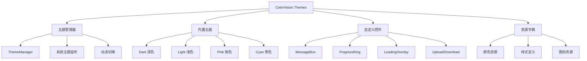

# ColorVision.Themes

## 目录
1. [概述](#概述)
2. [主题系统](#主题系统)
3. [主题管理器](#主题管理器)
4. [内置主题](#内置主题)
5. [自定义控件](#自定义控件)
6. [使用示例](#使用示例)
7. [主题扩展](#主题扩展)

## 概述

**ColorVision.Themes** 是 ColorVision 系统的主题控件库，提供了完整的 WPF 应用程序主题化解决方案。它不仅包含多套精美的内置主题，还提供了自定义控件、消息框、加载指示器等 UI 组件，为应用程序提供统一且专业的视觉体验。

### 基本信息

- **主要功能**: 主题管理、自定义控件、UI组件
- **支持主题**: 系统主题、深色、浅色、粉色、青色
- **UI 框架**: WPF
- **特色功能**: 动态主题切换、系统主题跟随、自定义样式

## 主题系统

### 主题枚举定义

```csharp
public enum Theme
{
    UseSystem,    // 跟随系统主题
    Light,        // 浅色主题
    Dark,         // 深色主题
    Pink,         // 粉色主题
    Cyan          // 青色主题
}
```

### 主题架构



## 主题管理器

### ThemeManager 核心类

```csharp
public class ThemeManager
{
    private static readonly Lazy<ThemeManager> _instance = new(() => new ThemeManager());
    public static ThemeManager Instance => _instance.Value;
    
    // 主题变更事件
    public static event ThemeChangedHandler ThemeChanged;
    public static event Action<Theme> AppsThemeChanged;
    
    // 系统主题
    public Theme SystemTheme { get; private set; }
    public Theme AppsTheme { get; private set; }
    
    // 当前主题
    private Theme? _currentTheme;
    public Theme? CurrentTheme
    {
        get => _currentTheme;
        private set
        {
            if (value == _currentTheme) return;
            _currentTheme = value;
            
            if (_currentTheme != null)
            {
                ThemeChanged?.Invoke(_currentTheme.Value);
                ThemeConfigChangedHandler?.Invoke();
            }
        }
    }
    
    private ThemeManager()
    {
        // 检测系统主题
        SystemTheme = SystemUsesLightTheme() ? Theme.Light : Theme.Dark;
        AppsTheme = AppsUseLightTheme() ? Theme.Light : Theme.Dark;
        
        // 延迟初始化系统主题监听
        DelayedInitialize();
        
        // 监听应用主题变更
        AppsThemeChanged += (theme) =>
        {
            if (CurrentTheme == Theme.UseSystem)
            {
                ApplyActTheme(Application.Current, theme);
            }
        };
    }
    
    /// <summary>
    /// 延迟初始化系统主题监听（避免启动时性能损失）
    /// </summary>
    private async void DelayedInitialize()
    {
        await Task.Delay(10000); // 延迟10秒
        
        // 监听系统主题变更
        SystemEvents.UserPreferenceChanged += (s, e) =>
        {
            AppsTheme = AppsUseLightTheme() ? Theme.Light : Theme.Dark;
            SystemTheme = SystemUsesLightTheme() ? Theme.Light : Theme.Dark;
        };
        
        SystemParameters.StaticPropertyChanged += (s, e) =>
        {
            AppsTheme = AppsUseLightTheme() ? Theme.Light : Theme.Dark;
            SystemTheme = SystemUsesLightTheme() ? Theme.Light : Theme.Dark;
        };
    }
    
    /// <summary>
    /// 应用主题
    /// </summary>
    public void ApplyTheme(Application app, Theme theme)
    {
        if (CurrentTheme == theme) return;
        
        CurrentTheme = theme;
        
        if (theme == Theme.UseSystem)
            theme = AppsTheme;
            
        ApplyActTheme(app, theme);
    }
    
    /// <summary>
    /// 实际应用主题
    /// </summary>
    private void ApplyActTheme(Application app, Theme theme)
    {
        var resources = app.Resources;
        
        // 清除现有主题资源
        ClearThemeResources(resources);
        
        // 应用基础资源
        ApplyBaseResources(resources);
        
        // 应用主题特定资源
        ApplyThemeResources(resources, theme);
    }
    
    private void ClearThemeResources(ResourceDictionary resources)
    {
        var toRemove = new List<ResourceDictionary>();
        
        foreach (var dict in resources.MergedDictionaries)
        {
            if (IsThemeResource(dict.Source))
            {
                toRemove.Add(dict);
            }
        }
        
        foreach (var dict in toRemove)
        {
            resources.MergedDictionaries.Remove(dict);
        }
    }
    
    private void ApplyBaseResources(ResourceDictionary resources)
    {
        foreach (var resourcePath in ResourceDictionaryBase)
        {
            var dict = new ResourceDictionary
            {
                Source = new Uri(resourcePath, UriKind.Relative)
            };
            resources.MergedDictionaries.Add(dict);
        }
    }
    
    private void ApplyThemeResources(ResourceDictionary resources, Theme theme)
    {
        var themeResources = GetThemeResources(theme);
        
        foreach (var resourcePath in themeResources)
        {
            var dict = new ResourceDictionary
            {
                Source = new Uri(resourcePath, UriKind.Relative)
            };
            resources.MergedDictionaries.Add(dict);
        }
    }
    
    /// <summary>
    /// 获取主题资源路径
    /// </summary>
    private List<string> GetThemeResources(Theme theme)
    {
        return theme switch
        {
            Theme.Dark => ResourceDictionaryDark,
            Theme.Light => ResourceDictionaryWhite,
            Theme.Pink => ResourceDictionaryPink,
            Theme.Cyan => ResourceDictionaryCyan,
            _ => ResourceDictionaryWhite
        };
    }
    
    /// <summary>
    /// 检测系统是否使用浅色主题
    /// </summary>
    private bool SystemUsesLightTheme()
    {
        try
        {
            using var key = Registry.CurrentUser.OpenSubKey(@"Software\Microsoft\Windows\CurrentVersion\Themes\Personalize");
            var value = key?.GetValue("SystemUsesLightTheme");
            return value is int intValue && intValue == 1;
        }
        catch
        {
            return true; // 默认浅色
        }
    }
    
    /// <summary>
    /// 检测应用是否使用浅色主题
    /// </summary>
    private bool AppsUseLightTheme()
    {
        try
        {
            using var key = Registry.CurrentUser.OpenSubKey(@"Software\Microsoft\Windows\CurrentVersion\Themes\Personalize");
            var value = key?.GetValue("AppsUseLightTheme");
            return value is int intValue && intValue == 1;
        }
        catch
        {
            return true; // 默认浅色
        }
    }
}
```

### 主题资源配置

```csharp
public static class ThemeResources
{
    // 基础资源
    public static List<string> ResourceDictionaryBase { get; } = new()
    {
        "/ColorVision.Themes;component/Themes/Base.xaml",
        "/ColorVision.Themes;component/Themes/Menu.xaml",
        "/ColorVision.Themes;component/Themes/GroupBox.xaml",
        "/ColorVision.Themes;component/Themes/Icons.xaml",
        "/ColorVision.Themes;component/Themes/Window/BaseWindow.xaml"
    };
    
    // 深色主题
    public static List<string> ResourceDictionaryDark { get; } = new()
    {
        "/HandyControl;component/themes/basic/colors/colorsdark.xaml",
        "/HandyControl;component/Themes/Theme.xaml",
        "/ColorVision.Themes;component/Themes/Dark.xaml",
    };
    
    // 浅色主题
    public static List<string> ResourceDictionaryWhite { get; } = new()
    {
        "/HandyControl;component/Themes/basic/colors/colors.xaml",
        "/HandyControl;component/Themes/Theme.xaml",
        "/ColorVision.Themes;component/Themes/White.xaml",
    };
    
    // 粉色主题
    public static List<string> ResourceDictionaryPink { get; } = new()
    {
        "/ColorVision.Themes;component/Themes/HPink.xaml",
        "/HandyControl;component/Themes/Theme.xaml",
        "/ColorVision.Themes;component/Themes/White.xaml",
        "/ColorVision.Themes;component/Themes/Pink.xaml",
    };
    
    // 青色主题
    public static List<string> ResourceDictionaryCyan { get; } = new()
    {
        "/ColorVision.Themes;component/Themes/HCyan.xaml",
        "/HandyControl;component/Themes/Theme.xaml",
        "/ColorVision.Themes;component/Themes/White.xaml",
        "/ColorVision.Themes;component/Themes/Cyan.xaml",
    };
}
```

## 内置主题

### 深色主题 (Dark.xaml)
```xml
<ResourceDictionary xmlns="http://schemas.microsoft.com/winfx/2006/xaml/presentation"
                    xmlns:x="http://schemas.microsoft.com/winfx/2006/xaml">
    
    <!-- 全局色彩定义 -->
    <SolidColorBrush x:Key="GlobalBackground" Color="#FF2D2D30"/>
    <SolidColorBrush x:Key="GlobalTextBrush" Color="#FFF0F0F0"/>
    <SolidColorBrush x:Key="GlobalBorderBrush" Color="#FF3E3E42"/>
    
    <!-- 控件背景色 -->
    <SolidColorBrush x:Key="ControlBackground" Color="#FF383838"/>
    <SolidColorBrush x:Key="ControlHoverBackground" Color="#FF4D4D4D"/>
    <SolidColorBrush x:Key="ControlPressedBackground" Color="#FF5A5A5A"/>
    
    <!-- 强调色 -->
    <SolidColorBrush x:Key="AccentBrush" Color="#FF0078D4"/>
    <SolidColorBrush x:Key="AccentHoverBrush" Color="#FF106EBE"/>
    
    <!-- 状态色 -->
    <SolidColorBrush x:Key="SuccessBrush" Color="#FF107C10"/>
    <SolidColorBrush x:Key="WarningBrush" Color="#FFFFB900"/>
    <SolidColorBrush x:Key="ErrorBrush" Color="#FFD13438"/>
    
</ResourceDictionary>
```

### 浅色主题 (White.xaml)
```xml
<ResourceDictionary xmlns="http://schemas.microsoft.com/winfx/2006/xaml/presentation"
                    xmlns:x="http://schemas.microsoft.com/winfx/2006/xaml">
    
    <!-- 全局色彩定义 -->
    <SolidColorBrush x:Key="GlobalBackground" Color="#FFFFFFFF"/>
    <SolidColorBrush x:Key="GlobalTextBrush" Color="#FF000000"/>
    <SolidColorBrush x:Key="GlobalBorderBrush" Color="#FFD0D0D0"/>
    
    <!-- 控件背景色 -->
    <SolidColorBrush x:Key="ControlBackground" Color="#FFF8F8F8"/>
    <SolidColorBrush x:Key="ControlHoverBackground" Color="#FFE8E8E8"/>
    <SolidColorBrush x:Key="ControlPressedBackground" Color="#FFD8D8D8"/>
    
    <!-- 强调色 -->
    <SolidColorBrush x:Key="AccentBrush" Color="#FF0078D4"/>
    <SolidColorBrush x:Key="AccentHoverBrush" Color="#FF106EBE"/>
    
    <!-- 状态色 -->
    <SolidColorBrush x:Key="SuccessBrush" Color="#FF107C10"/>
    <SolidColorBrush x:Key="WarningBrush" Color="#FFFFB900"/>
    <SolidColorBrush x:Key="ErrorBrush" Color="#FFD13438"/>
    
</ResourceDictionary>
```

### 粉色主题 (Pink.xaml)
```xml
<ResourceDictionary xmlns="http://schemas.microsoft.com/winfx/2006/xaml/presentation"
                    xmlns:x="http://schemas.microsoft.com/winfx/2006/xaml">
    
    <!-- 粉色主题特殊色彩 -->
    <SolidColorBrush x:Key="AccentBrush" Color="#FFE91E63"/>
    <SolidColorBrush x:Key="AccentHoverBrush" Color="#FFAD1457"/>
    <SolidColorBrush x:Key="AccentPressedBrush" Color="#FF880E4F"/>
    
    <!-- 粉色渐变 -->
    <LinearGradientBrush x:Key="PinkGradientBrush" StartPoint="0,0" EndPoint="1,1">
        <GradientStop Color="#FFFFE0F4" Offset="0"/>
        <GradientStop Color="#FFFCE4EC" Offset="1"/>
    </LinearGradientBrush>
    
    <!-- 特殊控件样式覆盖 -->
    <Style TargetType="Button" BasedOn="{StaticResource {x:Type Button}}">
        <Setter Property="Background" Value="{StaticResource AccentBrush}"/>
        <Setter Property="Foreground" Value="White"/>
        <Style.Triggers>
            <Trigger Property="IsMouseOver" Value="True">
                <Setter Property="Background" Value="{StaticResource AccentHoverBrush}"/>
            </Trigger>
        </Style.Triggers>
    </Style>
    
</ResourceDictionary>
```

## 自定义控件

### 自定义消息框

```csharp
public static class MessageBox
{
    public static MessageBoxResult Show(string message, string title = "", 
                                      MessageBoxButton buttons = MessageBoxButton.OK,
                                      MessageBoxImage icon = MessageBoxImage.None)
    {
        var messageBoxWindow = new MessageBoxWindow
        {
            Title = title,
            Message = message,
            Buttons = buttons,
            Icon = icon,
            Owner = Application.Current.MainWindow,
            WindowStartupLocation = WindowStartupLocation.CenterOwner
        };
        
        messageBoxWindow.ShowDialog();
        return messageBoxWindow.Result;
    }
    
    public static void ShowInfo(string message, string title = "信息")
    {
        Show(message, title, MessageBoxButton.OK, MessageBoxImage.Information);
    }
    
    public static void ShowWarning(string message, string title = "警告")
    {
        Show(message, title, MessageBoxButton.OK, MessageBoxImage.Warning);
    }
    
    public static void ShowError(string message, string title = "错误")
    {
        Show(message, title, MessageBoxButton.OK, MessageBoxImage.Error);
    }
    
    public static MessageBoxResult ShowQuestion(string message, string title = "确认")
    {
        return Show(message, title, MessageBoxButton.YesNo, MessageBoxImage.Question);
    }
}
```

### MessageBoxWindow 实现

```csharp
public partial class MessageBoxWindow : Window
{
    public MessageBoxResult Result { get; private set; } = MessageBoxResult.Cancel;
    
    public string Message
    {
        get => MessageTextBlock.Text;
        set => MessageTextBlock.Text = value;
    }
    
    public MessageBoxButton Buttons
    {
        set => ConfigureButtons(value);
    }
    
    public MessageBoxImage Icon
    {
        set => ConfigureIcon(value);
    }
    
    public MessageBoxWindow()
    {
        InitializeComponent();
        ApplyCurrentTheme();
    }
    
    private void ApplyCurrentTheme()
    {
        // 应用当前主题
        var theme = ThemeManager.Instance.CurrentTheme ?? Theme.Light;
        this.ApplyTheme(theme);
    }
    
    private void ConfigureButtons(MessageBoxButton buttons)
    {
        ButtonPanel.Children.Clear();
        
        switch (buttons)
        {
            case MessageBoxButton.OK:
                AddButton("确定", MessageBoxResult.OK, isDefault: true);
                break;
                
            case MessageBoxButton.OKCancel:
                AddButton("确定", MessageBoxResult.OK, isDefault: true);
                AddButton("取消", MessageBoxResult.Cancel);
                break;
                
            case MessageBoxButton.YesNo:
                AddButton("是", MessageBoxResult.Yes, isDefault: true);
                AddButton("否", MessageBoxResult.No);
                break;
                
            case MessageBoxButton.YesNoCancel:
                AddButton("是", MessageBoxResult.Yes, isDefault: true);
                AddButton("否", MessageBoxResult.No);
                AddButton("取消", MessageBoxResult.Cancel);
                break;
        }
    }
    
    private void AddButton(string content, MessageBoxResult result, bool isDefault = false)
    {
        var button = new Button
        {
            Content = content,
            MinWidth = 80,
            Height = 32,
            Margin = new Thickness(5, 0, 0, 0),
            IsDefault = isDefault
        };
        
        button.Click += (s, e) =>
        {
            Result = result;
            DialogResult = true;
            Close();
        };
        
        ButtonPanel.Children.Add(button);
    }
    
    private void ConfigureIcon(MessageBoxImage icon)
    {
        var iconPath = icon switch
        {
            MessageBoxImage.Information => "M13,9H11V7H13M13,17H11V11H13M12,2A10,10 0 0,0 2,12A10,10 0 0,0 12,22A10,10 0 0,0 22,12A10,10 0 0,0 12,2Z",
            MessageBoxImage.Warning => "M13,14H11V10H13M13,18H11V16H13M1,21H23L12,2L1,21Z",
            MessageBoxImage.Error => "M19,6.41L17.59,5L12,10.59L6.41,5L5,6.41L10.59,12L5,17.59L6.41,19L12,13.41L17.59,19L19,17.59L13.41,12L19,6.41Z",
            MessageBoxImage.Question => "M15.07,11.25L14.17,12.17C13.45,12.89 13,13.5 13,15H11V14.5C11,13.39 11.45,12.39 12.17,11.67L13.41,10.41C13.78,10.05 14,9.55 14,9C14,7.89 13.1,7 12,7A2,2 0 0,0 10,9H8A4,4 0 0,1 12,5A4,4 0 0,1 16,9C16,9.88 15.64,10.67 15.07,11.25M13,19H11V17H13M12,2A10,10 0 0,0 2,12A10,10 0 0,0 12,22A10,10 0 0,0 22,12C22,6.47 17.5,2 12,2Z",
            _ => null
        };
        
        if (!string.IsNullOrEmpty(iconPath))
        {
            IconPath.Data = Geometry.Parse(iconPath);
            IconElement.Visibility = Visibility.Visible;
        }
        else
        {
            IconElement.Visibility = Visibility.Collapsed;
        }
    }
}
```

### 进度环控件

```csharp
public partial class ProgressRing : UserControl
{
    public static readonly DependencyProperty IsActiveProperty =
        DependencyProperty.Register(nameof(IsActive), typeof(bool), typeof(ProgressRing),
            new PropertyMetadata(false, OnIsActiveChanged));
    
    public static readonly DependencyProperty ProgressProperty =
        DependencyProperty.Register(nameof(Progress), typeof(double), typeof(ProgressRing),
            new PropertyMetadata(0.0, OnProgressChanged));
    
    public bool IsActive
    {
        get => (bool)GetValue(IsActiveProperty);
        set => SetValue(IsActiveProperty, value);
    }
    
    public double Progress
    {
        get => (double)GetValue(ProgressProperty);
        set => SetValue(ProgressProperty, Math.Max(0, Math.Min(100, value)));
    }
    
    private Storyboard _storyboard;
    
    public ProgressRing()
    {
        InitializeComponent();
        CreateStoryboard();
    }
    
    private void CreateStoryboard()
    {
        _storyboard = new Storyboard
        {
            RepeatBehavior = RepeatBehavior.Forever
        };
        
        var animation = new DoubleAnimation
        {
            From = 0,
            To = 360,
            Duration = TimeSpan.FromSeconds(2),
            EasingFunction = new QuadraticEase { EasingMode = EasingMode.EaseInOut }
        };
        
        Storyboard.SetTarget(animation, RingTransform);
        Storyboard.SetTargetProperty(animation, new PropertyPath(RotateTransform.AngleProperty));
        
        _storyboard.Children.Add(animation);
    }
    
    private static void OnIsActiveChanged(DependencyObject d, DependencyPropertyChangedEventArgs e)
    {
        if (d is ProgressRing ring)
        {
            if ((bool)e.NewValue)
            {
                ring._storyboard.Begin();
                ring.Visibility = Visibility.Visible;
            }
            else
            {
                ring._storyboard.Stop();
                ring.Visibility = Visibility.Collapsed;
            }
        }
    }
    
    private static void OnProgressChanged(DependencyObject d, DependencyPropertyChangedEventArgs e)
    {
        if (d is ProgressRing ring)
        {
            var progress = (double)e.NewValue;
            var angle = 360 * (progress / 100);
            
            // 更新进度弧形
            ring.UpdateProgressArc(angle);
        }
    }
    
    private void UpdateProgressArc(double angle)
    {
        var radiusX = ActualWidth / 2 - 5;
        var radiusY = ActualHeight / 2 - 5;
        var centerX = ActualWidth / 2;
        var centerY = ActualHeight / 2;
        
        var startAngle = -90; // 从顶部开始
        var endAngle = startAngle + angle;
        
        var startAngleRad = startAngle * Math.PI / 180;
        var endAngleRad = endAngle * Math.PI / 180;
        
        var startPoint = new Point(
            centerX + radiusX * Math.Cos(startAngleRad),
            centerY + radiusY * Math.Sin(startAngleRad));
            
        var endPoint = new Point(
            centerX + radiusX * Math.Cos(endAngleRad),
            centerY + radiusY * Math.Sin(endAngleRad));
        
        var isLargeArc = angle > 180;
        
        var geometry = new PathGeometry();
        var figure = new PathFigure { StartPoint = startPoint };
        
        var arcSegment = new ArcSegment
        {
            Point = endPoint,
            Size = new Size(radiusX, radiusY),
            IsLargeArc = isLargeArc,
            SweepDirection = SweepDirection.Clockwise
        };
        
        figure.Segments.Add(arcSegment);
        geometry.Figures.Add(figure);
        
        ProgressPath.Data = geometry;
    }
}
```

### 加载覆盖层

```csharp
public partial class LoadingOverlay : UserControl
{
    public static readonly DependencyProperty LoadingTextProperty =
        DependencyProperty.Register(nameof(LoadingText), typeof(string), typeof(LoadingOverlay),
            new PropertyMetadata("加载中..."));
    
    public static readonly DependencyProperty IsLoadingProperty =
        DependencyProperty.Register(nameof(IsLoading), typeof(bool), typeof(LoadingOverlay),
            new PropertyMetadata(false, OnIsLoadingChanged));
    
    public string LoadingText
    {
        get => (string)GetValue(LoadingTextProperty);
        set => SetValue(LoadingTextProperty, value);
    }
    
    public bool IsLoading
    {
        get => (bool)GetValue(IsLoadingProperty);
        set => SetValue(IsLoadingProperty, value);
    }
    
    public LoadingOverlay()
    {
        InitializeComponent();
    }
    
    private static void OnIsLoadingChanged(DependencyObject d, DependencyPropertyChangedEventArgs e)
    {
        if (d is LoadingOverlay overlay)
        {
            overlay.Visibility = (bool)e.NewValue ? Visibility.Visible : Visibility.Collapsed;
            overlay.ProgressRing.IsActive = (bool)e.NewValue;
        }
    }
    
    /// <summary>
    /// 显示加载层
    /// </summary>
    public static void Show(FrameworkElement parent, string text = "加载中...")
    {
        var overlay = new LoadingOverlay
        {
            LoadingText = text,
            IsLoading = true
        };
        
        if (parent is Panel panel)
        {
            panel.Children.Add(overlay);
        }
        else if (parent is Grid grid)
        {
            Grid.SetRowSpan(overlay, grid.RowDefinitions.Count);
            Grid.SetColumnSpan(overlay, grid.ColumnDefinitions.Count);
            grid.Children.Add(overlay);
        }
    }
    
    /// <summary>
    /// 隐藏加载层
    /// </summary>
    public static void Hide(FrameworkElement parent)
    {
        if (parent is Panel panel)
        {
            var overlay = panel.Children.OfType<LoadingOverlay>().FirstOrDefault();
            if (overlay != null)
            {
                panel.Children.Remove(overlay);
            }
        }
    }
}
```

## 使用示例

### 1. 基础主题应用

```csharp
public partial class App : Application
{
    protected override void OnStartup(StartupEventArgs e)
    {
        base.OnStartup(e);
        
        // 应用主题
        ThemeManager.Instance.ApplyTheme(this, Theme.Dark);
        
        // 监听主题变更
        ThemeManager.ThemeChanged += OnThemeChanged;
    }
    
    private void OnThemeChanged(Theme newTheme)
    {
        // 主题变更时的处理逻辑
        Console.WriteLine($"主题已切换为: {newTheme}");
    }
}
```

### 2. 动态主题切换

```csharp
public partial class MainWindow : Window
{
    public MainWindow()
    {
        InitializeComponent();
        
        // 应用当前主题
        this.ApplyTheme(ThemeManager.Instance.CurrentTheme ?? Theme.Light);
    }
    
    private void DarkTheme_Click(object sender, RoutedEventArgs e)
    {
        ThemeManager.Instance.ApplyTheme(Application.Current, Theme.Dark);
    }
    
    private void LightTheme_Click(object sender, RoutedEventArgs e)
    {
        ThemeManager.Instance.ApplyTheme(Application.Current, Theme.Light);
    }
    
    private void PinkTheme_Click(object sender, RoutedEventArgs e)
    {
        ThemeManager.Instance.ApplyTheme(Application.Current, Theme.Pink);
    }
    
    private void SystemTheme_Click(object sender, RoutedEventArgs e)
    {
        ThemeManager.Instance.ApplyTheme(Application.Current, Theme.UseSystem);
    }
}
```

### 3. 使用自定义消息框

```csharp
private void ShowMessage_Click(object sender, RoutedEventArgs e)
{
    // 信息消息框
    MessageBox.ShowInfo("操作成功完成！");
    
    // 警告消息框
    MessageBox.ShowWarning("请检查输入的数据格式。");
    
    // 错误消息框
    MessageBox.ShowError("文件保存失败，请检查文件权限。");
    
    // 确认消息框
    var result = MessageBox.ShowQuestion("确定要删除这个文件吗？");
    if (result == MessageBoxResult.Yes)
    {
        // 执行删除操作
        DeleteFile();
    }
}
```

### 4. 使用进度环和加载覆盖层

```csharp
private async void ProcessData_Click(object sender, RoutedEventArgs e)
{
    // 显示加载覆盖层
    LoadingOverlay.Show(MainGrid, "正在处理数据...");
    
    try
    {
        // 模拟长时间操作
        await Task.Run(() =>
        {
            for (int i = 0; i <= 100; i += 10)
            {
                Thread.Sleep(200);
                
                // 更新进度
                Dispatcher.Invoke(() =>
                {
                    ProgressRing.Progress = i;
                });
            }
        });
        
        MessageBox.ShowInfo("数据处理完成！");
    }
    catch (Exception ex)
    {
        MessageBox.ShowError($"数据处理失败：{ex.Message}");
    }
    finally
    {
        // 隐藏加载覆盖层
        LoadingOverlay.Hide(MainGrid);
    }
}
```

### 5. 自定义窗口样式

```xml
<Window x:Class="MyApp.CustomWindow"
        xmlns="http://schemas.microsoft.com/winfx/2006/xaml/presentation"
        xmlns:x="http://schemas.microsoft.com/winfx/2006/xaml"
        xmlns:themes="clr-namespace:ColorVision.Themes.Controls;assembly=ColorVision.Themes"
        Style="{StaticResource BaseWindowStyle}"
        Title="自定义窗口" Height="600" Width="800">
    
    <Grid Background="{DynamicResource GlobalBackground}">
        <Grid.RowDefinitions>
            <RowDefinition Height="Auto"/>
            <RowDefinition Height="*"/>
            <RowDefinition Height="Auto"/>
        </Grid.RowDefinitions>
        
        <!-- 标题栏 -->
        <Border Grid.Row="0" Background="{DynamicResource AccentBrush}" Height="40">
            <TextBlock Text="{Binding Title, RelativeSource={RelativeSource AncestorType=Window}}"
                       Foreground="White" FontSize="16" FontWeight="Bold"
                       VerticalAlignment="Center" Margin="15,0"/>
        </Border>
        
        <!-- 主内容区 -->
        <ScrollViewer Grid.Row="1" Margin="10">
            <StackPanel>
                <!-- 内容控件 -->
                <themes:ProgressRing x:Name="ProgressRing" 
                                    Width="50" Height="50" 
                                    Margin="0,20"
                                    IsActive="True"/>
                
                <Button Content="测试按钮" 
                        HorizontalAlignment="Center" 
                        Margin="0,10"
                        Click="TestButton_Click"/>
            </StackPanel>
        </ScrollViewer>
        
        <!-- 状态栏 -->
        <StatusBar Grid.Row="2" Background="{DynamicResource ControlBackground}">
            <StatusBarItem>
                <TextBlock Text="就绪" Foreground="{DynamicResource GlobalTextBrush}"/>
            </StatusBarItem>
        </StatusBar>
    </Grid>
</Window>
```

## 主题扩展

### 创建自定义主题

```xml
<!-- CustomTheme.xaml -->
<ResourceDictionary xmlns="http://schemas.microsoft.com/winfx/2006/xaml/presentation"
                    xmlns:x="http://schemas.microsoft.com/winfx/2006/xaml">
    
    <!-- 自定义主题色彩 -->
    <SolidColorBrush x:Key="GlobalBackground" Color="#FF1E1E2E"/>
    <SolidColorBrush x:Key="GlobalTextBrush" Color="#FFCDD6F4"/>
    <SolidColorBrush x:Key="AccentBrush" Color="#FFB4BEFE"/>
    
    <!-- 自定义控件样式 -->
    <Style TargetType="Button" BasedOn="{StaticResource {x:Type Button}}">
        <Setter Property="Background" Value="{StaticResource AccentBrush}"/>
        <Setter Property="BorderThickness" Value="0"/>
        <Setter Property="Padding" Value="16,8"/>
        <Setter Property="CornerRadius" Value="8"/>
    </Style>
    
</ResourceDictionary>
```

### 注册自定义主题

```csharp
public enum CustomTheme
{
    Catppuccin = 100
}

public static class CustomThemeManager
{
    public static void RegisterCustomThemes()
    {
        // 扩展主题管理器
        ThemeManager.CustomThemes.Add(CustomTheme.Catppuccin, new List<string>
        {
            "/MyApp;component/Themes/CustomTheme.xaml"
        });
    }
    
    public static void ApplyCustomTheme(CustomTheme theme)
    {
        var resources = Application.Current.Resources;
        
        // 清除现有主题
        ThemeManager.Instance.ClearThemeResources();
        
        // 应用自定义主题
        var themeResources = ThemeManager.CustomThemes[theme];
        foreach (var resourcePath in themeResources)
        {
            var dict = new ResourceDictionary
            {
                Source = new Uri(resourcePath, UriKind.Relative)
            };
            resources.MergedDictionaries.Add(dict);
        }
    }
}
```

### 主题配置持久化

```csharp
public class ThemeConfig : IConfigSetting
{
    public string SettingName => "Theme";
    
    [JsonProperty]
    public Theme Theme { get; set; } = Theme.UseSystem;
    
    [JsonProperty]
    public bool FollowSystemTheme { get; set; } = true;
    
    [JsonProperty]
    public string CustomThemePath { get; set; }
    
    public void ApplySettings()
    {
        if (!string.IsNullOrEmpty(CustomThemePath) && File.Exists(CustomThemePath))
        {
            // 加载自定义主题文件
            LoadCustomTheme(CustomThemePath);
        }
        else
        {
            // 应用内置主题
            ThemeManager.Instance.ApplyTheme(Application.Current, Theme);
        }
    }
    
    private void LoadCustomTheme(string themePath)
    {
        try
        {
            var dict = new ResourceDictionary
            {
                Source = new Uri(themePath, UriKind.Absolute)
            };
            
            Application.Current.Resources.MergedDictionaries.Add(dict);
        }
        catch (Exception ex)
        {
            Console.WriteLine($"加载自定义主题失败：{ex.Message}");
            // 回退到默认主题
            ThemeManager.Instance.ApplyTheme(Application.Current, Theme.Light);
        }
    }
}
```

## 最佳实践

1. **主题切换**: 始终使用 ThemeManager 进行主题切换，确保一致性
2. **资源引用**: 使用 DynamicResource 引用主题颜色，支持动态切换
3. **自定义控件**: 继承现有样式，保持主题一致性
4. **性能优化**: 延迟加载系统主题监听，避免启动时性能损失
5. **用户体验**: 提供主题预览功能，让用户选择合适的主题

---

*ColorVision.Themes 为 ColorVision 系统提供了完整的主题化解决方案，通过丰富的内置主题和强大的自定义功能，为用户提供了优秀的视觉体验。*