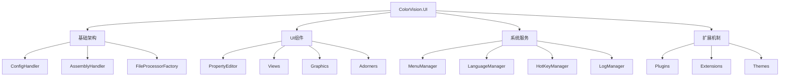

# ColorVision.UI

## 目录
1. [概述](#概述)
2. [核心功能](#核心功能)
3. [架构设计](#架构设计)
4. [主要组件](#主要组件)
5. [菜单系统](#菜单系统)
6. [设置管理](#设置管理)
7. [多语言支持](#多语言支持)
8. [热键系统](#热键系统)
9. [使用示例](#使用示例)

## 概述

**ColorVision.UI** 是 ColorVision 系统的底层控件库，提供了丰富的 UI 组件、系统功能和框架支持。它是整个应用程序 UI 层的基础，包含菜单管理、配置系统、多语言支持、热键管理、日志系统等核心功能。

### 基本信息

- **主要功能**: 底层UI控件、系统管理、框架支持
- **UI 框架**: WPF
- **特色功能**: 插件化菜单、动态配置、多语言、热键、属性编辑器
- **扩展性**: 高度可扩展的插件架构

## 核心功能

### 1. 菜单管理系统
- **动态菜单**: 支持运行时动态添加和移除菜单项
- **插件菜单**: 自动发现和集成插件菜单
- **菜单配置**: 支持菜单的可见性和权限控制
- **快捷键集成**: 菜单项与快捷键的自动关联

### 2. 配置管理
- **配置持久化**: 自动保存和加载应用程序配置
- **设置界面**: 可视化的设置管理窗口
- **导入导出**: 配置的备份和恢复功能
- **多环境配置**: 支持开发、测试、生产环境配置

### 3. 多语言支持
- **动态语言切换**: 运行时切换界面语言
- **资源本地化**: 支持文本、图像等资源本地化
- **语言包管理**: 插件化的语言包支持
- **区域设置**: 支持不同地区的格式化设置

### 4. 热键系统
- **全局热键**: 系统级别的快捷键支持
- **局部热键**: 窗口或控件级别的快捷键
- **热键配置**: 用户自定义快捷键设置
- **冲突检测**: 自动检测和解决快捷键冲突

### 5. 属性编辑器
- **PropertyGrid**: 强大的属性编辑控件
- **自定义编辑器**: 支持各种数据类型的编辑器
- **分组显示**: 属性的分类和分组显示
- **实时验证**: 属性值的实时验证和错误提示

## 架构设计



## 主要组件

### ConfigHandler 配置处理器

```csharp
public class ConfigHandler
{
    private static readonly Lazy<ConfigHandler> _instance = new(() => new ConfigHandler());
    public static ConfigHandler Instance => _instance.Value;
    
    private readonly Dictionary<string, IConfig> _configs = new();
    private readonly string _configPath;
    
    private ConfigHandler()
    {
        _configPath = Path.Combine(Environment.GetFolderPath(Environment.SpecialFolder.ApplicationData),
                                  "ColorVision", "Configs");
        
        if (!Directory.Exists(_configPath))
            Directory.CreateDirectory(_configPath);
    }
    
    public T GetConfig<T>() where T : class, IConfig, new()
    {
        var typeName = typeof(T).Name;
        
        if (!_configs.ContainsKey(typeName))
        {
            var config = new T();
            LoadConfig(config, typeName);
            _configs[typeName] = config;
        }
        
        return (T)_configs[typeName];
    }
    
    public void SaveConfig<T>(T config) where T : class, IConfig
    {
        var typeName = typeof(T).Name;
        SaveConfig(config, typeName);
        _configs[typeName] = config;
    }
    
    private void LoadConfig<T>(T config, string typeName) where T : IConfig
    {
        var filePath = Path.Combine(_configPath, $"{typeName}.json");
        
        if (File.Exists(filePath))
        {
            try
            {
                var json = File.ReadAllText(filePath);
                var loaded = JsonSerializer.Deserialize<T>(json, new JsonSerializerOptions
                {
                    PropertyNamingPolicy = JsonNamingPolicy.CamelCase,
                    WriteIndented = true
                });
                
                if (loaded != null)
                {
                    // 复制属性值
                    CopyProperties(loaded, config);
                }
            }
            catch (Exception ex)
            {
                Console.WriteLine($"加载配置失败 {typeName}: {ex.Message}");
            }
        }
        
        config.Load();
    }
    
    private void SaveConfig<T>(T config, string typeName) where T : IConfig
    {
        try
        {
            config.Save();
            
            var filePath = Path.Combine(_configPath, $"{typeName}.json");
            var json = JsonSerializer.Serialize(config, new JsonSerializerOptions
            {
                PropertyNamingPolicy = JsonNamingPolicy.CamelCase,
                WriteIndented = true
            });
            
            File.WriteAllText(filePath, json);
        }
        catch (Exception ex)
        {
            Console.WriteLine($"保存配置失败 {typeName}: {ex.Message}");
        }
    }
    
    private void CopyProperties<T>(T source, T target)
    {
        var properties = typeof(T).GetProperties(BindingFlags.Public | BindingFlags.Instance);
        
        foreach (var property in properties)
        {
            if (property.CanRead && property.CanWrite)
            {
                var value = property.GetValue(source);
                property.SetValue(target, value);
            }
        }
    }
    
    public void SaveAllConfigs()
    {
        foreach (var config in _configs.Values)
        {
            SaveConfig(config, config.GetType().Name);
        }
    }
    
    public void ReloadAllConfigs()
    {
        foreach (var config in _configs.Values.ToList())
        {
            LoadConfig(config, config.GetType().Name);
        }
    }
}
```

### AssemblyHandler 程序集处理器

```csharp
public class AssemblyHandler
{
    private static readonly Lazy<AssemblyHandler> _instance = new(() => new AssemblyHandler());
    public static AssemblyHandler Instance => _instance.Value;
    
    private readonly List<Assembly> _loadedAssemblies = new();
    private readonly Dictionary<Type, List<object>> _instanceCache = new();
    
    public void LoadAssembliesFromDirectory(string directory)
    {
        if (!Directory.Exists(directory)) return;
        
        var assemblyFiles = Directory.GetFiles(directory, "*.dll");
        
        foreach (var assemblyFile in assemblyFiles)
        {
            try
            {
                var assembly = Assembly.LoadFrom(assemblyFile);
                _loadedAssemblies.Add(assembly);
                Console.WriteLine($"加载程序集: {assembly.GetName().Name}");
            }
            catch (Exception ex)
            {
                Console.WriteLine($"加载程序集失败 {assemblyFile}: {ex.Message}");
            }
        }
    }
    
    public List<T> GetInstances<T>() where T : class
    {
        var targetType = typeof(T);
        
        if (_instanceCache.ContainsKey(targetType))
        {
            return _instanceCache[targetType].Cast<T>().ToList();
        }
        
        var instances = new List<T>();
        
        foreach (var assembly in _loadedAssemblies)
        {
            try
            {
                var types = assembly.GetTypes()
                    .Where(t => t.IsClass && !t.IsAbstract && targetType.IsAssignableFrom(t));
                
                foreach (var type in types)
                {
                    var instance = Activator.CreateInstance(type) as T;
                    if (instance != null)
                    {
                        instances.Add(instance);
                    }
                }
            }
            catch (Exception ex)
            {
                Console.WriteLine($"创建实例失败 {assembly.GetName().Name}: {ex.Message}");
            }
        }
        
        _instanceCache[targetType] = instances.Cast<object>().ToList();
        return instances;
    }
    
    public List<Type> GetTypes<T>()
    {
        var targetType = typeof(T);
        var types = new List<Type>();
        
        foreach (var assembly in _loadedAssemblies)
        {
            try
            {
                var assemblyTypes = assembly.GetTypes()
                    .Where(t => t.IsClass && !t.IsAbstract && targetType.IsAssignableFrom(t));
                
                types.AddRange(assemblyTypes);
            }
            catch (Exception ex)
            {
                Console.WriteLine($"获取类型失败 {assembly.GetName().Name}: {ex.Message}");
            }
        }
        
        return types;
    }
    
    public void RegisterInstance<T>(T instance) where T : class
    {
        var targetType = typeof(T);
        
        if (!_instanceCache.ContainsKey(targetType))
        {
            _instanceCache[targetType] = new List<object>();
        }
        
        _instanceCache[targetType].Add(instance);
    }
    
    public void ClearCache()
    {
        _instanceCache.Clear();
    }
}
```

## 菜单系统

### MenuManager 菜单管理器

```csharp
public class MenuManager
{
    private static readonly Lazy<MenuManager> _instance = new(() => new MenuManager());
    public static MenuManager Instance => _instance.Value;
    
    private readonly Dictionary<string, List<IMenuItem>> _menuItems = new();
    private readonly Dictionary<string, Menu> _menus = new();
    
    public void RegisterMenu(string menuName, Menu menu)
    {
        _menus[menuName] = menu;
        
        if (_menuItems.ContainsKey(menuName))
        {
            RefreshMenu(menuName);
        }
    }
    
    public void AddMenuItem(string menuName, IMenuItem menuItem)
    {
        if (!_menuItems.ContainsKey(menuName))
        {
            _menuItems[menuName] = new List<IMenuItem>();
        }
        
        _menuItems[menuName].Add(menuItem);
        _menuItems[menuName] = _menuItems[menuName].OrderBy(m => m.Order).ToList();
        
        if (_menus.ContainsKey(menuName))
        {
            RefreshMenu(menuName);
        }
    }
    
    public void RemoveMenuItem(string menuName, string itemName)
    {
        if (_menuItems.ContainsKey(menuName))
        {
            _menuItems[menuName].RemoveAll(m => m.Name == itemName);
            
            if (_menus.ContainsKey(menuName))
            {
                RefreshMenu(menuName);
            }
        }
    }
    
    private void RefreshMenu(string menuName)
    {
        if (!_menus.ContainsKey(menuName) || !_menuItems.ContainsKey(menuName))
            return;
        
        var menu = _menus[menuName];
        var menuItems = _menuItems[menuName];
        
        Application.Current.Dispatcher.Invoke(() =>
        {
            menu.Items.Clear();
            
            string currentGroup = null;
            
            foreach (var menuItem in menuItems)
            {
                // 添加分组分隔符
                if (!string.IsNullOrEmpty(menuItem.Group) && menuItem.Group != currentGroup)
                {
                    if (menu.Items.Count > 0)
                    {
                        menu.Items.Add(new Separator());
                    }
                    currentGroup = menuItem.Group;
                }
                
                var wpfMenuItem = CreateWpfMenuItem(menuItem);
                menu.Items.Add(wpfMenuItem);
            }
        });
    }
    
    private MenuItem CreateWpfMenuItem(IMenuItem menuItem)
    {
        var wpfMenuItem = new MenuItem
        {
            Header = menuItem.Header,
            Command = menuItem.Command,
            CommandParameter = menuItem.CommandParameter,
            IsEnabled = menuItem.IsEnabled,
            IsVisible = menuItem.IsVisible,
            Tag = menuItem
        };
        
        // 设置图标
        if (!string.IsNullOrEmpty(menuItem.Icon))
        {
            wpfMenuItem.Icon = CreateIcon(menuItem.Icon);
        }
        
        // 设置快捷键
        if (menuItem.InputGesture != null)
        {
            wpfMenuItem.InputGestureText = menuItem.InputGesture.GetDisplayStringForCulture(CultureInfo.CurrentUICulture);
        }
        
        // 添加子菜单
        foreach (var subItem in menuItem.SubItems)
        {
            var subMenuItem = CreateWpfMenuItem(subItem);
            wpfMenuItem.Items.Add(subMenuItem);
        }
        
        return wpfMenuItem;
    }
    
    private FrameworkElement CreateIcon(string iconPath)
    {
        try
        {
            if (iconPath.StartsWith("pack://"))
            {
                var image = new Image
                {
                    Source = new BitmapImage(new Uri(iconPath)),
                    Width = 16,
                    Height = 16
                };
                return image;
            }
            else if (iconPath.Contains(","))
            {
                // 几何图标路径
                var geometry = Geometry.Parse(iconPath);
                var path = new Path
                {
                    Data = geometry,
                    Fill = Brushes.Black,
                    Width = 16,
                    Height = 16
                };
                return path;
            }
        }
        catch (Exception ex)
        {
            Console.WriteLine($"创建图标失败: {ex.Message}");
        }
        
        return null;
    }
    
    public void LoadMenusFromPlugins()
    {
        var menuProviders = AssemblyHandler.Instance.GetInstances<IMenuProvider>();
        
        foreach (var provider in menuProviders)
        {
            try
            {
                var menus = provider.GetMenuItems();
                
                foreach (var menu in menus)
                {
                    AddMenuItem(menu.TargetMenu, menu);
                }
            }
            catch (Exception ex)
            {
                Console.WriteLine($"加载插件菜单失败: {ex.Message}");
            }
        }
    }
}

public interface IMenuProvider
{
    List<IMenuItem> GetMenuItems();
}
```

## 设置管理

### SettingWindow 设置窗口

```csharp
public partial class SettingWindow : Window
{
    public ObservableCollection<IConfigSetting> Settings { get; } = new();
    
    public SettingWindow()
    {
        InitializeComponent();
        DataContext = this;
        LoadSettings();
    }
    
    private void LoadSettings()
    {
        // 从已加载的程序集中获取所有设置项
        var settingTypes = AssemblyHandler.Instance.GetTypes<IConfigSetting>();
        
        foreach (var settingType in settingTypes)
        {
            try
            {
                var setting = Activator.CreateInstance(settingType) as IConfigSetting;
                if (setting != null)
                {
                    Settings.Add(setting);
                }
            }
            catch (Exception ex)
            {
                Console.WriteLine($"创建设置实例失败 {settingType.Name}: {ex.Message}");
            }
        }
        
        // 按分类分组设置项
        var groupedSettings = Settings.GroupBy(s => s.Category ?? "常规")
                                    .OrderBy(g => g.Key);
        
        SettingsTreeView.Items.Clear();
        
        foreach (var group in groupedSettings)
        {
            var groupItem = new TreeViewItem
            {
                Header = group.Key,
                IsExpanded = true
            };
            
            foreach (var setting in group.OrderBy(s => s.Order))
            {
                var settingItem = new TreeViewItem
                {
                    Header = setting.DisplayName,
                    Tag = setting
                };
                
                groupItem.Items.Add(settingItem);
            }
            
            SettingsTreeView.Items.Add(groupItem);
        }
    }
    
    private void SettingsTreeView_SelectedItemChanged(object sender, RoutedPropertyChangedEventArgs<object> e)
    {
        if (e.NewValue is TreeViewItem item && item.Tag is IConfigSetting setting)
        {
            DisplaySetting(setting);
        }
    }
    
    private void DisplaySetting(IConfigSetting setting)
    {
        // 创建设置控件
        var settingControl = CreateSettingControl(setting);
        
        SettingContentPanel.Children.Clear();
        
        if (settingControl != null)
        {
            SettingContentPanel.Children.Add(settingControl);
        }
    }
    
    private FrameworkElement CreateSettingControl(IConfigSetting setting)
    {
        var properties = setting.GetType().GetProperties()
            .Where(p => p.CanRead && p.CanWrite && p.GetCustomAttribute<SettingAttribute>() != null)
            .OrderBy(p => p.GetCustomAttribute<SettingAttribute>()?.Order ?? 0);
        
        var panel = new StackPanel { Margin = new Thickness(10) };
        
        foreach (var property in properties)
        {
            var attr = property.GetCustomAttribute<SettingAttribute>();
            var control = CreatePropertyControl(setting, property, attr);
            
            if (control != null)
            {
                panel.Children.Add(control);
            }
        }
        
        return panel;
    }
    
    private FrameworkElement CreatePropertyControl(IConfigSetting setting, PropertyInfo property, SettingAttribute attr)
    {
        var container = new StackPanel { Margin = new Thickness(0, 5) };
        
        // 添加标签
        var label = new TextBlock
        {
            Text = attr.DisplayName ?? property.Name,
            FontWeight = FontWeights.SemiBold,
            Margin = new Thickness(0, 0, 0, 3)
        };
        container.Children.Add(label);
        
        // 添加描述
        if (!string.IsNullOrEmpty(attr.Description))
        {
            var description = new TextBlock
            {
                Text = attr.Description,
                FontSize = 11,
                Foreground = Brushes.Gray,
                TextWrapping = TextWrapping.Wrap,
                Margin = new Thickness(0, 0, 0, 5)
            };
            container.Children.Add(description);
        }
        
        // 创建编辑控件
        var editControl = CreateEditControl(setting, property);
        if (editControl != null)
        {
            container.Children.Add(editControl);
        }
        
        return container;
    }
    
    private FrameworkElement CreateEditControl(IConfigSetting setting, PropertyInfo property)
    {
        var propertyType = property.PropertyType;
        var currentValue = property.GetValue(setting);
        
        if (propertyType == typeof(bool))
        {
            var checkBox = new CheckBox
            {
                IsChecked = (bool)currentValue,
                Content = ""
            };
            
            checkBox.Checked += (s, e) => property.SetValue(setting, true);
            checkBox.Unchecked += (s, e) => property.SetValue(setting, false);
            
            return checkBox;
        }
        else if (propertyType == typeof(string))
        {
            var textBox = new TextBox
            {
                Text = currentValue?.ToString() ?? "",
                MinWidth = 200
            };
            
            textBox.TextChanged += (s, e) => property.SetValue(setting, textBox.Text);
            
            return textBox;
        }
        else if (propertyType.IsNumeric())
        {
            var textBox = new TextBox
            {
                Text = currentValue?.ToString() ?? "0",
                MinWidth = 100
            };
            
            textBox.TextChanged += (s, e) =>
            {
                if (TryParseNumber(textBox.Text, propertyType, out var value))
                {
                    property.SetValue(setting, value);
                }
            };
            
            return textBox;
        }
        else if (propertyType.IsEnum)
        {
            var comboBox = new ComboBox
            {
                ItemsSource = Enum.GetValues(propertyType),
                SelectedItem = currentValue,
                MinWidth = 150
            };
            
            comboBox.SelectionChanged += (s, e) =>
            {
                if (comboBox.SelectedItem != null)
                {
                    property.SetValue(setting, comboBox.SelectedItem);
                }
            };
            
            return comboBox;
        }
        
        // 默认使用文本框
        return new TextBox
        {
            Text = currentValue?.ToString() ?? "",
            MinWidth = 200,
            IsReadOnly = true
        };
    }
    
    private bool TryParseNumber(string text, Type targetType, out object value)
    {
        value = null;
        
        try
        {
            if (targetType == typeof(int))
                value = int.Parse(text);
            else if (targetType == typeof(double))
                value = double.Parse(text);
            else if (targetType == typeof(float))
                value = float.Parse(text);
            else if (targetType == typeof(decimal))
                value = decimal.Parse(text);
            else
                return false;
            
            return true;
        }
        catch
        {
            return false;
        }
    }
    
    private void SaveSettings_Click(object sender, RoutedEventArgs e)
    {
        try
        {
            foreach (var setting in Settings)
            {
                setting.ApplySettings();
                ConfigHandler.Instance.SaveConfig(setting);
            }
            
            MessageBox.Show("设置保存成功！", "保存设置", MessageBoxButton.OK, MessageBoxImage.Information);
            Close();
        }
        catch (Exception ex)
        {
            MessageBox.Show($"保存设置失败：{ex.Message}", "错误", MessageBoxButton.OK, MessageBoxImage.Error);
        }
    }
    
    private void ResetSettings_Click(object sender, RoutedEventArgs e)
    {
        var result = MessageBox.Show("确定要重置所有设置为默认值吗？", "重置设置", 
                                   MessageBoxButton.YesNo, MessageBoxImage.Question);
        
        if (result == MessageBoxResult.Yes)
        {
            foreach (var setting in Settings)
            {
                setting.Reset();
            }
            
            // 刷新显示
            LoadSettings();
        }
    }
}

[AttributeUsage(AttributeTargets.Property)]
public class SettingAttribute : Attribute
{
    public string DisplayName { get; set; }
    public string Description { get; set; }
    public int Order { get; set; }
    
    public SettingAttribute(string displayName = null)
    {
        DisplayName = displayName;
    }
}

public interface IConfigSetting : IConfig
{
    string DisplayName { get; }
    string Category { get; }
    int Order { get; }
    void ApplySettings();
    void Reset();
}
```

## 多语言支持

### LanguageManager 语言管理器

```csharp
public class LanguageManager
{
    private static readonly Lazy<LanguageManager> _instance = new(() => new LanguageManager());
    public static LanguageManager Instance => _instance.Value;
    
    private readonly Dictionary<string, ResourceDictionary> _languages = new();
    private string _currentLanguage = "zh-CN";
    
    public event EventHandler<LanguageChangedEventArgs> LanguageChanged;
    
    public string CurrentLanguage
    {
        get => _currentLanguage;
        set
        {
            if (_currentLanguage != value)
            {
                var oldLanguage = _currentLanguage;
                _currentLanguage = value;
                ApplyLanguage(value);
                LanguageChanged?.Invoke(this, new LanguageChangedEventArgs(oldLanguage, value));
            }
        }
    }
    
    public List<LanguageInfo> AvailableLanguages { get; } = new()
    {
        new("zh-CN", "简体中文", "pack://application:,,,/ColorVision.UI;component/Languages/zh-CN.xaml"),
        new("en-US", "English", "pack://application:,,,/ColorVision.UI;component/Languages/en-US.xaml"),
        new("ja-JP", "日本語", "pack://application:,,,/ColorVision.UI;component/Languages/ja-JP.xaml"),
        new("ko-KR", "한국어", "pack://application:,,,/ColorVision.UI;component/Languages/ko-KR.xaml")
    };
    
    public void LoadLanguage(string languageCode)
    {
        if (_languages.ContainsKey(languageCode))
            return;
        
        var languageInfo = AvailableLanguages.FirstOrDefault(l => l.Code == languageCode);
        if (languageInfo == null) return;
        
        try
        {
            var dictionary = new ResourceDictionary
            {
                Source = new Uri(languageInfo.ResourcePath, UriKind.Absolute)
            };
            
            _languages[languageCode] = dictionary;
        }
        catch (Exception ex)
        {
            Console.WriteLine($"加载语言包失败 {languageCode}: {ex.Message}");
        }
    }
    
    private void ApplyLanguage(string languageCode)
    {
        LoadLanguage(languageCode);
        
        if (!_languages.ContainsKey(languageCode))
            return;
        
        var app = Application.Current;
        if (app == null) return;
        
        // 移除现有语言资源
        var currentLanguageDict = app.Resources.MergedDictionaries
            .FirstOrDefault(d => d.Source != null && d.Source.ToString().Contains("/Languages/"));
        
        if (currentLanguageDict != null)
        {
            app.Resources.MergedDictionaries.Remove(currentLanguageDict);
        }
        
        // 添加新语言资源
        app.Resources.MergedDictionaries.Add(_languages[languageCode]);
        
        // 设置当前区域信息
        var cultureInfo = new CultureInfo(languageCode);
        Thread.CurrentThread.CurrentCulture = cultureInfo;
        Thread.CurrentThread.CurrentUICulture = cultureInfo;
        
        // 通知所有窗口更新语言
        foreach (Window window in app.Windows)
        {
            UpdateWindowLanguage(window);
        }
    }
    
    private void UpdateWindowLanguage(Window window)
    {
        try
        {
            // 触发绑定更新
            window.Language = XmlLanguage.GetLanguage(CurrentLanguage);
            
            // 刷新数据绑定
            var bindingExpression = BindingOperations.GetBindingExpression(window, FrameworkElement.LanguageProperty);
            bindingExpression?.UpdateTarget();
            
            // 递归更新子控件
            UpdateControlLanguage(window);
        }
        catch (Exception ex)
        {
            Console.WriteLine($"更新窗口语言失败: {ex.Message}");
        }
    }
    
    private void UpdateControlLanguage(DependencyObject obj)
    {
        for (int i = 0; i < VisualTreeHelper.GetChildrenCount(obj); i++)
        {
            var child = VisualTreeHelper.GetChild(obj, i);
            
            if (child is FrameworkElement element)
            {
                element.Language = XmlLanguage.GetLanguage(CurrentLanguage);
            }
            
            UpdateControlLanguage(child);
        }
    }
    
    public string GetString(string key, string defaultValue = null)
    {
        try
        {
            var app = Application.Current;
            if (app?.Resources.Contains(key) == true)
            {
                return app.Resources[key]?.ToString() ?? defaultValue ?? key;
            }
        }
        catch (Exception ex)
        {
            Console.WriteLine($"获取本地化字符串失败 {key}: {ex.Message}");
        }
        
        return defaultValue ?? key;
    }
    
    public void LoadPluginLanguages()
    {
        var languageProviders = AssemblyHandler.Instance.GetInstances<ILanguageProvider>();
        
        foreach (var provider in languageProviders)
        {
            try
            {
                var languages = provider.GetLanguageResources();
                
                foreach (var lang in languages)
                {
                    if (!AvailableLanguages.Any(l => l.Code == lang.Code))
                    {
                        AvailableLanguages.Add(lang);
                    }
                }
            }
            catch (Exception ex)
            {
                Console.WriteLine($"加载插件语言包失败: {ex.Message}");
            }
        }
    }
}

public class LanguageInfo
{
    public string Code { get; }
    public string Name { get; }
    public string ResourcePath { get; }
    
    public LanguageInfo(string code, string name, string resourcePath)
    {
        Code = code;
        Name = name;
        ResourcePath = resourcePath;
    }
}

public class LanguageChangedEventArgs : EventArgs
{
    public string OldLanguage { get; }
    public string NewLanguage { get; }
    
    public LanguageChangedEventArgs(string oldLanguage, string newLanguage)
    {
        OldLanguage = oldLanguage;
        NewLanguage = newLanguage;
    }
}

public interface ILanguageProvider
{
    List<LanguageInfo> GetLanguageResources();
}
```

## 使用示例

### 1. 基础初始化

```csharp
public partial class App : Application
{
    protected override void OnStartup(StartupEventArgs e)
    {
        base.OnStartup(e);
        
        // 初始化配置系统
        ConfigHandler.Instance.LoadAllConfigs();
        
        // 初始化程序集加载器
        AssemblyHandler.Instance.LoadAssembliesFromDirectory("Plugins");
        
        // 初始化语言系统
        var languageConfig = ConfigHandler.Instance.GetConfig<LanguageConfig>();
        LanguageManager.Instance.CurrentLanguage = languageConfig.CurrentLanguage;
        
        // 加载插件菜单和语言
        MenuManager.Instance.LoadMenusFromPlugins();
        LanguageManager.Instance.LoadPluginLanguages();
        
        // 启动主窗口
        var mainWindow = new MainWindow();
        mainWindow.Show();
    }
    
    protected override void OnExit(ExitEventArgs e)
    {
        // 保存所有配置
        ConfigHandler.Instance.SaveAllConfigs();
        
        base.OnExit(e);
    }
}
```

### 2. 自定义配置设置

```csharp
public class ApplicationConfig : IConfigSetting
{
    public string DisplayName => "应用程序设置";
    public string Category => "常规";
    public int Order => 1;
    
    [Setting("启动时最大化", Description = "应用程序启动时是否自动最大化窗口")]
    public bool StartMaximized { get; set; } = false;
    
    [Setting("自动保存间隔", Description = "自动保存的时间间隔（分钟）")]
    public int AutoSaveInterval { get; set; } = 5;
    
    [Setting("默认主题", Description = "应用程序的默认主题")]
    public Theme DefaultTheme { get; set; } = Theme.Light;
    
    [Setting("工作目录", Description = "默认的工作目录路径")]
    public string WorkingDirectory { get; set; } = Environment.GetFolderPath(Environment.SpecialFolder.MyDocuments);
    
    public void Load()
    {
        // 从注册表或配置文件加载设置
    }
    
    public void Save()
    {
        // 保存设置到注册表或配置文件
    }
    
    public void ApplySettings()
    {
        // 应用设置到应用程序
        if (Application.Current.MainWindow != null)
        {
            if (StartMaximized)
            {
                Application.Current.MainWindow.WindowState = WindowState.Maximized;
            }
        }
        
        // 设置自动保存定时器
        SetupAutoSave();
    }
    
    public void Reset()
    {
        StartMaximized = false;
        AutoSaveInterval = 5;
        DefaultTheme = Theme.Light;
        WorkingDirectory = Environment.GetFolderPath(Environment.SpecialFolder.MyDocuments);
    }
    
    private void SetupAutoSave()
    {
        // 实现自动保存逻辑
    }
}
```

### 3. 插件菜单提供者

```csharp
public class MyPluginMenuProvider : IMenuProvider
{
    public List<IMenuItem> GetMenuItems()
    {
        return new List<IMenuItem>
        {
            new MenuItemImpl
            {
                Name = "MyPlugin",
                Header = "我的插件",
                TargetMenu = "Tools",
                Group = "插件",
                Order = 100,
                Icon = "M12,2A10,10 0 0,0 2,12A10,10 0 0,0 12,22A10,10 0 0,0 22,12A10,10 0 0,0 12,2Z",
                Command = new RelayCommand(ExecutePlugin),
                InputGesture = new KeyGesture(Key.P, ModifierKeys.Control | ModifierKeys.Shift)
            },
            new MenuItemImpl
            {
                Name = "PluginSettings",
                Header = "插件设置",
                TargetMenu = "Tools",
                Group = "插件",
                Order = 101,
                Command = new RelayCommand(ShowPluginSettings)
            }
        };
    }
    
    private void ExecutePlugin()
    {
        MessageBox.Show("执行插件功能");
    }
    
    private void ShowPluginSettings()
    {
        var settingsWindow = new PluginSettingsWindow();
        settingsWindow.ShowDialog();
    }
}

public class MenuItemImpl : IMenuItem
{
    public string Name { get; set; }
    public string Header { get; set; }
    public string TargetMenu { get; set; }
    public string Group { get; set; }
    public int Order { get; set; }
    public string Icon { get; set; }
    public ICommand Command { get; set; }
    public object CommandParameter { get; set; }
    public InputGesture InputGesture { get; set; }
    public bool IsEnabled { get; set; } = true;
    public bool IsVisible { get; set; } = true;
    public List<IMenuItem> SubItems { get; set; } = new();
}
```

### 4. 属性编辑器使用

```csharp
public class PropertyGridExample : Window
{
    public PropertyGridExample()
    {
        InitializeComponent();
        
        var propertyGrid = new PropertyGrid();
        
        // 设置要编辑的对象
        var testObject = new TestObject
        {
            Name = "测试对象",
            Value = 123,
            IsEnabled = true,
            Color = Colors.Red,
            Size = new Size(100, 200)
        };
        
        propertyGrid.SelectedObject = testObject;
        
        // 自定义属性编辑器
        propertyGrid.PropertyValueChanged += (s, e) =>
        {
            Console.WriteLine($"属性 {e.PropertyName} 的值已改变为: {e.NewValue}");
        };
        
        Content = propertyGrid;
    }
}

public class TestObject
{
    [Category("基本")]
    [DisplayName("名称")]
    [Description("对象的名称")]
    public string Name { get; set; }
    
    [Category("基本")]
    [DisplayName("数值")]
    [Description("数值属性")]
    public int Value { get; set; }
    
    [Category("状态")]
    [DisplayName("启用")]
    [Description("是否启用该对象")]
    public bool IsEnabled { get; set; }
    
    [Category("外观")]
    [DisplayName("颜色")]
    [Description("对象的颜色")]
    public Color Color { get; set; }
    
    [Category("外观")]
    [DisplayName("大小")]
    [Description("对象的尺寸")]
    public Size Size { get; set; }
}
```

## 扩展机制

### 插件系统

```csharp
public interface IPlugin
{
    string Name { get; }
    string Version { get; }
    string Description { get; }
    bool IsEnabled { get; set; }
    
    void Initialize();
    void Shutdown();
}

public class PluginManager
{
    private readonly List<IPlugin> _plugins = new();
    
    public void LoadPlugins()
    {
        var plugins = AssemblyHandler.Instance.GetInstances<IPlugin>();
        
        foreach (var plugin in plugins)
        {
            try
            {
                plugin.Initialize();
                _plugins.Add(plugin);
                Console.WriteLine($"插件已加载: {plugin.Name} v{plugin.Version}");
            }
            catch (Exception ex)
            {
                Console.WriteLine($"插件加载失败 {plugin.Name}: {ex.Message}");
            }
        }
    }
    
    public void UnloadPlugins()
    {
        foreach (var plugin in _plugins)
        {
            try
            {
                plugin.Shutdown();
            }
            catch (Exception ex)
            {
                Console.WriteLine($"插件卸载失败 {plugin.Name}: {ex.Message}");
            }
        }
        
        _plugins.Clear();
    }
    
    public List<IPlugin> GetPlugins() => _plugins.ToList();
}
```

## 最佳实践

1. **配置管理**: 使用 ConfigHandler 统一管理所有配置
2. **插件开发**: 实现标准接口，确保插件的兼容性
3. **多语言**: 所有用户可见文本都应支持本地化
4. **资源管理**: 及时释放不再使用的资源和事件处理器
5. **异常处理**: 在插件加载和UI操作中实现完善的异常处理

---

*ColorVision.UI 为整个 ColorVision 系统提供了强大的 UI 基础设施，通过丰富的功能和灵活的扩展机制，支持构建专业的桌面应用程序。*