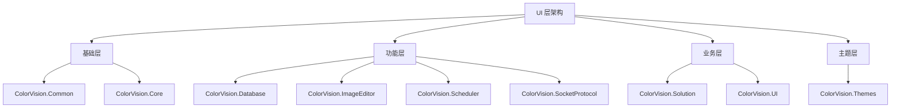
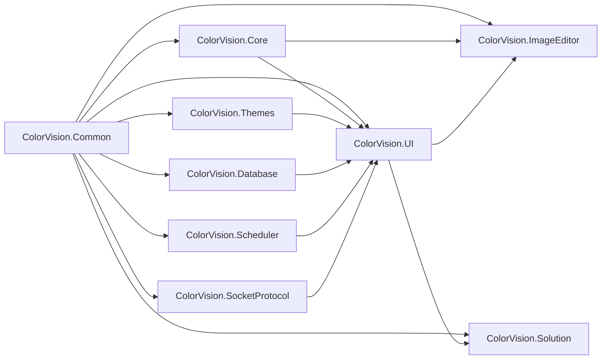

# UI组件概览

## 目录
1. [介绍](#介绍)
2. [组件架构](#组件架构)
3. [核心组件列表](#核心组件列表)
4. [组件依赖关系](#组件依赖关系)
5. [使用指南](#使用指南)

## 介绍

ColorVision 的 UI 层采用模块化设计，由多个独立的组件库组成。每个组件都有特定的职责和功能，共同构建了完整的用户界面系统。本文档提供了 UI 目录下所有组件的概览和详细说明。

## 组件架构



## 核心组件列表

### 基础层组件

#### 1. ColorVision.Common
- **功能**: 通用框架基础封装
- **职责**: 提供 MVVM 模式支持、命令封装和接口定义
- **版本**: 1.3.8.1
- **关键特性**:
  - MVVM 架构支持
  - ActionCommand/RelayCommand 命令封装
  - 通用接口定义（IConfig, IMenuItem, IWizardStep 等）

#### 2. ColorVision.Core  
- **功能**: C++ 接口封装
- **职责**: 提供底层 C++ 功能的接口访问
- **关键特性**:
  - OpenCV 集成
  - 图像处理算法支持
  - 硬件加速接口

### 功能层组件

#### 3. ColorVision.Database
- **功能**: 数据库辅助控件
- **职责**: 提供数据库连接和操作的 UI 控件
- **关键特性**:
  - MySQL 连接管理
  - 数据查询界面
  - 数据库工具窗口

#### 4. ColorVision.ImageEditor
- **功能**: 图像编辑控件
- **职责**: 提供完整的图像编辑和显示功能
- **版本**: 1.3.8.1
- **关键特性**:
  - 图像显示、编辑、保存
  - 对比度、gamma、色调调整
  - 图形绘制（文字、矩形、圆形、线条、贝塞尔曲线）
  - RGB48 格式支持
  - 选择和移动功能

#### 5. ColorVision.Scheduler
- **功能**: 定时任务管理控件
- **职责**: 基于 Quartz.Net 的任务调度系统
- **关键特性**:
  - 定时任务管理
  - 任务执行监控
  - 任务调度界面

#### 6. ColorVision.SocketProtocol
- **功能**: 串口通信插件
- **职责**: 提供串口和网络通信功能
- **关键特性**:
  - Socket 连接管理
  - 通信协议处理
  - 连接状态监控

### 业务层组件

#### 7. ColorVision.Solution
- **功能**: 解决方案管理
- **职责**: 项目和解决方案的创建、打开和管理
- **关键特性**:
  - 解决方案创建和打开
  - 项目管理界面
  - 文件树导航
  - 最近文件管理
  - 权限管理集成

#### 8. ColorVision.UI
- **功能**: 底层控件库
- **职责**: 提供核心 UI 组件和功能
- **关键特性**:
  - 菜单管理
  - 配置系统
  - 多语言支持
  - 热键管理
  - 日志系统
  - 工具栏和状态栏
  - 对话框组件
  - 下载管理
  - CUDA 支持
  - PropertyGrid 属性编辑器

### 主题层组件

#### 9. ColorVision.Themes
- **功能**: 主题控件系统
- **职责**: 提供应用程序的视觉主题支持
- **关键特性**:
  - 多主题支持（系统、黑色、白色、粉色、青色）
  - 主题切换功能
  - 自定义窗口样式
  - 上传/下载对话框
  - 消息弹窗样式

## 组件依赖关系



### 依赖层级说明

1. **基础依赖**: 所有组件都依赖 `ColorVision.Common`
2. **核心功能**: `ColorVision.Core` 为图像处理提供底层支持
3. **UI 基础**: `ColorVision.UI` 作为上层 UI 组件的基础
4. **主题系统**: `ColorVision.Themes` 为所有 UI 提供视觉样式
5. **业务集成**: `ColorVision.Solution` 整合各种功能组件

## 使用指南

### 基本初始化流程

```csharp
// 1. 读取配置
ConfigHandler.GetInstance();

// 2. 设置权限
Authorization.Instance = ConfigService.Instance.GetRequiredService<Authorization>();

// 3. 设置日志级别
LogConfig.Instance.SetLog();

// 4. 设置主题
this.ApplyTheme(ThemeConfig.Instance.Theme);

// 5. 设置语言
Thread.CurrentThread.CurrentUICulture = new System.Globalization.CultureInfo(LanguageConfig.Instance.UICulture);
```

### 组件使用建议

1. **开发新功能时**: 优先使用 `ColorVision.Common` 提供的基础接口
2. **图像处理功能**: 使用 `ColorVision.ImageEditor` 和 `ColorVision.Core`
3. **UI 定制**: 基于 `ColorVision.UI` 和 `ColorVision.Themes`
4. **数据管理**: 结合 `ColorVision.Database` 和 `ColorVision.Solution`

### 技术要求

- **框架版本**: .NET 8.0 / .NET 6.0 Windows
- **UI 框架**: WPF
- **包管理**: NuGet 包支持
- **开发环境**: Visual Studio 2022+

---

*本文档反映了 ColorVision UI 组件库的当前架构和功能。有关具体组件的详细信息，请参考各组件的专门文档。*