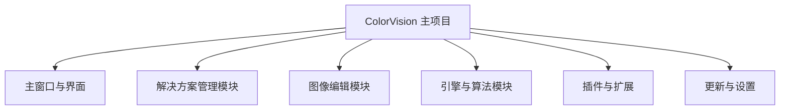
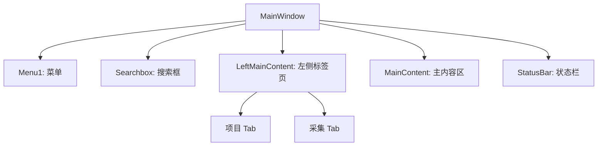
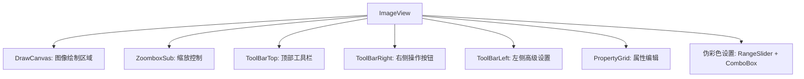

# 用户界面指南


# 用户界面指南

## 目录
1. [引言](#引言)
2. [项目结构](#项目结构)
3. [核心组件](#核心组件)
4. [架构总览](#架构总览)
5. [详细组件分析](#详细组件分析)
   - [主窗口 MainWindow.xaml](#主窗口-mainwindowxaml)
   - [解决方案管理 SolutionManager.cs](#解决方案管理-solutionmanagercs)
   - [图像视图 ImageView.xaml](#图像视图-imageviewxaml)
6. [依赖关系分析](#依赖关系分析)
7. [性能考虑](#性能考虑)
8. [故障排查指南](#故障排查指南)
9. [总结](#总结)
10. [附录](#附录)

---

## 引言
ColorVision 是一款功能强大的视觉软件，提供丰富的图像处理与项目管理功能。本文档旨在详细介绍 ColorVision 的主要用户界面元素和交互方式，涵盖主窗口布局、各个面板的功能，以及常用的操作流程，帮助用户熟练掌握软件界面使用。

---

## 项目结构

ColorVision 项目结构清晰，采用模块化设计，主要分为以下几个部分：



1. **主窗口与界面（/ColorVision/MainWindow.xaml 等）**  
   负责整个应用的主界面布局和核心交互，包含菜单、搜索框、状态栏和内容展示区。

2. **解决方案管理模块（/UI/ColorVision.Solution/）**  
   管理项目（解决方案）的创建、打开、历史记录等功能，核心类为 `SolutionManager`。

3. **图像编辑模块（/UI/ColorVision.ImageEditor/）**  
   提供图像查看、编辑和伪彩色处理等功能，界面复杂，支持多种绘图工具和属性编辑。

4. **引擎与算法模块（/Engine/ColorVision.Engine/）**  
   包含图像处理、算法实现及设备交互等核心逻辑，支持多种视觉算法。

5. **插件与扩展（/Plugins/）**  
   支持多种插件扩展功能，如聊天、系统监控、屏幕录制等。

6. **更新与设置（/ColorVision/Update/, /ColorVision/Settings/）**  
   管理软件自动更新和用户设置。

此结构体现了典型的分层架构，界面层与业务逻辑层分离，方便维护和扩展。

---

## 核心组件

根据项目结构和界面需求，以下是关键组件：

- **MainWindow.xaml**：主窗口界面定义，布局包含菜单、搜索框、左侧项目/视图标签页、主内容区和状态栏。
- **SolutionManager.cs**：解决方案管理核心，负责项目的创建、打开、历史记录管理及事件通知。
- **ImageView.xaml**：图像编辑视图控件，集成图像显示、缩放、绘图工具栏、属性编辑和伪彩色处理功能。

---

## 架构总览

ColorVision 采用典型的 MVVM（Model-View-ViewModel）设计模式：

- **Model**：数据模型，如项目配置、图像数据等。
- **View**：界面定义，如 XAML 文件（MainWindow.xaml、ImageView.xaml）。
- **ViewModel**：界面逻辑和状态管理，绑定界面与数据。

同时，应用通过事件机制和命令绑定实现模块间解耦，支持插件扩展和动态功能加载。

---

## 详细组件分析

### 主窗口 MainWindow.xaml

主窗口是用户交互的核心界面，结构清晰，主要分为三部分：

1. **顶部菜单栏和搜索区**  
   - 菜单 `Menu1` 用于展示应用的功能菜单，左对齐。  
   - 搜索框 `Searchbox` 支持输入查询，配合弹出列表 `SearchPopup` 显示搜索结果。  
   - 右侧有用户图标按钮，方便用户相关操作。

2. **中间内容区**  
   - 左侧 `LeftMainContent` 通过标签页 `LeftTabControl` 切换显示“项目”与“采集”视图。  
   - 右侧主内容区 `MainContent` 根据标签页状态显示不同内容区域。

3. **底部状态栏**  
   - 显示状态信息和视图切换按钮，支持多种窗口布局切换（单窗口、双窗口、四窗口等）。

界面采用动态资源绑定和数据绑定，支持主题和状态动态变化。



**关键交互事件**  
- `Window_Initialized`：窗口初始化事件。  
- `Searchbox_GotFocus`、`Searchbox_TextChanged` 等：搜索框交互。  
- `ListView1_SelectionChanged`、`ListView1_MouseDoubleClick`：搜索结果操作。  
- `ViewGrid_Click`：状态栏视图切换按钮点击。

---

### 解决方案管理 SolutionManager.cs

`SolutionManager` 是项目管理的核心类，职责包括：

- 管理当前打开的解决方案（项目）及其环境信息。  
- 维护解决方案历史记录，支持最近打开文件列表。  
- 提供创建新解决方案和打开现有解决方案的功能。  
- 通过事件通知界面和其他模块解决方案状态变化。  
- 支持命令绑定，供界面调用设置窗口。

主要成员和功能：

| 成员/方法                | 说明                                   |
|-------------------------|--------------------------------------|
| `SolutionHistory`       | 最近打开的解决方案列表，持久化存储于注册表。          |
| `OpenSolution(string)`  | 打开指定路径的解决方案文件（.cvsln）。              |
| `CreateSolution(string)`| 创建新解决方案，生成默认配置文件。                  |
| `SolutionCreated`       | 解决方案创建事件。                           |
| `SolutionLoaded`        | 解决方案加载事件。                           |
| `OpenView(VObject)`     | 打开指定视图对象，触发界面更新。                 |
| `NewCreateWindow()`     | 弹出新建解决方案窗口。                         |
| `OpenSolutionWindow()`  | 弹出打开解决方案窗口。                         |

代码片段示例：

```csharp
public bool OpenSolution(string FullPath)
{
    if (File.Exists(FullPath) && FullPath.EndsWith("cvsln", StringComparison.OrdinalIgnoreCase))
    {
        FileInfo fileInfo = new FileInfo(FullPath);
        SolutionHistory.InsertFile(FullPath);
        SolutionLoaded?.Invoke(FullPath, new EventArgs());
        // 设置环境信息
        SolutionEnvironments.SolutionDir = Directory.GetParent(fileInfo.FullName).FullName;
        SolutionEnvironments.SolutionPath = fileInfo.FullName;
        SolutionEnvironments.SolutionExt = fileInfo.Extension;
        SolutionEnvironments.SolutionName = fileInfo.Name;
        SolutionEnvironments.SolutionFileName = Path.GetFileName(FullPath);

        SolutionExplorers.Clear();
        CurrentSolutionExplorer = new SolutionExplorer(SolutionEnvironments);
        SolutionExplorers.Add(CurrentSolutionExplorer);
        return true;
    }
    else
    {
        SolutionHistory.RemoveFile(FullPath);
        return false;
    }
}
```

---

### 图像视图 ImageView.xaml

`ImageView` 是图像编辑和显示的用户控件，包含丰富的界面元素和交互工具，主要功能包括：

- **图像显示区域**  
  - 使用 `DrawCanvas` 进行图像绘制，支持高质量缩放和平滑渲染。  
  - 支持缩放盒子 `ZoomboxSub`，允许用户放大、缩小图像。

- **工具栏**  
  - 顶部工具栏包含拖拽、鼠标模式切换、缩放控制按钮。  
  - 右侧工具栏支持打开、保存、清除图像操作。  
  - 左侧工具栏提供高级功能开关，如伪彩色、3D视图、白平衡调整、亮度对比度调节等。

- **属性编辑**  
  - 右侧集成 `PropertyGrid` 供用户编辑选中图像元素属性。  
  - 支持显示和编辑图层、绘图工具参数。

- **绘图工具按钮**  
  - 包含测量、橡皮擦、圆形、矩形、多边形、贝塞尔曲线等绘图工具切换按钮。  
  - 还支持同心圆、十字线等辅助绘图参考。

- **伪彩色设置**  
  - 伪彩色范围调整滑块和色彩映射选择，方便用户对图像颜色进行自定义处理。

界面布局采用网格和堆栈面板组合，控件间通过绑定和事件响应实现动态交互。



---

## 依赖关系分析

- **界面层依赖**：  
  `MainWindow` 依赖于 `SolutionManager` 处理项目管理逻辑，依赖 `ImageView` 作为图像编辑视图组件。  
  通过数据绑定和事件机制实现解耦。

- **模块耦合度**：  
  解决方案管理模块与界面层通过事件和命令交互，保持了较低耦合度，便于维护和扩展。  
  图像编辑模块内部功能丰富，工具栏与绘图区域交互紧密。

- **外部依赖**：  
  使用第三方控件库（如 HandyControl）增强界面交互体验。  
  使用 MVVM 框架辅助数据绑定和命令管理。

---

## 性能考虑

- 图像绘制采用高质量渲染模式，支持缩放时保持平滑，可能会增加 GPU 负担，适合中高端设备。  
- 搜索框使用即时搜索和弹出列表，响应快速，支持最大15字符限制防止性能瓶颈。  
- 解决方案管理采用文件和注册表缓存，启动时加载最近项目，提升用户体验。  
- 界面资源使用动态资源绑定，支持主题切换，减少重复资源加载。

---

## 故障排查指南

- **主界面不显示**：确认 `MainWindow.xaml` 正确加载，检查 `Window_Initialized` 事件是否触发。  
- **搜索无响应**：检查搜索框事件绑定（`Searchbox_TextChanged`）是否正常，确认搜索数据源。  
- **项目无法打开**：确认解决方案文件路径正确，文件后缀为 `.cvsln`，查看 `SolutionManager.OpenSolution` 返回值。  
- **图像显示异常**：确认 `ImageView` 控件初始化完成，检查绘图画布事件和绑定属性。  
- **工具栏按钮无效**：确认命令绑定是否正确，检查 ViewModel 中命令实现。

---

## 总结

本文档详细介绍了 ColorVision 的用户界面结构和交互方式，重点分析了主窗口布局、解决方案管理模块和图像编辑视图控件。通过清晰的模块划分和 MVVM 架构，ColorVision 实现了功能丰富且易于扩展的用户界面。用户可以通过菜单、搜索框、标签页和工具栏高效完成项目管理和图像处理任务。

---

## 附录

### 参考源码链接

- 主窗口界面定义  
  [https://github.com/xincheng213618/scgd_general_wpf/blob/master/ColorVision/MainWindow.xaml](ColorVision/MainWindow.xaml)

- 解决方案管理核心代码  
  [https://github.com/xincheng213618/scgd_general_wpf/blob/master/UI/ColorVision.Solution/SolutionManager.cs](UI/ColorVision.Solution/SolutionManager.cs)

- 图像视图控件定义  
  [https://github.com/xincheng213618/scgd_general_wpf/blob/master/UI/ColorVision.ImageEditor/ImageView.xaml](UI/ColorVision.ImageEditor/ImageView.xaml)

