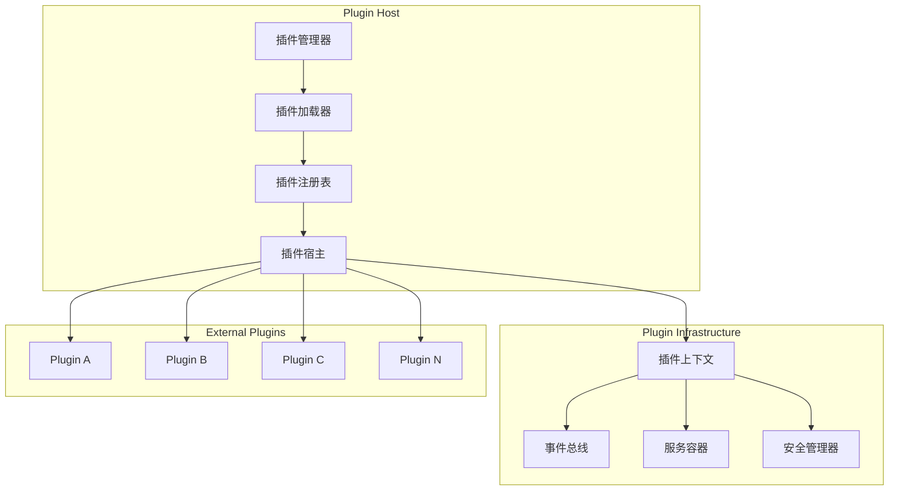
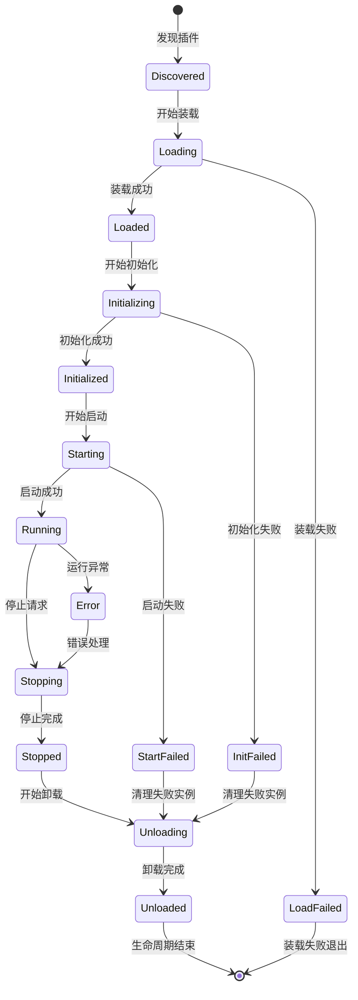
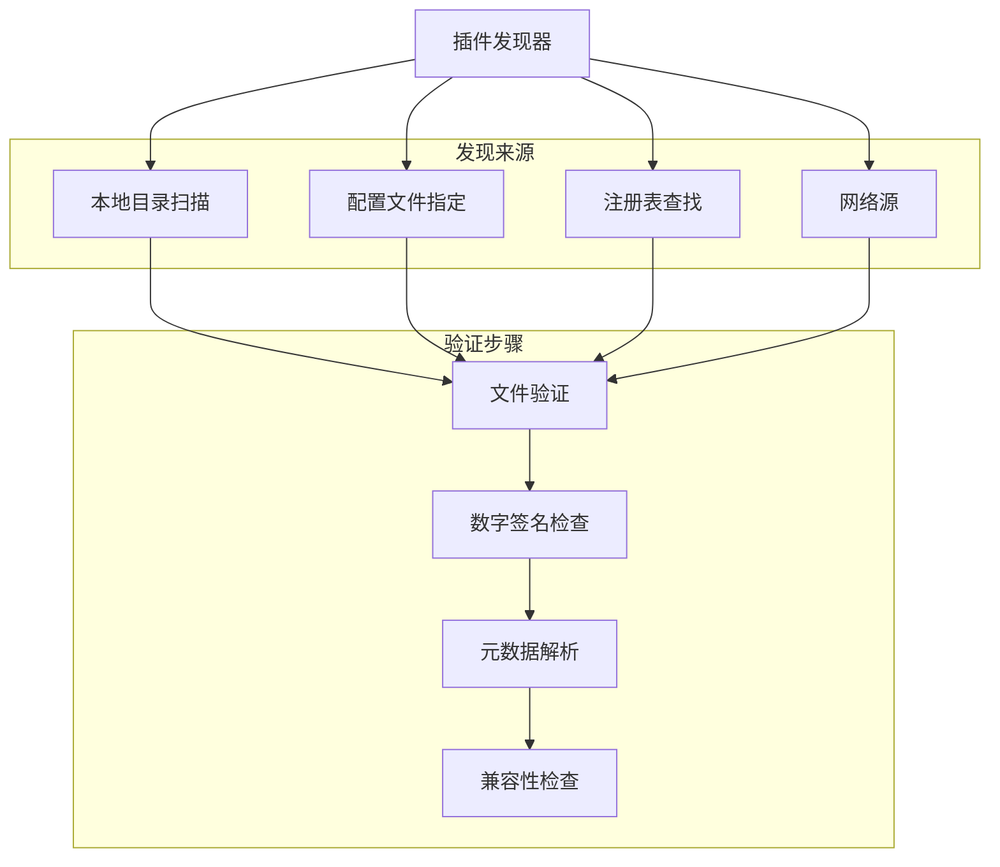
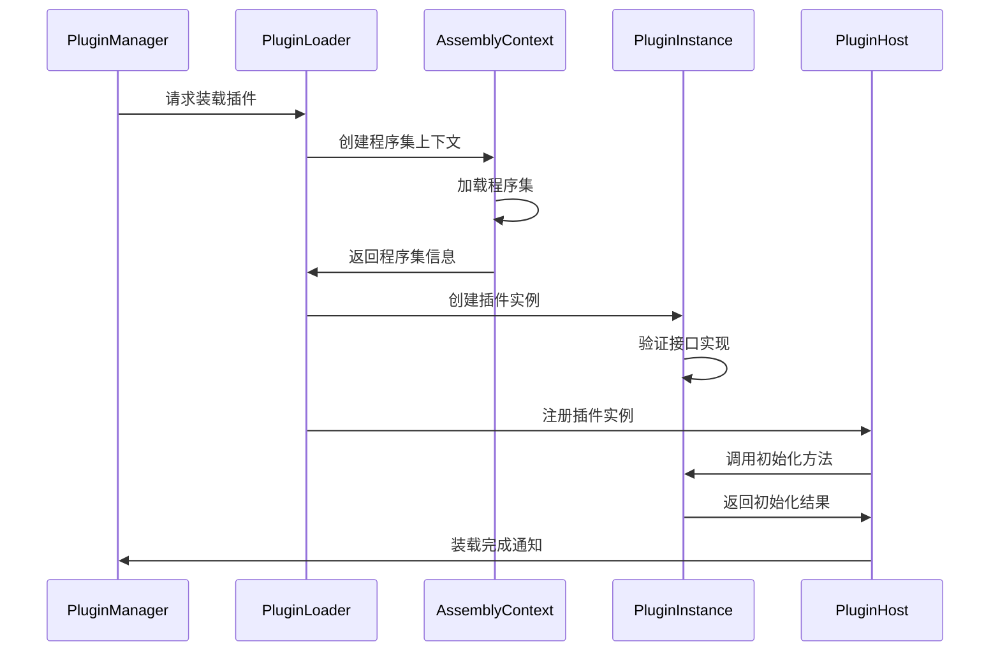
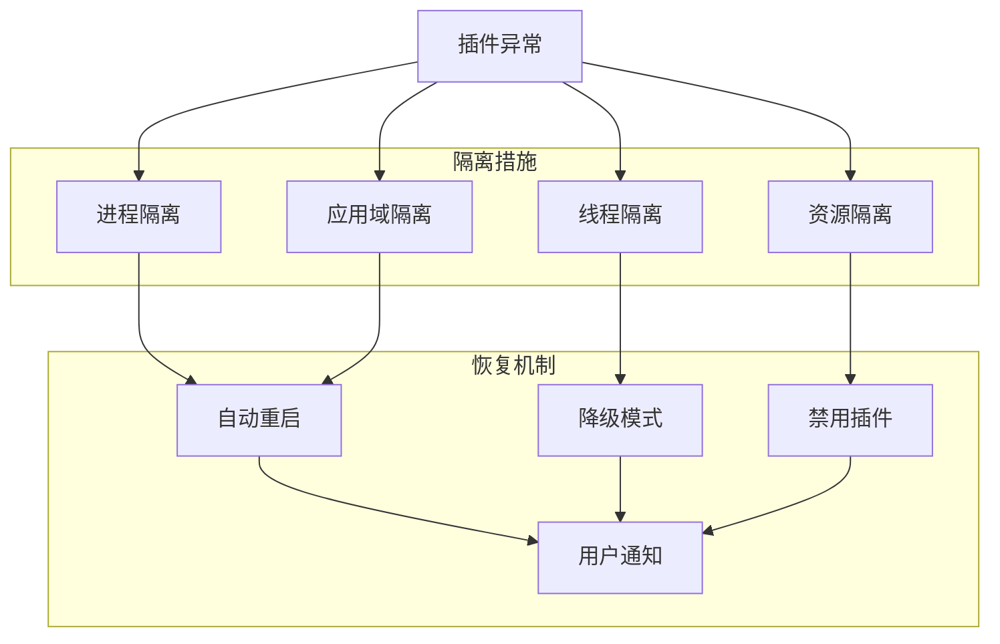
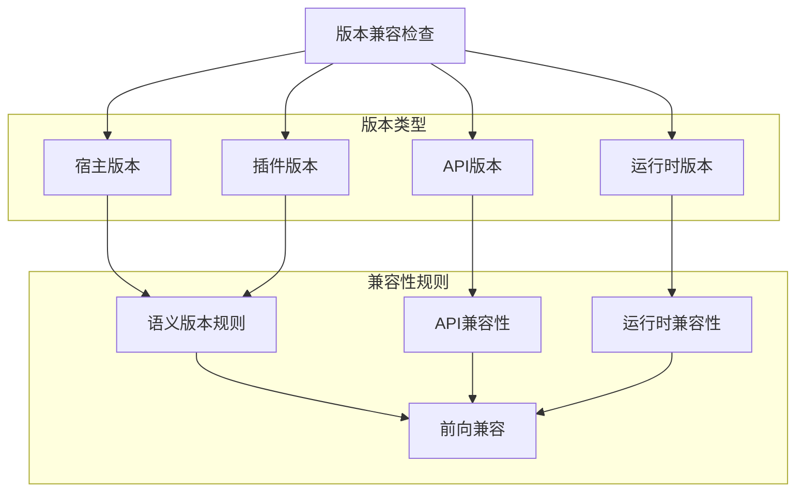
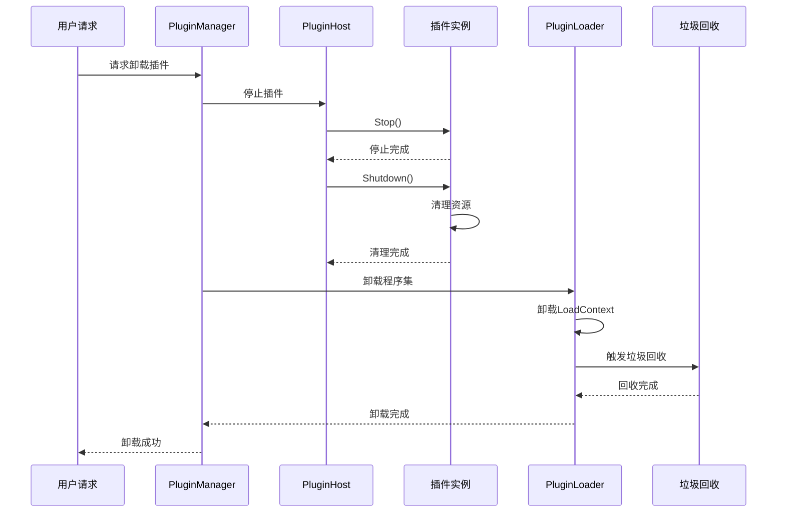

# Plugin Lifecycle

---
**Metadata:**
- Title: Plugin Lifecycle - Discovery, Loading, and Management
- Status: draft
- Updated: 2024-09-28
- Author: ColorVision Development Team
---

## 简介

本文档详细描述 ColorVision 插件系统的完整生命周期，包括插件发现、装载、初始化、运行时管理、以及卸载过程。还涵盖了失败隔离机制和版本兼容性策略。

## 目录

1. [插件系统概览](#插件系统概览)
2. [生命周期阶段](#生命周期阶段)
3. [插件发现机制](#插件发现机制)
4. [装载与初始化](#装载与初始化)
5. [运行时管理](#运行时管理)
6. [失败隔离机制](#失败隔离机制)
7. [版本兼容策略](#版本兼容策略)
8. [卸载与清理](#卸载与清理)

## 插件系统概览

### 架构组件



### 核心接口

```csharp
/// <summary>
/// 插件基础接口
/// </summary>
public interface IPlugin
{
    /// <summary>插件唯一标识符</summary>
    string Id { get; }
    
    /// <summary>插件名称</summary>
    string Name { get; }
    
    /// <summary>插件版本</summary>
    Version Version { get; }
    
    /// <summary>插件描述</summary>
    string Description { get; }
    
    /// <summary>插件作者</summary>
    string Author { get; }
    
    /// <summary>初始化插件</summary>
    Task InitializeAsync(IPluginContext context);
    
    /// <summary>启动插件</summary>
    Task StartAsync();
    
    /// <summary>停止插件</summary>
    Task StopAsync();
    
    /// <summary>清理资源</summary>
    Task ShutdownAsync();
}
```

## 生命周期阶段

### 完整生命周期状态图



### 状态定义

```csharp
public enum PluginState
{
    /// <summary>未知状态</summary>
    Unknown = 0,
    
    /// <summary>已发现</summary>
    Discovered = 1,
    
    /// <summary>装载中</summary>
    Loading = 2,
    
    /// <summary>已装载</summary>
    Loaded = 3,
    
    /// <summary>装载失败</summary>
    LoadFailed = 4,
    
    /// <summary>初始化中</summary>
    Initializing = 5,
    
    /// <summary>已初始化</summary>
    Initialized = 6,
    
    /// <summary>初始化失败</summary>
    InitFailed = 7,
    
    /// <summary>启动中</summary>
    Starting = 8,
    
    /// <summary>运行中</summary>
    Running = 9,
    
    /// <summary>启动失败</summary>
    StartFailed = 10,
    
    /// <summary>停止中</summary>
    Stopping = 11,
    
    /// <summary>已停止</summary>
    Stopped = 12,
    
    /// <summary>运行异常</summary>
    Error = 13,
    
    /// <summary>卸载中</summary>
    Unloading = 14,
    
    /// <summary>已卸载</summary>
    Unloaded = 15
}
```

## 插件发现机制

### 发现策略



### 插件清单格式

```json
{
  "plugin": {
    "id": "com.colorvision.plugin.example",
    "name": "示例插件",
    "version": "1.2.3",
    "description": "这是一个示例插件",
    "author": "ColorVision Team",
    "website": "https://colorvision.com",
    "license": "MIT",
    "category": "Analysis",
    "tags": ["image", "analysis", "opencv"],
    
    "compatibility": {
      "minHostVersion": "3.0.0",
      "maxHostVersion": "4.0.0",
      "targetFramework": "net8.0",
      "architecture": ["x64", "x86"]
    },
    
    "dependencies": [
      {
        "id": "opencv",
        "version": "4.5.0",
        "required": true
      }
    ],
    
    "assembly": {
      "fileName": "ExamplePlugin.dll",
      "entryPoint": "ExamplePlugin.PluginEntry",
      "configFile": "plugin.config"
    },
    
    "permissions": [
      "system.io.file.read",
      "system.io.file.write",
      "device.camera.access"
    ],
    
    "ui": {
      "menuItems": [
        {
          "text": "示例功能",
          "command": "example.action",
          "icon": "icon.png",
          "shortcut": "Ctrl+E"
        }
      ],
      "toolbarButtons": [
        {
          "text": "快速处理",
          "command": "example.quickProcess",
          "icon": "quick.png"
        }
      ]
    }
  }
}
```

### 发现器实现

```csharp
public class PluginDiscoveryService : IPluginDiscoveryService
{
    private readonly ILogger _logger;
    private readonly PluginDiscoveryOptions _options;
    
    public async Task<IEnumerable<PluginDescriptor>> DiscoverPluginsAsync()
    {
        var plugins = new List<PluginDescriptor>();
        
        // 扫描本地插件目录
        plugins.AddRange(await ScanLocalDirectoryAsync(_options.PluginDirectory));
        
        // 从配置文件加载指定插件
        plugins.AddRange(await LoadFromConfigAsync(_options.ConfigFile));
        
        // 验证和过滤插件
        return await ValidatePluginsAsync(plugins);
    }
    
    private async Task<IEnumerable<PluginDescriptor>> ScanLocalDirectoryAsync(string directory)
    {
        var plugins = new List<PluginDescriptor>();
        
        if (!Directory.Exists(directory))
        {
            _logger.Warning("Plugin directory not found: {Directory}", directory);
            return plugins;
        }
        
        var pluginFiles = Directory.GetFiles(directory, "*.dll", SearchOption.AllDirectories);
        
        foreach (var file in pluginFiles)
        {
            try
            {
                var manifestFile = Path.Combine(Path.GetDirectoryName(file), "plugin.json");
                if (File.Exists(manifestFile))
                {
                    var manifest = await ParseManifestAsync(manifestFile);
                    var descriptor = CreateDescriptor(file, manifest);
                    plugins.Add(descriptor);
                }
            }
            catch (Exception ex)
            {
                _logger.Error(ex, "Failed to process plugin file: {File}", file);
            }
        }
        
        return plugins;
    }
    
    private async Task<IEnumerable<PluginDescriptor>> ValidatePluginsAsync(
        IEnumerable<PluginDescriptor> plugins)
    {
        var validPlugins = new List<PluginDescriptor>();
        
        foreach (var plugin in plugins)
        {
            try
            {
                // 验证文件完整性
                if (!await ValidateFileIntegrityAsync(plugin.AssemblyPath))
                    continue;
                
                // 检查数字签名
                if (!await ValidateSignatureAsync(plugin.AssemblyPath))
                    continue;
                
                // 检查兼容性
                if (!ValidateCompatibility(plugin))
                    continue;
                
                validPlugins.Add(plugin);
                _logger.Information("Plugin validated: {PluginId}", plugin.Id);
            }
            catch (Exception ex)
            {
                _logger.Error(ex, "Plugin validation failed: {PluginId}", plugin.Id);
            }
        }
        
        return validPlugins;
    }
}
```

## 装载与初始化

### 装载过程



### 程序集装载实现

```csharp
public class PluginLoader : IPluginLoader
{
    private readonly Dictionary<string, PluginLoadContext> _loadContexts = new();
    private readonly ILogger _logger;
    
    public async Task<IPlugin> LoadPluginAsync(PluginDescriptor descriptor)
    {
        try
        {
            // 创建插件专用的加载上下文
            var loadContext = new PluginLoadContext(descriptor.AssemblyPath, descriptor.Id);
            _loadContexts[descriptor.Id] = loadContext;
            
            // 加载主程序集
            var assembly = loadContext.LoadFromAssemblyPath(descriptor.AssemblyPath);
            
            // 查找插件入口点
            var entryPointType = FindEntryPointType(assembly, descriptor);
            if (entryPointType == null)
            {
                throw new PluginLoadException($"Entry point not found in plugin: {descriptor.Id}");
            }
            
            // 创建插件实例
            var plugin = (IPlugin)Activator.CreateInstance(entryPointType);
            
            // 验证插件接口
            ValidatePluginInterface(plugin, descriptor);
            
            _logger.Information("Plugin loaded successfully: {PluginId}", descriptor.Id);
            return plugin;
        }
        catch (Exception ex)
        {
            _logger.Error(ex, "Failed to load plugin: {PluginId}", descriptor.Id);
            throw;
        }
    }
    
    private Type FindEntryPointType(Assembly assembly, PluginDescriptor descriptor)
    {
        // 首先尝试从清单指定的入口点
        if (!string.IsNullOrEmpty(descriptor.EntryPoint))
        {
            var type = assembly.GetType(descriptor.EntryPoint);
            if (type != null && typeof(IPlugin).IsAssignableFrom(type))
                return type;
        }
        
        // 搜索实现了IPlugin接口的类型
        var pluginTypes = assembly.GetTypes()
            .Where(t => typeof(IPlugin).IsAssignableFrom(t) && !t.IsAbstract)
            .ToArray();
        
        if (pluginTypes.Length == 1)
            return pluginTypes[0];
        
        if (pluginTypes.Length > 1)
        {
            // 多个实现时，优先选择带有PluginAttribute的类型
            var attributedType = pluginTypes
                .FirstOrDefault(t => t.GetCustomAttribute<PluginAttribute>() != null);
            
            return attributedType ?? pluginTypes[0];
        }
        
        return null;
    }
}

/// <summary>
/// 插件专用程序集加载上下文
/// 提供插件隔离和卸载能力
/// </summary>
public class PluginLoadContext : AssemblyLoadContext
{
    private readonly AssemblyDependencyResolver _resolver;
    private readonly string _pluginId;
    
    public PluginLoadContext(string pluginPath, string pluginId) : base(pluginId, true)
    {
        _resolver = new AssemblyDependencyResolver(pluginPath);
        _pluginId = pluginId;
    }
    
    protected override Assembly Load(AssemblyName assemblyName)
    {
        var assemblyPath = _resolver.ResolveAssemblyToPath(assemblyName);
        return assemblyPath != null ? LoadFromAssemblyPath(assemblyPath) : null;
    }
    
    protected override IntPtr LoadUnmanagedDll(string unmanagedDllName)
    {
        var libraryPath = _resolver.ResolveUnmanagedDllToPath(unmanagedDllName);
        return libraryPath != null ? LoadUnmanagedDllFromPath(libraryPath) : IntPtr.Zero;
    }
}
```

### 插件初始化

```csharp
public class PluginInitializer
{
    private readonly IServiceProvider _serviceProvider;
    private readonly ILogger _logger;
    
    public async Task<bool> InitializePluginAsync(IPlugin plugin, PluginDescriptor descriptor)
    {
        try
        {
            // 创建插件上下文
            var context = CreatePluginContext(plugin, descriptor);
            
            // 验证权限
            ValidatePermissions(descriptor.Permissions);
            
            // 注入服务依赖
            await InjectDependenciesAsync(plugin, context);
            
            // 执行插件初始化
            await plugin.InitializeAsync(context);
            
            // 注册插件服务和扩展点
            RegisterPluginServices(plugin, context);
            
            // 集成UI元素
            IntegrateUserInterface(plugin, descriptor);
            
            _logger.Information("Plugin initialized: {PluginId}", plugin.Id);
            return true;
        }
        catch (Exception ex)
        {
            _logger.Error(ex, "Plugin initialization failed: {PluginId}", plugin.Id);
            return false;
        }
    }
    
    private IPluginContext CreatePluginContext(IPlugin plugin, PluginDescriptor descriptor)
    {
        return new PluginContext
        {
            Plugin = plugin,
            Descriptor = descriptor,
            ServiceProvider = _serviceProvider,
            Logger = _logger.ForContext("PluginId", plugin.Id),
            Configuration = LoadPluginConfiguration(descriptor),
            DataDirectory = GetPluginDataDirectory(plugin.Id),
            TempDirectory = GetPluginTempDirectory(plugin.Id)
        };
    }
    
    private void IntegrateUserInterface(IPlugin plugin, PluginDescriptor descriptor)
    {
        // 集成菜单项
        foreach (var menuItem in descriptor.Manifest.UI?.MenuItems ?? [])
        {
            RegisterMenuItem(plugin, menuItem);
        }
        
        // 集成工具栏按钮
        foreach (var button in descriptor.Manifest.UI?.ToolbarButtons ?? [])
        {
            RegisterToolbarButton(plugin, button);
        }
        
        // 集成快捷键
        foreach (var shortcut in descriptor.Manifest.UI?.Shortcuts ?? [])
        {
            RegisterShortcut(plugin, shortcut);
        }
    }
}
```

## 运行时管理

### 插件宿主实现

```csharp
public class PluginHost : IPluginHost
{
    private readonly ConcurrentDictionary<string, PluginRuntime> _runningPlugins = new();
    private readonly IEventBus _eventBus;
    private readonly ILogger _logger;
    
    public async Task StartPluginAsync(string pluginId)
    {
        if (!_runningPlugins.TryGetValue(pluginId, out var runtime))
        {
            throw new InvalidOperationException($"Plugin not found: {pluginId}");
        }
        
        try
        {
            await runtime.Plugin.StartAsync();
            runtime.State = PluginState.Running;
            runtime.StartTime = DateTime.UtcNow;
            
            // 发布插件启动事件
            await _eventBus.PublishAsync(new PluginStartedEvent
            {
                PluginId = pluginId,
                StartTime = runtime.StartTime.Value
            });
            
            _logger.Information("Plugin started: {PluginId}", pluginId);
        }
        catch (Exception ex)
        {
            runtime.State = PluginState.StartFailed;
            runtime.LastError = ex.Message;
            
            _logger.Error(ex, "Failed to start plugin: {PluginId}", pluginId);
            throw;
        }
    }
    
    public async Task StopPluginAsync(string pluginId)
    {
        if (!_runningPlugins.TryGetValue(pluginId, out var runtime))
            return;
        
        try
        {
            runtime.State = PluginState.Stopping;
            await runtime.Plugin.StopAsync();
            runtime.State = PluginState.Stopped;
            
            await _eventBus.PublishAsync(new PluginStoppedEvent
            {
                PluginId = pluginId,
                StopTime = DateTime.UtcNow
            });
        }
        catch (Exception ex)
        {
            runtime.State = PluginState.Error;
            runtime.LastError = ex.Message;
            _logger.Error(ex, "Failed to stop plugin: {PluginId}", pluginId);
        }
    }
}

public class PluginRuntime
{
    public IPlugin Plugin { get; set; }
    public PluginDescriptor Descriptor { get; set; }
    public PluginState State { get; set; }
    public DateTime LoadTime { get; set; }
    public DateTime? StartTime { get; set; }
    public string LastError { get; set; }
    public PluginMetrics Metrics { get; set; }
}
```

## 失败隔离机制

### 隔离策略



### 异常处理实现

```csharp
public class PluginFailureHandler : IPluginFailureHandler
{
    private readonly PluginRestartPolicy _restartPolicy;
    private readonly ILogger _logger;
    
    public async Task HandlePluginFailureAsync(string pluginId, Exception exception)
    {
        var runtime = GetPluginRuntime(pluginId);
        if (runtime == null) return;
        
        // 记录异常信息
        _logger.Error(exception, "Plugin failure: {PluginId}", pluginId);
        
        // 更新插件状态
        runtime.State = PluginState.Error;
        runtime.LastError = exception.Message;
        runtime.Metrics.FailureCount++;
        
        // 确定恢复策略
        var strategy = DetermineRecoveryStrategy(runtime, exception);
        
        switch (strategy)
        {
            case RecoveryStrategy.Restart:
                await RestartPluginAsync(pluginId);
                break;
                
            case RecoveryStrategy.FallbackMode:
                await EnableFallbackModeAsync(pluginId);
                break;
                
            case RecoveryStrategy.Disable:
                await DisablePluginAsync(pluginId);
                break;
                
            case RecoveryStrategy.Isolate:
                await IsolatePluginAsync(pluginId);
                break;
        }
        
        // 通知用户
        await NotifyUserAsync(pluginId, strategy, exception);
    }
    
    private RecoveryStrategy DetermineRecoveryStrategy(PluginRuntime runtime, Exception exception)
    {
        // 检查重启次数限制
        if (runtime.Metrics.RestartCount >= _restartPolicy.MaxRestartCount)
        {
            return RecoveryStrategy.Disable;
        }
        
        // 根据异常类型决定策略
        return exception switch
        {
            OutOfMemoryException => RecoveryStrategy.Restart,
            TimeoutException => RecoveryStrategy.Restart,
            SecurityException => RecoveryStrategy.Isolate,
            FileNotFoundException => RecoveryStrategy.FallbackMode,
            UnauthorizedAccessException => RecoveryStrategy.Disable,
            _ => RecoveryStrategy.Restart
        };
    }
    
    private async Task RestartPluginAsync(string pluginId)
    {
        var runtime = GetPluginRuntime(pluginId);
        runtime.Metrics.RestartCount++;
        
        try
        {
            // 停止插件
            await StopPluginSafelyAsync(pluginId);
            
            // 等待冷却时间
            await Task.Delay(_restartPolicy.RestartDelay);
            
            // 重新启动
            await StartPluginAsync(pluginId);
            
            _logger.Information("Plugin restarted successfully: {PluginId}", pluginId);
        }
        catch (Exception ex)
        {
            _logger.Error(ex, "Failed to restart plugin: {PluginId}", pluginId);
            await DisablePluginAsync(pluginId);
        }
    }
}
```

## 版本兼容策略

### 版本管理



### 兼容性检查实现

```csharp
public class PluginCompatibilityChecker : IPluginCompatibilityChecker
{
    private readonly HostVersionInfo _hostVersion;
    
    public CompatibilityResult CheckCompatibility(PluginDescriptor plugin)
    {
        var result = new CompatibilityResult { IsCompatible = true };
        
        // 检查宿主版本兼容性
        CheckHostVersionCompatibility(plugin, result);
        
        // 检查.NET运行时兼容性
        CheckRuntimeCompatibility(plugin, result);
        
        // 检查架构兼容性
        CheckArchitectureCompatibility(plugin, result);
        
        // 检查API版本兼容性
        CheckApiCompatibility(plugin, result);
        
        // 检查依赖项兼容性
        CheckDependencyCompatibility(plugin, result);
        
        return result;
    }
    
    private void CheckHostVersionCompatibility(PluginDescriptor plugin, CompatibilityResult result)
    {
        var compatibility = plugin.Manifest.Compatibility;
        
        if (compatibility.MinHostVersion != null)
        {
            if (_hostVersion.Version < Version.Parse(compatibility.MinHostVersion))
            {
                result.IsCompatible = false;
                result.Issues.Add(new CompatibilityIssue
                {
                    Type = IssueType.HostVersionTooLow,
                    Message = $"需要宿主版本 >= {compatibility.MinHostVersion}，当前版本 {_hostVersion.Version}"
                });
            }
        }
        
        if (compatibility.MaxHostVersion != null)
        {
            if (_hostVersion.Version > Version.Parse(compatibility.MaxHostVersion))
            {
                result.IsCompatible = false;
                result.Issues.Add(new CompatibilityIssue
                {
                    Type = IssueType.HostVersionTooHigh,
                    Message = $"需要宿主版本 <= {compatibility.MaxHostVersion}，当前版本 {_hostVersion.Version}"
                });
            }
        }
    }
}
```

## 卸载与清理

### 卸载过程



### 资源清理实现

```csharp
public class PluginUnloader : IPluginUnloader
{
    public async Task<bool> UnloadPluginAsync(string pluginId)
    {
        try
        {
            var runtime = GetPluginRuntime(pluginId);
            if (runtime == null) return false;
            
            // 1. 停止插件
            if (runtime.State == PluginState.Running)
            {
                await runtime.Plugin.StopAsync();
            }
            
            // 2. 清理插件资源
            await runtime.Plugin.ShutdownAsync();
            
            // 3. 移除UI集成
            RemoveUserInterfaceElements(pluginId);
            
            // 4. 取消事件订阅
            UnsubscribeEvents(pluginId);
            
            // 5. 清理服务注册
            UnregisterServices(pluginId);
            
            // 6. 清理临时文件
            CleanupTempFiles(runtime.TempDirectory);
            
            // 7. 卸载程序集
            UnloadAssembly(pluginId);
            
            // 8. 移除运行时记录
            RemovePluginRuntime(pluginId);
            
            _logger.Information("Plugin unloaded successfully: {PluginId}", pluginId);
            return true;
        }
        catch (Exception ex)
        {
            _logger.Error(ex, "Failed to unload plugin: {PluginId}", pluginId);
            return false;
        }
    }
    
    private void UnloadAssembly(string pluginId)
    {
        if (_loadContexts.TryRemove(pluginId, out var loadContext))
        {
            // 卸载程序集上下文
            loadContext.Unload();
            
            // 等待垃圾回收
            for (int i = 0; i < 10 && loadContext.IsCollectible; i++)
            {
                GC.Collect();
                GC.WaitForPendingFinalizers();
                Thread.Sleep(100);
            }
            
            if (loadContext.IsCollectible)
            {
                _logger.Warning("Plugin assembly may not be fully unloaded: {PluginId}", pluginId);
            }
        }
    }
    
    private void CleanupTempFiles(string tempDirectory)
    {
        try
        {
            if (Directory.Exists(tempDirectory))
            {
                Directory.Delete(tempDirectory, true);
            }
        }
        catch (Exception ex)
        {
            _logger.Warning(ex, "Failed to cleanup temp directory: {Directory}", tempDirectory);
        }
    }
}
```

### 完整的插件管理器

```csharp
public class PluginManager : IPluginManager, IDisposable
{
    private readonly IPluginDiscoveryService _discoveryService;
    private readonly IPluginLoader _loader;
    private readonly IPluginHost _host;
    private readonly IPluginUnloader _unloader;
    private readonly ConcurrentDictionary<string, PluginRuntime> _plugins = new();
    
    public async Task LoadAllPluginsAsync()
    {
        // 发现插件
        var descriptors = await _discoveryService.DiscoverPluginsAsync();
        
        // 按依赖顺序排序
        var sortedDescriptors = TopologicalSort(descriptors);
        
        // 逐个加载插件
        foreach (var descriptor in sortedDescriptors)
        {
            try
            {
                await LoadPluginAsync(descriptor);
            }
            catch (Exception ex)
            {
                _logger.Error(ex, "Failed to load plugin: {PluginId}", descriptor.Id);
            }
        }
    }
    
    public async Task<bool> LoadPluginAsync(PluginDescriptor descriptor)
    {
        try
        {
            // 装载插件
            var plugin = await _loader.LoadPluginAsync(descriptor);
            
            // 创建运行时
            var runtime = new PluginRuntime
            {
                Plugin = plugin,
                Descriptor = descriptor,
                State = PluginState.Loaded,
                LoadTime = DateTime.UtcNow,
                Metrics = new PluginMetrics()
            };
            
            _plugins[descriptor.Id] = runtime;
            
            // 初始化插件
            await InitializePluginAsync(plugin, descriptor);
            
            return true;
        }
        catch (Exception ex)
        {
            _logger.Error(ex, "Plugin loading failed: {PluginId}", descriptor.Id);
            return false;
        }
    }
    
    public void Dispose()
    {
        // 卸载所有插件
        foreach (var pluginId in _plugins.Keys.ToArray())
        {
            try
            {
                _unloader.UnloadPluginAsync(pluginId).Wait();
            }
            catch (Exception ex)
            {
                _logger.Error(ex, "Error during plugin cleanup: {PluginId}", pluginId);
            }
        }
    }
}
```

---

*最后更新: 2024-09-28 | 状态: draft*