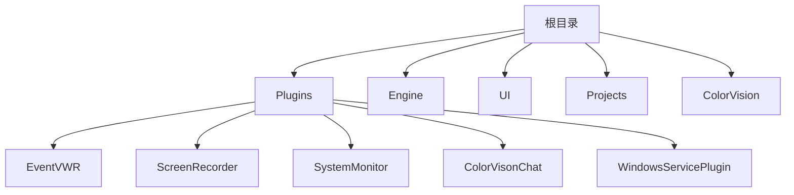

# 使用标准插件


# 使用标准插件

## 目录
1. [简介](#简介)
2. [项目结构](#项目结构)
3. [核心组件](#核心组件)
4. [架构概述](#架构概述)
5. [详细组件分析](#详细组件分析)
   - 事件查看器插件
   - 屏幕录像机插件
   - 系统监视器插件
   - 聊天插件（简介）
   - Windows服务插件（简介）
6. [依赖关系分析](#依赖关系分析)
7. [性能考虑](#性能考虑)
8. [故障排除指南](#故障排除指南)
9. [总结](#总结)
10. [附录](#附录)

## 简介
本篇文档旨在为用户详细介绍本项目中的**标准插件**的使用方法，包括事件查看器插件、屏幕录像机插件、系统监视器插件、聊天插件及Windows服务插件。文档将详细阐述各插件的功能、界面及配置选项，帮助用户快速理解和高效使用这些插件。

本项目基于WPF技术，采用模块化插件架构，各插件独立开发并通过统一接口集成，方便扩展与维护。

## 项目结构
该项目结构清晰，主要分为核心引擎、用户界面、插件、项目示例、引擎辅助库等模块。插件文件夹内包含多个标准插件，每个插件为一个独立的子目录，内部包含其代码和资源文件。项目采用了命名空间划分，方便管理。

主要目录说明：



- **Plugins/**：存放各标准插件，每个插件为一个子文件夹，包含插件的代码、资源及配置。
- **Engine/**：包含核心算法、设备管理、服务等实现。
- **UI/**：用户界面相关代码及主题资源。
- **Projects/**：各示例项目，展示插件或引擎的不同应用。
- **ColorVision/**：主程序与插件管理相关。

这种结构将功能模块化，便于维护和扩展。

## 核心组件
核心组件主要包括：

- **插件基类接口**（如`IPluginBase`）：所有插件均继承该接口，实现统一管理。
- **事件查看器插件**：用于增强异常管理，提供事件查看和Dump设置功能。
- **屏幕录像机插件**：实现屏幕录制功能。
- **系统监视器插件**：实现电脑性能监控。
- **聊天插件**：集成聊天功能（基于ColorVisonChat）。
- **Windows服务插件**：管理Windows服务的安装、配置与日志导出。

## 架构概述
本项目采用插件化架构，主程序通过统一接口加载和管理插件。每个插件独立开发，拥有自己的界面和业务逻辑，且通过继承`IPluginBase`接口实现统一的插件元信息（如名称、描述）。

插件通过WPF实现界面，利用MVVM设计模式分离视图与逻辑。核心引擎负责算法和设备管理，UI层负责界面显示和用户交互。

该架构保证了系统的灵活性与可扩展性，便于新增或替换插件。

## 详细组件分析

### 事件查看器插件（EventVWR）

**功能简介**  
事件查看器插件主要用于增强异常管理，提供事件日志查看和Dump文件设置，帮助用户定位和分析系统异常。

**关键文件**  
- `EventVWRPlugins.cs`：插件元信息定义。
- `EventWindow.xaml`及其代码文件：插件主界面。
- `EventVWRPlugins.csproj`：项目文件。

**代码示例**（插件元信息定义）：

```csharp
using ColorVision.UI;

namespace EventVWR
{
    public class EventVWRPlugins : IPluginBase
    {
        public override string Header { get; set; } = "事件插件";
        public override string Description { get; set; } = "增强的异常管理,提供事件插件和Dump设置";
    }
}
```

**界面与配置**  
插件提供事件日志列表视图，支持筛选和导出事件。Dump设置用于配置异常转储文件，便于异常分析。

**设计说明**  
继承自`IPluginBase`接口，实现插件基础元数据。界面使用WPF，采用MVVM模式分离视图与逻辑。

---

### 屏幕录像机插件（ScreenRecorder）

**功能简介**  
屏幕录像机插件允许用户录制屏幕内容，支持多种录制源（全屏、窗口、摄像头等）。

**关键文件**  
- `ScreenRecorderPlugins.cs`：插件元信息。
- `MainWindow.xaml`及对应代码文件：主界面和录制控制。
- `ScreenRecorder.csproj`：项目文件。

**代码示例**（插件元信息定义）：

```csharp
using ColorVision.UI;

namespace ScreenRecorder
{
    public class ScreenRecorderPlugins : IPluginBase
    {
        public override string Header { get; set; } = "录像插件";
        public override string Description { get; set; } = "可以录屏";
    }
}
```

**界面与配置**  
界面包含录制按钮、录制源选择、录制状态显示等。用户可选择录制显示器、指定窗口或摄像头作为录制源。

**设计说明**  
插件采用WPF界面，业务逻辑封装在对应的ViewModel中。支持多录制源，具备良好的扩展性。

---

### 系统监视器插件（SystemMonitor）

**功能简介**  
系统监视器插件用于监控电脑性能指标，如CPU使用率、内存占用、磁盘和网络状态。

**关键文件**  
- `SystemMonitorPlugins.cs`：插件元信息。
- `SystemMonitorControl.xaml`及代码文件：监控界面。
- `SystemMonitor.csproj`：项目文件。

**代码示例**（插件元信息定义）：

```csharp
using ColorVision.UI;

namespace SystemMonitor
{
    public class SystemMonitorPlugins : IPluginBase
    {
        public override string Header { get; set; } = "性能监控";
        public override string Description { get; set; } = "增强的电脑性能监控插件";
    }
}
```

**界面与配置**  
界面实时显示各项性能数据，支持历史数据图表和告警设置。

**设计说明**  
利用系统性能计数器获取数据，界面通过数据绑定实时更新。模块化设计方便后续扩展其他监控指标。

---

### 聊天插件（ColorVisonChat）

该插件位于`Plugins/ColorVisonChat`目录，提供聊天功能，界面基于WPF，支持消息发送和接收。具体使用方法和配置可参照该目录内README。

---

### Windows服务插件（WindowsServicePlugin）

该插件位于`Plugins/WindowsServicePlugin`目录，提供Windows服务的安装、配置和日志导出功能。支持多种服务管理工具，适合系统维护和监控。

## 依赖关系分析

- 所有插件均依赖核心接口`IPluginBase`（定义于`ColorVision.UI`命名空间），实现统一插件管理。
- 插件界面均基于WPF技术，采用MVVM设计模式。
- 系统监视器插件依赖系统性能计数器API。
- 屏幕录像机插件可能依赖多媒体相关库支持录制功能。
- Windows服务插件依赖系统管理相关API及第三方工具集成。

## 性能考虑

- 事件查看器插件在处理大量事件日志时，采用分页和异步加载减少界面卡顿。
- 屏幕录像机插件对录制性能要求较高，优化录制编码和资源占用，确保流畅录制。
- 系统监视器插件通过定时采样和数据缓存减少系统负载。

## 故障排除指南

- 插件无法加载：检查插件目录结构及`IPluginBase`接口实现是否正确。
- 事件查看器无事件显示：确认权限及事件日志服务是否正常。
- 录像插件无录制：检查录制权限及录制源配置。
- 系统监视器数据异常：确认系统性能计数器是否可用及插件配置。

## 总结

本项目通过模块化插件架构，实现了多种实用的标准插件，涵盖事件管理、屏幕录像和系统监控等功能。插件独立开发，界面友好，配置灵活，满足不同用户需求。文档详细介绍了各插件的功能和使用方法，帮助用户快速上手。

## 附录

### 参考代码文件链接

- 事件查看器插件元信息  
  Source:  
  - [EventVWRPlugins.cs](https://github.com/xincheng213618/scgd_general_wpf/blob/master/Plugins/EventVWR/EventVWRPlugins.cs)

- 屏幕录像机插件元信息  
  Source:  
  - [ScreenRecorderPlugins.cs](https://github.com/xincheng213618/scgd_general_wpf/blob/master/Plugins/ScreenRecorder/ScreenRecorderPlugins.cs)

- 系统监视器插件元信息  
  Source:  
  - [SystemMonitorPlugins.cs](https://github.com/xincheng213618/scgd_general_wpf/blob/master/Plugins/SystemMonitor/SystemMonitorPlugins.cs)

