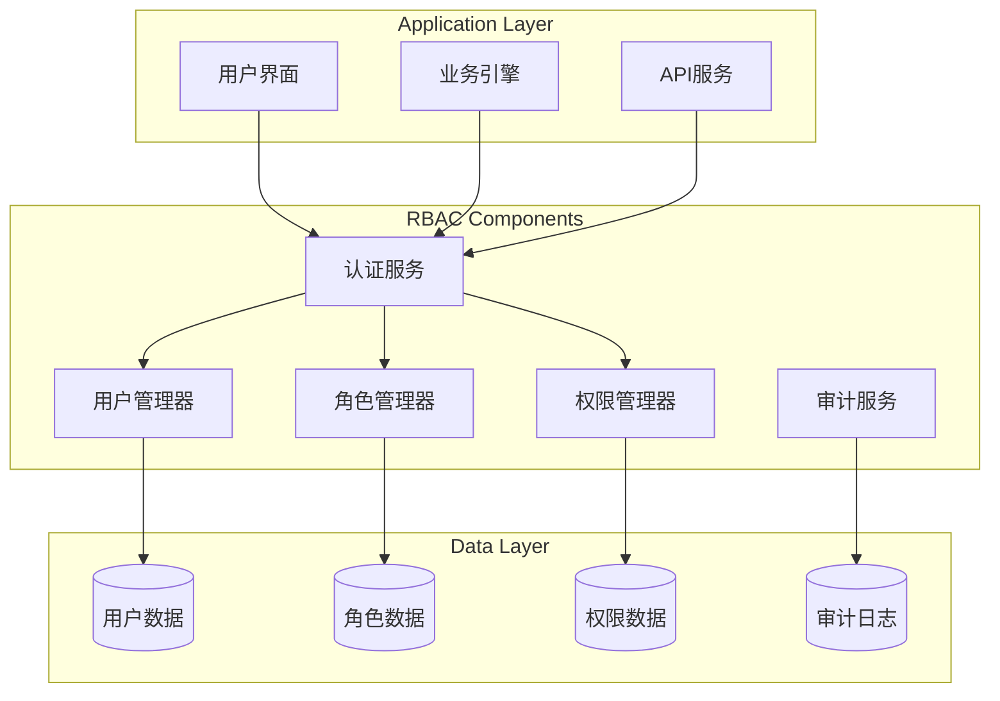
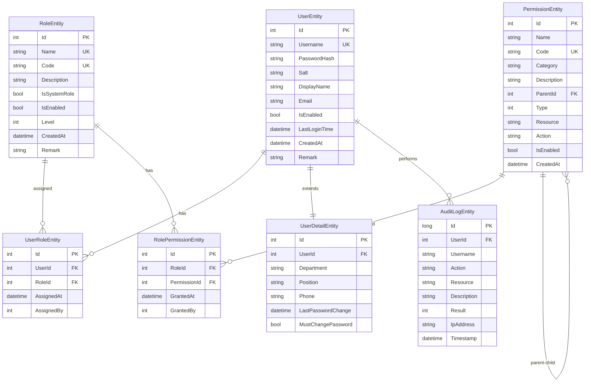
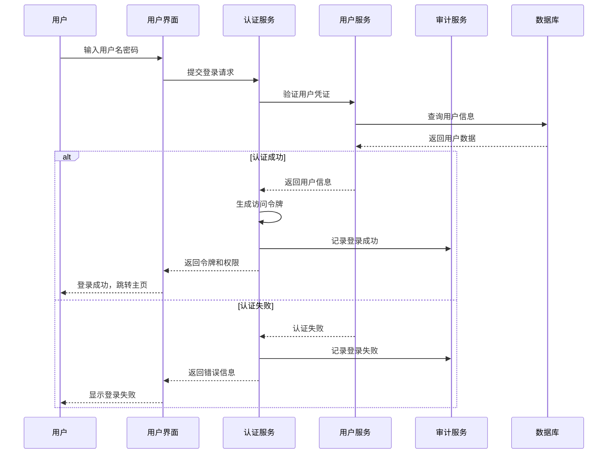
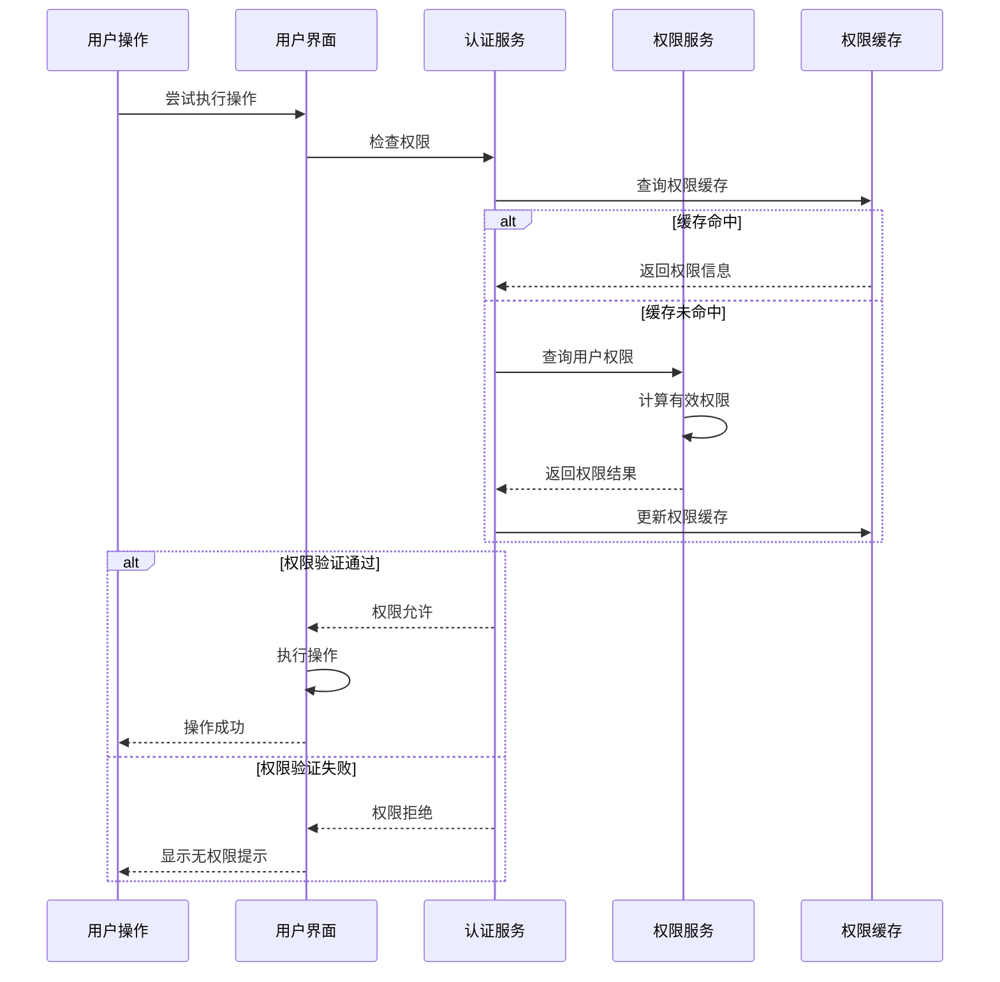
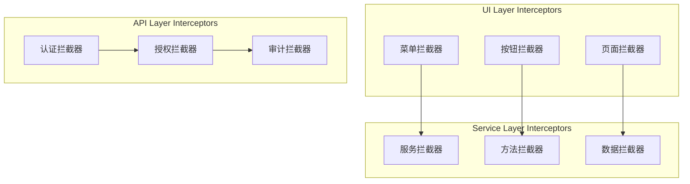
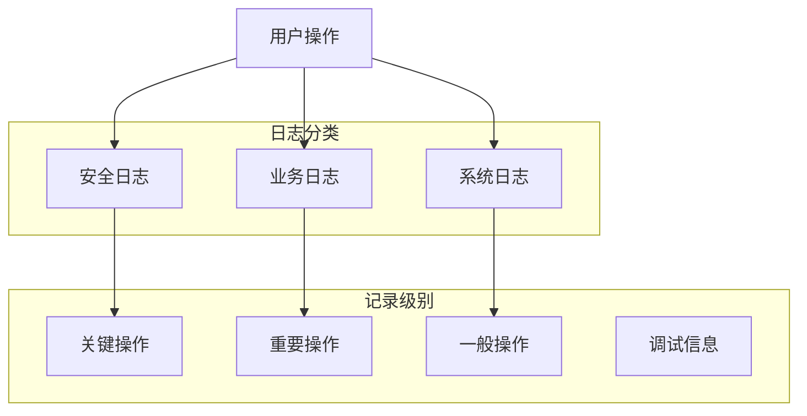

# RBAC Model

---
**Metadata:**
- Title: RBAC Model - Role-Based Access Control System
- Status: draft
- Updated: 2024-09-28
- Author: ColorVision Development Team
---

## 简介

本文档详细描述 ColorVision 系统的基于角色的访问控制（RBAC）模型，包括实体定义、关系结构、授权流程和权限拦截机制。

## 目录

1. [RBAC 概述](#rbac-概述)
2. [核心实体](#核心实体)
3. [实体关系模型](#实体关系模型)
4. [授权流程](#授权流程)
5. [权限拦截点](#权限拦截点)
6. [审计日志策略](#审计日志策略)
7. [实现细节](#实现细节)

## RBAC 概述

### 系统架构



### RBAC 模型特点

- **基于角色的访问控制**: 通过角色间接分配权限
- **最小权限原则**: 用户仅获得执行任务所需的最小权限
- **职责分离**: 敏感操作需要多个角色协作
- **动态权限管理**: 支持运行时权限变更
- **完整审计追踪**: 记录所有权限相关操作

## 核心实体

### User (用户实体)

```csharp
/// <summary>
/// 用户实体 - 系统使用者
/// </summary>
public class UserEntity
{
    public int Id { get; set; }
    
    /// <summary>用户名 - 唯一标识符</summary>
    public string Username { get; set; }
    
    /// <summary>密码哈希值</summary>
    public string PasswordHash { get; set; }
    
    /// <summary>盐值</summary>
    public string Salt { get; set; }
    
    /// <summary>显示名称</summary>
    public string DisplayName { get; set; }
    
    /// <summary>邮箱地址</summary>
    public string Email { get; set; }
    
    /// <summary>是否启用</summary>
    public bool IsEnabled { get; set; }
    
    /// <summary>最后登录时间</summary>
    public DateTime? LastLoginTime { get; set; }
    
    /// <summary>账户锁定到期时间</summary>
    public DateTime? LockoutEnd { get; set; }
    
    /// <summary>登录失败次数</summary>
    public int AccessFailedCount { get; set; }
    
    /// <summary>创建时间</summary>
    public DateTime CreatedAt { get; set; }
    
    /// <summary>更新时间</summary>
    public DateTime UpdatedAt { get; set; }
    
    /// <summary>备注信息</summary>
    public string Remark { get; set; }
    
    // 导航属性
    public virtual ICollection<UserRoleEntity> UserRoles { get; set; }
    public virtual UserDetailEntity UserDetail { get; set; }
}
```

### Role (角色实体)

```csharp
/// <summary>
/// 角色实体 - 权限集合的逻辑分组
/// </summary>
public class RoleEntity
{
    public int Id { get; set; }
    
    /// <summary>角色名称 - 唯一标识符</summary>
    public string Name { get; set; }
    
    /// <summary>角色代码 - 系统内部标识</summary>
    public string Code { get; set; }
    
    /// <summary>角色描述</summary>
    public string Description { get; set; }
    
    /// <summary>是否系统内置角色</summary>
    public bool IsSystemRole { get; set; }
    
    /// <summary>是否启用</summary>
    public bool IsEnabled { get; set; }
    
    /// <summary>角色级别 - 用于层级控制</summary>
    public int Level { get; set; }
    
    /// <summary>创建时间</summary>
    public DateTime CreatedAt { get; set; }
    
    /// <summary>更新时间</summary>
    public DateTime UpdatedAt { get; set; }
    
    /// <summary>备注信息</summary>
    public string Remark { get; set; }
    
    // 导航属性
    public virtual ICollection<UserRoleEntity> UserRoles { get; set; }
    public virtual ICollection<RolePermissionEntity> RolePermissions { get; set; }
}
```

### Permission (权限实体)

```csharp
/// <summary>
/// 权限实体 - 具体的操作授权
/// </summary>
public class PermissionEntity
{
    public int Id { get; set; }
    
    /// <summary>权限名称</summary>
    public string Name { get; set; }
    
    /// <summary>权限代码 - 系统内部标识</summary>
    public string Code { get; set; }
    
    /// <summary>权限分类</summary>
    public string Category { get; set; }
    
    /// <summary>权限描述</summary>
    public string Description { get; set; }
    
    /// <summary>父权限ID - 支持权限层次结构</summary>
    public int? ParentId { get; set; }
    
    /// <summary>权限类型</summary>
    public PermissionType Type { get; set; }
    
    /// <summary>资源标识符</summary>
    public string Resource { get; set; }
    
    /// <summary>操作类型</summary>
    public string Action { get; set; }
    
    /// <summary>是否启用</summary>
    public bool IsEnabled { get; set; }
    
    /// <summary>创建时间</summary>
    public DateTime CreatedAt { get; set; }
    
    // 导航属性
    public virtual PermissionEntity Parent { get; set; }
    public virtual ICollection<PermissionEntity> Children { get; set; }
    public virtual ICollection<RolePermissionEntity> RolePermissions { get; set; }
}

/// <summary>
/// 权限类型枚举
/// </summary>
public enum PermissionType
{
    /// <summary>菜单权限</summary>
    Menu = 1,
    
    /// <summary>功能权限</summary>
    Function = 2,
    
    /// <summary>数据权限</summary>
    Data = 3,
    
    /// <summary>接口权限</summary>
    Api = 4
}
```

### AuditLog (审计日志实体)

```csharp
/// <summary>
/// 审计日志实体 - 记录系统操作
/// </summary>
public class AuditLogEntity
{
    public long Id { get; set; }
    
    /// <summary>用户ID</summary>
    public int? UserId { get; set; }
    
    /// <summary>用户名</summary>
    public string Username { get; set; }
    
    /// <summary>操作类型</summary>
    public string Action { get; set; }
    
    /// <summary>资源标识</summary>
    public string Resource { get; set; }
    
    /// <summary>操作描述</summary>
    public string Description { get; set; }
    
    /// <summary>操作结果</summary>
    public AuditResult Result { get; set; }
    
    /// <summary>IP地址</summary>
    public string IpAddress { get; set; }
    
    /// <summary>用户代理</summary>
    public string UserAgent { get; set; }
    
    /// <summary>附加数据</summary>
    public string AdditionalData { get; set; }
    
    /// <summary>操作时间</summary>
    public DateTime Timestamp { get; set; }
}

public enum AuditResult
{
    Success = 1,
    Failed = 2,
    Denied = 3
}
```

## 实体关系模型

### ER 图



### 关系约束

1. **用户-角色关系**
   - 一个用户可以拥有多个角色
   - 一个角色可以分配给多个用户
   - 支持角色的有效期控制

2. **角色-权限关系**
   - 一个角色可以拥有多个权限
   - 一个权限可以分配给多个角色
   - 支持权限的继承关系

3. **权限层次结构**
   - 权限支持树形结构
   - 父权限包含子权限
   - 支持权限的级联操作

## 授权流程

### 用户认证流程



### 权限检查流程



## 权限拦截点

### 系统拦截点



### 拦截器实现

#### UI 层权限拦截

```csharp
/// <summary>
/// UI 权限拦截器
/// </summary>
public class UIPermissionInterceptor
{
    private readonly IPermissionService _permissionService;
    private readonly ICurrentUser _currentUser;
    
    public void InterceptMenuVisibility(Menu menu)
    {
        foreach (MenuItem item in menu.Items)
        {
            var permission = item.Tag?.ToString();
            if (!string.IsNullOrEmpty(permission))
            {
                item.Visibility = _permissionService
                    .HasPermission(_currentUser.Id, permission) 
                    ? Visibility.Visible 
                    : Visibility.Collapsed;
            }
        }
    }
    
    public void InterceptButtonEnabled(Button button, string permission)
    {
        button.IsEnabled = _permissionService
            .HasPermission(_currentUser.Id, permission);
    }
}
```

#### 服务层权限拦截

```csharp
/// <summary>
/// 服务层权限拦截器
/// </summary>
[AttributeUsage(AttributeTargets.Method | AttributeTargets.Class)]
public class RequirePermissionAttribute : Attribute
{
    public string Permission { get; }
    public string Resource { get; set; }
    public string Action { get; set; }
    
    public RequirePermissionAttribute(string permission)
    {
        Permission = permission;
    }
}

public class PermissionInterceptor : IInterceptor
{
    private readonly IPermissionService _permissionService;
    private readonly ICurrentUser _currentUser;
    private readonly IAuditService _auditService;
    
    public void Intercept(IInvocation invocation)
    {
        var attributes = invocation.Method.GetCustomAttributes<RequirePermissionAttribute>();
        
        foreach (var attr in attributes)
        {
            if (!_permissionService.HasPermission(_currentUser.Id, attr.Permission))
            {
                // 记录权限拒绝审计
                _auditService.LogAsync(new AuditLogEntity
                {
                    UserId = _currentUser.Id,
                    Username = _currentUser.Username,
                    Action = "Permission Denied",
                    Resource = attr.Resource ?? invocation.Method.Name,
                    Result = AuditResult.Denied,
                    Timestamp = DateTime.UtcNow
                });
                
                throw new UnauthorizedAccessException(
                    $"用户缺少权限: {attr.Permission}");
            }
        }
        
        invocation.Proceed();
    }
}
```

## 审计日志策略

### 日志记录策略



### 审计规则

| 操作类型 | 记录级别 | 保留期限 | 说明 |
|---------|----------|----------|------|
| 用户登录/登出 | 安全 | 1年 | 记录所有认证操作 |
| 权限变更 | 安全 | 永久 | 角色权限分配变更 |
| 敏感数据访问 | 业务 | 3年 | 重要数据的访问记录 |
| 系统配置变更 | 系统 | 1年 | 配置参数的修改 |
| 设备控制 | 业务 | 6个月 | 设备操作记录 |
| 算法执行 | 业务 | 3个月 | 算法模板执行记录 |

### 审计实现

```csharp
public class AuditService : IAuditService
{
    private readonly IDatabase _database;
    private readonly ILogger _logger;
    
    public async Task LogAsync(AuditLogEntity auditLog)
    {
        try
        {
            // 增强审计信息
            auditLog.IpAddress ??= GetClientIpAddress();
            auditLog.UserAgent ??= GetUserAgent();
            auditLog.Timestamp = DateTime.UtcNow;
            
            // 持久化审计日志
            await _database.InsertAsync(auditLog);
            
            // 实时监控告警
            if (auditLog.Result == AuditResult.Denied)
            {
                await CheckSecurityAlerts(auditLog);
            }
        }
        catch (Exception ex)
        {
            _logger.Error(ex, "Failed to save audit log");
        }
    }
    
    private async Task CheckSecurityAlerts(AuditLogEntity auditLog)
    {
        // 检查是否触发安全告警
        var recentFailures = await _database.QueryAsync<AuditLogEntity>(
            "SELECT COUNT(*) FROM AuditLogs WHERE UserId = @UserId " +
            "AND Result = @Result AND Timestamp > @Since",
            new { auditLog.UserId, Result = AuditResult.Denied, 
                  Since = DateTime.UtcNow.AddMinutes(-15) });
        
        if (recentFailures.Count() >= 5)
        {
            // 触发账户锁定
            await LockUserAccount(auditLog.UserId.Value);
            
            // 发送安全告警
            await SendSecurityAlert(auditLog);
        }
    }
}
```

## 实现细节

### RbacManager 核心实现

```csharp
public class RbacManager : IDisposable
{
    private static RbacManager _instance;
    private static readonly object Locker = new();
    
    public static RbacManager GetInstance()
    {
        if (_instance == null)
        {
            lock (Locker)
            {
                _instance ??= new RbacManager();
            }
        }
        return _instance;
    }
    
    private readonly SqlSugarClient _database;
    
    public AuthService AuthService { get; }
    public UserService UserService { get; }
    public PermissionService PermissionService { get; }
    public AuditLogService AuditLogService { get; }
    
    public RbacManager()
    {
        // 初始化数据库连接
        _database = new SqlSugarClient(new ConnectionConfig
        {
            ConnectionString = $"DataSource={SqliteDbPath};",
            DbType = DbType.Sqlite,
            IsAutoCloseConnection = true,
        });
        
        // 创建数据表
        InitializeTables();
        
        // 初始化服务
        AuthService = new AuthService(_database);
        UserService = new UserService(_database);
        PermissionService = new PermissionService(_database);
        AuditLogService = new AuditLogService(_database);
        
        // 创建默认管理员
        InitializeDefaultAdmin();
        
        // 初始化权限种子数据
        SeedPermissions();
    }
    
    private void InitializeTables()
    {
        _database.CodeFirst.InitTables<UserEntity, UserDetailEntity>();
        _database.CodeFirst.InitTables<TenantEntity, UserTenantEntity>();
        _database.CodeFirst.InitTables<RoleEntity, UserRoleEntity>();
        _database.CodeFirst.InitTables<PermissionEntity, RolePermissionEntity>();
        _database.CodeFirst.InitTables<AuditLogEntity>();
    }
}
```

### 权限服务实现

```csharp
public class PermissionService : IPermissionService
{
    private readonly SqlSugarClient _database;
    private readonly IMemoryCache _cache;
    
    public async Task<bool> HasPermissionAsync(int userId, string permission)
    {
        var cacheKey = $"user_permissions_{userId}";
        
        // 尝试从缓存获取
        if (_cache.TryGetValue(cacheKey, out HashSet<string> permissions))
        {
            return permissions.Contains(permission);
        }
        
        // 从数据库查询用户权限
        permissions = await GetUserPermissionsAsync(userId);
        
        // 缓存权限信息（15分钟过期）
        _cache.Set(cacheKey, permissions, TimeSpan.FromMinutes(15));
        
        return permissions.Contains(permission);
    }
    
    private async Task<HashSet<string>> GetUserPermissionsAsync(int userId)
    {
        var query = @"
            SELECT DISTINCT p.Code 
            FROM PermissionEntity p
            INNER JOIN RolePermissionEntity rp ON p.Id = rp.PermissionId
            INNER JOIN UserRoleEntity ur ON rp.RoleId = ur.RoleId
            WHERE ur.UserId = @UserId AND p.IsEnabled = 1";
        
        var permissions = await _database.Ado.SqlQueryAsync<string>(query, 
            new { UserId = userId });
        
        return new HashSet<string>(permissions);
    }
    
    public async Task InvalidateUserPermissionCache(int userId)
    {
        var cacheKey = $"user_permissions_{userId}";
        _cache.Remove(cacheKey);
    }
}
```

---

*最后更新: 2024-09-28 | 状态: draft*