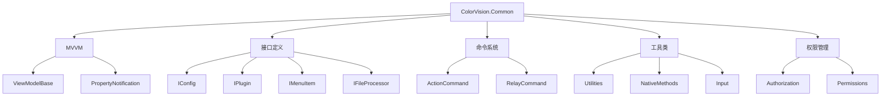

# ColorVision.Common

## 目录
1. [概述](#概述)
2. [核心功能](#核心功能)
3. [架构组件](#架构组件)
4. [接口定义](#接口定义)
5. [MVVM支持](#mvvm支持)
6. [命令模式](#命令模式)
7. [使用示例](#使用示例)

## 概述

**ColorVision.Common** 是整个 ColorVision 系统的基础组件库，提供了通用的框架基础设施。它定义了系统的核心抽象接口、MVVM 架构支持、命令模式实现以及各种通用工具类。

通用框架中的一些基础封装比如MVVM，ActionCommand,RelayCommand。提供对于整体框架下的接口封装，比如 IConfig,IConfigSetting,IMenuItem,IWizardStep,IFileProcessor,ISearch,Iinitalizer。

### 基本信息

- **版本**: 1.3.8.1
- **目标框架**: .NET 8.0 / .NET 6.0 Windows
- **技术栈**: WPF, Windows Forms
- **包类型**: NuGet 包支持

## 核心功能

### 1. MVVM 架构支持
- 提供完整的 MVVM 模式基础设施
- ViewModelBase 基类实现
- 属性变更通知机制
- 命令绑定支持

### 2. 命令模式实现
- ActionCommand 实现
- RelayCommand 支持
- 参数化命令处理

### 3. 接口定义系统
- 配置管理接口
- 插件系统接口
- UI 组件接口
- 文件处理接口

### 4. 通用工具类
- 输入处理工具
- 权限管理系统
- 本地化方法集合
- 算法工具类

## 架构组件



## 接口定义

### 配置管理接口

#### IConfig
定义配置对象的基本契约，提供配置的加载、保存和验证功能。

```csharp
public interface IConfig
{
    void Load();
    void Save();
    bool Validate();
    string ConfigPath { get; }
}
```

#### IConfigSetting
单个配置项的定义接口。

```csharp
public interface IConfigSetting
{
    string Key { get; }
    object DefaultValue { get; }
    Type ValueType { get; }
}
```

### 插件系统接口

#### IPlugin
插件的基础接口，定义插件的生命周期和基本信息。

```csharp
public interface IPlugin
{
    string Name { get; }
    string Version { get; }
    string Description { get; }
    void Initialize();
    void Shutdown();
}
```

### UI 组件接口

#### IMenuItem
菜单项接口，用于动态菜单系统。

```csharp
public interface IMenuItem
{
    string Name { get; }
    string Header { get; }
    object Icon { get; }
    ICommand Command { get; }
    IList<IMenuItem> Children { get; }
}
```

#### IWizardStep
向导步骤接口，用于构建多步骤向导。

```csharp
public interface IWizardStep
{
    string Title { get; }
    string Description { get; }
    bool IsValid { get; }
    bool CanGoNext();
    bool CanGoPrevious();
}
```

### 文件处理接口

#### IFileProcessor
文件处理器接口，支持不同类型文件的处理。

```csharp
public interface IFileProcessor
{
    string[] SupportedExtensions { get; }
    bool CanProcess(string filePath);
    Task<bool> ProcessAsync(string filePath);
}
```

#### ISearch
搜索功能接口，提供统一的搜索能力。

```csharp
public interface ISearch
{
    string SearchText { get; set; }
    bool CaseSensitive { get; set; }
    IEnumerable<object> Search();
}
```

#### IInitializer
初始化器接口，用于组件的启动初始化。

```csharp
public interface IInitializer
{
    int Priority { get; }
    Task InitializeAsync();
}
```

## MVVM支持

### ViewModelBase
提供 INotifyPropertyChanged 的基础实现：

```csharp
public abstract class ViewModelBase : INotifyPropertyChanged
{
    public event PropertyChangedEventHandler PropertyChanged;

    protected virtual void OnPropertyChanged([CallerMemberName] string propertyName = null)
    {
        PropertyChanged?.Invoke(this, new PropertyChangedEventArgs(propertyName));
    }

    protected bool SetProperty<T>(ref T backingStore, T value, [CallerMemberName] string propertyName = "")
    {
        if (EqualityComparer<T>.Default.Equals(backingStore, value))
            return false;

        backingStore = value;
        OnPropertyChanged(propertyName);
        return true;
    }
}
```

### 属性绑定支持
简化的属性绑定模式：

```csharp
public class SampleViewModel : ViewModelBase
{
    private string _title;
    public string Title
    {
        get => _title;
        set => SetProperty(ref _title, value);
    }
}
```

## 命令模式

### ActionCommand
简单的命令实现：

```csharp
public class ActionCommand : ICommand
{
    private readonly Action _execute;
    private readonly Func<bool> _canExecute;

    public ActionCommand(Action execute, Func<bool> canExecute = null)
    {
        _execute = execute ?? throw new ArgumentNullException(nameof(execute));
        _canExecute = canExecute;
    }

    public event EventHandler CanExecuteChanged
    {
        add { CommandManager.RequerySuggested += value; }
        remove { CommandManager.RequerySuggested -= value; }
    }

    public bool CanExecute(object parameter) => _canExecute?.Invoke() ?? true;
    public void Execute(object parameter) => _execute();
}
```

### RelayCommand
支持参数的命令实现：

```csharp
public class RelayCommand<T> : ICommand
{
    private readonly Action<T> _execute;
    private readonly Predicate<T> _canExecute;

    public RelayCommand(Action<T> execute, Predicate<T> canExecute = null)
    {
        _execute = execute ?? throw new ArgumentNullException(nameof(execute));
        _canExecute = canExecute;
    }

    public bool CanExecute(object parameter) => _canExecute?.Invoke((T)parameter) ?? true;
    public void Execute(object parameter) => _execute((T)parameter);
}
```

## 使用示例

### 1. 基础 ViewModel 创建

```csharp
public class MainViewModel : ViewModelBase
{
    private string _status;
    public string Status
    {
        get => _status;
        set => SetProperty(ref _status, value);
    }

    public ICommand SaveCommand { get; }
    public ICommand LoadCommand { get; }

    public MainViewModel()
    {
        SaveCommand = new ActionCommand(Save, CanSave);
        LoadCommand = new ActionCommand(Load);
    }

    private void Save()
    {
        // 保存逻辑
        Status = "已保存";
    }

    private bool CanSave() => !string.IsNullOrEmpty(Status);

    private void Load()
    {
        // 加载逻辑
        Status = "已加载";
    }
}
```

### 2. 配置管理实现

```csharp
public class AppConfig : IConfig
{
    public string ConfigPath => "config.json";
    
    public string Theme { get; set; } = "Light";
    public string Language { get; set; } = "zh-CN";
    
    public void Load()
    {
        if (File.Exists(ConfigPath))
        {
            var json = File.ReadAllText(ConfigPath);
            var config = JsonSerializer.Deserialize<AppConfig>(json);
            Theme = config.Theme;
            Language = config.Language;
        }
    }

    public void Save()
    {
        var json = JsonSerializer.Serialize(this, new JsonSerializerOptions { WriteIndented = true });
        File.WriteAllText(ConfigPath, json);
    }

    public bool Validate()
    {
        return !string.IsNullOrEmpty(Theme) && !string.IsNullOrEmpty(Language);
    }
}
```

### 3. 插件实现

```csharp
public class SamplePlugin : IPlugin
{
    public string Name => "Sample Plugin";
    public string Version => "1.0.0";
    public string Description => "示例插件";

    public void Initialize()
    {
        // 插件初始化逻辑
        Console.WriteLine($"{Name} 已初始化");
    }

    public void Shutdown()
    {
        // 插件关闭逻辑
        Console.WriteLine($"{Name} 已关闭");
    }
}
```

### 4. 文件处理器实现

```csharp
public class ImageProcessor : IFileProcessor
{
    public string[] SupportedExtensions => new[] { ".jpg", ".png", ".bmp", ".tiff" };

    public bool CanProcess(string filePath)
    {
        var ext = Path.GetExtension(filePath).ToLowerInvariant();
        return SupportedExtensions.Contains(ext);
    }

    public async Task<bool> ProcessAsync(string filePath)
    {
        try
        {
            // 图像处理逻辑
            await Task.Delay(100); // 模拟处理时间
            return true;
        }
        catch
        {
            return false;
        }
    }
}
```

## 最佳实践

1. **MVVM 模式**: 使用 ViewModelBase 基类确保属性变更通知
2. **命令绑定**: 使用 ActionCommand 和 RelayCommand 实现命令绑定
3. **接口设计**: 通过接口定义组件契约，提高系统的可测试性和可扩展性
4. **配置管理**: 实现 IConfig 接口统一配置管理方式
5. **插件架构**: 通过 IPlugin 接口实现插件化架构

## 依赖关系

ColorVision.Common 作为基础库，被其他所有组件依赖：

- ColorVision.UI 依赖 Common
- ColorVision.ImageEditor 依赖 Common
- 所有业务模块都依赖 Common

## 相关资源

- [MVVM 模式最佳实践](../developer-guide/mvvm-patterns/)
- [插件开发指南](../developer-guide/plugin-development/)
- [配置管理指南](../developer-guide/configuration-management/)
- [命令模式实现](../developer-guide/command-patterns/)