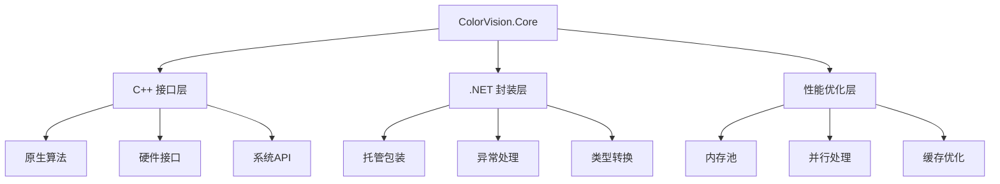

# ColorVision.Core

## 目录
1. [概述](#概述)
2. [核心功能](#核心功能)
3. [架构设计](#架构设计)
4. [接口封装](#接口封装)
5. [使用示例](#使用示例)
6. [性能考虑](#性能考虑)

## 概述

**ColorVision.Core** 是 ColorVision 系统的核心组件库，提供一些C++接口的封装和核心功能的实现。它作为底层技术栈的桥接层，为上层应用提供高性能的算法接口和系统级功能。

### 基本信息

- **主要功能**: C++ 接口封装、核心算法实现
- **技术栈**: C++/CLI, .NET Interop
- **特色功能**: 高性能计算、系统级操作
- **应用场景**: 图像处理、数值计算、硬件接口

## 核心功能

### 1. C++ 接口封装
- **互操作性**: .NET 与 C++ 代码的互操作
- **性能优化**: 关键算法的原生实现
- **内存管理**: 托管和非托管内存的协调
- **异常处理**: 跨语言异常处理机制

### 2. 算法接口
- **图像处理**: 高性能图像算法
- **数值计算**: 数学运算和统计分析
- **信号处理**: 数字信号处理算法
- **优化算法**: 搜索和优化算法

### 3. 系统接口
- **硬件访问**: 硬件设备的底层访问
- **系统调用**: Windows API 的封装
- **文件操作**: 高效的文件 I/O 操作
- **网络通信**: 底层网络协议实现

## 架构设计



## 接口封装

### 1. 图像处理接口

```csharp
public static class ImageProcessor
{
    [DllImport("ColorVisionCore.dll", CallingConvention = CallingConvention.Cdecl)]
    private static extern IntPtr ProcessImage(IntPtr imageData, int width, int height, int channels);
    
    public static unsafe byte[] ProcessImage(byte[] imageData, int width, int height, int channels = 3)
    {
        fixed (byte* ptr = imageData)
        {
            IntPtr result = ProcessImage(new IntPtr(ptr), width, height, channels);
            // 处理返回的结果
            return ConvertToManagedArray(result, width * height * channels);
        }
    }
}
```

### 2. 数学运算接口

```csharp
public static class MathUtils
{
    [DllImport("ColorVisionCore.dll")]
    private static extern double FastSin(double x);
    
    [DllImport("ColorVisionCore.dll")]
    private static extern double FastCos(double x);
    
    public static double Sin(double x) => FastSin(x);
    public static double Cos(double x) => FastCos(x);
}
```

### 3. 硬件接口封装

```csharp
public class HardwareInterface : IDisposable
{
    private IntPtr _handle;
    
    [DllImport("ColorVisionCore.dll")]
    private static extern IntPtr InitializeHardware();
    
    [DllImport("ColorVisionCore.dll")]
    private static extern bool WriteToHardware(IntPtr handle, byte[] data, int length);
    
    [DllImport("ColorVisionCore.dll")]
    private static extern int ReadFromHardware(IntPtr handle, byte[] buffer, int bufferSize);
    
    public HardwareInterface()
    {
        _handle = InitializeHardware();
        if (_handle == IntPtr.Zero)
            throw new InvalidOperationException("无法初始化硬件");
    }
    
    public bool Write(byte[] data)
    {
        return WriteToHardware(_handle, data, data.Length);
    }
    
    public byte[] Read(int bufferSize)
    {
        byte[] buffer = new byte[bufferSize];
        int bytesRead = ReadFromHardware(_handle, buffer, bufferSize);
        
        if (bytesRead <= 0) return new byte[0];
        
        Array.Resize(ref buffer, bytesRead);
        return buffer;
    }
    
    public void Dispose()
    {
        if (_handle != IntPtr.Zero)
        {
            CloseHardware(_handle);
            _handle = IntPtr.Zero;
        }
    }
    
    [DllImport("ColorVisionCore.dll")]
    private static extern void CloseHardware(IntPtr handle);
}
```

## 使用示例

### 1. 图像处理应用

```csharp
public class ImageProcessingService
{
    public byte[] EnhanceImage(byte[] originalImage, int width, int height)
    {
        try
        {
            // 使用 ColorVision.Core 的高性能图像处理
            return ImageProcessor.ProcessImage(originalImage, width, height);
        }
        catch (Exception ex)
        {
            // 异常处理
            throw new ImageProcessingException("图像处理失败", ex);
        }
    }
    
    public async Task<byte[]> EnhanceImageAsync(byte[] originalImage, int width, int height)
    {
        return await Task.Run(() => EnhanceImage(originalImage, width, height));
    }
}
```

### 2. 数值计算应用

```csharp
public class CalculationService
{
    public double[] CalculateFrequencySpectrum(double[] signal)
    {
        // 使用优化的 FFT 算法
        return CoreMath.FFT(signal);
    }
    
    public Matrix MultiplyMatrices(Matrix a, Matrix b)
    {
        // 使用优化的矩阵运算
        return CoreMath.MatrixMultiply(a, b);
    }
}
```

### 3. 硬件控制应用

```csharp
public class DeviceController : IDisposable
{
    private HardwareInterface _hardware;
    
    public DeviceController()
    {
        _hardware = new HardwareInterface();
    }
    
    public async Task\<bool\> SendCommandAsync(byte[] command)
    {
        return await Task.Run(() => _hardware.Write(command));
    }
    
    public async Task<byte[]> ReadDataAsync(int size)
    {
        return await Task.Run(() => _hardware.Read(size));
    }
    
    public void Dispose()
    {
        _hardware?.Dispose();
    }
}
```

## 性能考虑

### 1. 内存管理

```csharp
public class ManagedBuffer : IDisposable
{
    private IntPtr _nativeBuffer;
    private int _size;
    
    public ManagedBuffer(int size)
    {
        _size = size;
        _nativeBuffer = Marshal.AllocHGlobal(size);
    }
    
    public IntPtr Buffer => _nativeBuffer;
    public int Size => _size;
    
    public void Dispose()
    {
        if (_nativeBuffer != IntPtr.Zero)
        {
            Marshal.FreeHGlobal(_nativeBuffer);
            _nativeBuffer = IntPtr.Zero;
        }
    }
}
```

### 2. 并行处理

```csharp
public static class ParallelProcessor
{
    public static void ProcessInParallel\<T\>(T[] data, Action\<T\> processor)
    {
        Parallel.ForEach(data, new ParallelOptions
        {
            MaxDegreeOfParallelism = Environment.ProcessorCount
        }, processor);
    }
    
    public static TResult[] ProcessInParallel\<T, TResult\>(T[] data, Func\<T, TResult\> processor)
    {
        var results = new TResult[data.Length];
        
        Parallel.For(0, data.Length, i =>
        {
            results[i] = processor(data[i]);
        });
        
        return results;
    }
}
```

### 3. 缓存优化

```csharp
public class ResultCache\<TKey, TValue\>
{
    private readonly ConcurrentDictionary\\<TKey, TValue\> _cache = new();
    private readonly int _maxSize;
    
    public ResultCache(int maxSize = 1000)
    {
        _maxSize = maxSize;
    }
    
    public TValue GetOrCompute(TKey key, Func\<TKey, TValue\> factory)
    {
        return _cache.GetOrAdd(key, factory);
    }
    
    public void Clear()
    {
        if (_cache.Count > _maxSize)
        {
            _cache.Clear();
        }
    }
}
```

## 最佳实践

### 1. 异常处理
- 正确处理跨语言异常
- 实现适当的异常转换
- 提供有意义的错误信息

### 2. 资源管理
- 及时释放非托管资源
- 使用 IDisposable 模式
- 避免内存泄漏

### 3. 性能优化
- 最小化托管/非托管转换
- 使用内存池减少分配
- 合理使用并行处理

### 4. 类型安全
- 验证输入参数
- 正确处理指针操作
- 实现类型安全的包装

## 相关资源

- [性能优化指南](../developer-guide/performance-optimization/)
- [互操作性最佳实践](../developer-guide/interop-best-practices/)
- [内存管理指南](../developer-guide/memory-management/)
- [硬件接口开发](../developer-guide/hardware-interfaces/)