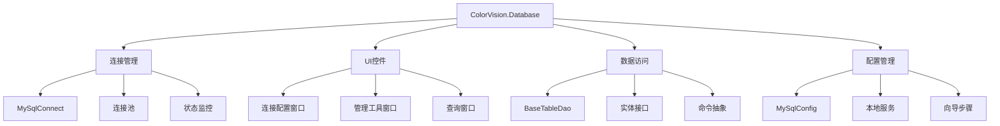

# ColorVision.Database

## 目录
1. [概述](#概述)
2. [核心功能](#核心功能)
3. [架构设计](#架构设计)
4. [主要组件](#主要组件)
5. [数据访问层](#数据访问层)
6. [UI控件](#ui控件)
7. [使用示例](#使用示例)
8. [配置管理](#配置管理)

## 概述

**ColorVision.Database** 是专门为 ColorVision 系统提供数据库功能的 UI 组件库，主要支持 MySQL 数据库的连接、配置、管理和操作。它提供了可视化的数据库管理界面，简化了数据库相关的开发和维护工作。

### 基本信息

- **主要功能**: 数据库连接管理、UI控件、查询工具
- **支持数据库**: MySQL, SQLite
- **UI 框架**: WPF
- **特色功能**: 可视化配置、本地服务管理、通用查询界面

## 核心功能

### 1. 数据库连接管理
- **MySQL 连接配置**: 可视化的连接参数设置
- **连接状态监控**: 实时连接状态检测和显示
- **连接池管理**: 高效的数据库连接复用
- **安全认证**: 支持用户名密码和高级安全选项

### 2. 可视化管理工具
- **数据库工具窗口**: 集成的管理界面
- **连接向导**: 分步式连接配置流程
- **查询工具**: 通用的SQL查询执行器
- **本地服务管理**: MySQL 本地服务的启停控制

### 3. 数据访问抽象
- **泛型 DAO**: 基于泛型的数据访问对象
- **实体映射**: ORM 支持和实体定义
- **事务管理**: 自动事务处理和回滚
- **SQL 日志**: SQLite 日志记录功能

## 架构设计



## 主要组件

### MySQL连接管理器

```csharp
public class MySqlConnect : Window
{
    public MySQLConfig Config { get; set; }
    
    public MySqlConnect()
    {
        InitializeComponent();
        Config = MySQLConfig.Instance;
        DataContext = Config;
    }
    
    private void TestConnection_Click(object sender, RoutedEventArgs e)
    {
        try
        {
            using var connection = MySqlControl.GetConnection();
            connection.Open();
            
            MessageBox.Show("数据库连接成功！", "连接测试", 
                          MessageBoxButton.OK, MessageBoxImage.Information);
        }
        catch (Exception ex)
        {
            MessageBox.Show($"数据库连接失败：{ex.Message}", "连接测试", 
                          MessageBoxButton.OK, MessageBoxImage.Error);
        }
    }
    
    private void SaveConfig_Click(object sender, RoutedEventArgs e)
    {
        try
        {
            Config.Save();
            MessageBox.Show("配置保存成功！", "保存配置", 
                          MessageBoxButton.OK, MessageBoxImage.Information);
        }
        catch (Exception ex)
        {
            MessageBox.Show($"配置保存失败：{ex.Message}", "保存配置", 
                          MessageBoxButton.OK, MessageBoxImage.Error);
        }
    }
}
```

### MySQL配置类

```csharp
public class MySQLConfig : IConfig
{
    public static MySQLConfig Instance { get; } = new MySQLConfig();
    
    private string _server = "localhost";
    public string Server
    {
        get => _server;
        set
        {
            _server = value;
            OnPropertyChanged();
            UpdateConnectionString();
        }
    }
    
    private int _port = 3306;
    public int Port
    {
        get => _port;
        set
        {
            _port = value;
            OnPropertyChanged();
            UpdateConnectionString();
        }
    }
    
    private string _database = "";
    public string Database
    {
        get => _database;
        set
        {
            _database = value;
            OnPropertyChanged();
            UpdateConnectionString();
        }
    }
    
    private string _username = "";
    public string Username
    {
        get => _username;
        set
        {
            _username = value;
            OnPropertyChanged();
            UpdateConnectionString();
        }
    }
    
    private string _password = "";
    public string Password
    {
        get => _password;
        set
        {
            _password = value;
            OnPropertyChanged();
            UpdateConnectionString();
        }
    }
    
    public string ConnectionString { get; private set; }
    
    private void UpdateConnectionString()
    {
        ConnectionString = $"Server={Server};Port={Port};Database={Database};" +
                         $"Uid={Username};Pwd={Password};CharSet=utf8mb4;" +
                         $"SslMode=None;AllowPublicKeyRetrieval=True;";
        OnPropertyChanged(nameof(ConnectionString));
    }
    
    public void Load()
    {
        var config = ConfigurationManager.AppSettings;
        Server = config["MySQL.Server"] ?? "localhost";
        Port = int.Parse(config["MySQL.Port"] ?? "3306");
        Database = config["MySQL.Database"] ?? "";
        Username = config["MySQL.Username"] ?? "";
        Password = EncryptionHelper.Decrypt(config["MySQL.Password"] ?? "");
    }
    
    public void Save()
    {
        var config = ConfigurationManager.OpenExeConfiguration(ConfigurationUserLevel.None);
        var settings = config.AppSettings.Settings;
        
        settings["MySQL.Server"].Value = Server;
        settings["MySQL.Port"].Value = Port.ToString();
        settings["MySQL.Database"].Value = Database;
        settings["MySQL.Username"].Value = Username;
        settings["MySQL.Password"].Value = EncryptionHelper.Encrypt(Password);
        
        config.Save(ConfigurationSaveMode.Modified);
        ConfigurationManager.RefreshSection("appSettings");
    }
    
    public event PropertyChangedEventHandler PropertyChanged;
    
    protected virtual void OnPropertyChanged([CallerMemberName] string propertyName = null)
    {
        PropertyChanged?.Invoke(this, new PropertyChangedEventArgs(propertyName));
    }
}
```

### MySQL控制类

```csharp
public static class MySqlControl
{
    private static readonly object LockObject = new object();
    private static MySqlConnection _connection;
    
    public static MySqlConnection GetConnection()
    {
        lock (LockObject)
        {
            if (_connection == null || _connection.State != ConnectionState.Open)
            {
                _connection?.Dispose();
                _connection = new MySqlConnection(MySQLConfig.Instance.ConnectionString);
            }
            return _connection;
        }
    }
    
    public static bool TestConnection()
    {
        try
        {
            using var connection = new MySqlConnection(MySQLConfig.Instance.ConnectionString);
            connection.Open();
            return true;
        }
        catch
        {
            return false;
        }
    }
    
    public static bool TestConnection(string connectionString)
    {
        try
        {
            using var connection = new MySqlConnection(connectionString);
            connection.Open();
            return true;
        }
        catch
        {
            return false;
        }
    }
    
    public static DataTable ExecuteQuery(string sql, Dictionary<string, object> parameters = null)
    {
        using var connection = GetConnection();
        using var command = new MySqlCommand(sql, connection);
        
        if (parameters != null)
        {
            foreach (var param in parameters)
            {
                command.Parameters.AddWithValue(param.Key, param.Value);
            }
        }
        
        using var adapter = new MySqlDataAdapter(command);
        var dataTable = new DataTable();
        adapter.Fill(dataTable);
        
        return dataTable;
    }
    
    public static int ExecuteNonQuery(string sql, Dictionary<string, object> parameters = null)
    {
        using var connection = GetConnection();
        using var command = new MySqlCommand(sql, connection);
        
        if (parameters != null)
        {
            foreach (var param in parameters)
            {
                command.Parameters.AddWithValue(param.Key, param.Value);
            }
        }
        
        if (connection.State != ConnectionState.Open)
            connection.Open();
            
        return command.ExecuteNonQuery();
    }
}
```

## 数据访问层

### 基础表DAO

```csharp
public abstract class BaseTableDao<T> where T : class, IEntity, new()
{
    protected readonly string ConnectionString;
    protected readonly string TableName;
    
    public BaseTableDao(string tableName)
    {
        ConnectionString = MySQLConfig.Instance.ConnectionString;
        TableName = tableName;
    }
    
    public virtual List<T> GetAll()
    {
        var sql = $"SELECT * FROM {TableName}";
        return ExecuteQuery(sql);
    }
    
    public virtual T GetById(int id)
    {
        var sql = $"SELECT * FROM {TableName} WHERE Id = @id";
        var parameters = new Dictionary<string, object> { { "@id", id } };
        return ExecuteQuery(sql, parameters).FirstOrDefault();
    }
    
    public virtual int Insert(T entity)
    {
        var properties = GetInsertProperties();
        var columns = string.Join(", ", properties.Select(p => p.Name));
        var values = string.Join(", ", properties.Select(p => "@" + p.Name));
        
        var sql = $"INSERT INTO {TableName} ({columns}) VALUES ({values})";
        var parameters = properties.ToDictionary(p => "@" + p.Name, p => p.GetValue(entity));
        
        return MySqlControl.ExecuteNonQuery(sql, parameters);
    }
    
    public virtual int Update(T entity)
    {
        var properties = GetUpdateProperties();
        var setClause = string.Join(", ", properties.Select(p => $"{p.Name} = @{p.Name}"));
        
        var sql = $"UPDATE {TableName} SET {setClause} WHERE Id = @Id";
        var parameters = properties.ToDictionary(p => "@" + p.Name, p => p.GetValue(entity));
        parameters["@Id"] = entity.Id;
        
        return MySqlControl.ExecuteNonQuery(sql, parameters);
    }
    
    public virtual int Delete(int id)
    {
        var sql = $"DELETE FROM {TableName} WHERE Id = @id";
        var parameters = new Dictionary<string, object> { { "@id", id } };
        
        return MySqlControl.ExecuteNonQuery(sql, parameters);
    }
    
    protected List<T> ExecuteQuery(string sql, Dictionary<string, object> parameters = null)
    {
        var dataTable = MySqlControl.ExecuteQuery(sql, parameters);
        return MapDataTableToEntities(dataTable);
    }
    
    protected virtual List<T> MapDataTableToEntities(DataTable dataTable)
    {
        var entities = new List<T>();
        var properties = typeof(T).GetProperties();
        
        foreach (DataRow row in dataTable.Rows)
        {
            var entity = new T();
            
            foreach (var property in properties)
            {
                if (dataTable.Columns.Contains(property.Name) && 
                    row[property.Name] != DBNull.Value)
                {
                    var value = Convert.ChangeType(row[property.Name], property.PropertyType);
                    property.SetValue(entity, value);
                }
            }
            
            entities.Add(entity);
        }
        
        return entities;
    }
    
    protected virtual PropertyInfo[] GetInsertProperties()
    {
        return typeof(T).GetProperties()
                       .Where(p => p.Name != "Id" && p.CanWrite)
                       .ToArray();
    }
    
    protected virtual PropertyInfo[] GetUpdateProperties()
    {
        return typeof(T).GetProperties()
                       .Where(p => p.Name != "Id" && p.CanWrite)
                       .ToArray();
    }
}
```

### 实体接口

```csharp
public interface IEntity
{
    int Id { get; set; }
}

// 示例实体
public class User : IEntity
{
    public int Id { get; set; }
    public string Username { get; set; }
    public string Email { get; set; }
    public DateTime CreatedAt { get; set; }
    public DateTime? UpdatedAt { get; set; }
    public bool IsActive { get; set; } = true;
}

// 用户DAO实现
public class UserDao : BaseTableDao<User>
{
    public UserDao() : base("users") { }
    
    public User GetByUsername(string username)
    {
        var sql = $"SELECT * FROM {TableName} WHERE Username = @username";
        var parameters = new Dictionary<string, object> { { "@username", username } };
        return ExecuteQuery(sql, parameters).FirstOrDefault();
    }
    
    public List<User> GetActiveUsers()
    {
        var sql = $"SELECT * FROM {TableName} WHERE IsActive = 1";
        return ExecuteQuery(sql);
    }
}
```

## UI控件

### 通用查询窗口

```csharp
public partial class GenericQueryWindow : Window
{
    public GenericQueryWindow()
    {
        InitializeComponent();
    }
    
    private void ExecuteQuery_Click(object sender, RoutedEventArgs e)
    {
        try
        {
            var sql = QueryTextBox.Text.Trim();
            if (string.IsNullOrEmpty(sql))
            {
                MessageBox.Show("请输入SQL查询语句", "提示", MessageBoxButton.OK, MessageBoxImage.Warning);
                return;
            }
            
            var dataTable = MySqlControl.ExecuteQuery(sql);
            ResultDataGrid.ItemsSource = dataTable.DefaultView;
            
            StatusLabel.Content = $"查询完成，返回 {dataTable.Rows.Count} 行记录";
        }
        catch (Exception ex)
        {
            MessageBox.Show($"查询失败：{ex.Message}", "错误", MessageBoxButton.OK, MessageBoxImage.Error);
            StatusLabel.Content = "查询失败";
        }
    }
    
    private void SaveResults_Click(object sender, RoutedEventArgs e)
    {
        if (ResultDataGrid.ItemsSource is DataView dataView)
        {
            var saveFileDialog = new SaveFileDialog
            {
                Filter = "CSV文件|*.csv|Excel文件|*.xlsx",
                Title = "保存查询结果"
            };
            
            if (saveFileDialog.ShowDialog() == true)
            {
                ExportDataToFile(dataView.Table, saveFileDialog.FileName);
            }
        }
    }
    
    private void ExportDataToFile(DataTable dataTable, string fileName)
    {
        var extension = Path.GetExtension(fileName).ToLowerInvariant();
        
        switch (extension)
        {
            case ".csv":
                ExportToCsv(dataTable, fileName);
                break;
            case ".xlsx":
                ExportToExcel(dataTable, fileName);
                break;
        }
    }
}
```

### MySQL本地服务管理器

```csharp
public class MySqlLocalServicesManager : ViewModelBase
{
    private string _mysqlPath;
    public string MySqlPath
    {
        get => _mysqlPath;
        set => SetProperty(ref _mysqlPath, value);
    }
    
    private bool _isRunning;
    public bool IsRunning
    {
        get => _isRunning;
        set => SetProperty(ref _isRunning, value);
    }
    
    public ICommand StartServiceCommand { get; }
    public ICommand StopServiceCommand { get; }
    public ICommand InstallServiceCommand { get; }
    public ICommand UninstallServiceCommand { get; }
    
    public MySqlLocalServicesManager()
    {
        StartServiceCommand = new RelayCommand(StartService, CanStartService);
        StopServiceCommand = new RelayCommand(StopService, CanStopService);
        InstallServiceCommand = new RelayCommand(InstallService);
        UninstallServiceCommand = new RelayCommand(UninstallService);
        
        CheckServiceStatus();
    }
    
    private void StartService()
    {
        try
        {
            var process = new Process
            {
                StartInfo = new ProcessStartInfo
                {
                    FileName = "net",
                    Arguments = "start mysql",
                    UseShellExecute = false,
                    RedirectStandardOutput = true,
                    CreateNoWindow = true
                }
            };
            
            process.Start();
            process.WaitForExit();
            
            if (process.ExitCode == 0)
            {
                IsRunning = true;
                MessageBox.Show("MySQL 服务启动成功", "服务管理", MessageBoxButton.OK, MessageBoxImage.Information);
            }
            else
            {
                MessageBox.Show("MySQL 服务启动失败", "服务管理", MessageBoxButton.OK, MessageBoxImage.Error);
            }
        }
        catch (Exception ex)
        {
            MessageBox.Show($"启动服务时发生错误：{ex.Message}", "错误", MessageBoxButton.OK, MessageBoxImage.Error);
        }
    }
    
    private void StopService()
    {
        try
        {
            var process = new Process
            {
                StartInfo = new ProcessStartInfo
                {
                    FileName = "net",
                    Arguments = "stop mysql",
                    UseShellExecute = false,
                    RedirectStandardOutput = true,
                    CreateNoWindow = true
                }
            };
            
            process.Start();
            process.WaitForExit();
            
            if (process.ExitCode == 0)
            {
                IsRunning = false;
                MessageBox.Show("MySQL 服务停止成功", "服务管理", MessageBoxButton.OK, MessageBoxImage.Information);
            }
            else
            {
                MessageBox.Show("MySQL 服务停止失败", "服务管理", MessageBoxButton.OK, MessageBoxImage.Error);
            }
        }
        catch (Exception ex)
        {
            MessageBox.Show($"停止服务时发生错误：{ex.Message}", "错误", MessageBoxButton.OK, MessageBoxImage.Error);
        }
    }
    
    private void CheckServiceStatus()
    {
        try
        {
            var services = ServiceController.GetServices();
            var mysqlService = services.FirstOrDefault(s => s.ServiceName.ToLowerInvariant().Contains("mysql"));
            
            IsRunning = mysqlService?.Status == ServiceControllerStatus.Running;
        }
        catch
        {
            IsRunning = false;
        }
    }
    
    private bool CanStartService() => !IsRunning;
    private bool CanStopService() => IsRunning;
}
```

## 使用示例

### 1. 基础数据库连接

```csharp
// 配置数据库连接
var config = MySQLConfig.Instance;
config.Server = "localhost";
config.Port = 3306;
config.Database = "colorvision_db";
config.Username = "admin";
config.Password = "password";
config.Save();

// 测试连接
if (MySqlControl.TestConnection())
{
    Console.WriteLine("数据库连接成功");
}
```

### 2. 使用DAO进行数据操作

```csharp
// 创建用户DAO
var userDao = new UserDao();

// 添加用户
var newUser = new User
{
    Username = "john_doe",
    Email = "john@example.com",
    CreatedAt = DateTime.Now
};

int result = userDao.Insert(newUser);
if (result > 0)
{
    Console.WriteLine("用户添加成功");
}

// 查询用户
var users = userDao.GetAll();
foreach (var user in users)
{
    Console.WriteLine($"用户：{user.Username}, 邮箱：{user.Email}");
}

// 更新用户
var userToUpdate = userDao.GetById(1);
if (userToUpdate != null)
{
    userToUpdate.Email = "john.new@example.com";
    userToUpdate.UpdatedAt = DateTime.Now;
    userDao.Update(userToUpdate);
}
```

### 3. 显示数据库管理窗口

```csharp
// 显示连接配置窗口
var connectWindow = new MySqlConnect();
if (connectWindow.ShowDialog() == true)
{
    // 连接配置完成
}

// 显示数据库工具窗口
var toolWindow = new MySqlToolWindow();
toolWindow.Show();

// 显示通用查询窗口
var queryWindow = new GenericQueryWindow();
queryWindow.Show();
```

### 4. 自定义数据实体和DAO

```csharp
// 定义产品实体
public class Product : IEntity
{
    public int Id { get; set; }
    public string Name { get; set; }
    public string Description { get; set; }
    public decimal Price { get; set; }
    public int CategoryId { get; set; }
    public DateTime CreatedAt { get; set; }
    public bool IsAvailable { get; set; } = true;
}

// 产品DAO
public class ProductDao : BaseTableDao<Product>
{
    public ProductDao() : base("products") { }
    
    public List<Product> GetByCategory(int categoryId)
    {
        var sql = $"SELECT * FROM {TableName} WHERE CategoryId = @categoryId AND IsAvailable = 1";
        var parameters = new Dictionary<string, object> { { "@categoryId", categoryId } };
        return ExecuteQuery(sql, parameters);
    }
    
    public List<Product> SearchByName(string name)
    {
        var sql = $"SELECT * FROM {TableName} WHERE Name LIKE @name AND IsAvailable = 1";
        var parameters = new Dictionary<string, object> { { "@name", $"%{name}%" } };
        return ExecuteQuery(sql, parameters);
    }
}
```

## 配置管理

### 向导步骤实现

```csharp
public class DatabaseWizardStep : IWizardStep
{
    public string Title => "数据库配置";
    public string Description => "配置数据库连接参数";
    
    private UserControl _stepContent;
    public UserControl StepContent
    {
        get
        {
            if (_stepContent == null)
            {
                _stepContent = new DatabaseConfigControl();
            }
            return _stepContent;
        }
    }
    
    public bool CanGoNext
    {
        get
        {
            // 验证数据库配置是否正确
            return MySqlControl.TestConnection();
        }
    }
    
    public bool CanGoPrevious => true;
    
    public bool Validate()
    {
        var config = MySQLConfig.Instance;
        
        if (string.IsNullOrEmpty(config.Server) ||
            string.IsNullOrEmpty(config.Database) ||
            string.IsNullOrEmpty(config.Username))
        {
            MessageBox.Show("请填写完整的数据库连接信息", "验证失败", 
                          MessageBoxButton.OK, MessageBoxImage.Warning);
            return false;
        }
        
        if (!MySqlControl.TestConnection())
        {
            MessageBox.Show("数据库连接测试失败，请检查连接参数", "连接失败", 
                          MessageBoxButton.OK, MessageBoxImage.Error);
            return false;
        }
        
        return true;
    }
}
```

### SQLite日志系统

```csharp
public class SqliteLog
{
    private readonly string _connectionString;
    private readonly string _logTableName = "application_logs";
    
    public SqliteLog(string dbPath)
    {
        _connectionString = $"Data Source={dbPath};Version=3;";
        InitializeLogTable();
    }
    
    private void InitializeLogTable()
    {
        var sql = $@"
            CREATE TABLE IF NOT EXISTS {_logTableName} (
                Id INTEGER PRIMARY KEY AUTOINCREMENT,
                Timestamp DATETIME DEFAULT CURRENT_TIMESTAMP,
                Level VARCHAR(10) NOT NULL,
                Message TEXT NOT NULL,
                Exception TEXT,
                Source VARCHAR(255)
            )";
            
        ExecuteNonQuery(sql);
    }
    
    public void Log(string level, string message, string exception = null, string source = null)
    {
        var sql = $@"
            INSERT INTO {_logTableName} (Level, Message, Exception, Source)
            VALUES (@level, @message, @exception, @source)";
            
        var parameters = new Dictionary<string, object>
        {
            { "@level", level },
            { "@message", message },
            { "@exception", exception },
            { "@source", source }
        };
        
        ExecuteNonQuery(sql, parameters);
    }
    
    public void LogInfo(string message, string source = null)
    {
        Log("INFO", message, null, source);
    }
    
    public void LogError(string message, Exception ex = null, string source = null)
    {
        Log("ERROR", message, ex?.ToString(), source);
    }
    
    public void LogWarning(string message, string source = null)
    {
        Log("WARNING", message, null, source);
    }
    
    private void ExecuteNonQuery(string sql, Dictionary<string, object> parameters = null)
    {
        using var connection = new SQLiteConnection(_connectionString);
        connection.Open();
        
        using var command = new SQLiteCommand(sql, connection);
        
        if (parameters != null)
        {
            foreach (var param in parameters)
            {
                command.Parameters.AddWithValue(param.Key, param.Value ?? DBNull.Value);
            }
        }
        
        command.ExecuteNonQuery();
    }
}
```

## 最佳实践

### 1. 连接管理
- 使用连接池避免频繁创建连接
- 及时释放数据库资源
- 实现连接超时和重试机制

### 2. 安全考虑
- 密码加密存储
- SQL注入防护
- 参数化查询使用

### 3. 性能优化
- 使用索引优化查询
- 分页处理大数据集
- 缓存常用查询结果

### 4. 错误处理
- 完善的异常处理机制
- 用户友好的错误信息
- 详细的日志记录

---

*ColorVision.Database 提供了完整的数据库管理功能，通过可视化界面和抽象的数据访问层，大大简化了数据库相关的开发工作。*