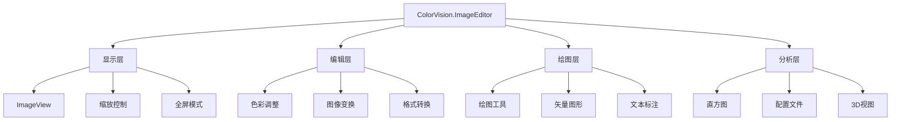

# ColorVision.ImageEditor

## 目录
1. [概述](#概述)
2. [核心功能](#核心功能)
3. [架构设计](#架构设计)
4. [主要组件](#主要组件)
5. [绘图工具](#绘图工具)
6. [图像处理功能](#图像处理功能)
7. [使用示例](#使用示例)
8. [扩展开发](#扩展开发)
9. [支持的操作](#支持的操作)
10. [性能优化建议](#性能优化建议)
11. [最佳实践](#最佳实践)
12. [改进建议](#改进建议)
13. [相关资源](#相关资源)

## 概述

**ColorVision.ImageEditor** 是一个功能完整的 WPF 图像编辑控件库，提供了专业级的图像显示、编辑、标注和分析功能。它支持多种图像格式，包括高精度的 RGB48 格式，并提供了丰富的绘图工具和图像处理算法。

基于UI和Core的图像展示控件，提供图像的展示，编辑，保存等功能。可以调整对比度，gamma，色调等功能，可以绘制图形，比如文字、矩形，圆，线，莫塞尔曲线等，可以删除或者编辑，可以保存为图片。

### 基本信息

- **版本**: 1.3.8.5
- **目标框架**: .NET 8.0 / .NET 6.0 Windows
- **UI 框架**: WPF
- **特色功能**: RGB48 支持、矢量绘图、图像分析、3D可视化
- **支持格式**: RGB48 及常见图像格式（PNG、JPG、BMP、TIFF、CVRAW、CVCIE）

## 核心功能

### 1. 图像显示与交互
- **多格式支持**: 支持常见图像格式和 RGB48 高精度格式
- **缩放与平移**: 流畅的缩放、平移和适配功能
- **全屏显示**: 沉浸式图像浏览体验
- **网格显示**: 像素级精确定位辅助

### 2. 图像编辑功能
- **色彩调整**: 对比度、Gamma、色调、饱和度调整
- **伪彩色显示**: 科学数据可视化支持
- **直方图分析**: 实时直方图显示和分析
- **配置文件剖析**: 像素数据分析工具

### 3. 绘图与标注工具
- **几何图形**: 矩形、圆形、线条、多边形
- **文本标注**: 自定义字体、颜色和样式
- **贝塞尔曲线**: 复杂路径绘制
- **测量工具**: 距离和角度测量

### 4. 3D 可视化
- **3D 图像视图**: 立体数据展示
- **CIE 色彩空间**: 色彩科学分析工具
- **深度数据处理**: 点云和深度图支持

## 支持的操作

### ✅ 已实现功能

1. **放大，缩小，指定比例，位置拖动** ✔
2. **绘制圆，椭圆，正方形，长方形** ✔
3. **支持不规则图形的绘制，支持贝塞尔曲线** ✔
4. **支持比例尺的操作，即图像中选中两个点，计算距离**
5. **支持比例显示，跟随窗口** ✔
6. **支持在关注点中显示文字（圆形中间显示参数，支持多条参数同时绘制）** ✔
7. **定位线** ✔
8. **支持定制显示关注点以及计算POI**

### 编辑功能增强

- 编辑功能支持选择窗口
- 重做右键菜单
- 选中和移动可以正常进行

## 架构设计



## 主要组件

### ImageView 主控件
核心显示控件，负责图像的渲染、交互和事件处理。

**主要功能：**
- 图像显示和缩放
- 鼠标交互处理
- 绘图工具集成
- 性能优化的渲染

### ImageViewModel
MVVM模式的视图模型，管理图像数据和用户界面状态。

**主要功能：**
- 图像数据管理
- 命令绑定
- 属性通知
- 状态同步

## 绘图工具

### 几何图形工具
- **矩形工具**: 支持填充和边框样式，可设置圆角
- **圆形工具**: 椭圆和正圆绘制，支持填充和描边
- **线条工具**: 直线、折线和箭头线
- **多边形工具**: 任意多边形区域绘制
- **贝塞尔工具**: 平滑曲线绘制和路径编辑
- **标尺工具**: 距离测量和比例尺显示

### 文本工具
- **文本标注**: 可编辑文本框
- **字体设置**: 字体、大小、颜色
- **对齐选项**: 左对齐、居中、右对齐

### 测量工具
- **距离测量**: 两点间距离计算
- **角度测量**: 角度计算和显示
- **面积测量**: 区域面积计算

## 图像处理功能

### 色彩调整
- **亮度/对比度**: 线性调整
- **Gamma校正**: 非线性色调调整
- **色调/饱和度**: HSV颜色空间调整
- **色彩平衡**: RGB通道独立调整

### 伪彩色映射
- **热力图**: 温度数据可视化
- **光谱映射**: 科学数据展示
- **自定义LUT**: 用户定义查找表

## 使用示例

### 1. 基础图像显示

```xml
<cv:ImageView x:Name="imageView" 
              Source="{Binding ImageSource}"
              ZoomMode="Fit"
              ShowGrid="True" />
```

### 2. 色彩调整功能

```csharp
imageView.ColorAdjustment.Brightness = 0.1;
imageView.ColorAdjustment.Contrast = 1.2;
imageView.ColorAdjustment.Gamma = 2.2;
```

### 3. 绘图工具使用

```csharp
// 启用矩形绘制工具
imageView.DrawingTool = DrawingToolType.Rectangle;
imageView.IsDrawingEnabled = true;

// 设置绘制样式
imageView.DrawingStyle.StrokeColor = Colors.Red;
imageView.DrawingStyle.StrokeThickness = 2;
```

### 4. 直方图分析

```csharp
// 获取直方图数据
var histogram = imageView.GetHistogram();
histogramView.DataSource = histogram;
```

### 5. 3D 可视化

```csharp
// 启用3D视图
imageView.Enable3DView = true;
imageView.View3D.SetViewAngle(45, 30);
```

## 扩展开发

### 自定义绘图工具

```csharp
public class CustomDrawingTool : IDrawingTool
{
    public string Name => "Custom Tool";
    public Cursor Cursor => Cursors.Cross;
    
    public void OnMouseDown(Point point) { /* 实现 */ }
    public void OnMouseMove(Point point) { /* 实现 */ }
    public void OnMouseUp(Point point) { /* 实现 */ }
}
```

### 自定义图像处理算法

```csharp
public class CustomImageProcessor : IImageProcessor
{
    public string Name => "Custom Filter";
    
    public ImageData Process(ImageData input)
    {
        // 自定义处理逻辑
        return processedImage;
    }
}
```

## 性能优化建议

1. **大图像处理**: 使用分块加载和虚拟化
2. **内存管理**: 及时释放不需要的图像资源
3. **GPU加速**: 利用硬件加速进行图像处理
4. **缓存策略**: 合理使用图像缓存机制

## 最佳实践

1. **MVVM模式**: 使用数据绑定和命令模式
2. **异步处理**: 大图像操作使用异步方法
3. **错误处理**: 完善的异常处理机制
4. **用户体验**: 提供进度指示和取消操作

## 改进建议

为了持续提升 ColorVision.ImageEditor 的质量和功能，我们制定了详细的改进计划。完整的改进建议文档包含以下内容：

### 📚 主要改进方向

1. **架构优化** 🔴
   - 依赖注入改造
   - 接口抽象设计
   - 命令模式改进

2. **性能优化** 🔴
   - 异步编程改进
   - 内存优化（对象池、弱引用缓存）
   - 渲染优化（虚拟化、GPU加速）

3. **代码质量** 🟡
   - 命名规范统一
   - 代码复用提升
   - SOLID原则应用

4. **功能增强** 🟢
   - 图层支持
   - 选区工具
   - AI功能集成

5. **用户体验** 🟡
   - 快捷键系统
   - 工具提示改进
   - 进度指示优化

6. **测试与质量保证** 🟡
   - 单元测试
   - 集成测试
   - 性能测试

7. **安全性** 🔴
   - 输入验证
   - 安全文件操作

### 📖 详细文档

完整的改进建议和实现方案请参考：
- [ColorVision.ImageEditor 改进建议](../../UI/ColorVision.ImageEditor/改进建议.md) - 详细的改进方案和代码示例

## 相关资源

- [API 参考文档](../developer-guide/api-reference/)
- [示例项目](../developer-guide/examples/)
- [故障排除](../troubleshooting/common-issues/)
- [改进建议详细文档](../../UI/ColorVision.ImageEditor/改进建议.md)