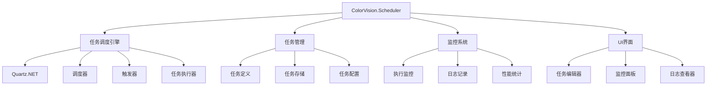

# ColorVision.Scheduler

## 目录
1. [概述](#概述)
2. [核心功能](#核心功能)
3. [架构设计](#架构设计)
4. [任务类型](#任务类型)
5. [使用示例](#使用示例)
6. [管理界面](#管理界面)
7. [最佳实践](#最佳实践)

## 概述

**ColorVision.Scheduler** 是基于UI的定时任务控件，使用Quartz.Net实现，提供定时任务的管理，执行，监控等功能。它为ColorVision系统提供了完整的任务调度解决方案，支持复杂的调度策略和任务监控。

### 基本信息

- **底层框架**: Quartz.NET
- **UI 框架**: WPF
- **特色功能**: 可视化任务管理、实时监控、灵活调度策略
- **应用场景**: 定时数据处理、系统维护、自动化测试

## 核心功能

### 1. 任务调度管理
- **Cron 表达式**: 支持复杂的时间调度规则
- **触发器管理**: 多种触发器类型支持
- **任务分组**: 按功能或类别组织任务
- **优先级控制**: 任务执行优先级设置

### 2. 任务执行监控
- **实时状态**: 查看任务执行状态
- **执行历史**: 详细的执行记录和日志
- **异常处理**: 任务失败时的处理策略
- **性能统计**: 任务执行时间和资源消耗统计

### 3. 任务管理界面
- **可视化编辑**: 图形界面创建和编辑任务
- **批量操作**: 批量启动、停止、删除任务
- **实时监控面板**: 任务执行状态实时显示
- **日志查看器**: 任务执行日志的查看和过滤

### 4. 集成支持
- **插件架构**: 支持自定义任务类型
- **事件通知**: 任务状态变更事件
- **API接口**: 编程方式管理任务
- **配置管理**: 任务配置的导入导出

## 架构设计



## 任务类型

### 1. 系统任务
- **数据备份**: 定期数据库备份
- **日志清理**: 清理过期日志文件
- **缓存清理**: 清理临时文件和缓存
- **系统检查**: 定期系统健康检查

### 2. 业务任务
- **数据同步**: 不同系统间的数据同步
- **报告生成**: 定期生成业务报告
- **数据处理**: 批量数据处理和转换
- **通知发送**: 定时发送通知和提醒

### 3. 维护任务
- **软件更新**: 自动检查和安装更新
- **配置同步**: 配置文件的同步和备份
- **性能优化**: 定期性能优化操作
- **安全扫描**: 定期安全检查和扫描

## 使用示例

### 1. 创建简单定时任务

```csharp
public class SimpleJob : IJob
{
    public async Task Execute(IJobExecutionContext context)
    {
        // 任务执行逻辑
        await Task.Run(() =>
        {
            // 具体的业务处理
            Console.WriteLine($"任务执行时间: {DateTime.Now}");
        });
    }
}

// 创建任务
var job = JobBuilder.Create<SimpleJob>()
    .WithIdentity("simpleJob", "group1")
    .Build();

// 创建触发器 - 每5分钟执行一次
var trigger = TriggerBuilder.Create()
    .WithIdentity("simpleTrigger", "group1")
    .WithCronSchedule("0 */5 * * * ?")
    .Build();

// 添加到调度器
await scheduler.ScheduleJob(job, trigger);
```

### 2. 使用Cron表达式

```csharp
// 每天凌晨2点执行
var dailyTrigger = TriggerBuilder.Create()
    .WithCronSchedule("0 0 2 * * ?")
    .Build();

// 每周一上午9点执行
var weeklyTrigger = TriggerBuilder.Create()
    .WithCronSchedule("0 0 9 ? * MON")
    .Build();

// 每月1号中午12点执行
var monthlyTrigger = TriggerBuilder.Create()
    .WithCronSchedule("0 0 12 1 * ?")
    .Build();
```

### 3. 任务监听器

```csharp
public class JobListener : IJobListener
{
    public string Name => "JobListener";

    public async Task JobToBeExecuted(IJobExecutionContext context, CancellationToken cancellationToken = default)
    {
        var jobName = context.JobDetail.Key.Name;
        Console.WriteLine($"任务 {jobName} 即将执行");
    }

    public async Task JobExecutionVetoed(IJobExecutionContext context, CancellationToken cancellationToken = default)
    {
        var jobName = context.JobDetail.Key.Name;
        Console.WriteLine($"任务 {jobName} 执行被否决");
    }

    public async Task JobWasExecuted(IJobExecutionContext context, JobExecutionException jobException, CancellationToken cancellationToken = default)
    {
        var jobName = context.JobDetail.Key.Name;
        if (jobException == null)
        {
            Console.WriteLine($"任务 {jobName} 执行成功");
        }
        else
        {
            Console.WriteLine($"任务 {jobName} 执行失败: {jobException.Message}");
        }
    }
}

// 注册监听器
scheduler.ListenerManager.AddJobListener(new JobListener());
```

### 4. 任务数据传递

```csharp
public class DataJob : IJob
{
    public async Task Execute(IJobExecutionContext context)
    {
        var jobDataMap = context.JobDetail.JobDataMap;
        var filePath = jobDataMap.GetString("FilePath");
        var batchSize = jobDataMap.GetInt("BatchSize");
        
        // 使用传入的参数执行任务
        await ProcessFile(filePath, batchSize);
    }
    
    private async Task ProcessFile(string filePath, int batchSize)
    {
        // 文件处理逻辑
    }
}

// 创建带数据的任务
var job = JobBuilder.Create<DataJob>()
    .WithIdentity("dataJob", "group1")
    .UsingJobData("FilePath", @"C:\data\input.csv")
    .UsingJobData("BatchSize", 1000)
    .Build();
```

## 管理界面

### 1. 任务列表视图

```xml
<DataGrid x:Name="JobsDataGrid" 
          ItemsSource="{Binding Jobs}"
          AutoGenerateColumns="False">
    <DataGrid.Columns>
        <DataGridTextColumn Header="任务名称" Binding="{Binding Name}"/>
        <DataGridTextColumn Header="组" Binding="{Binding Group}"/>
        <DataGridTextColumn Header="状态" Binding="{Binding State}"/>
        <DataGridTextColumn Header="下次执行" Binding="{Binding NextFireTime}"/>
        <DataGridTextColumn Header="上次执行" Binding="{Binding PreviousFireTime}"/>
        <DataGridTemplateColumn Header="操作">
            <DataGridTemplateColumn.CellTemplate>
                <DataTemplate>
                    <StackPanel Orientation="Horizontal">
                        <Button Content="启动" Command="{Binding StartCommand}"/>
                        <Button Content="暂停" Command="{Binding PauseCommand}"/>
                        <Button Content="停止" Command="{Binding StopCommand}"/>
                        <Button Content="删除" Command="{Binding DeleteCommand}"/>
                    </StackPanel>
                </DataTemplate>
            </DataGridTemplateColumn.CellTemplate>
        </DataGridTemplateColumn>
    </DataGrid.Columns>
</DataGrid>
```

### 2. 任务编辑窗口

```xml
<Window x:Class="JobEditorWindow">
    <Grid>
        <Grid.RowDefinitions>
            <RowDefinition Height="Auto"/>
            <RowDefinition Height="Auto"/>
            <RowDefinition Height="Auto"/>
            <RowDefinition Height="*"/>
            <RowDefinition Height="Auto"/>
        </Grid.RowDefinitions>
        
        <!-- 基本信息 -->
        <GroupBox Header="基本信息" Grid.Row="0">
            <Grid>
                <Grid.ColumnDefinitions>
                    <ColumnDefinition Width="Auto"/>
                    <ColumnDefinition Width="*"/>
                </Grid.ColumnDefinitions>
                
                <Label Content="任务名称:" Grid.Column="0"/>
                <TextBox Text="{Binding JobName}" Grid.Column="1"/>
            </Grid>
        </GroupBox>
        
        <!-- 调度设置 -->
        <GroupBox Header="调度设置" Grid.Row="1">
            <Grid>
                <Label Content="Cron表达式:"/>
                <TextBox Text="{Binding CronExpression}"/>
            </Grid>
        </GroupBox>
        
        <!-- 参数设置 -->
        <GroupBox Header="任务参数" Grid.Row="2">
            <DataGrid ItemsSource="{Binding JobData}"/>
        </GroupBox>
        
        <!-- 按钮 -->
        <StackPanel Orientation="Horizontal" Grid.Row="4" HorizontalAlignment="Right">
            <Button Content="保存" Command="{Binding SaveCommand}"/>
            <Button Content="取消" Command="{Binding CancelCommand}"/>
        </StackPanel>
    </Grid>
</Window>
```

### 3. 监控面板

```xml
<UserControl x:Class="SchedulerMonitorPanel">
    <Grid>
        <Grid.RowDefinitions>
            <RowDefinition Height="Auto"/>
            <RowDefinition Height="*"/>
        </Grid.RowDefinitions>
        
        <!-- 统计信息 -->
        <UniformGrid Rows="1" Columns="4" Grid.Row="0">
            <Border Background="LightBlue">
                <StackPanel HorizontalAlignment="Center">
                    <TextBlock Text="{Binding TotalJobs}" FontSize="24"/>
                    <TextBlock Text="总任务数"/>
                </StackPanel>
            </Border>
            
            <Border Background="LightGreen">
                <StackPanel HorizontalAlignment="Center">
                    <TextBlock Text="{Binding RunningJobs}" FontSize="24"/>
                    <TextBlock Text="运行中"/>
                </StackPanel>
            </Border>
            
            <Border Background="Yellow">
                <StackPanel HorizontalAlignment="Center">
                    <TextBlock Text="{Binding PausedJobs}" FontSize="24"/>
                    <TextBlock Text="已暂停"/>
                </StackPanel>
            </Border>
            
            <Border Background="LightCoral">
                <StackPanel HorizontalAlignment="Center">
                    <TextBlock Text="{Binding FailedJobs}" FontSize="24"/>
                    <TextBlock Text="失败"/>
                </StackPanel>
            </Border>
        </UniformGrid>
        
        <!-- 实时日志 -->
        <TextBox x:Name="LogTextBox" 
                 Grid.Row="1"
                 Text="{Binding LogContent}"
                 IsReadOnly="True"
                 VerticalScrollBarVisibility="Auto"
                 HorizontalScrollBarVisibility="Auto"/>
    </Grid>
</UserControl>
```

## 最佳实践

### 1. 任务设计原则
- **幂等性**: 任务应该是幂等的，重复执行不会产生副作用
- **异常处理**: 完善的异常处理和恢复机制
- **资源管理**: 合理使用系统资源，避免资源泄漏
- **状态检查**: 任务执行前检查系统状态

### 2. 调度策略
- **错峰执行**: 避免多个重要任务同时执行
- **依赖管理**: 处理任务间的依赖关系
- **失败重试**: 合理的重试策略和退避算法
- **负载均衡**: 在多实例环境中合理分配任务

### 3. 监控和维护
- **日志记录**: 详细记录任务执行过程
- **性能监控**: 监控任务执行时间和资源消耗
- **告警机制**: 及时发现和处理任务异常
- **定期维护**: 清理过期日志和数据

### 4. 安全考虑
- **权限控制**: 限制任务的执行权限
- **数据保护**: 保护敏感数据和配置
- **审计日志**: 记录任务管理操作
- **网络安全**: 在集群环境中确保通信安全

## 相关资源

- [Quartz.NET 官方文档](https://www.quartz-scheduler.net/documentation/)
- [任务调度最佳实践](../developer-guide/scheduler-best-practices/)
- [系统配置指南](../system-configuration/)
- [故障排除指南](../troubleshooting/)