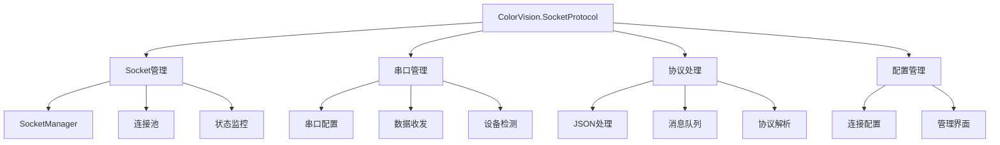

# ColorVision.SocketProtocol

## 目录
1. [概述](#概述)
2. [核心功能](#核心功能)
3. [架构设计](#架构设计)
4. [主要组件](#主要组件)
5. [通信协议](#通信协议)
6. [使用示例](#使用示例)

## 概述

**ColorVision.SocketProtocol** 是专门为 ColorVision 系统提供网络通信和串口通信功能的组件库。它封装了 Socket 通信、串口操作和网络协议处理，为系统提供了稳定可靠的通信基础设施。

### 基本信息

- **主要功能**: Socket通信、串口通信、协议处理
- **支持协议**: TCP、UDP、串口通信
- **特色功能**: 连接管理、协议解析、状态监控

## 核心功能

### 1. Socket 网络通信
- **TCP 连接**: 可靠的TCP连接管理
- **UDP 通信**: 无连接的UDP数据传输
- **连接池**: 高效的连接复用机制
- **断线重连**: 自动重连和故障恢复

### 2. 串口通信
- **串口枚举**: 自动检测可用串口
- **参数配置**: 波特率、数据位、停止位配置
- **数据收发**: 异步数据收发处理
- **流控制**: 硬件和软件流控制支持

### 3. 协议处理
- **JSON 协议**: 基于JSON的消息协议
- **自定义协议**: 支持用户自定义通信协议
- **消息队列**: 消息的缓存和队列处理
- **错误处理**: 通信错误的检测和处理

## 架构设计



## 主要组件

### SocketManager 连接管理器

```csharp
public class SocketManager
{
    private readonly Dictionary<string, ISocketConnection> _connections = new();
    private readonly object _lockObject = new object();
    
    public event EventHandler<ConnectionEventArgs> ConnectionStateChanged;
    public event EventHandler<DataReceivedEventArgs> DataReceived;
    
    public bool CreateConnection(string name, SocketConfig config)
    {
        lock (_lockObject)
        {
            if (_connections.ContainsKey(name))
                return false;
            
            var connection = config.Type switch
            {
                SocketType.TCP => new TcpConnection(config),
                SocketType.UDP => new UdpConnection(config),
                SocketType.Serial => new SerialConnection(config),
                _ => throw new NotSupportedException($"不支持的连接类型: {config.Type}")
            };
            
            connection.StateChanged += OnConnectionStateChanged;
            connection.DataReceived += OnDataReceived;
            
            _connections[name] = connection;
            return true;
        }
    }
    
    public bool Connect(string name)
    {
        lock (_lockObject)
        {
            if (_connections.TryGetValue(name, out var connection))
            {
                return connection.Connect();
            }
            return false;
        }
    }
    
    public void Disconnect(string name)
    {
        lock (_lockObject)
        {
            if (_connections.TryGetValue(name, out var connection))
            {
                connection.Disconnect();
            }
        }
    }
    
    public bool SendData(string name, byte[] data)
    {
        lock (_lockObject)
        {
            if (_connections.TryGetValue(name, out var connection))
            {
                return connection.SendData(data);
            }
            return false;
        }
    }
    
    public bool SendJson<T>(string name, T data)
    {
        try
        {
            var json = JsonSerializer.Serialize(data);
            var bytes = Encoding.UTF8.GetBytes(json);
            return SendData(name, bytes);
        }
        catch (Exception ex)
        {
            Console.WriteLine($"发送JSON数据失败: {ex.Message}");
            return false;
        }
    }
    
    private void OnConnectionStateChanged(object sender, ConnectionEventArgs e)
    {
        ConnectionStateChanged?.Invoke(sender, e);
    }
    
    private void OnDataReceived(object sender, DataReceivedEventArgs e)
    {
        DataReceived?.Invoke(sender, e);
    }
    
    public List<ConnectionInfo> GetConnections()
    {
        lock (_lockObject)
        {
            return _connections.Select(kvp => new ConnectionInfo
            {
                Name = kvp.Key,
                Type = kvp.Value.Config.Type,
                State = kvp.Value.State,
                Config = kvp.Value.Config
            }).ToList();
        }
    }
    
    public void Dispose()
    {
        lock (_lockObject)
        {
            foreach (var connection in _connections.Values)
            {
                connection.Dispose();
            }
            _connections.Clear();
        }
    }
}
```

### SocketConfig 连接配置

```csharp
public class SocketConfig
{
    public SocketType Type { get; set; }
    public string Host { get; set; }
    public int Port { get; set; }
    public string SerialPort { get; set; }
    public int BaudRate { get; set; } = 9600;
    public Parity Parity { get; set; } = Parity.None;
    public int DataBits { get; set; } = 8;
    public StopBits StopBits { get; set; } = StopBits.One;
    public int ReceiveTimeout { get; set; } = 5000;
    public int SendTimeout { get; set; } = 5000;
    public bool AutoReconnect { get; set; } = true;
    public int ReconnectInterval { get; set; } = 5000;
}

public enum SocketType
{
    TCP,
    UDP,
    Serial
}

public class ConnectionInfo
{
    public string Name { get; set; }
    public SocketType Type { get; set; }
    public ConnectionState State { get; set; }
    public SocketConfig Config { get; set; }
}

public enum ConnectionState
{
    Disconnected,
    Connecting,
    Connected,
    Reconnecting,
    Error
}
```

### TCP连接实现

```csharp
public class TcpConnection : ISocketConnection
{
    private TcpClient _tcpClient;
    private NetworkStream _stream;
    private readonly SocketConfig _config;
    private readonly CancellationTokenSource _cancellationTokenSource = new();
    
    public SocketConfig Config => _config;
    public ConnectionState State { get; private set; } = ConnectionState.Disconnected;
    
    public event EventHandler<ConnectionEventArgs> StateChanged;
    public event EventHandler<DataReceivedEventArgs> DataReceived;
    
    public TcpConnection(SocketConfig config)
    {
        _config = config;
    }
    
    public bool Connect()
    {
        try
        {
            SetState(ConnectionState.Connecting);
            
            _tcpClient = new TcpClient();
            _tcpClient.ReceiveTimeout = _config.ReceiveTimeout;
            _tcpClient.SendTimeout = _config.SendTimeout;
            
            _tcpClient.Connect(_config.Host, _config.Port);
            _stream = _tcpClient.GetStream();
            
            SetState(ConnectionState.Connected);
            
            // 启动数据接收线程
            Task.Run(ReceiveDataAsync, _cancellationTokenSource.Token);
            
            return true;
        }
        catch (Exception ex)
        {
            Console.WriteLine($"TCP连接失败: {ex.Message}");
            SetState(ConnectionState.Error);
            return false;
        }
    }
    
    public void Disconnect()
    {
        try
        {
            _cancellationTokenSource.Cancel();
            _stream?.Close();
            _tcpClient?.Close();
            
            SetState(ConnectionState.Disconnected);
        }
        catch (Exception ex)
        {
            Console.WriteLine($"TCP断开连接失败: {ex.Message}");
        }
    }
    
    public bool SendData(byte[] data)
    {
        try
        {
            if (_stream != null && _stream.CanWrite)
            {
                _stream.Write(data, 0, data.Length);
                return true;
            }
        }
        catch (Exception ex)
        {
            Console.WriteLine($"TCP发送数据失败: {ex.Message}");
            if (_config.AutoReconnect)
            {
                StartReconnect();
            }
        }
        
        return false;
    }
    
    private async Task ReceiveDataAsync()
    {
        var buffer = new byte[4096];
        
        while (!_cancellationTokenSource.Token.IsCancellationRequested)
        {
            try
            {
                if (_stream != null && _stream.CanRead)
                {
                    int bytesRead = await _stream.ReadAsync(buffer, 0, buffer.Length, _cancellationTokenSource.Token);
                    
                    if (bytesRead > 0)
                    {
                        var data = new byte[bytesRead];
                        Array.Copy(buffer, data, bytesRead);
                        
                        DataReceived?.Invoke(this, new DataReceivedEventArgs(data));
                    }
                    else
                    {
                        // 连接可能已断开
                        SetState(ConnectionState.Disconnected);
                        if (_config.AutoReconnect)
                        {
                            StartReconnect();
                        }
                        break;
                    }
                }
            }
            catch (Exception ex)
            {
                Console.WriteLine($"TCP接收数据失败: {ex.Message}");
                SetState(ConnectionState.Error);
                if (_config.AutoReconnect)
                {
                    StartReconnect();
                }
                break;
            }
        }
    }
    
    private void StartReconnect()
    {
        if (State == ConnectionState.Reconnecting) return;
        
        SetState(ConnectionState.Reconnecting);
        
        Task.Run(async () =>
        {
            while (!_cancellationTokenSource.Token.IsCancellationRequested)
            {
                await Task.Delay(_config.ReconnectInterval, _cancellationTokenSource.Token);
                
                if (Connect())
                {
                    break;
                }
            }
        });
    }
    
    private void SetState(ConnectionState state)
    {
        if (State != state)
        {
            State = state;
            StateChanged?.Invoke(this, new ConnectionEventArgs(state));
        }
    }
    
    public void Dispose()
    {
        Disconnect();
        _cancellationTokenSource.Dispose();
    }
}
```

### 串口连接实现

```csharp
public class SerialConnection : ISocketConnection
{
    private SerialPort _serialPort;
    private readonly SocketConfig _config;
    
    public SocketConfig Config => _config;
    public ConnectionState State { get; private set; } = ConnectionState.Disconnected;
    
    public event EventHandler<ConnectionEventArgs> StateChanged;
    public event EventHandler<DataReceivedEventArgs> DataReceived;
    
    public SerialConnection(SocketConfig config)
    {
        _config = config;
    }
    
    public bool Connect()
    {
        try
        {
            SetState(ConnectionState.Connecting);
            
            _serialPort = new SerialPort(_config.SerialPort)
            {
                BaudRate = _config.BaudRate,
                Parity = _config.Parity,
                DataBits = _config.DataBits,
                StopBits = _config.StopBits,
                ReadTimeout = _config.ReceiveTimeout,
                WriteTimeout = _config.SendTimeout
            };
            
            _serialPort.DataReceived += OnSerialDataReceived;
            _serialPort.Open();
            
            SetState(ConnectionState.Connected);
            return true;
        }
        catch (Exception ex)
        {
            Console.WriteLine($"串口连接失败: {ex.Message}");
            SetState(ConnectionState.Error);
            return false;
        }
    }
    
    public void Disconnect()
    {
        try
        {
            if (_serialPort != null && _serialPort.IsOpen)
            {
                _serialPort.DataReceived -= OnSerialDataReceived;
                _serialPort.Close();
            }
            
            SetState(ConnectionState.Disconnected);
        }
        catch (Exception ex)
        {
            Console.WriteLine($"串口断开连接失败: {ex.Message}");
        }
    }
    
    public bool SendData(byte[] data)
    {
        try
        {
            if (_serialPort != null && _serialPort.IsOpen)
            {
                _serialPort.Write(data, 0, data.Length);
                return true;
            }
        }
        catch (Exception ex)
        {
            Console.WriteLine($"串口发送数据失败: {ex.Message}");
        }
        
        return false;
    }
    
    private void OnSerialDataReceived(object sender, SerialDataReceivedEventArgs e)
    {
        try
        {
            var port = sender as SerialPort;
            if (port != null && port.IsOpen)
            {
                int bytesToRead = port.BytesToRead;
                if (bytesToRead > 0)
                {
                    var buffer = new byte[bytesToRead];
                    port.Read(buffer, 0, bytesToRead);
                    
                    DataReceived?.Invoke(this, new DataReceivedEventArgs(buffer));
                }
            }
        }
        catch (Exception ex)
        {
            Console.WriteLine($"串口接收数据失败: {ex.Message}");
        }
    }
    
    private void SetState(ConnectionState state)
    {
        if (State != state)
        {
            State = state;
            StateChanged?.Invoke(this, new ConnectionEventArgs(state));
        }
    }
    
    public static List<string> GetAvailablePorts()
    {
        return SerialPort.GetPortNames().ToList();
    }
    
    public void Dispose()
    {
        Disconnect();
        _serialPort?.Dispose();
    }
}
```

## 使用示例

### 1. TCP连接使用

```csharp
// 创建Socket管理器
var socketManager = new SocketManager();

// 配置TCP连接
var tcpConfig = new SocketConfig
{
    Type = SocketType.TCP,
    Host = "192.168.1.100",
    Port = 8080,
    AutoReconnect = true,
    ReconnectInterval = 5000
};

// 创建连接
socketManager.CreateConnection("device1", tcpConfig);

// 监听连接状态变化
socketManager.ConnectionStateChanged += (sender, e) =>
{
    Console.WriteLine($"连接状态改变: {e.State}");
};

// 监听数据接收
socketManager.DataReceived += (sender, e) =>
{
    var data = Encoding.UTF8.GetString(e.Data);
    Console.WriteLine($"接收到数据: {data}");
};

// 连接设备
if (socketManager.Connect("device1"))
{
    // 发送数据
    var message = "Hello Device";
    var data = Encoding.UTF8.GetBytes(message);
    socketManager.SendData("device1", data);
    
    // 发送JSON数据
    var jsonData = new { command = "status", timestamp = DateTime.Now };
    socketManager.SendJson("device1", jsonData);
}
```

### 2. 串口通信使用

```csharp
// 获取可用串口
var availablePorts = SerialConnection.GetAvailablePorts();
Console.WriteLine($"可用串口: {string.Join(", ", availablePorts)}");

// 配置串口连接
var serialConfig = new SocketConfig
{
    Type = SocketType.Serial,
    SerialPort = "COM3",
    BaudRate = 115200,
    Parity = Parity.None,
    DataBits = 8,
    StopBits = StopBits.One
};

// 创建连接
socketManager.CreateConnection("sensor1", serialConfig);

// 连接设备
if (socketManager.Connect("sensor1"))
{
    // 发送控制命令
    var command = Encoding.ASCII.GetBytes("READ_SENSOR\r\n");
    socketManager.SendData("sensor1", command);
}
```

### 3. JSON协议处理

```csharp
public class JsonProtocolHandler : ISocketJsonHandler
{
    public void HandleJsonMessage(string connectionName, JObject message)
    {
        var messageType = message["type"]?.ToString();
        
        switch (messageType)
        {
            case "response":
                HandleResponse(connectionName, message);
                break;
            case "notification":
                HandleNotification(connectionName, message);
                break;
            case "error":
                HandleError(connectionName, message);
                break;
            default:
                Console.WriteLine($"未知消息类型: {messageType}");
                break;
        }
    }
    
    private void HandleResponse(string connectionName, JObject message)
    {
        var requestId = message["requestId"]?.ToString();
        var result = message["result"];
        
        Console.WriteLine($"收到响应 [{connectionName}] ID:{requestId}, 结果:{result}");
    }
    
    private void HandleNotification(string connectionName, JObject message)
    {
        var eventName = message["event"]?.ToString();
        var data = message["data"];
        
        Console.WriteLine($"收到通知 [{connectionName}] 事件:{eventName}, 数据:{data}");
    }
    
    private void HandleError(string connectionName, JObject message)
    {
        var errorCode = message["code"]?.ToString();
        var errorMessage = message["message"]?.ToString();
        
        Console.WriteLine($"收到错误 [{connectionName}] 代码:{errorCode}, 消息:{errorMessage}");
    }
}
```

### 4. 连接管理窗口

```csharp
public partial class SocketManagerWindow : Window
{
    private readonly SocketManager _socketManager = new();
    
    public SocketManagerWindow()
    {
        InitializeComponent();
        
        // 设置数据源
        ConnectionsListView.ItemsSource = _socketManager.GetConnections();
        
        // 监听连接状态变化
        _socketManager.ConnectionStateChanged += OnConnectionStateChanged;
        _socketManager.DataReceived += OnDataReceived;
    }
    
    private void OnConnectionStateChanged(object sender, ConnectionEventArgs e)
    {
        Dispatcher.Invoke(() =>
        {
            // 刷新连接列表
            ConnectionsListView.Items.Refresh();
            
            // 更新状态显示
            StatusTextBlock.Text = $"连接状态: {e.State}";
        });
    }
    
    private void OnDataReceived(object sender, DataReceivedEventArgs e)
    {
        Dispatcher.Invoke(() =>
        {
            var data = Encoding.UTF8.GetString(e.Data);
            ReceivedDataTextBox.AppendText($"[{DateTime.Now}] {data}\n");
            ReceivedDataTextBox.ScrollToEnd();
        });
    }
    
    private void ConnectButton_Click(object sender, RoutedEventArgs e)
    {
        var selectedConnection = ConnectionsListView.SelectedItem as ConnectionInfo;
        if (selectedConnection != null)
        {
            _socketManager.Connect(selectedConnection.Name);
        }
    }
    
    private void DisconnectButton_Click(object sender, RoutedEventArgs e)
    {
        var selectedConnection = ConnectionsListView.SelectedItem as ConnectionInfo;
        if (selectedConnection != null)
        {
            _socketManager.Disconnect(selectedConnection.Name);
        }
    }
    
    private void SendButton_Click(object sender, RoutedEventArgs e)
    {
        var selectedConnection = ConnectionsListView.SelectedItem as ConnectionInfo;
        if (selectedConnection != null && !string.IsNullOrEmpty(SendDataTextBox.Text))
        {
            var data = Encoding.UTF8.GetBytes(SendDataTextBox.Text);
            _socketManager.SendData(selectedConnection.Name, data);
            
            SentDataTextBox.AppendText($"[{DateTime.Now}] {SendDataTextBox.Text}\n");
            SentDataTextBox.ScrollToEnd();
            
            SendDataTextBox.Clear();
        }
    }
}
```

## 最佳实践

1. **连接管理**: 合理设置连接超时和重连机制
2. **数据处理**: 实现完善的数据解析和错误处理
3. **线程安全**: 确保多线程环境下的数据安全
4. **资源释放**: 及时释放网络和串口资源
5. **协议设计**: 设计简洁高效的通信协议

---

*ColorVision.SocketProtocol 为 ColorVision 系统提供了稳定可靠的通信基础，支持多种通信方式和协议，满足不同场景的通信需求。*