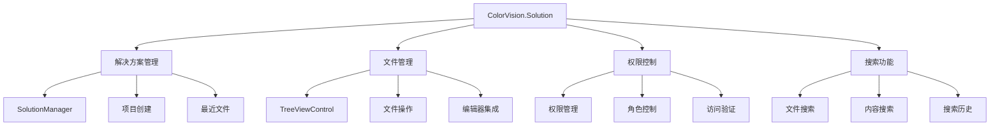

# ColorVision.Solution

## 目录
1. [概述](#概述)
2. [核心功能](#核心功能)
3. [架构设计](#架构设计)
4. [主要组件](#主要组件)
5. [文件管理](#文件管理)
6. [权限控制](#权限控制)
7. [使用示例](#使用示例)

## 概述

**ColorVision.Solution** 是 ColorVision 系统的解决方案管理组件，提供了项目和解决方案的创建、打开、管理功能。它类似于 Visual Studio 的解决方案资源管理器，为用户提供了层次化的项目文件管理界面和丰富的项目操作功能。

### 基本信息

- **主要功能**: 解决方案管理、项目文件管理、权限控制
- **UI 框架**: WPF TreeView
- **特色功能**: 文件树导航、最近文件、搜索功能、权限管理

## 核心功能

### 1. 解决方案管理
- **创建解决方案**: 新建项目解决方案
- **打开解决方案**: 加载现有项目文件
- **保存解决方案**: 自动保存项目状态
- **解决方案配置**: 项目参数和设置管理

### 2. 文件系统管理
- **文件树显示**: 层次化的文件和文件夹显示
- **文件操作**: 新建、重命名、删除文件和文件夹
- **拖拽支持**: 支持文件的拖拽操作
- **右键菜单**: 丰富的上下文菜单操作

### 3. 搜索功能
- **文件搜索**: 在项目中搜索文件
- **内容搜索**: 搜索文件内容
- **过滤器**: 支持文件类型和名称过滤
- **搜索历史**: 保存搜索历史记录

### 4. 权限管理
- **用户权限**: 基于角色的访问控制
- **文件权限**: 文件级别的权限管理
- **操作权限**: 对特定操作的权限控制

## 架构设计



## 主要组件

### SolutionManager 解决方案管理器

```csharp
public class SolutionManager : ViewModelBase
{
    private static readonly Lazy<SolutionManager> _instance = new(() => new SolutionManager());
    public static SolutionManager Instance => _instance.Value;
    
    private Solution _currentSolution;
    public Solution CurrentSolution
    {
        get => _currentSolution;
        set
        {
            SetProperty(ref _currentSolution, value);
            OnSolutionChanged();
        }
    }
    
    private readonly ObservableCollection<RecentSolution> _recentSolutions = new();
    public ReadOnlyObservableCollection<RecentSolution> RecentSolutions { get; }
    
    public event EventHandler<SolutionEventArgs> SolutionOpened;
    public event EventHandler<SolutionEventArgs> SolutionClosed;
    public event EventHandler<SolutionEventArgs> SolutionSaved;
    
    public ICommand NewSolutionCommand { get; }
    public ICommand OpenSolutionCommand { get; }
    public ICommand SaveSolutionCommand { get; }
    public ICommand CloseSolutionCommand { get; }
    
    private SolutionManager()
    {
        RecentSolutions = new ReadOnlyObservableCollection<RecentSolution>(_recentSolutions);
        
        NewSolutionCommand = new RelayCommand(NewSolution);
        OpenSolutionCommand = new RelayCommand(OpenSolution);
        SaveSolutionCommand = new RelayCommand(SaveSolution, CanSaveSolution);
        CloseSolutionCommand = new RelayCommand(CloseSolution, CanCloseSolution);
        
        LoadRecentSolutions();
    }
    
    public void NewSolution()
    {
        var dialog = new NewCreatWindow();
        if (dialog.ShowDialog() == true)
        {
            var solutionInfo = dialog.SolutionInfo;
            CreateNewSolution(solutionInfo);
        }
    }
    
    private void CreateNewSolution(SolutionInfo solutionInfo)
    {
        try
        {
            var solution = new Solution
            {
                Name = solutionInfo.Name,
                Description = solutionInfo.Description,
                FilePath = Path.Combine(solutionInfo.Location, solutionInfo.Name, $"{solutionInfo.Name}.cvs"),
                CreatedDate = DateTime.Now,
                LastModified = DateTime.Now
            };
            
            // 创建解决方案目录
            var solutionDir = Path.GetDirectoryName(solution.FilePath);
            if (!Directory.Exists(solutionDir))
            {
                Directory.CreateDirectory(solutionDir);
            }
            
            // 创建默认项目结构
            CreateDefaultProjectStructure(solution);
            
            // 保存解决方案文件
            SaveSolutionFile(solution);
            
            CurrentSolution = solution;
            AddToRecentSolutions(solution);
            
            SolutionOpened?.Invoke(this, new SolutionEventArgs(solution));
        }
        catch (Exception ex)
        {
            MessageBox.Show($"创建解决方案失败：{ex.Message}", "错误", MessageBoxButton.OK, MessageBoxImage.Error);
        }
    }
    
    public void OpenSolution()
    {
        var dialog = new OpenSolutionWindow();
        if (dialog.ShowDialog() == true)
        {
            var filePath = dialog.SelectedPath;
            OpenSolution(filePath);
        }
    }
    
    public void OpenSolution(string filePath)
    {
        try
        {
            if (!File.Exists(filePath))
            {
                MessageBox.Show("解决方案文件不存在", "错误", MessageBoxButton.OK, MessageBoxImage.Error);
                return;
            }
            
            var solution = LoadSolutionFile(filePath);
            CurrentSolution = solution;
            AddToRecentSolutions(solution);
            
            SolutionOpened?.Invoke(this, new SolutionEventArgs(solution));
        }
        catch (Exception ex)
        {
            MessageBox.Show($"打开解决方案失败：{ex.Message}", "错误", MessageBoxButton.OK, MessageBoxImage.Error);
        }
    }
    
    private void SaveSolution()
    {
        if (CurrentSolution != null)
        {
            try
            {
                SaveSolutionFile(CurrentSolution);
                CurrentSolution.LastModified = DateTime.Now;
                
                SolutionSaved?.Invoke(this, new SolutionEventArgs(CurrentSolution));
            }
            catch (Exception ex)
            {
                MessageBox.Show($"保存解决方案失败：{ex.Message}", "错误", MessageBoxButton.OK, MessageBoxImage.Error);
            }
        }
    }
    
    private void CloseSolution()
    {
        if (CurrentSolution != null)
        {
            var solution = CurrentSolution;
            
            // 检查是否有未保存的更改
            if (HasUnsavedChanges())
            {
                var result = MessageBox.Show("解决方案有未保存的更改，是否保存？", "确认", 
                                           MessageBoxButton.YesNoCancel, MessageBoxImage.Question);
                
                switch (result)
                {
                    case MessageBoxResult.Yes:
                        SaveSolution();
                        break;
                    case MessageBoxResult.Cancel:
                        return;
                }
            }
            
            CurrentSolution = null;
            SolutionClosed?.Invoke(this, new SolutionEventArgs(solution));
        }
    }
    
    private void SaveSolutionFile(Solution solution)
    {
        var json = JsonSerializer.Serialize(solution, new JsonSerializerOptions
        {
            WriteIndented = true,
            PropertyNamingPolicy = JsonNamingPolicy.CamelCase
        });
        
        File.WriteAllText(solution.FilePath, json, Encoding.UTF8);
    }
    
    private Solution LoadSolutionFile(string filePath)
    {
        var json = File.ReadAllText(filePath, Encoding.UTF8);
        var solution = JsonSerializer.Deserialize<Solution>(json, new JsonSerializerOptions
        {
            PropertyNamingPolicy = JsonNamingPolicy.CamelCase
        });
        
        solution.FilePath = filePath;
        return solution;
    }
    
    private void CreateDefaultProjectStructure(Solution solution)
    {
        var solutionDir = Path.GetDirectoryName(solution.FilePath);
        
        // 创建默认文件夹结构
        var folders = new[] { "Assets", "Data", "Scripts", "Configs", "Output" };
        
        foreach (var folder in folders)
        {
            var folderPath = Path.Combine(solutionDir, folder);
            Directory.CreateDirectory(folderPath);
            
            solution.Items.Add(new SolutionItem
            {
                Name = folder,
                Type = SolutionItemType.Folder,
                Path = folderPath,
                IsExpanded = true
            });
        }
    }
    
    private void AddToRecentSolutions(Solution solution)
    {
        // 移除已存在的记录
        var existing = _recentSolutions.FirstOrDefault(r => r.FilePath == solution.FilePath);
        if (existing != null)
        {
            _recentSolutions.Remove(existing);
        }
        
        // 添加到顶部
        _recentSolutions.Insert(0, new RecentSolution
        {
            Name = solution.Name,
            FilePath = solution.FilePath,
            LastOpenTime = DateTime.Now
        });
        
        // 保持最近文件列表不超过10个
        while (_recentSolutions.Count > 10)
        {
            _recentSolutions.RemoveAt(_recentSolutions.Count - 1);
        }
        
        SaveRecentSolutions();
    }
    
    private void LoadRecentSolutions()
    {
        var configPath = Path.Combine(Environment.GetFolderPath(Environment.SpecialFolder.ApplicationData),
                                     "ColorVision", "RecentSolutions.json");
        
        if (File.Exists(configPath))
        {
            try
            {
                var json = File.ReadAllText(configPath);
                var recentSolutions = JsonSerializer.Deserialize<List<RecentSolution>>(json);
                
                _recentSolutions.Clear();
                foreach (var item in recentSolutions)
                {
                    _recentSolutions.Add(item);
                }
            }
            catch (Exception ex)
            {
                Console.WriteLine($"加载最近解决方案失败：{ex.Message}");
            }
        }
    }
    
    private void SaveRecentSolutions()
    {
        try
        {
            var configDir = Path.Combine(Environment.GetFolderPath(Environment.SpecialFolder.ApplicationData), "ColorVision");
            if (!Directory.Exists(configDir))
            {
                Directory.CreateDirectory(configDir);
            }
            
            var configPath = Path.Combine(configDir, "RecentSolutions.json");
            var json = JsonSerializer.Serialize(_recentSolutions.ToList(), new JsonSerializerOptions
            {
                WriteIndented = true
            });
            
            File.WriteAllText(configPath, json);
        }
        catch (Exception ex)
        {
            Console.WriteLine($"保存最近解决方案失败：{ex.Message}");
        }
    }
    
    private bool HasUnsavedChanges()
    {
        // 检查解决方案是否有未保存的更改
        return CurrentSolution?.HasUnsavedChanges ?? false;
    }
    
    private bool CanSaveSolution() => CurrentSolution != null;
    private bool CanCloseSolution() => CurrentSolution != null;
    
    private void OnSolutionChanged()
    {
        CommandManager.InvalidateRequerySuggested();
    }
}
```

### Solution 解决方案类

```csharp
public class Solution
{
    public string Name { get; set; }
    public string Description { get; set; }
    public string FilePath { get; set; }
    public DateTime CreatedDate { get; set; }
    public DateTime LastModified { get; set; }
    public string Version { get; set; } = "1.0.0";
    public ObservableCollection<SolutionItem> Items { get; set; } = new();
    public Dictionary<string, object> Properties { get; set; } = new();
    
    [JsonIgnore]
    public bool HasUnsavedChanges { get; set; }
    
    public string SolutionDirectory => Path.GetDirectoryName(FilePath);
}

public class SolutionItem : ViewModelBase
{
    private string _name;
    public string Name
    {
        get => _name;
        set => SetProperty(ref _name, value);
    }
    
    private SolutionItemType _type;
    public SolutionItemType Type
    {
        get => _type;
        set => SetProperty(ref _type, value);
    }
    
    private string _path;
    public string Path
    {
        get => _path;
        set => SetProperty(ref _path, value);
    }
    
    private bool _isExpanded;
    public bool IsExpanded
    {
        get => _isExpanded;
        set => SetProperty(ref _isExpanded, value);
    }
    
    private bool _isSelected;
    public bool IsSelected
    {
        get => _isSelected;
        set => SetProperty(ref _isSelected, value);
    }
    
    public ObservableCollection<SolutionItem> Children { get; set; } = new();
    
    public string Icon => Type switch
    {
        SolutionItemType.Folder => "📁",
        SolutionItemType.File => GetFileIcon(),
        SolutionItemType.Project => "📋",
        _ => "📄"
    };
    
    private string GetFileIcon()
    {
        var extension = System.IO.Path.GetExtension(Path)?.ToLowerInvariant();
        return extension switch
        {
            ".cs" => "🔷",
            ".xaml" => "🎨",
            ".json" => "🔧",
            ".xml" => "📄",
            ".txt" => "📄",
            ".log" => "📋",
            ".config" => "⚙️",
            _ => "📄"
        };
    }
}

public enum SolutionItemType
{
    Folder,
    File,
    Project
}

public class RecentSolution
{
    public string Name { get; set; }
    public string FilePath { get; set; }
    public DateTime LastOpenTime { get; set; }
}
```

### TreeViewControl 文件树控件

```csharp
public partial class TreeViewControl : UserControl
{
    public static readonly DependencyProperty SolutionProperty =
        DependencyProperty.Register(nameof(Solution), typeof(Solution), typeof(TreeViewControl),
            new PropertyMetadata(null, OnSolutionChanged));
    
    public Solution Solution
    {
        get => (Solution)GetValue(SolutionProperty);
        set => SetValue(SolutionProperty, value);
    }
    
    public event EventHandler<ItemSelectedEventArgs> ItemSelected;
    public event EventHandler<ItemActionEventArgs> ItemDoubleClicked;
    
    public TreeViewControl()
    {
        InitializeComponent();
    }
    
    private static void OnSolutionChanged(DependencyObject d, DependencyPropertyChangedEventArgs e)
    {
        if (d is TreeViewControl control)
        {
            control.RefreshTree();
        }
    }
    
    private void RefreshTree()
    {
        SolutionTreeView.Items.Clear();
        
        if (Solution != null)
        {
            foreach (var item in Solution.Items)
            {
                var treeViewItem = CreateTreeViewItem(item);
                SolutionTreeView.Items.Add(treeViewItem);
            }
        }
    }
    
    private TreeViewItem CreateTreeViewItem(SolutionItem solutionItem)
    {
        var treeViewItem = new TreeViewItem
        {
            Header = CreateItemHeader(solutionItem),
            Tag = solutionItem,
            IsExpanded = solutionItem.IsExpanded
        };
        
        // 添加子项
        foreach (var child in solutionItem.Children)
        {
            var childItem = CreateTreeViewItem(child);
            treeViewItem.Items.Add(childItem);
        }
        
        // 为文件夹添加虚拟子项以支持延迟加载
        if (solutionItem.Type == SolutionItemType.Folder && solutionItem.Children.Count == 0)
        {
            LoadFolderContents(solutionItem);
        }
        
        return treeViewItem;
    }
    
    private FrameworkElement CreateItemHeader(SolutionItem item)
    {
        var panel = new StackPanel { Orientation = Orientation.Horizontal };
        
        // 图标
        var icon = new TextBlock
        {
            Text = item.Icon,
            Margin = new Thickness(0, 0, 5, 0),
            VerticalAlignment = VerticalAlignment.Center
        };
        panel.Children.Add(icon);
        
        // 名称
        var name = new TextBlock
        {
            Text = item.Name,
            VerticalAlignment = VerticalAlignment.Center
        };
        panel.Children.Add(name);
        
        return panel;
    }
    
    private void LoadFolderContents(SolutionItem folderItem)
    {
        if (!Directory.Exists(folderItem.Path)) return;
        
        try
        {
            // 加载子文件夹
            var directories = Directory.GetDirectories(folderItem.Path);
            foreach (var dir in directories)
            {
                var dirInfo = new DirectoryInfo(dir);
                if ((dirInfo.Attributes & FileAttributes.Hidden) == 0)
                {
                    var childItem = new SolutionItem
                    {
                        Name = dirInfo.Name,
                        Type = SolutionItemType.Folder,
                        Path = dir
                    };
                    folderItem.Children.Add(childItem);
                }
            }
            
            // 加载文件
            var files = Directory.GetFiles(folderItem.Path);
            foreach (var file in files)
            {
                var fileInfo = new FileInfo(file);
                if ((fileInfo.Attributes & FileAttributes.Hidden) == 0)
                {
                    var childItem = new SolutionItem
                    {
                        Name = fileInfo.Name,
                        Type = SolutionItemType.File,
                        Path = file
                    };
                    folderItem.Children.Add(childItem);
                }
            }
        }
        catch (Exception ex)
        {
            Console.WriteLine($"加载文件夹内容失败：{ex.Message}");
        }
    }
    
    private void TreeViewItem_Selected(object sender, RoutedPropertyChangedEventArgs<object> e)
    {
        if (e.NewValue is TreeViewItem item && item.Tag is SolutionItem solutionItem)
        {
            ItemSelected?.Invoke(this, new ItemSelectedEventArgs(solutionItem));
        }
    }
    
    private void TreeViewItem_MouseDoubleClick(object sender, MouseButtonEventArgs e)
    {
        if (sender is TreeViewItem item && item.Tag is SolutionItem solutionItem)
        {
            ItemDoubleClicked?.Invoke(this, new ItemActionEventArgs(solutionItem, "DoubleClick"));
            e.Handled = true;
        }
    }
    
    private void TreeViewItem_ContextMenuOpening(object sender, ContextMenuEventArgs e)
    {
        if (sender is TreeViewItem item && item.Tag is SolutionItem solutionItem)
        {
            var contextMenu = CreateContextMenu(solutionItem);
            item.ContextMenu = contextMenu;
        }
    }
    
    private ContextMenu CreateContextMenu(SolutionItem item)
    {
        var contextMenu = new ContextMenu();
        
        if (item.Type == SolutionItemType.Folder)
        {
            // 文件夹右键菜单
            contextMenu.Items.Add(new MenuItem { Header = "新建文件", Command = new RelayCommand(() => CreateNewFile(item)) });
            contextMenu.Items.Add(new MenuItem { Header = "新建文件夹", Command = new RelayCommand(() => CreateNewFolder(item)) });
            contextMenu.Items.Add(new Separator());
            contextMenu.Items.Add(new MenuItem { Header = "在资源管理器中打开", Command = new RelayCommand(() => OpenInExplorer(item.Path)) });
            contextMenu.Items.Add(new Separator());
            contextMenu.Items.Add(new MenuItem { Header = "重命名", Command = new RelayCommand(() => RenameItem(item)) });
            contextMenu.Items.Add(new MenuItem { Header = "删除", Command = new RelayCommand(() => DeleteItem(item)) });
        }
        else if (item.Type == SolutionItemType.File)
        {
            // 文件右键菜单
            contextMenu.Items.Add(new MenuItem { Header = "打开", Command = new RelayCommand(() => OpenFile(item)) });
            contextMenu.Items.Add(new MenuItem { Header = "打开方式...", Command = new RelayCommand(() => OpenFileWith(item)) });
            contextMenu.Items.Add(new Separator());
            contextMenu.Items.Add(new MenuItem { Header = "复制路径", Command = new RelayCommand(() => CopyPath(item.Path)) });
            contextMenu.Items.Add(new MenuItem { Header = "在资源管理器中显示", Command = new RelayCommand(() => ShowInExplorer(item.Path)) });
            contextMenu.Items.Add(new Separator());
            contextMenu.Items.Add(new MenuItem { Header = "重命名", Command = new RelayCommand(() => RenameItem(item)) });
            contextMenu.Items.Add(new MenuItem { Header = "删除", Command = new RelayCommand(() => DeleteItem(item)) });
        }
        
        return contextMenu;
    }
    
    private void CreateNewFile(SolutionItem parentItem)
    {
        var fileName = Microsoft.VisualBasic.Interaction.InputBox("请输入文件名:", "新建文件", "新文件.txt");
        if (!string.IsNullOrEmpty(fileName))
        {
            var filePath = Path.Combine(parentItem.Path, fileName);
            try
            {
                File.WriteAllText(filePath, "");
                
                var newItem = new SolutionItem
                {
                    Name = fileName,
                    Type = SolutionItemType.File,
                    Path = filePath
                };
                
                parentItem.Children.Add(newItem);
                RefreshTree();
            }
            catch (Exception ex)
            {
                MessageBox.Show($"创建文件失败：{ex.Message}", "错误", MessageBoxButton.OK, MessageBoxImage.Error);
            }
        }
    }
    
    private void CreateNewFolder(SolutionItem parentItem)
    {
        var folderName = Microsoft.VisualBasic.Interaction.InputBox("请输入文件夹名:", "新建文件夹", "新文件夹");
        if (!string.IsNullOrEmpty(folderName))
        {
            var folderPath = Path.Combine(parentItem.Path, folderName);
            try
            {
                Directory.CreateDirectory(folderPath);
                
                var newItem = new SolutionItem
                {
                    Name = folderName,
                    Type = SolutionItemType.Folder,
                    Path = folderPath
                };
                
                parentItem.Children.Add(newItem);
                RefreshTree();
            }
            catch (Exception ex)
            {
                MessageBox.Show($"创建文件夹失败：{ex.Message}", "错误", MessageBoxButton.OK, MessageBoxImage.Error);
            }
        }
    }
    
    private void OpenFile(SolutionItem item)
    {
        try
        {
            Process.Start(new ProcessStartInfo(item.Path) { UseShellExecute = true });
        }
        catch (Exception ex)
        {
            MessageBox.Show($"打开文件失败：{ex.Message}", "错误", MessageBoxButton.OK, MessageBoxImage.Error);
        }
    }
    
    private void OpenInExplorer(string path)
    {
        try
        {
            Process.Start("explorer.exe", path);
        }
        catch (Exception ex)
        {
            MessageBox.Show($"打开资源管理器失败：{ex.Message}", "错误", MessageBoxButton.OK, MessageBoxImage.Error);
        }
    }
    
    private void ShowInExplorer(string filePath)
    {
        try
        {
            Process.Start("explorer.exe", $"/select,\"{filePath}\"");
        }
        catch (Exception ex)
        {
            MessageBox.Show($"在资源管理器中显示文件失败：{ex.Message}", "错误", MessageBoxButton.OK, MessageBoxImage.Error);
        }
    }
    
    private void CopyPath(string path)
    {
        Clipboard.SetText(path);
    }
    
    private void RenameItem(SolutionItem item)
    {
        var newName = Microsoft.VisualBasic.Interaction.InputBox("请输入新名称:", "重命名", item.Name);
        if (!string.IsNullOrEmpty(newName) && newName != item.Name)
        {
            try
            {
                var parentPath = Path.GetDirectoryName(item.Path);
                var newPath = Path.Combine(parentPath, newName);
                
                if (item.Type == SolutionItemType.File)
                {
                    File.Move(item.Path, newPath);
                }
                else if (item.Type == SolutionItemType.Folder)
                {
                    Directory.Move(item.Path, newPath);
                }
                
                item.Name = newName;
                item.Path = newPath;
                RefreshTree();
            }
            catch (Exception ex)
            {
                MessageBox.Show($"重命名失败：{ex.Message}", "错误", MessageBoxButton.OK, MessageBoxImage.Error);
            }
        }
    }
    
    private void DeleteItem(SolutionItem item)
    {
        var result = MessageBox.Show($"确定要删除 '{item.Name}' 吗？", "确认删除", 
                                   MessageBoxButton.YesNo, MessageBoxImage.Question);
        
        if (result == MessageBoxResult.Yes)
        {
            try
            {
                if (item.Type == SolutionItemType.File)
                {
                    File.Delete(item.Path);
                }
                else if (item.Type == SolutionItemType.Folder)
                {
                    Directory.Delete(item.Path, true);
                }
                
                // 从父项中移除
                RemoveItemFromParent(item);
                RefreshTree();
            }
            catch (Exception ex)
            {
                MessageBox.Show($"删除失败：{ex.Message}", "错误", MessageBoxButton.OK, MessageBoxImage.Error);
            }
        }
    }
    
    private void RemoveItemFromParent(SolutionItem item)
    {
        foreach (var rootItem in Solution.Items)
        {
            if (RemoveItemRecursive(rootItem, item))
                break;
        }
    }
    
    private bool RemoveItemRecursive(SolutionItem parent, SolutionItem itemToRemove)
    {
        if (parent.Children.Contains(itemToRemove))
        {
            parent.Children.Remove(itemToRemove);
            return true;
        }
        
        foreach (var child in parent.Children)
        {
            if (RemoveItemRecursive(child, itemToRemove))
                return true;
        }
        
        return false;
    }
}

public class ItemSelectedEventArgs : EventArgs
{
    public SolutionItem Item { get; }
    
    public ItemSelectedEventArgs(SolutionItem item)
    {
        Item = item;
    }
}

public class ItemActionEventArgs : EventArgs
{
    public SolutionItem Item { get; }
    public string Action { get; }
    
    public ItemActionEventArgs(SolutionItem item, string action)
    {
        Item = item;
        Action = action;
    }
}
```

## 使用示例

### 1. 基础解决方案管理

```csharp
// 创建新解决方案
var solutionManager = SolutionManager.Instance;

// 监听解决方案事件
solutionManager.SolutionOpened += (sender, e) =>
{
    Console.WriteLine($"解决方案已打开: {e.Solution.Name}");
};

solutionManager.SolutionClosed += (sender, e) =>
{
    Console.WriteLine($"解决方案已关闭: {e.Solution.Name}");
};

// 在主窗口中显示解决方案
var treeViewControl = new TreeViewControl
{
    Solution = solutionManager.CurrentSolution
};

// 监听项目选择事件
treeViewControl.ItemSelected += (sender, e) =>
{
    Console.WriteLine($"选中项目: {e.Item.Name}");
};

treeViewControl.ItemDoubleClicked += (sender, e) =>
{
    if (e.Item.Type == SolutionItemType.File)
    {
        // 打开文件编辑器
        OpenFileEditor(e.Item.Path);
    }
};
```

### 2. 权限管理集成

```csharp
public class SolutionPermissionManager
{
    public bool CanCreateSolution(User user)
    {
        return user.HasPermission("CreateSolution");
    }
    
    public bool CanOpenSolution(User user, string solutionPath)
    {
        return user.HasPermission("OpenSolution") && 
               user.HasFileAccess(solutionPath);
    }
    
    public bool CanModifyFile(User user, string filePath)
    {
        return user.HasPermission("ModifyFile") && 
               !IsReadOnlyFile(filePath);
    }
    
    private bool IsReadOnlyFile(string filePath)
    {
        if (!File.Exists(filePath)) return false;
        
        var attributes = File.GetAttributes(filePath);
        return (attributes & FileAttributes.ReadOnly) == FileAttributes.ReadOnly;
    }
}
```

## 最佳实践

1. **性能优化**: 对大型解决方案使用延迟加载
2. **权限控制**: 实现细粒度的权限管理
3. **错误处理**: 完善的文件操作异常处理
4. **用户体验**: 提供丰富的快捷操作和上下文菜单
5. **数据一致性**: 确保文件系统和界面状态的同步

---

*ColorVision.Solution 为 ColorVision 系统提供了强大的项目管理功能，通过直观的文件树界面和丰富的操作功能，帮助用户高效地管理项目文件和资源。*