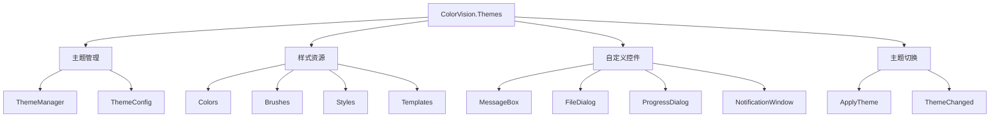

# ColorVision.Themes

## 目录
1. [概述](#概述)
2. [支持的主题](#支持的主题)
3. [架构设计](#架构设计)
4. [主题切换](#主题切换)
5. [自定义控件](#自定义控件)
6. [使用示例](#使用示例)
7. [自定义主题开发](#自定义主题开发)

## 概述

**ColorVision.Themes** 是 ColorVision 系统的主题控件库，提供多种预设主题方案和自定义UI控件。封装了基于系统、黑色、白色、粉色、青色等几种主题方案，支持通过 ApplyTheme 方法直接切换主题。

### 基本信息

- **主要功能**: WPF主题和样式管理
- **UI 框架**: WPF
- **特色功能**: 多主题支持、自定义控件、主题动态切换
- **扩展性**: 支持自定义主题开发

## 支持的主题

### 预设主题

1. **系统主题 (System)**
   - 跟随系统主题设置
   - 自动适配深色/浅色模式
   - Windows 11 风格适配

2. **浅色主题 (Light)**
   - 明亮的界面设计
   - 高对比度文本
   - 现代简约风格

3. **深色主题 (Dark)**
   - 护眼的深色背景
   - 减少眩光
   - 专业开发环境风格

4. **粉色主题 (Pink)**
   - 温暖的粉色调
   - 柔和的视觉体验
   - 适合设计类应用

5. **青色主题 (Cyan)**
   - 清新的青色调
   - 科技感十足
   - 适合技术类应用

## 架构设计



## 主题切换

### ApplyTheme 方法

通过 `ApplyTheme` 方法可以直接切换主题：

```csharp
//设置主题
this.ApplyTheme(ThemeConfig.Instance.Theme);
```

### 支持的主题枚举

```csharp
public enum ThemeType
{
    System,
    Light,
    Dark,
    Pink,
    Cyan
}
```

### 动态主题切换

```csharp
public void SwitchTheme(ThemeType theme)
{
    ThemeConfig.Instance.Theme = theme;
    Application.Current.ApplyTheme(theme);
}
```

## 自定义控件

### 消息弹窗 (MessageBox)

提供符合主题风格的消息对话框：

```csharp
CustomMessageBox.Show("操作完成", "提示", MessageBoxButton.OK, MessageBoxImage.Information);
```

### 文件对话框

主题化的文件选择对话框：

```csharp
var dialog = new ThemedOpenFileDialog
{
    Filter = "图像文件|*.jpg;*.png;*.bmp",
    Multiselect = false
};

if (dialog.ShowDialog() == true)
{
    var fileName = dialog.FileName;
}
```

### 进度对话框

带进度显示的模态对话框：

```csharp
using var progressDialog = new ProgressDialog("正在处理...");
progressDialog.Show();

for (int i = 0; i <= 100; i++)
{
    progressDialog.UpdateProgress(i, $"处理进度: {i}%");
    await Task.Delay(50);
}
```

### 通知窗口

非模态的通知提示窗口：

```csharp
NotificationWindow.Show("操作完成", NotificationType.Success);
```

## 使用示例

### 1. 基础主题应用

```xml
<Application x:Class="MyApp.App"
             xmlns="http://schemas.microsoft.com/winfx/2006/xaml/presentation"
             xmlns:x="http://schemas.microsoft.com/winfx/2006/xaml">
    <Application.Resources>
        <ResourceDictionary>
            <ResourceDictionary.MergedDictionaries>
                <!-- 引入主题资源 -->
                <ResourceDictionary Source="pack://application:,,,/ColorVision.Themes;component/Themes/Dark.xaml"/>
            </ResourceDictionary.MergedDictionaries>
        </ResourceDictionary>
    </Application.Resources>
</Application>
```

### 2. 窗口主题应用

```xml
<Window x:Class="MainWindow"
        Style="{StaticResource ThemedWindowStyle}"
        Background="{StaticResource WindowBackgroundBrush}">
    <!-- 窗口内容 -->
</Window>
```

### 3. 控件主题应用

```xml
<Grid Background="{StaticResource PanelBackgroundBrush}">
    <Button Content="主题按钮" 
            Style="{StaticResource PrimaryButtonStyle}"/>
    
    <TextBox Text="主题文本框" 
             Style="{StaticResource ThemedTextBoxStyle}"/>
    
    <ListView ItemsSource="{Binding Items}"
              Style="{StaticResource ThemedListViewStyle}"/>
</Grid>
```

### 4. 代码中切换主题

```csharp
public partial class SettingsWindow : Window
{
    public SettingsWindow()
    {
        InitializeComponent();
    }

    private void OnThemeChanged(object sender, SelectionChangedEventArgs e)
    {
        if (sender is ComboBox comboBox && comboBox.SelectedItem is ThemeItem item)
        {
            Application.Current.ApplyTheme(item.Theme);
            ThemeConfig.Instance.Theme = item.Theme;
            ThemeConfig.Instance.Save();
        }
    }
}
```

## 主题资源结构

### 颜色资源
```xml
<ResourceDictionary xmlns="http://schemas.microsoft.com/winfx/2006/xaml/presentation">
    <!-- 主色调 -->
    <Color x:Key="PrimaryColor">#FF007ACC</Color>
    <Color x:Key="SecondaryColor">#FF424242</Color>
    
    <!-- 背景色 -->
    <Color x:Key="WindowBackgroundColor">#FF2D2D30</Color>
    <Color x:Key="PanelBackgroundColor">#FF383838</Color>
    
    <!-- 文本色 -->
    <Color x:Key="PrimaryTextColor">#FFFFFFFF</Color>
    <Color x:Key="SecondaryTextColor">#FFB0B0B0</Color>
    
    <!-- 边框色 -->
    <Color x:Key="BorderColor">#FF555555</Color>
</ResourceDictionary>
```

### 画刷资源
```xml
<ResourceDictionary>
    <SolidColorBrush x:Key="PrimaryBrush" Color="{StaticResource PrimaryColor}"/>
    <SolidColorBrush x:Key="WindowBackgroundBrush" Color="{StaticResource WindowBackgroundColor}"/>
    <SolidColorBrush x:Key="PanelBackgroundBrush" Color="{StaticResource PanelBackgroundColor}"/>
    <SolidColorBrush x:Key="PrimaryTextBrush" Color="{StaticResource PrimaryTextColor}"/>
    <SolidColorBrush x:Key="BorderBrush" Color="{StaticResource BorderColor}"/>
</ResourceDictionary>
```

## 自定义主题开发

### 1. 创建主题资源文件

```xml
<!-- MyCustomTheme.xaml -->
<ResourceDictionary xmlns="http://schemas.microsoft.com/winfx/2006/xaml/presentation">
    <!-- 自定义颜色 -->
    <Color x:Key="PrimaryColor">#FF8B4513</Color>
    <!-- ... 其他颜色定义 -->
    
    <!-- 自定义样式 -->
    <Style x:Key="CustomButtonStyle" TargetType="Button">
        <Setter Property="Background" Value="{StaticResource PrimaryBrush}"/>
        <!-- ... 其他样式设置 -->
    </Style>
</ResourceDictionary>
```

### 2. 注册自定义主题

```csharp
public class CustomTheme : ITheme
{
    public string Name => "Custom";
    public string DisplayName => "自定义主题";
    
    public ResourceDictionary GetResourceDictionary()
    {
        return new ResourceDictionary
        {
            Source = new Uri("pack://application:,,,/MyApp;component/Themes/MyCustomTheme.xaml")
        };
    }
}

// 注册主题
ThemeManager.RegisterTheme(new CustomTheme());
```

### 3. 主题响应接口

```csharp
public interface IThemeAware
{
    void OnThemeChanged(ThemeType newTheme);
}

// 在控件中实现
public class CustomControl : UserControl, IThemeAware
{
    public void OnThemeChanged(ThemeType newTheme)
    {
        // 响应主题变更
        UpdateVisualState();
    }
}
```

## 性能优化

### 1. 资源缓存
主题资源使用弱引用缓存，避免内存泄漏。

### 2. 按需加载
只加载当前使用的主题资源，减少启动时间。

### 3. 样式继承
合理使用样式继承，减少重复定义。

## 最佳实践

1. **一致性**: 保持整个应用程序的主题一致性
2. **可访问性**: 确保足够的颜色对比度
3. **响应式**: 支持不同DPI和屏幕尺寸
4. **性能**: 避免在主题切换时的卡顿

## 相关资源

- [UI 组件概览](./UI组件概览.md)
- [ColorVision.UI 文档](./ColorVision.UI.md)
- [开发者指南](../developer-guide/)
- [自定义控件开发](../developer-guide/custom-controls/)