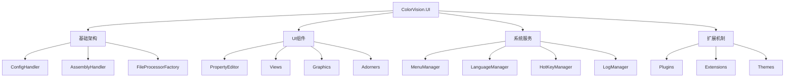

# ColorVision.UI

## 目录
1. [概述](#概述)
2. [核心功能](#核心功能)
3. [架构设计](#架构设计)
4. [主要组件](#主要组件)
5. [菜单系统](#菜单系统)
6. [设置管理](#设置管理)
7. [多语言支持](#多语言支持)
8. [热键系统](#热键系统)
9. [使用示例](#使用示例)
10. [扩展机制](#扩展机制)

## 概述

**ColorVision.UI** 是 ColorVision 系统的底层控件库，提供了丰富的 UI 组件、系统功能和框架支持。它是整个应用程序 UI 层的基础，包含菜单管理、配置系统、多语言支持、热键管理、日志系统等核心功能。

封装的底层控件库，提供对于菜单，配置，设置，视窗，语言，主题，日志，热键，命令，工具栏，状态栏，对话框，下载，CUDA，加密等的封装，用户可以按照需求实现对映的UI，也可以直接使用封装好的UI。

### 基本信息

- **主要功能**: 底层UI控件、系统管理、框架支持
- **UI 框架**: WPF
- **特色功能**: 插件化菜单、动态配置、多语言、热键、属性编辑器
- **扩展性**: 高度可扩展的插件架构

## 核心功能

### 1. 菜单管理系统
- **动态菜单**: 支持运行时动态添加和移除菜单项
- **插件菜单**: 自动发现和集成插件菜单
- **菜单配置**: 支持菜单的可见性和权限控制
- **快捷键集成**: 菜单项与快捷键的自动关联

### 2. 配置管理
- **配置持久化**: 自动保存和加载应用程序配置
- **设置界面**: 可视化的设置管理窗口
- **导入导出**: 配置的备份和恢复功能
- **多环境配置**: 支持开发、测试、生产环境配置

### 3. 多语言支持
- **动态语言切换**: 运行时切换界面语言
- **资源本地化**: 支持文本、图像等资源本地化
- **语言包管理**: 插件化的语言包支持
- **区域设置**: 支持不同地区的格式化设置

### 4. 热键系统
- **全局热键**: 系统级别的快捷键支持
- **局部热键**: 窗口或控件级别的快捷键
- **热键配置**: 用户自定义快捷键设置
- **冲突检测**: 自动检测和解决快捷键冲突

### 5. 属性编辑器
- **PropertyGrid**: 强大的属性编辑控件
- **自定义编辑器**: 支持各种数据类型的编辑器
- **分组显示**: 属性的分类和分组显示
- **实时验证**: 属性值的实时验证和错误提示

### 6. 系统封装功能
- **窗口管理**: 视窗操作和状态管理
- **工具栏**: 可自定义的工具栏组件
- **状态栏**: 应用状态显示
- **对话框**: 标准化的对话框控件
- **下载管理**: 文件下载功能封装
- **CUDA支持**: GPU计算功能集成
- **加密功能**: 数据加密和解密工具

## 架构设计



## 主要组件

### ConfigHandler 配置处理器

配置系统的核心组件，负责应用程序配置的管理和持久化。

**主要功能：**
- 配置文件的加载和保存
- 配置项的注册和管理
- 配置变更的通知机制
- 配置验证和默认值处理

**使用示例：**
```csharp
//读取配置
ConfigHandler.GetInstance();
```

### AssemblyHandler 程序集处理器

负责动态程序集的加载、管理和插件发现。

**主要功能：**
- 插件程序集的动态加载
- 类型发现和实例化
- 程序集依赖管理
- 版本兼容性检查

### PropertyGrid 属性编辑器

提供对于对象属性的编辑功能，支持属性分类，属性排序，属性过滤，属性编辑器自定义等功能。

**特色功能：**
- 自动属性发现和展示
- 属性分组和分类
- 自定义属性编辑器
- 实时数据绑定和验证

### MenuManager 菜单管理器

管理应用程序的菜单系统，支持动态菜单添加和插件菜单集成。

**主要功能：**
- 菜单结构管理
- 插件菜单自动发现
- 权限控制集成
- 快捷键管理

## 菜单系统

### 动态菜单支持
菜单系统支持运行时的动态修改，插件可以注册自己的菜单项：

```csharp
public interface IMenuItem
{
    string Name { get; }
    string Header { get; }
    object Icon { get; }
    ICommand Command { get; }
    IList<IMenuItem> Children { get; }
}
```

### 插件菜单集成
插件通过实现 `IMenuItem` 接口可以自动集成到主菜单中。

## 设置管理

### 权限设置
```csharp
//设置权限
Authorization.Instance = ConfigService.Instance.GetRequiredService<Authorization>();
```

### 日志配置
```csharp
//设置日志级别
LogConfig.Instance.SetLog();
```

### 主题配置
```csharp
//设置主题
this.ApplyTheme(ThemeConfig.Instance.Theme);
```

### 语言配置
```csharp
//设置语言
Thread.CurrentThread.CurrentUICulture = new System.Globalization.CultureInfo(LanguageConfig.Instance.UICulture);
```

## 多语言支持

ColorVision.UI 提供完整的国际化支持：

### 资源管理
- 基于 RESX 文件的资源管理
- 运行时语言切换
- 插件语言资源集成

### 区域设置
- 日期时间格式化
- 数字格式化
- 货币格式化

## 热键系统

### 全局热键
支持系统级别的快捷键注册，即使应用程序在后台也能响应。

### 快捷键配置
用户可以通过设置界面自定义快捷键组合。

### 冲突检测
自动检测快捷键冲突并提供解决方案。

## 窗口操作增强

### 窗口拖动
设置窗口的实现移动到框架中来实现：

```csharp
//设置窗口可拖动
this.MouseLeftButtonDown += (s, e) =>
{
    if (e.ButtonState == MouseButtonState.Pressed)
        this.DragMove();
};
```

## 使用示例

### 1. 基础初始化

```csharp
// 应用程序启动时的基础设置
public partial class App : Application
{
    protected override void OnStartup(StartupEventArgs e)
    {
        base.OnStartup(e);
        
        //读取配置
        ConfigHandler.GetInstance();
        
        //设置权限
        Authorization.Instance = ConfigService.Instance.GetRequiredService<Authorization>();
        
        //设置日志级别
        LogConfig.Instance.SetLog();
        
        //设置主题
        this.ApplyTheme(ThemeConfig.Instance.Theme);
        
        //设置语言
        Thread.CurrentThread.CurrentUICulture = new System.Globalization.CultureInfo(LanguageConfig.Instance.UICulture);
    }
}
```

### 2. 菜单项注册

```csharp
public class PluginMenuItem : IMenuItem
{
    public string Name => "MyPlugin";
    public string Header => "My Plugin";
    public object Icon => new BitmapImage(new Uri("pack://application:,,,/Resources/plugin.png"));
    public ICommand Command { get; }
    public IList<IMenuItem> Children { get; }
}
```

### 3. 属性编辑器使用

```xml
<ui:PropertyGrid x:Name="propertyGrid" 
                 SelectedObject="{Binding CurrentObject}"
                 ShowCategories="True"
                 ShowAdvancedOptions="False" />
```

## 扩展机制

### 插件接口
```csharp
public interface IPlugin
{
    string Name { get; }
    string Version { get; }
    void Initialize();
    void Shutdown();
}
```

### 自定义控件
用户可以通过继承基础控件类来创建自定义UI组件：

```csharp
public class CustomControl : BaseUserControl
{
    // 自定义控件实现
}
```

### 主题扩展
支持自定义主题的开发和集成：

```csharp
public interface ITheme
{
    string Name { get; }
    ResourceDictionary GetResourceDictionary();
}
```

## 最佳实践

1. **配置管理**: 使用 ConfigHandler 统一管理配置
2. **权限控制**: 通过 Authorization 实现访问控制
3. **日志记录**: 使用 LogConfig 配置日志级别
4. **主题切换**: 通过 ApplyTheme 方法动态切换主题
5. **国际化**: 使用 CultureInfo 设置区域信息

## 相关资源

- [开发者指南](../developer-guide/)
- [插件开发指南](../developer-guide/plugin-development/)
- [主题开发](../ui-components/ColorVision.Themes.md)
- [故障排除](../troubleshooting/)