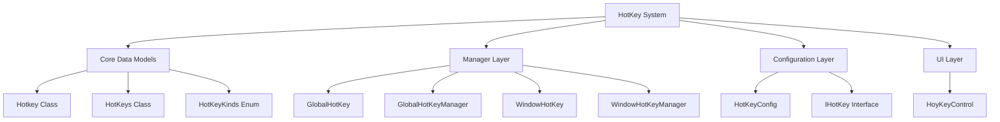

# HotKey System Design Document

> **Note**: This is a brief English summary. For the complete Chinese documentation, see [HotKey系统设计文档.md](./HotKey系统设计文档.md)

## Overview

The HotKey system is a comprehensive keyboard shortcut management framework in ColorVision.UI that supports both global (system-level) and window (application-level) hotkeys.

## Key Features

- **Dual Mode Support**: Global hotkeys (system-wide) and Window hotkeys (application-specific)
- **Dynamic Registration**: Register and unregister hotkeys at runtime
- **Configuration Persistence**: Save and load user-defined hotkey settings
- **Conflict Detection**: Automatic detection of hotkey conflicts
- **UI Controls**: User-friendly hotkey configuration control
- **Plugin Support**: Extensible through IHotKey interface

## Architecture



## Core Components

### 1. Hotkey Class
Represents a keyboard shortcut combination with key and modifiers.

```csharp
var hotkey = new Hotkey(Key.S, ModifierKeys.Control);
Console.WriteLine(hotkey.ToString()); // Output: Ctrl + S
```

### 2. HotKeys Class
Configuration unit containing hotkey definition, callback, and registration state.

```csharp
var hotKeys = new HotKeys(
    "Save File", 
    new Hotkey(Key.S, ModifierKeys.Control),
    () => SaveFile()
);
```

### 3. GlobalHotKeyManager
Manages system-level global hotkeys using Win32 API.

```csharp
var manager = GlobalHotKeyManager.GetInstance(window);
manager.Register(hotKeys);
```

### 4. WindowHotKeyManager
Manages application-level window hotkeys using WPF events.

```csharp
var manager = WindowHotKeyManager.GetInstance(control);
manager.Register(hotKeys);
```

## Quick Start

### Register Global Hotkey

```csharp
public MainWindow()
{
    InitializeComponent();
    
    var manager = GlobalHotKeyManager.GetInstance(this);
    var hotkey = new HotKeys(
        "Screenshot",
        new Hotkey(Key.PrintScreen, ModifierKeys.Control | ModifierKeys.Alt),
        TakeScreenshot
    );
    hotkey.Kinds = HotKeyKinds.Global;
    
    manager.Register(hotkey);
}

private void TakeScreenshot()
{
    // Screenshot logic
}
```

### Register Window Hotkey

```csharp
public TextEditor()
{
    InitializeComponent();
    
    var manager = WindowHotKeyManager.GetInstance(this);
    
    // Ctrl+S to save
    manager.Register(
        new Hotkey(Key.S, ModifierKeys.Control),
        SaveDocument
    );
}
```

### Using Extension Methods

```csharp
// Load all plugin hotkeys from assemblies
this.LoadHotKeyFromAssembly();

// Add hotkey using extension method
this.AddHotKeys(new HotKeys("New", 
    new Hotkey(Key.N, ModifierKeys.Control),
    () => NewDocument()));
```

## Fixed Issues (v2024)

The following critical bugs have been fixed in this version:

### 1. IsNullOrEmpty Logic Error ✅
- **Before**: `hotkey != null && hotkey != None` (returns true when NOT empty)
- **After**: `hotkey == null || hotkey == None` (returns true when empty)
- **Impact**: Fixed null reference exceptions and validation logic

### 2. GlobalHotKeyManager.ModifiedHotkey Condition Error ✅
- **Before**: `hotkey == Hotkey.None` (only registers when None)
- **After**: `hotkey != Hotkey.None` (registers when valid)
- **Impact**: Hotkey modification now works correctly

### 3. Collection Modification During Iteration ✅
- **Before**: Modifying collections during foreach loops causing `InvalidOperationException`
- **After**: Using LINQ to collect items first, then modify
- **Files Fixed**: `GlobalHotKey.cs`, `WindowHotKey.cs`, `WindowHotKeyManager.cs`

### 4. HotKeyHelper.UnRegisterHotKeys Logic Error ✅
- **Before**: Method was calling `Register` instead of `UnRegister`
- **After**: Correctly calls `UnRegister` methods
- **Impact**: Hotkey unregistration now works as intended

## Design Patterns

- **Singleton Pattern**: GlobalHotKeyManager, WindowHotKeyManager (per window/control)
- **Observer Pattern**: HotKeys implements INotifyPropertyChanged
- **Proxy Pattern**: Managers act as proxies for low-level APIs
- **Command Pattern**: HotKeyCallBackHanlder delegate encapsulates commands

## API Reference

### Hotkey Class

```csharp
public class Hotkey
{
    public Key Key { get; set; }
    public ModifierKeys Modifiers { get; set; }
    public static readonly Hotkey None;
    
    public static bool IsNullOrEmpty(Hotkey hotkey);
    public static int ToInt(Hotkey hotkey);
    public override string ToString();
}
```

### HotKeys Class

```csharp
public class HotKeys : INotifyPropertyChanged
{
    public string Name { get; set; }
    public Hotkey Hotkey { get; set; }
    public HotKeyKinds Kinds { get; set; }
    public bool IsGlobal { get; set; }
    public bool IsRegistered { get; internal set; }
    public HotKeyCallBackHanlder HotKeyHandler { get; set; }
    
    public static ObservableCollection<HotKeys> HotKeysList;
    public static void SetDefault();
}
```

### GlobalHotKeyManager

```csharp
public class GlobalHotKeyManager
{
    public static GlobalHotKeyManager GetInstance(Window window);
    public bool Register(HotKeys hotKeys);
    public bool Register(Hotkey hotkey, HotKeyCallBackHanlder callBack);
    public void UnRegister(HotKeys hotKeys);
    public bool ModifiedHotkey(HotKeys hotkeys);
}
```

### WindowHotKeyManager

```csharp
public class WindowHotKeyManager
{
    public static WindowHotKeyManager GetInstance(Control control);
    public bool Register(HotKeys hotkeys);
    public bool Register(Hotkey hotkey, HotKeyCallBackHanlder callBack);
    public bool UnRegister(HotKeys hotkeys);
    public bool ModifiedHotkey(HotKeys hotkeys);
}
```

## Best Practices

### 1. Use Descriptive Names
```csharp
// Good
new HotKeys("Save File", ...)
new HotKeys("Undo Action", ...)

// Avoid
new HotKeys("HK1", ...)
```

### 2. Choose Appropriate Hotkey Type
- **Global**: For background features (screenshot, show/hide window)
- **Window**: For application features (save, find, format)

### 3. Handle Registration Failures
```csharp
if (!manager.Register(hotKeys))
{
    MessageBox.Show(
        $"Hotkey {hotKeys.Hotkey} registration failed. " +
        "It may already be in use.",
        "Hotkey Conflict",
        MessageBoxButton.OK,
        MessageBoxImage.Warning
    );
}
```

### 4. Provide Default Hotkeys
```csharp
// Standard save hotkey
var saveHotkey = new HotKeys(
    "Save",
    new Hotkey(Key.S, ModifierKeys.Control),
    SaveDocument
);
```

### 5. Allow User Customization
Provide a settings UI for users to customize hotkeys using the built-in `HoyKeyControl`.

## Technology Stack

- **WPF**: Windows Presentation Foundation
- **Win32 API**: RegisterHotKey/UnregisterHotKey for global hotkeys
- **C# Events**: PreviewKeyUp for window hotkeys
- **LINQ**: Collection operations

## Future Enhancements

Potential improvements documented in the full Chinese version:
- Add hotkey validation interface
- Implement conflict resolution strategies
- Support hotkey grouping
- Add hotkey history tracking
- Improve error handling with custom exceptions
- Add unit tests coverage

## License

Part of the ColorVision project. See main project license for details.

## References

- Full Documentation: [HotKey系统设计文档.md](./HotKey系统设计文档.md) (Chinese)
- ColorVision.UI Overview: [ColorVision.UI.md](./ColorVision.UI.md)
- MSDN: [RegisterHotKey function](https://docs.microsoft.com/en-us/windows/win32/api/winuser/nf-winuser-registerhotkey)
