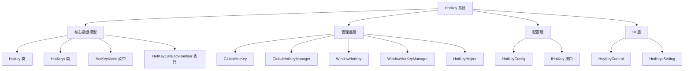
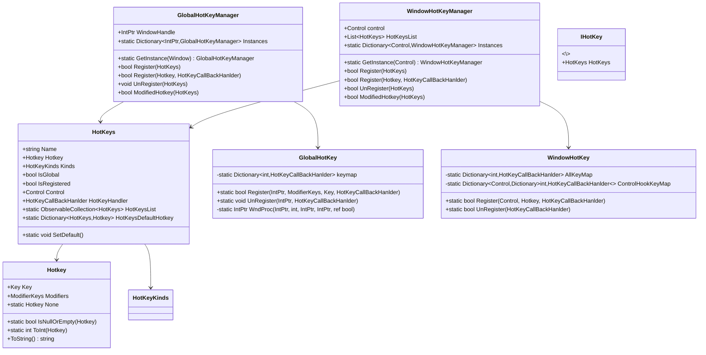
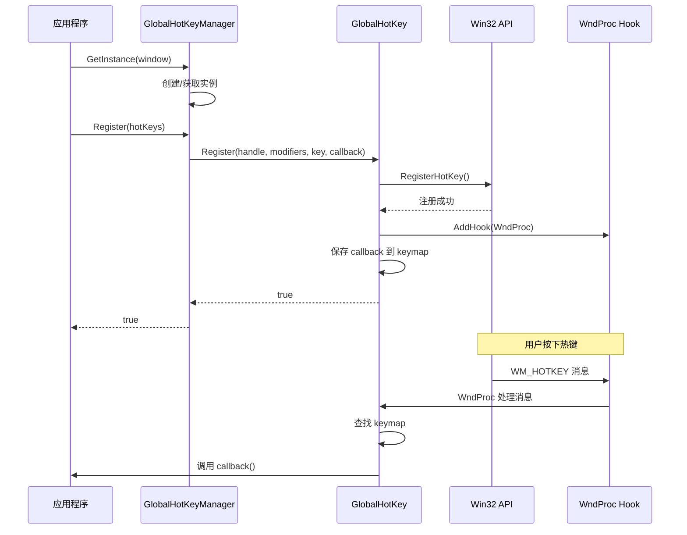
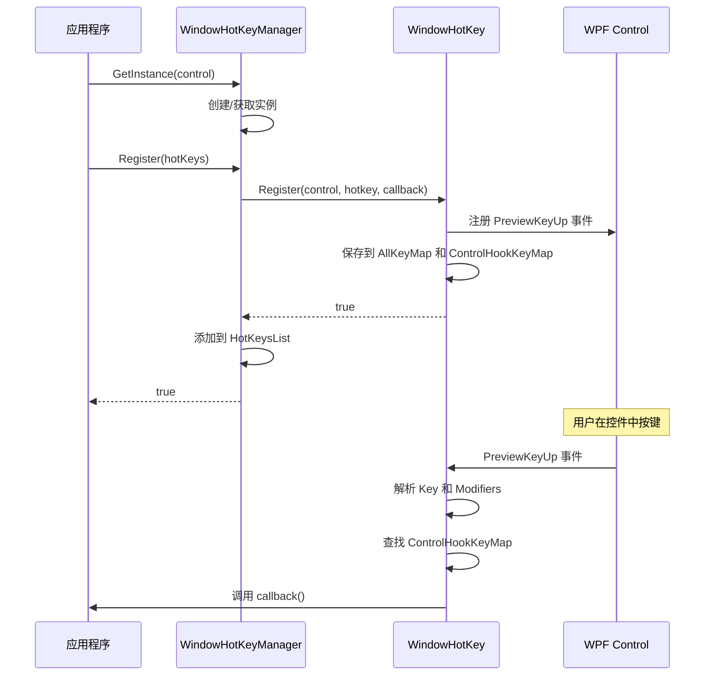

# HotKey 系统设计文档

## 目录
1. [概述](#概述)
2. [架构设计](#架构设计)
3. [核心组件](#核心组件)
4. [使用指南](#使用指南)
5. [设计模式](#设计模式)
6. [API 参考](#api-参考)
7. [最佳实践](#最佳实践)
8. [已知问题与优化建议](#已知问题与优化建议)

---

## 概述

HotKey 系统是 ColorVision.UI 框架中的核心功能模块，提供了全面的快捷键管理解决方案。该系统支持全局热键（系统级）和窗口热键（应用程序级），并提供灵活的配置管理和用户自定义功能。

### 主要特性

- **双模式支持**: 全局热键（Global）和窗口热键（Windows）
- **动态注册**: 运行时动态注册和注销热键
- **配置持久化**: 热键配置的保存和加载
- **冲突检测**: 自动检测热键冲突
- **UI 控件**: 提供用户友好的热键设置控件
- **插件化**: 通过 IHotKey 接口支持插件扩展

### 基本信息

- **命名空间**: `ColorVision.UI.HotKey`
- **依赖项**: WPF, System.Windows.Input, System.Windows.Interop
- **核心技术**: Win32 API (RegisterHotKey/UnregisterHotKey), WPF 事件处理

---

## 架构设计

### 系统架构图



### 类层次结构



### 工作流程

#### 全局热键注册流程



#### 窗口热键注册流程



---

## 核心组件

### 1. Hotkey 类

**功能**: 表示一个热键组合，包含键值和修饰键。

**核心属性**:
- `Key Key`: 主键值（如 A, F1 等）
- `ModifierKeys Modifiers`: 修饰键组合（Ctrl, Alt, Shift, Win）

**核心方法**:
- `ToString()`: 将热键转换为友好的字符串表示（如 "Ctrl + Shift + A"）
- `static ToInt(Hotkey)`: 将热键转换为唯一整数标识
- `static IsNullOrEmpty(Hotkey)`: 检查热键是否为空或无效

**示例**:
```csharp
// 创建 Ctrl+S 热键
var hotkey = new Hotkey(Key.S, ModifierKeys.Control);
Console.WriteLine(hotkey.ToString()); // 输出: Ctrl + S

// 检查是否为空
if (Hotkey.IsNullOrEmpty(hotkey))
{
    // 热键有效
}
```

---

### 2. HotKeys 类

**功能**: 热键配置单元，包含热键定义、回调函数和注册状态。

**核心属性**:
- `string Name`: 热键名称（用于配置识别）
- `Hotkey Hotkey`: 热键组合
- `HotKeyKinds Kinds`: 热键类型（Global 或 Windows）
- `bool IsGlobal`: 是否为全局热键
- `bool IsRegistered`: 是否已成功注册
- `HotKeyCallBackHanlder HotKeyHandler`: 回调函数

**静态成员**:
- `ObservableCollection\<HotKeys\> HotKeysList`: 全局热键列表
- `Dictionary\<HotKeys,Hotkey\> HotKeysDefaultHotkey`: 默认热键映射

**特性**:
- 实现 `INotifyPropertyChanged` 接口，支持 WPF 数据绑定
- 自动处理热键类型切换时的注册/注销
- 修改热键时自动更新注册

**示例**:
```csharp
// 创建热键配置
var hotKeys = new HotKeys(
    "保存文件", 
    new Hotkey(Key.S, ModifierKeys.Control),
    () => SaveFile()
);

// 切换为全局热键
hotKeys.IsGlobal = true;

// 监听注册状态
hotKeys.PropertyChanged += (s, e) =>
{
    if (e.PropertyName == nameof(HotKeys.IsRegistered))
    {
        Console.WriteLine($"热键注册状态: {hotKeys.IsRegistered}");
    }
};
```

---

### 3. GlobalHotKey 类

**功能**: 封装 Win32 API，实现系统级全局热键。

**核心方法**:
- `Register(IntPtr hwnd, ModifierKeys modifiers, Key key, HotKeyCallBackHanlder callback)`: 注册全局热键
- `UnRegister(IntPtr hWnd, HotKeyCallBackHanlder callback)`: 注销全局热键

**技术细节**:
- 使用 `RegisterHotKey` Win32 API 注册系统热键
- 通过 `HwndSource.AddHook` 添加消息钩子
- 监听 `WM_HOTKEY` (0x312) 消息
- 即使应用在后台也能响应热键

**示例**:
```csharp
IntPtr hwnd = new WindowInteropHelper(window).EnsureHandle();
bool success = GlobalHotKey.Register(
    hwnd, 
    ModifierKeys.Control | ModifierKeys.Alt, 
    Key.F1,
    () => Console.WriteLine("全局热键被触发")
);
```

---

### 4. GlobalHotKeyManager 类

**功能**: 管理全局热键的注册、注销和生命周期。

**设计模式**: 单例模式（每个窗口一个实例）

**核心方法**:
- `GetInstance(Window window)`: 获取窗口对应的管理器实例
- `Register(HotKeys hotKeys)`: 注册热键配置
- `UnRegister(HotKeys hotKeys)`: 注销热键配置
- `ModifiedHotkey(HotKeys hotkeys)`: 修改已注册的热键

**特性**:
- 线程安全的实例管理
- 支持多窗口独立管理
- 自动管理窗口句柄

**示例**:
```csharp
var manager = GlobalHotKeyManager.GetInstance(mainWindow);

var hotKeys = new HotKeys("截图", 
    new Hotkey(Key.PrintScreen, ModifierKeys.Control),
    () => TakeScreenshot());
hotKeys.Kinds = HotKeyKinds.Global;

if (manager.Register(hotKeys))
{
    Console.WriteLine("全局热键注册成功");
}
```

---

### 5. WindowHotKey 类

**功能**: 实现窗口级别的热键，仅在控件获得焦点时响应。

**核心方法**:
- `Register(Control control, Hotkey hotkey, HotKeyCallBackHanlder callback)`: 注册窗口热键
- `UnRegister(HotKeyCallBackHanlder callback)`: 注销窗口热键

**技术细节**:
- 监听控件的 `PreviewKeyUp` 事件
- 解析 `Keyboard.Modifiers` 和按键
- 支持 Windows 键检测
- 过滤纯修饰键和不合法按键组合

**示例**:
```csharp
bool success = WindowHotKey.Register(
    myTextBox,
    new Hotkey(Key.F, ModifierKeys.Control),
    () => ShowFindDialog()
);
```

---

### 6. WindowHotKeyManager 类

**功能**: 管理窗口热键的注册、注销和生命周期。

**设计模式**: 单例模式（每个控件一个实例）

**核心方法**:
- `GetInstance(Control control)`: 获取控件对应的管理器实例
- `Register(HotKeys hotKeys)`: 注册热键配置
- `UnRegister(HotKeys hotKeys)`: 注销热键配置
- `ModifiedHotkey(HotKeys hotkeys)`: 修改已注册的热键

**特性**:
- 自动清理：窗口关闭时自动注销所有热键
- 支持控件级别的热键隔离
- 维护热键列表

**示例**:
```csharp
var manager = WindowHotKeyManager.GetInstance(this);

var hotKeys = new HotKeys("查找", 
    new Hotkey(Key.F, ModifierKeys.Control),
    () => Find());

if (manager.Register(hotKeys))
{
    Console.WriteLine("窗口热键注册成功");
}
```

---

### 7. HotKeyHelper 类

**功能**: 提供热键系统的辅助功能和扩展方法。

**核心功能**:
- 热键批量注册/注销
- 从程序集自动加载热键（通过 IHotKey 接口）
- 热键配置同步

**扩展方法**:
- `LoadHotKeyFromAssembly(this Window)`: 从程序集加载所有实现 IHotKey 接口的热键
- `AddHotKeys(this Window, HotKeys)`: 添加热键到窗口
- `AddHotKeys(this Control, HotKeys)`: 添加热键到控件

**示例**:
```csharp
// 在主窗口启动时加载所有插件热键
public MainWindow()
{
    InitializeComponent();
    this.LoadHotKeyFromAssembly();
}

// 手动添加热键
this.AddHotKeys(new HotKeys("新建", 
    new Hotkey(Key.N, ModifierKeys.Control),
    () => NewDocument()));
```

---

### 8. HotKeyConfig 类

**功能**: 热键配置的持久化管理。

**核心属性**:
- `ObservableCollection\<HotKeys\> Hotkeys`: 热键配置集合

**集成点**:
- 实现 `IConfig` 接口，集成到配置系统
- 通过 `HotKeyConfigProvider` 提供设置界面
- 自动保存和加载用户自定义热键

**示例**:
```csharp
// 获取配置实例
var config = HotKeyConfig.Instance;

// 保存当前热键配置
config.Hotkeys = HotKeys.HotKeysList;

// 加载已保存的配置
foreach (var hotkey in config.Hotkeys)
{
    // 应用配置
}
```

---

### 9. HoyKeyControl UI 控件

**功能**: 提供用户友好的热键设置界面。

**特性**:
- 实时键盘输入捕获
- 可视化热键显示
- 支持 Delete/Backspace/Escape 清除热键
- 自动过滤无效按键组合
- 提供输入提示

**使用方法**:
```xaml
<local:HoyKeyControl />
```

```csharp
// 在代码中使用
var control = new HoyKeyControl(hotKeys);
settingsPanel.Children.Add(control);
```

**按键处理逻辑**:
1. 捕获 `PreviewKeyDown` 事件
2. 解析修饰键（Ctrl, Alt, Shift, Win）
3. 获取实际按键（处理 SystemKey）
4. 验证按键组合有效性
5. 过滤纯修饰键和不合法组合
6. 更新热键值

---

## 使用指南

### 场景 1: 注册全局热键

```csharp
public partial class MainWindow : Window
{
    public MainWindow()
    {
        InitializeComponent();
        
        // 创建全局热键配置
        var screenshotHotkey = new HotKeys(
            "全局截图",
            new Hotkey(Key.PrintScreen, ModifierKeys.Control | ModifierKeys.Alt),
            TakeScreenshot
        );
        screenshotHotkey.Kinds = HotKeyKinds.Global;
        
        // 注册全局热键
        var manager = GlobalHotKeyManager.GetInstance(this);
        if (manager.Register(screenshotHotkey))
        {
            Console.WriteLine("全局热键注册成功");
        }
        else
        {
            MessageBox.Show("热键注册失败，可能已被其他程序占用");
        }
    }
    
    private void TakeScreenshot()
    {
        // 截图逻辑
        Console.WriteLine("执行截图操作");
    }
}
```

---

### 场景 2: 注册窗口热键

```csharp
public partial class TextEditor : UserControl
{
    public TextEditor()
    {
        InitializeComponent();
        
        // 注册多个窗口热键
        var manager = WindowHotKeyManager.GetInstance(this);
        
        // Ctrl+S 保存
        manager.Register(
            new Hotkey(Key.S, ModifierKeys.Control),
            SaveDocument
        );
        
        // Ctrl+F 查找
        manager.Register(
            new Hotkey(Key.F, ModifierKeys.Control),
            ShowFindDialog
        );
        
        // Ctrl+H 替换
        manager.Register(
            new Hotkey(Key.H, ModifierKeys.Control),
            ShowReplaceDialog
        );
    }
    
    private void SaveDocument() { /* ... */ }
    private void ShowFindDialog() { /* ... */ }
    private void ShowReplaceDialog() { /* ... */ }
}
```

---

### 场景 3: 通过插件扩展热键

```csharp
// 定义插件热键
public class MyPluginHotKeys : IHotKey
{
    public HotKeys HotKeys { get; }
    
    public MyPluginHotKeys()
    {
        HotKeys = new HotKeys(
            "插件功能",
            new Hotkey(Key.P, ModifierKeys.Control | ModifierKeys.Shift),
            ExecutePluginFunction
        );
    }
    
    private void ExecutePluginFunction()
    {
        Console.WriteLine("插件热键被触发");
    }
}

// 在主窗口加载插件热键
public partial class MainWindow : Window
{
    public MainWindow()
    {
        InitializeComponent();
        
        // 自动加载所有插件热键
        this.LoadHotKeyFromAssembly();
    }
}
```

---

### 场景 4: 用户自定义热键

```csharp
public partial class SettingsWindow : Window
{
    public SettingsWindow()
    {
        InitializeComponent();
        
        // 绑定热键列表到 UI
        hotkeyListView.ItemsSource = HotKeys.HotKeysList;
    }
    
    private void ResetToDefault_Click(object sender, RoutedEventArgs e)
    {
        // 恢复默认热键
        HotKeys.SetDefault();
    }
    
    private void SaveSettings_Click(object sender, RoutedEventArgs e)
    {
        // 保存配置
        HotKeyConfig.Instance.Hotkeys = HotKeys.HotKeysList;
    }
}
```

---

### 场景 5: 动态修改热键

```csharp
var hotKeys = new HotKeys(
    "复制",
    new Hotkey(Key.C, ModifierKeys.Control),
    CopyText
);

// 注册热键
var manager = WindowHotKeyManager.GetInstance(this);
manager.Register(hotKeys);

// 稍后修改热键（自动处理注销和重新注册）
hotKeys.Hotkey = new Hotkey(Key.Insert, ModifierKeys.Control);

// 切换为全局热键
hotKeys.IsGlobal = true;
```

---

## 设计模式

### 1. 单例模式 (Singleton Pattern)

**应用场景**: 
- `GlobalHotKeyManager`: 每个窗口一个实例
- `WindowHotKeyManager`: 每个控件一个实例
- `HotKeyHelper`: 全局单例

**优势**:
- 统一管理热键资源
- 避免重复注册
- 线程安全

**实现**:
```csharp
private static readonly object locker = new();

public static GlobalHotKeyManager GetInstance(Window window)
{
    IntPtr intPtr = new WindowInteropHelper(window).EnsureHandle();
    lock (locker)
    {
        if (Instances.TryGetValue(intPtr, out GlobalHotKeyManager manager))
        {
            return manager;
        }
        else
        {
            return new GlobalHotKeyManager(intPtr);
        }
    }
}
```

---

### 2. 观察者模式 (Observer Pattern)

**应用场景**: 
- `HotKeys` 实现 `INotifyPropertyChanged`
- 热键状态变化通知 UI 更新

**优势**:
- 解耦数据和 UI
- 支持 WPF 数据绑定
- 自动 UI 刷新

**实现**:
```csharp
public Hotkey Hotkey
{
    get => _Hotkey;
    set
    {
        if (value == _Hotkey) return;
        _Hotkey = value;
        // 自动处理注册逻辑
        if (Control != null)
        {
            // ... 重新注册热键
        }
        NotifyPropertyChanged();
    }
}
```

---

### 3. 代理模式 (Proxy Pattern)

**应用场景**: 
- `GlobalHotKeyManager` 和 `WindowHotKeyManager` 作为底层 API 的代理

**优势**:
- 简化 API 调用
- 统一错误处理
- 添加额外功能（如日志、验证）

---

### 4. 命令模式 (Command Pattern)

**应用场景**: 
- `HotKeyCallBackHanlder` 委托封装命令

**优势**:
- 解耦按键和操作
- 支持延迟执行
- 便于测试

---

### 5. 工厂模式 (Factory Pattern)

**应用场景**: 
- `HotKeyConfigProvider` 创建配置界面

**优势**:
- 统一对象创建
- 支持依赖注入
- 便于扩展

---

## API 参考

### Hotkey 类

#### 构造函数
```csharp
public Hotkey()
public Hotkey(Key key, ModifierKeys modifiers)
```

#### 属性
```csharp
public Key Key { get; set; }
public ModifierKeys Modifiers { get; set; }
public static readonly Hotkey None
```

#### 方法
```csharp
public override string ToString()
public static bool IsNullOrEmpty(Hotkey hotkey)
public static int ToInt(Hotkey hotkey)
```

---

### HotKeys 类

#### 构造函数
```csharp
public HotKeys()
public HotKeys(string name, Hotkey hotkey, HotKeyCallBackHanlder hotKeyCallBackHanlder)
```

#### 属性
```csharp
public string Name { get; set; }
public Hotkey Hotkey { get; set; }
public HotKeyKinds Kinds { get; set; }
public bool IsGlobal { get; set; }
public bool IsRegistered { get; internal set; }
public Control Control { get; set; }
public HotKeyCallBackHanlder HotKeyHandler { get; set; }
```

#### 静态成员
```csharp
public static ObservableCollection\<HotKeys\> HotKeysList
public static Dictionary\\<HotKeys, Hotkey\> HotKeysDefaultHotkey
public static void SetDefault()
```

---

### GlobalHotKeyManager 类

#### 方法
```csharp
public static GlobalHotKeyManager GetInstance(Window window)
public bool Register(HotKeys hotKeys)
public bool Register(Hotkey hotkey, HotKeyCallBackHanlder callBack)
public bool Register(ModifierKeys modifierKeys, Key key, HotKeyCallBackHanlder callBack)
public void UnRegister(HotKeys hotKeys)
public void UnRegister(HotKeyCallBackHanlder callBack)
public bool ModifiedHotkey(HotKeys hotkeys)
public void ModifiedHotkey(Hotkey hotkey, HotKeyCallBackHanlder callBack)
```

---

### WindowHotKeyManager 类

#### 方法
```csharp
public static WindowHotKeyManager GetInstance(Control control)
public bool Register(HotKeys hotkeys)
public bool Register(Hotkey hotkey, HotKeyCallBackHanlder callBack)
public bool UnRegister(HotKeys hotkeys)
public bool UnRegister(HotKeyCallBackHanlder callBack)
public bool ModifiedHotkey(HotKeys hotkeys)
public void ModifiedHotkey(Hotkey hotkey, HotKeyCallBackHanlder callBack)
```

---

### 扩展方法

```csharp
// HotKeyExtension
public static int ToInt(this Hotkey hotkey)
public static bool IsNullOrEmpty(this Hotkey hotkey)

// HotKeysExtension
public static void LoadHotKeyFromAssembly(this Window window)
public static bool AddHotKeys(this Window window, HotKeys hotKeys)
public static bool AddHotKeys(this Control control, HotKeys hotKeys)
public static bool AddHotKeys(this Window window, Hotkey hotKey, HotKeyCallBackHanlder hotKeyHandler, HotKeyKinds hotKeyKinds = HotKeyKinds.Windows)
public static bool AddHotKeysGlobal(this Window window, Hotkey hotKey, HotKeyCallBackHanlder hotKeyHandler)
```

---

## 最佳实践

### 1. 热键命名规范

使用描述性的名称，便于用户理解：

```csharp
// 好的命名
new HotKeys("保存文件", ...)
new HotKeys("撤销操作", ...)
new HotKeys("全局截图", ...)

// 避免的命名
new HotKeys("HK1", ...)
new HotKeys("功能A", ...)
```

---

### 2. 合理选择热键类型

- **全局热键**: 用于需要后台响应的功能（如截图、显示/隐藏主窗口）
- **窗口热键**: 用于应用内部的功能（如保存、查找、格式化）

```csharp
// 全局热键示例
screenshotHotkey.Kinds = HotKeyKinds.Global;

// 窗口热键示例（默认）
saveHotkey.Kinds = HotKeyKinds.Windows;
```

---

### 3. 错误处理

始终检查注册返回值，处理冲突：

```csharp
var manager = GlobalHotKeyManager.GetInstance(this);
if (!manager.Register(hotKeys))
{
    // 热键可能已被占用
    MessageBox.Show(
        $"热键 {hotKeys.Hotkey} 注册失败，可能已被其他程序占用。\n请选择其他热键组合。",
        "热键冲突",
        MessageBoxButton.OK,
        MessageBoxImage.Warning
    );
}
```

---

### 4. 资源清理

窗口关闭时自动清理（WindowHotKeyManager 已处理），但全局热键需要注意：

```csharp
protected override void OnClosed(EventArgs e)
{
    // WindowHotKeyManager 自动清理
    // GlobalHotKeyManager 需要手动清理（如果窗口不再使用）
    base.OnClosed(e);
}
```

---

### 5. 提供默认热键

为常用功能提供合理的默认热键：

```csharp
var saveHotkey = new HotKeys(
    "保存",
    new Hotkey(Key.S, ModifierKeys.Control), // 标准的保存热键
    SaveDocument
);
```

---

### 6. 允许用户自定义

提供设置界面让用户修改热键：

```csharp
// 使用内置的 HoyKeyControl
var control = new HoyKeyControl(hotKeys);

// 或者使用完整的设置窗口
var settings = new HotKeysSetting();
settingsWindow.Content = settings;
```

---

### 7. 避免常见问题

**问题 1: 热键冲突**
```csharp
// 检查热键是否已存在
var existing = HotKeys.HotKeysList
    .FirstOrDefault(h => h.Hotkey.ToInt() == newHotkey.ToInt());
if (existing != null)
{
    Console.WriteLine($"热键冲突: {existing.Name}");
}
```

**问题 2: 内存泄漏**
```csharp
// 确保注销不再使用的热键
manager.UnRegister(hotKeys);
```

**问题 3: 线程安全**
```csharp
// UI 操作在 UI 线程执行
Application.Current.Dispatcher.Invoke(() =>
{
    // 更新 UI
});
```

---

## 已知问题与优化建议

### 已识别的问题

#### 1. IsNullOrEmpty 逻辑错误 ⚠️

**位置**: `HotKey.cs:22`

**当前代码**:
```csharp
public static bool IsNullOrEmpty(Hotkey hotkey) => hotkey != null && hotkey != None;
```

**问题**: 逻辑错误，当 hotkey 为 null 时返回 false，当 hotkey 不为 null 且不等于 None 时返回 true。这与方法名称的语义不符。

**影响**: 可能导致空引用异常，影响热键有效性判断。

**建议修复**:
```csharp
public static bool IsNullOrEmpty(Hotkey hotkey) => hotkey == null || hotkey == None;
```

---

#### 2. GlobalHotKeyManager.ModifiedHotkey 条件判断问题 ⚠️

**位置**: `GlobalHotKeyManager.cs:70`

**当前代码**:
```csharp
public bool ModifiedHotkey(HotKeys hotkeys)
{
    GlobalHotKey.UnRegister(WindowHandle, hotkeys.HotKeyHandler);
    return hotkeys.Hotkey != null && hotkeys.Hotkey == Hotkey.None && 
           GlobalHotKey.Register(WindowHandle, hotkeys.Hotkey.Modifiers, hotkeys.Hotkey.Key, hotkeys.HotKeyHandler);
}
```

**问题**: 条件 `hotkeys.Hotkey == Hotkey.None` 会导致只有当热键为 None 时才注册，这与预期相反。

**影响**: 修改热键为有效值时无法注册，只有设置为 None 时才会尝试注册。

**建议修复**:
```csharp
public bool ModifiedHotkey(HotKeys hotkeys)
{
    GlobalHotKey.UnRegister(WindowHandle, hotkeys.HotKeyHandler);
    return hotkeys.Hotkey != null && hotkeys.Hotkey != Hotkey.None && 
           GlobalHotKey.Register(WindowHandle, hotkeys.Hotkey.Modifiers, hotkeys.Hotkey.Key, hotkeys.HotKeyHandler);
}
```

---

#### 3. 迭代器修改集合异常 ⚠️

**位置**: 
- `GlobalHotKey.cs:132-139`
- `WindowHotKey.cs:66-79`

**当前代码**:
```csharp
public static void UnRegister(IntPtr hWnd, HotKeyCallBackHanlder callBack)
{
    foreach (KeyValuePair\<int, HotKeyCallBackHanlder\> var in keymap)
    {
        if (var.Value == callBack)
        {
            UnregisterHotKey(hWnd, var.Key);
            keymap.Remove(var.Key);  // 在迭代时修改集合!
        }
    }
}
```

**问题**: 在 foreach 循环中修改正在迭代的集合会抛出 `InvalidOperationException`。

**影响**: 运行时异常，热键无法正确注销。

**建议修复**:
```csharp
public static void UnRegister(IntPtr hWnd, HotKeyCallBackHanlder callBack)
{
    var keysToRemove = keymap.Where(kv => kv.Value == callBack)
                             .Select(kv => kv.Key)
                             .ToList();
    
    foreach (var key in keysToRemove)
    {
        UnregisterHotKey(hWnd, key);
        keymap.Remove(key);
    }
}
```

---

#### 4. HotKeyHelper.UnRegisterHotKeys 方法逻辑错误 ⚠️

**位置**: `HotKeyHelper.cs:115-129`

**当前代码**:
```csharp
public static void UnRegisterHotKeys(int vk)
{
    if (HotKeysList.TryGetValue(vk, out HotKeys hotKeys))
    {
        Window window = WindowList[vk];
        if (hotKeys.Kinds == HotKeyKinds.Global)
        {
            hotKeys.IsRegistered = GlobalHotKeyManager.GetInstance(window).Register(hotKeys.Hotkey, hotKeys.HotKeyHandler);
        }
        else
        {
            hotKeys.IsRegistered = WindowHotKeyManager.GetInstance(window).Register(hotKeys.Hotkey, hotKeys.HotKeyHandler);
        }
    }
}
```

**问题**: 方法名为 UnRegister 但实际执行的是 Register 操作。

**影响**: 调用此方法会注册热键而不是注销，与方法名称不符。

**建议**: 
- 如果目的是注销，应调用 UnRegister 方法
- 如果目的是重新注册，应重命名方法为 `ReRegisterHotKeys`

---

#### 5. WindowHotKeyManager 构造函数中的 foreach 遍历修改问题 ⚠️

**位置**: `WindowHotKeyManager.cs:80-90`

**当前代码**:
```csharp
public bool UnRegister(HotKeyCallBackHanlder callBack)
{
    WindowHotKey.UnRegister(callBack);
    foreach (var item in HotKeysList)
    {
        if (callBack == item.HotKeyHandler)
        {
            HotKeysList.Remove(item);  // 在迭代时修改集合!
        }
    }
    return true;
}
```

**问题**: 在 foreach 循环中修改正在迭代的列表。

**建议修复**:
```csharp
public bool UnRegister(HotKeyCallBackHanlder callBack)
{
    WindowHotKey.UnRegister(callBack);
    var itemsToRemove = HotKeysList.Where(item => callBack == item.HotKeyHandler).ToList();
    foreach (var item in itemsToRemove)
    {
        HotKeysList.Remove(item);
    }
    return true;
}
```

---

#### 6. 拼写错误 📝

**位置**: 多处文件名和类名

**问题**: `HoyKeyControl` 应该是 `HotKeyControl`（多处 y/t 拼写错误）

**影响**: 代码可读性，可能导致混淆

**建议**: 统一修正为 `HotKeyControl`

---

### 性能优化建议

#### 1. 减少字典查找

**当前**: 多次查找字典
```csharp
if (keymap.TryGetValue(id, out var callback))
{
    callback();
}
```

**优化**: 已经是最优实现，保持现状。

---

#### 2. 使用 ConcurrentDictionary

**建议**: 对于可能的多线程访问，使用线程安全的字典：

```csharp
// 替换
static Dictionary\\<int, HotKeyCallBackHanlder\> keymap = new();

// 为
static ConcurrentDictionary\\<int, HotKeyCallBackHanlder\> keymap = new();
```

---

#### 3. 避免频繁的装箱/拆箱

**当前**: `ToInt` 方法涉及枚举转换
```csharp
public static int ToInt(Hotkey hotkey) => ((int)hotkey.Modifiers << 8) + (int)hotkey.Key;
```

**优化**: 考虑缓存计算结果（如果热键不常变）

---

### 架构改进建议

#### 1. 添加热键验证接口

```csharp
public interface IHotKeyValidator
{
    bool Validate(Hotkey hotkey, out string errorMessage);
}

public class DefaultHotKeyValidator : IHotKeyValidator
{
    public bool Validate(Hotkey hotkey, out string errorMessage)
    {
        // 检查是否为系统保留热键
        // 检查是否与现有热键冲突
        // 等等
        errorMessage = null;
        return true;
    }
}
```

---

#### 2. 添加热键冲突解决策略

```csharp
public interface IHotKeyConflictResolver
{
    HotKeyConflictResolution Resolve(HotKeys existing, HotKeys newHotKey);
}

public enum HotKeyConflictResolution
{
    KeepExisting,
    ReplaceWithNew,
    AskUser
}
```

---

#### 3. 支持热键分组

```csharp
public class HotKeyGroup
{
    public string Name { get; set; }
    public ObservableCollection\<HotKeys\> HotKeys { get; set; }
    public bool IsEnabled { get; set; }
}
```

---

#### 4. 添加热键历史记录

```csharp
public class HotKeyHistory
{
    public void Record(HotKeys hotKey, DateTime triggeredAt);
    public IEnumerable\<HotKeyHistoryEntry\> GetHistory(TimeSpan timeRange);
}
```

---

#### 5. 改进错误处理

```csharp
public class HotKeyException : Exception
{
    public HotKeyErrorCode ErrorCode { get; set; }
    public Hotkey Hotkey { get; set; }
}

public enum HotKeyErrorCode
{
    AlreadyRegistered,
    InvalidHotkey,
    SystemReserved,
    RegistrationFailed
}
```

---

### 文档改进建议

1. **添加更多示例代码**: 覆盖各种使用场景
2. **添加故障排查指南**: 常见问题及解决方案
3. **添加性能基准测试**: 热键响应时间等指标
4. **添加 API 变更日志**: 跟踪版本变更
5. **多语言文档支持**: 英文版本

---

### 测试建议

#### 单元测试覆盖

```csharp
[TestClass]
public class HotkeyTests
{
    [TestMethod]
    public void IsNullOrEmpty_WithNull_ReturnsTrue()
    {
        Assert.IsTrue(Hotkey.IsNullOrEmpty(null));
    }
    
    [TestMethod]
    public void IsNullOrEmpty_WithNone_ReturnsTrue()
    {
        Assert.IsTrue(Hotkey.IsNullOrEmpty(Hotkey.None));
    }
    
    [TestMethod]
    public void ToInt_SameHotkey_ReturnsSameValue()
    {
        var hotkey1 = new Hotkey(Key.A, ModifierKeys.Control);
        var hotkey2 = new Hotkey(Key.A, ModifierKeys.Control);
        Assert.AreEqual(Hotkey.ToInt(hotkey1), Hotkey.ToInt(hotkey2));
    }
}
```

---

## 总结

HotKey 系统是一个功能完整的热键管理框架，提供了全局和窗口两种热键模式，支持配置持久化和用户自定义。虽然存在一些逻辑错误和潜在的运行时异常，但整体架构设计良好，易于扩展和维护。

### 优势
✅ 清晰的架构分层  
✅ 支持全局和窗口两种模式  
✅ 完善的管理器模式  
✅ 良好的扩展性  
✅ 配置持久化  
✅ 用户友好的 UI 控件  

### 需要改进
⚠️ 修复逻辑错误（IsNullOrEmpty, ModifiedHotkey）  
⚠️ 解决迭代器修改集合问题  
⚠️ 改进错误处理机制  
⚠️ 添加热键验证和冲突检测  
⚠️ 统一命名（HoyKey -> HotKey）  
⚠️ 增强线程安全性  

通过实施本文档中的优化建议，可以进一步提升 HotKey 系统的稳定性、性能和可维护性。
