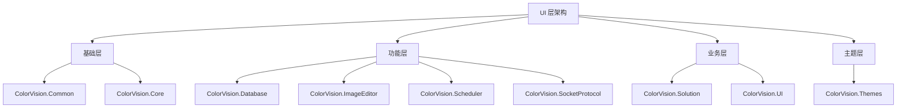
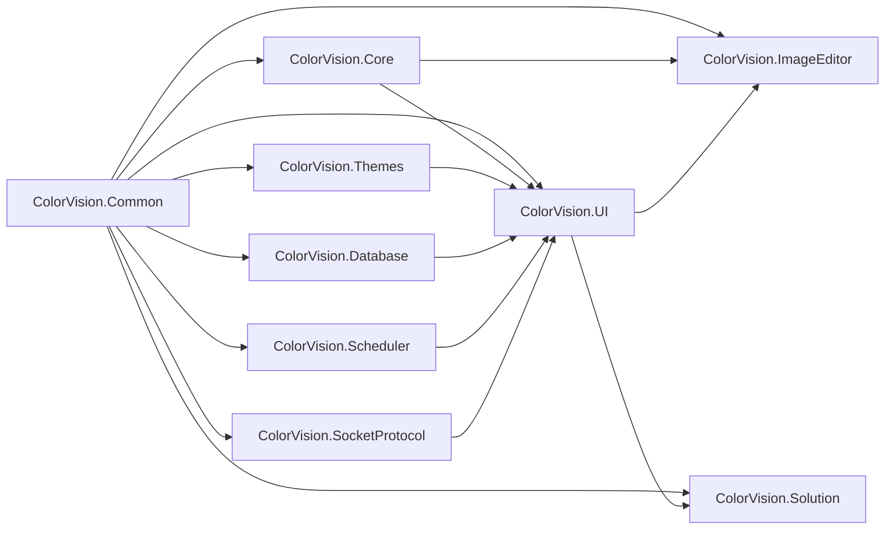

# UI组件概览

## 目录
1. [介绍](#介绍)
2. [组件架构](#组件架构)
3. [核心组件列表](#核心组件列表)
4. [组件依赖关系](#组件依赖关系)
5. [使用指南](#使用指南)
6. [开发建议](#开发建议)

## 介绍

ColorVision 的 UI 层采用模块化设计，由多个独立的组件库组成。每个组件都有特定的职责和功能，共同构建了完整的用户界面系统。本文档提供了 UI 目录下所有组件的概览和详细说明。

## 组件架构



## 核心组件列表

### 基础层组件

#### 1. [ColorVision.Common](./ColorVision.Common.md)
- **功能**: 通用框架基础封装
- **职责**: 提供 MVVM 模式支持、命令封装和接口定义
- **版本**: 1.3.8.1
- **关键特性**:
  - MVVM 架构支持
  - ActionCommand/RelayCommand 命令封装
  - 通用接口定义（IConfig, IMenuItem, IWizardStep 等）

#### 2. ColorVision.Core
- **功能**: 核心功能接口封装
- **职责**: 提供一些C++接口
- **关键特性**:
  - 底层 C++ 接口封装
  - 核心算法接口
  - 性能关键操作

### 功能层组件

#### 3. [ColorVision.Database](./ColorVision.Database.md)
- **功能**: 数据库辅助控件
- **职责**: 数据库访问和管理的UI控件
- **关键特性**:
  - 数据库连接管理UI
  - SQL查询界面
  - 数据表格显示控件

#### 4. [ColorVision.ImageEditor](./ColorVision.ImageEditor.md)
- **功能**: 图像编辑控件库
- **职责**: 专业级图像显示、编辑、标注和分析
- **版本**: 1.3.8.1
- **关键特性**:
  - RGB48 高精度图像支持
  - 丰富的绘图工具（矩形、圆形、贝塞尔曲线等）
  - 色彩调整和图像处理算法
  - 3D 可视化和直方图分析

#### 5. [ColorVision.Scheduler](./ColorVision.Scheduler.md)
- **功能**: 定时任务管理控件
- **职责**: 基于Quartz.Net的任务调度管理
- **关键特性**:
  - 可视化任务管理界面
  - 复杂的Cron调度策略
  - 实时任务监控和日志
  - 任务执行历史记录

#### 6. ColorVision.SocketProtocol
- **功能**: 网络通信协议封装
- **职责**: Socket通信的UI控件和协议管理
- **关键特性**:
  - 网络连接状态显示
  - 协议数据可视化
  - 通信日志界面

### 业务层组件

#### 7. ColorVision.Solution
- **功能**: 解决方案管理
- **职责**: 项目和解决方案的创建、打开和管理
- **关键特性**:
  - 解决方案创建和打开
  - 项目管理界面
  - 文件树导航
  - 最近文件管理
  - 权限管理集成

#### 8. [ColorVision.UI](./ColorVision.UI.md)
- **功能**: 底层UI控件库和系统服务
- **职责**: 提供应用程序UI基础设施
- **关键特性**:
  - 菜单管理和动态菜单支持
  - 配置系统和设置界面
  - 多语言支持和国际化
  - 热键系统和快捷键管理
  - 属性编辑器PropertyGrid
  - 日志系统和权限管理
  - 插件加载和管理机制

### 主题层组件

#### 9. [ColorVision.Themes](./ColorVision.Themes.md)
- **功能**: 主题和样式管理
- **职责**: 提供多种预设主题和自定义UI控件
- **关键特性**:
  - 多主题支持（系统、深色、浅色、粉色、青色）
  - ApplyTheme 动态主题切换
  - 自定义控件（消息框、进度对话框、通知窗口等）
  - 主题资源管理

## 组件依赖关系



### 依赖层级说明

1. **基础层**: ColorVision.Common 作为基础，被所有其他组件依赖
2. **功能层**: 各功能组件独立，但都依赖基础层
3. **业务层**: ColorVision.UI 集成多个功能层组件，提供统一的应用框架
4. **主题层**: ColorVision.Themes 为 UI 层提供视觉支持

## 使用指南

### 1. 新项目集成

```xml
<!-- 在项目中引入核心组件 -->
<PackageReference Include="ColorVision.Common" Version="1.3.8.1" />
<PackageReference Include="ColorVision.UI" Version="1.3.8.1" />
<PackageReference Include="ColorVision.Themes" Version="1.3.8.1" />
```

### 2. 基础应用设置

```csharp
public partial class App : Application
{
    protected override void OnStartup(StartupEventArgs e)
    {
        base.OnStartup(e);
        
        // 读取配置
        ConfigHandler.GetInstance();
        
        // 设置权限
        Authorization.Instance = ConfigService.Instance.GetRequiredService<Authorization>();
        
        // 设置日志级别
        LogConfig.Instance.SetLog();
        
        // 设置主题
        this.ApplyTheme(ThemeConfig.Instance.Theme);
        
        // 设置语言
        Thread.CurrentThread.CurrentUICulture = new System.Globalization.CultureInfo(LanguageConfig.Instance.UICulture);
        
        // 设置窗口可拖动
        MainWindow.MouseLeftButtonDown += (s, ev) =>
        {
            if (ev.ButtonState == MouseButtonState.Pressed)
                MainWindow.DragMove();
        };
    }
}
```

### 3. 功能组件使用

```xml
<!-- 图像编辑器 -->
<cv:ImageView x:Name="imageView" 
              Source="{Binding ImageSource}"
              ZoomMode="Fit"
              ShowGrid="True" />

<!-- 属性编辑器 -->
<ui:PropertyGrid SelectedObject="{Binding CurrentObject}"
                 ShowCategories="True" />

<!-- 任务调度器 -->
<scheduler:SchedulerMonitorPanel DataContext="{Binding SchedulerViewModel}" />
```

### 4. 主题应用

```xml
<Application.Resources>
    <ResourceDictionary>
        <ResourceDictionary.MergedDictionaries>
            <ResourceDictionary Source="pack://application:,,,/ColorVision.Themes;component/Themes/Dark.xaml"/>
        </ResourceDictionary.MergedDictionaries>
    </ResourceDictionary>
</Application.Resources>
```

## 开发建议

### 1. 架构原则
- **单一职责**: 每个组件专注于特定功能
- **低耦合**: 组件间通过接口交互
- **高内聚**: 相关功能集中在同一组件内
- **可扩展**: 支持插件和自定义扩展

### 2. 最佳实践
- **MVVM模式**: 使用 ColorVision.Common 提供的 ViewModelBase
- **命令绑定**: 使用 ActionCommand 和 RelayCommand
- **配置管理**: 通过 IConfig 接口统一配置
- **主题支持**: 使用 ColorVision.Themes 保持视觉一致性

### 3. 性能考虑
- **按需加载**: 只加载必要的组件
- **资源释放**: 及时释放不需要的资源
- **异步操作**: 长时间操作使用异步处理
- **内存管理**: 避免内存泄漏和过度消耗

### 4. 扩展开发

#### 自定义组件
```csharp
public class CustomComponent : UserControl
{
    // 继承基础控件实现自定义功能
}
```

#### 插件开发
```csharp
public class CustomPlugin : IPlugin
{
    public string Name => "Custom Plugin";
    public void Initialize() { /* 初始化逻辑 */ }
    public void Shutdown() { /* 清理逻辑 */ }
}
```

#### 主题扩展
```csharp
public class CustomTheme : ITheme
{
    public string Name => "Custom";
    public ResourceDictionary GetResourceDictionary() { /* 返回主题资源 */ }
}
```

## 版本兼容性

### 当前版本
- **稳定版本**: 1.3.8.1
- **目标框架**: .NET 8.0 / .NET 6.0 Windows
- **最低系统要求**: Windows 10

### 升级指南
1. 检查依赖项版本
2. 更新NuGet包引用
3. 检查API变更
4. 测试核心功能
5. 验证主题和样式

## 相关资源

- [开发者指南](../developer-guide/)
- [系统架构概览](../introduction/system-architecture/)
- [插件开发指南](../developer-guide/plugin-development/)
- [故障排除](../troubleshooting/)
- [API 参考文档](../developer-guide/api-reference/)