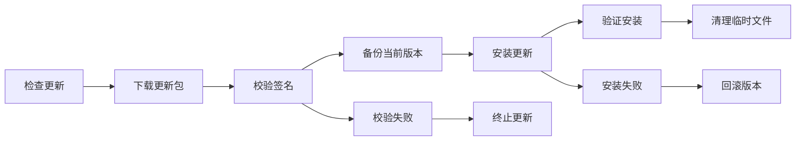

# Update System Documentation

自动更新系统文档，包括更新机制、版本管理和故障恢复。

## 目录结构

- [Auto Update Flow](auto-update-flow.md) - 自动更新流程和机制
- [Version Management](version-management.md) - 版本控制和发布策略
- [Update Rollback](update-rollback.md) - 更新失败回滚机制

## 概述

ColorVision 自动更新系统确保用户能够及时获得最新功能和安全修复：

### 更新流程

### 核心功能

- **版本检查**: 定期检查远程更新服务器
- **增量更新**: 仅下载差异文件，减少带宽使用
- **签名验证**: 确保更新包的完整性和安全性
- **自动回滚**: 更新失败时自动恢复到之前版本
- **静默更新**: 后台自动更新，不影响用户操作

### 更新策略

- **稳定版**: 经过充分测试的正式版本
- **测试版**: 包含最新功能的预览版本
- **安全更新**: 紧急安全补丁，强制更新

## 相关组件

- `ColorVisionSetup/` - 安装和更新程序
- `Scripts/update/` - 更新相关脚本

## 相关文档

- [部署文档](../deployment/README.md)
- [安全与权限控制](../security/README.md)

---

*最后更新: 2024-09-28*