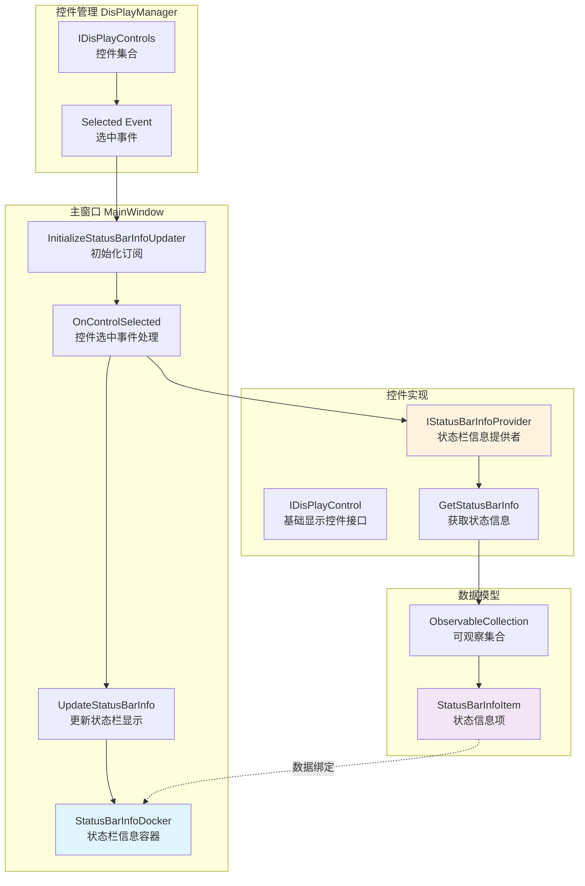
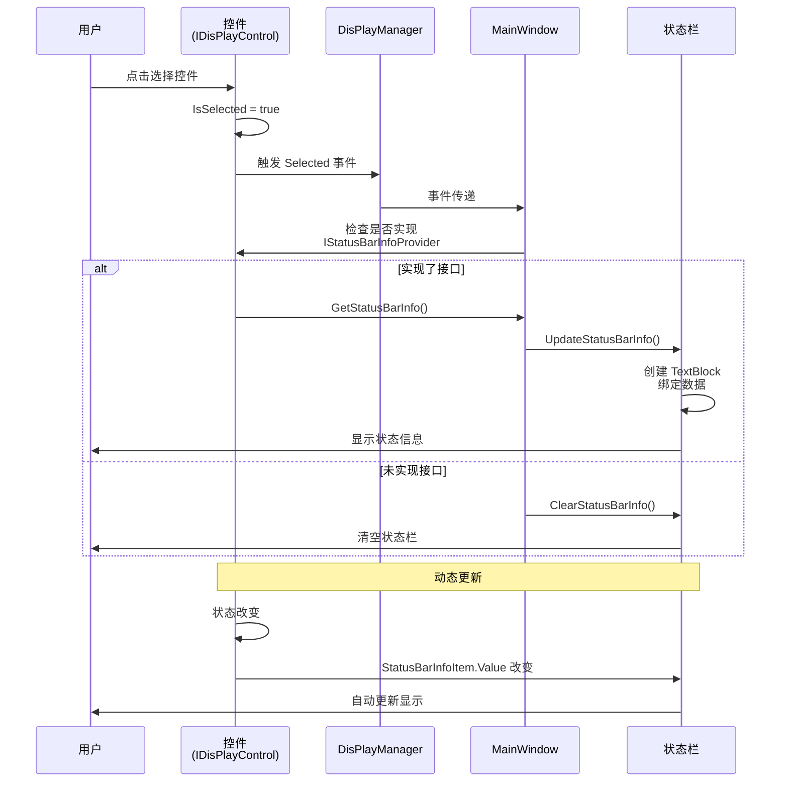
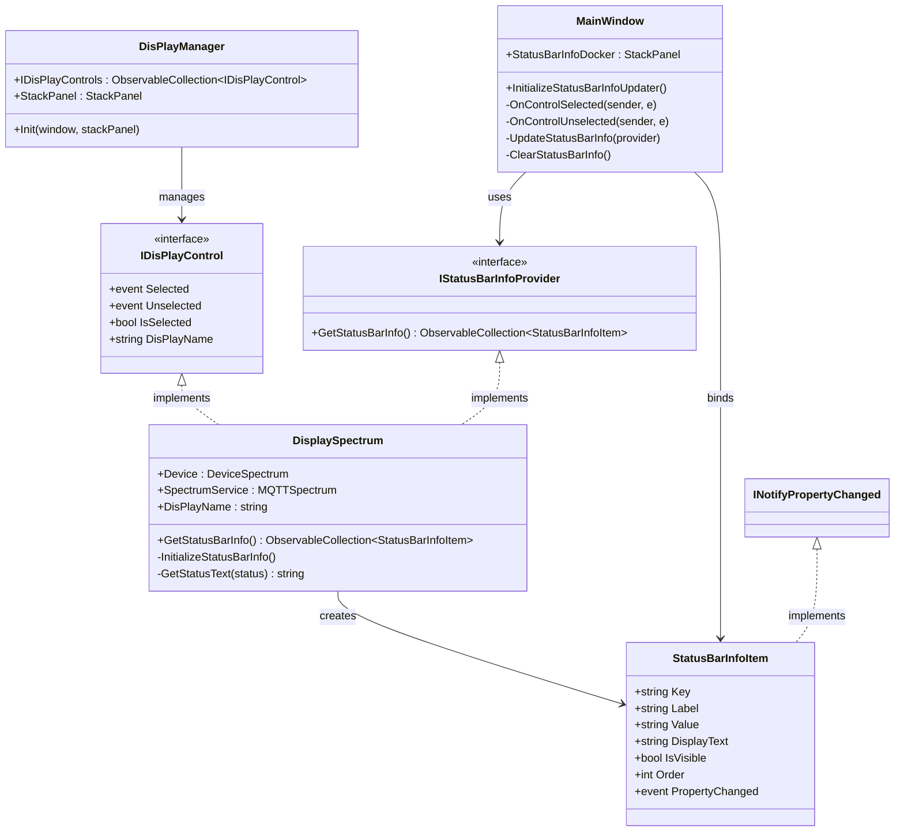

# 状态栏信息接口 - 架构设计

## 系统架构图



## 数据流程图



## 类图关系



## 核心组件职责

### 1. IStatusBarInfoProvider（接口）
- **职责**：定义获取状态栏信息的标准契约
- **方法**：`GetStatusBarInfo()` - 返回状态栏信息项集合
- **设计原则**：接口隔离原则（ISP）

### 2. StatusBarInfoItem（数据模型）
- **职责**：封装单个状态信息项
- **特性**：
  - 实现 `INotifyPropertyChanged` 支持数据绑定
  - 提供 `Key`、`Label`、`Value` 等属性
  - 支持排序（`Order`）和可见性控制（`IsVisible`）
- **设计原则**：单一职责原则（SRP）

### 3. MainWindow（协调者）
- **职责**：协调控件选择和状态栏更新
- **功能**：
  - 订阅控件选择事件
  - 检查控件是否实现 `IStatusBarInfoProvider`
  - 动态创建和绑定状态栏 UI 元素
- **设计原则**：依赖倒置原则（DIP）- 依赖接口而非具体实现

### 4. DisplaySpectrum（实现示例）
- **职责**：提供设备特定的状态信息
- **功能**：
  - 实现 `IStatusBarInfoProvider` 接口
  - 创建并管理状态信息项
  - 订阅设备事件并更新状态
- **设计原则**：开闭原则（OCP）- 对扩展开放

## 设计模式应用

### 1. 观察者模式（Observer Pattern）
- **应用**：`INotifyPropertyChanged`、事件订阅
- **优势**：自动 UI 更新，松耦合

### 2. 策略模式（Strategy Pattern）
- **应用**：不同控件提供不同的状态信息策略
- **优势**：灵活扩展，易于维护

### 3. 模板方法模式（Template Method Pattern）
- **应用**：`GetStatusBarInfo()` 提供统一的获取接口
- **优势**：标准化流程，保证一致性

## 扩展点

### 1. 新增控件支持
只需实现 `IStatusBarInfoProvider` 接口：
```csharp
public class MyNewControl : UserControl, IDisPlayControl, IStatusBarInfoProvider
{
    public ObservableCollection<StatusBarInfoItem> GetStatusBarInfo()
    {
        // 返回特定的状态信息
    }
}
```

### 2. 自定义状态项渲染
可以在 `MainWindow.UpdateStatusBarInfo()` 中添加不同的渲染逻辑：
```csharp
private void UpdateStatusBarInfo(IStatusBarInfoProvider infoProvider)
{
    // 可以根据 StatusBarInfoItem 的属性选择不同的渲染方式
    // 例如：图标、进度条、按钮等
}
```

### 3. 状态信息持久化
可以扩展 `StatusBarInfoItem` 添加持久化支持：
```csharp
public class PersistentStatusBarInfoItem : StatusBarInfoItem
{
    public void SaveToConfig() { /* 保存逻辑 */ }
    public void LoadFromConfig() { /* 加载逻辑 */ }
}
```

## 性能考虑

### 1. 延迟初始化
- 状态信息在第一次调用 `GetStatusBarInfo()` 时才创建
- 避免为未被选中的控件创建不必要的对象

### 2. 事件订阅优化
- 只在控件被添加到 `DisPlayManager` 时订阅事件
- 控件移除时自动取消订阅，防止内存泄漏

### 3. UI 更新优化
- 使用数据绑定代替手动更新 UI
- `StatusBarInfoItem` 的属性变化自动触发 UI 刷新

## 测试策略

### 1. 单元测试
```csharp
[Test]
public void StatusBarInfoItem_ValueChange_ShouldNotifyPropertyChanged()
{
    var item = new StatusBarInfoItem { Key = "Test" };
    bool eventRaised = false;
    item.PropertyChanged += (s, e) => eventRaised = true;
    
    item.Value = "NewValue";
    
    Assert.IsTrue(eventRaised);
}
```

### 2. 集成测试
```csharp
[Test]
public void MainWindow_SelectControl_ShouldUpdateStatusBar()
{
    var control = new MockControlWithStatusInfo();
    DisPlayManager.GetInstance().IDisPlayControls.Add(control);
    
    control.IsSelected = true;
    
    // 验证状态栏已更新
    Assert.IsNotNull(mainWindow.StatusBarInfoDocker.Children);
}
```

### 3. UI 测试
- 手动测试：选择不同控件，验证状态栏显示正确信息
- 自动化测试：使用 UI 自动化工具验证状态栏内容

## 总结

该架构设计具有以下特点：

1. **高内聚低耦合**：接口定义清晰，组件职责明确
2. **易于扩展**：新增控件类型无需修改现有代码
3. **性能优化**：延迟初始化和数据绑定提升效率
4. **可维护性强**：遵循 SOLID 原则，代码结构清晰
5. **灵活性高**：支持动态更新，适应不同场景需求

通过这种设计，实现了一个标准化、可扩展、易维护的状态栏信息系统，为用户提供了上下文相关的、实时更新的状态信息展示。
