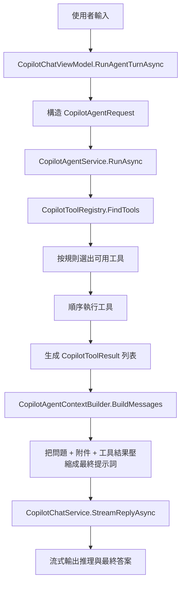

# Copilot Agent 現狀與 ReAct 演進路線

本文件說明 ColorVision 當前 Copilot Agent 的實際工作方式、它與 ReAct 風格 Agent 的差異，以及下一步如何演進到支援本地檔案讀取和更便宜的上下文檢索。

另見：Copilot Context Integration v1。該文件聚焦 Copilot 如何從獨立聊天模組演進為軟體上下文服務，與本文的 Agent/ReAct 路線互補。

## 一句話結論

當前實現不是標準的 ReAct Agent，而是“靜態候選篩選 + 最小模型 planner + 最多幾輪工具執行 + 區域性結構化檔案讀取參數 + 一次性壓縮上下文 + 一次性呼叫大模型”的只讀 Agent。

最近一輪已經開始削弱“使用者原話關鍵詞門檻”這一層靜態限制：工具登錄檔不再把 planner 可見工具硬截斷到前 6 個，SearchFiles、GrepText、GetRecentLog 也已經改成以執行時能力為主的可見性判斷，讓 planner 在存在搜尋根或最近日誌時自己決定是否先做便宜檢索。planner 解析失敗時，也不再盲目執行登錄檔裡的第一個工具，而是按當前模式和已知上下文做保守回退；如果沒有合適候選，則直接結束工具階段。

它已經具備最小工具層和最小 planner-executor 雛形，但還沒有以下能力：

- 像程式碼代理那樣繼續做檢索、修改、建置、看錯誤、再迭代
- 讓模型對更多診斷/環境工具也輸出真正結構化的參數，而不只是目前對 ReadLocalFile、SearchFiles、GrepText、GetRecentLog、FetchUrl 生效
- 支援更強的多工具連續規劃，而不是當前這種每輪偏單步的最小 planner

## 當前實際執行鏈路

當前呼叫鏈路如下：



關鍵程式碼位置：

- Agent 主流程：ColorVision/Copilot/Agent/CopilotAgentService.cs
- 工具登錄檔：ColorVision/Copilot/Agent/CopilotToolRegistry.cs
- 工具介面：ColorVision/Copilot/Agent/ICopilotTool.cs
- 上下文壓縮：ColorVision/Copilot/Agent/CopilotAgentContextBuilder.cs
- UI 接入：ColorVision/Copilot/CopilotChatViewModel.cs

## 當前工具層到底做了什麼

當前預設註冊了十一個工具，其中八個只讀工具加三個受控執行工具：

1. ExecuteMenu
   作用：按選單名稱或路徑執行主選單命令，例如“選項”“VAM”“檢查更新”，也能命中主題、語言這類選單子項。

2. SetTheme
   作用：按使用者明確意圖切換應用主題，例如淺色、深色、粉色、青色或跟隨系統。

3. SetLanguage
   作用：按使用者明確意圖切換介面語言，並複用現有重啟確認流程。

4. SearchDocs
   作用：查詢釋出後的 ColorVision 線上文件索引，按章節、頁面和頁面內標題返回最相關片段，適合軟體使用、選單、裝置、外掛、開發指南和架構說明問題。

5. FetchUrl
   作用：優先抓取 planner 透過 query 指定的 URL；如果 planner 沒給出 URL，再回退到使用者文字里的 URL 並抓取網頁正文。

6. SearchFiles
   作用：按檔名或路徑片段在當前解決方案搜尋根裡找候選檔案。

7. GrepText
   作用：按關鍵字或識別符號在當前解決方案文字檔案裡找命中行。

8. ListDirectory
   作用：列出使用者在當前訊息中明確提到的本地資料夾內容，併產出後續可讀檔案候選。

9. ReadAttachedFile
   作用：讀取“當前會話已經掛載的檔案附件”。

10. ReadLocalFile
   作用：讀取使用者在當前訊息中明確提到的本地文字檔案。

11. GetRecentLog
   作用：讀取最近日誌，並可按 planner 提供的 query 過濾結果。

這說明當前 Agent 仍然有明確的受控能力邊界：

- 它能讀取已經掛到會話裡的檔案。
- 它也能讀取當前使用者訊息裡顯式出現的本地文字檔案路徑。
- 它還能基於當前解決方案根目錄、活動文件目錄和附件所在目錄，先做一輪輕量檔名/文字檢索。
- 它現在還能訪問釋出後的 ColorVision 線上文件索引，用較小上下文回答軟體使用和開發文件問題。
- 它現在還能在顯式使用者意圖下執行少量受控動作，例如執行主選單命令、切換主題和介面語言。
- 它仍不能根據模型在對話裡臨時生成的新路徑去讀取任意本地檔案，也不能執行任意副作用操作。
- 它已經有最小結構化參數層，但參數面仍然比較窄。

## 它和 ReAct 的核心差異

ReAct 的典型模式是：

1. 模型先思考當前缺什麼資訊
2. 模型提出一個動作，例如 Search、ReadFile、Grep、RunTests
3. 系統執行動作並返回 Observation
4. 模型基於 Observation 繼續決定下一步
5. 多輪後再給出最終答案

而當前實現和理想中的完整 coding agent 仍有差距，主要有四點：

### 1. 工具不是模型決定的，而是規則提前決定的

當前是 CopilotToolRegistry.FindTools 根據 request 直接跑 CanHandle。

也就是說：

- 工具是否執行，取決於本地 C# 規則
- 不是模型在上下文中動態決定“下一步該讀哪個檔案”

### 2. 工具已有輕量結構化參數，但參數面仍有限

當前 ICopilotTool 的簽名是：

```csharp
bool CanHandle(CopilotAgentRequest request);
Task<CopilotToolResult> ExecuteAsync(CopilotAgentRequest request, CopilotAgentToolInput toolInput, CancellationToken cancellationToken);
```

這意味著工具除了拿到整個 request，也會拿到一個最小結構化輸入物件，例如：

```json
{ "tool": "read_file", "path": "...", "startLine": 1, "endLine": 200 }
```

當前這層結構化輸入主要覆蓋 query、path、startLine、endLine 四個欄位，已經足以支援搜尋、檔案讀取，以及 SetTheme/SetLanguage 這類小型應用控制動作；但它仍不像完整函式呼叫那樣有更細的 schema、權限模型和參數驗證體系。

### 3. 服務層已經有最小 planner-executor 迴圈，但還不是完整閉環

CopilotAgentService.RunAsync 的模式是：

- 每輪先讓 planner 在當前可用工具裡選擇一個動作
- 執行該工具並記錄 observation
- 在 MaxToolRounds 範圍內繼續下一輪，直到 planner finish 或工具階段收斂
- 最後再把累計工具觀察餵給模型輸出最終回答

所以它已經不是單輪“先全執行工具，再統一回答”的模式，但還沒有演進到帶編輯、測試、驗證的完整 coding loop。

### 4. 沒有針對程式碼代理的便宜檢索層

使用者期望中的流程是：

```text
使用者任務
-> Agent 判斷需要哪些上下文
-> 先用便宜工具找候選資訊
-> 壓縮候選結果
-> 發給大模型
-> 制定修改方案
-> 編輯
-> 測試/建置
-> 看錯誤
-> 繼續檢索/繼續修改
```

當前實現只覆蓋了其中一小段：

```text
使用者任務
-> 規則暴露工具
-> planner 選下一步
-> 執行受控工具
-> 壓縮結果
-> 調大模型
-> 結束
```

它沒有 grep、symbol search、AST search、embedding search、git history、diagnostics、tests 這些更便宜的候選上下文工具，也沒有修改和驗證迴圈。

## 為什麼它現在仍然不是完整的本地檔案 Agent

當前版本已經能處理“請讀取 C:\\Users\\...\\remote_control.py”這類明確路徑輸入，但仍然有明顯邊界：

1. 當前仍然不能讓模型跳出允許列表，去讀取任意新路徑
2. request 裡已經有最小的統一工具參數物件，但介面層和權限策略物件還沒有徹底獨立出來
3. 結構化參數目前已覆蓋 ReadLocalFile 與 ListDirectory 的 path，以及 SearchFiles、GrepText、GetRecentLog、SearchDocs、FetchUrl 的 query；其中 SearchFiles、GrepText、GetRecentLog 的可見性也已開始從“使用者原話關鍵詞”放寬為“能力優先”，SearchDocs 則走釋出後的穩定文件索引，FetchUrl 雖然已支援結構化 query 執行，但工具可見性仍主要依賴請求級 URL 提取
4. 服務層雖然已經能做最小 planner-executor 迴圈，但還不是更強的多工具規劃閉環
5. 當前檔案讀取雖然支援按行範圍精讀，但還沒有更細的片段定位、symbol 級讀取和 AST 級上下文

所以它已經邁出了第一步，但還不是一個真正的程式碼檢索 Agent。

## 推薦的演進方向

不建議一步直接跳到“完整 coding agent”。更穩的路線是分三層演進。

### 階段 1：先支援顯式路徑的本地檔案讀取

目標：當使用者明確給出一個路徑時，Agent 能安全地讀取該檔案。

這一步不要求完整 ReAct，只需要把當前最小多輪 Agent 擴一下即可。

當前狀態：已實現最小版本，能夠從當前使用者訊息裡提取顯式本地路徑，並把顯式檔案與顯式資料夾分流處理；也已經補上基於解決方案搜尋根的 SearchFiles 和 GrepText，以及針對本地資料夾的 ListDirectory，並支援 `ListDirectory(path) -> ReadLocalFile(batch-all)` 與 `SearchFiles/GrepText -> ReadLocalFile(path, startLine, endLine)` 這種最小兩輪鏈式執行。對於顯式目錄分析場景，首個 ReadLocalFile 會優先批次讀取當前目錄下全部候選檔案，而不是繼續逐檔案消耗輪次。

#### 建議新增能力

1. 在 CopilotAgentRequest 中加入執行上下文

當前已經接入的欄位：

- SearchRootPaths
- ActiveDocumentPath

後續仍建議補充的欄位：

- AllowedReadRoots
- AllowExternalRead
- MaxToolCalls

2. 新增 ReadLocalFile 工具

建議輸入參數：

- path
- startLine
- endLine
- reason

建議返回內容：

- 實際解析後的路徑
- 檔案摘要
- 讀取的片段內容
- 截斷資訊
- 錯誤資訊

3. 先做顯式路徑觸發，不急著做模型規劃

最便宜的第一版可以這樣做：

- 如果使用者訊息裡出現看起來像檔案路徑的文字
- 且路徑在允許範圍內
- 則自動呼叫 ReadLocalFile

這一步足以覆蓋截圖裡的場景。

#### 安全邊界

這一步必須帶檔案訪問策略，否則很容易越權讀取：

- 預設只允許工作區內路徑
- 工作區外路徑需要使用者顯式授權
- 只允許白名單文字副檔名，例如 .cs .xaml .py .json .md .txt .log
- 單次讀取限制最大字元數和行數
- 二進位制檔案直接拒絕
- 在執行過程裡顯示“讀取了哪個路徑、讀了多少行”

### 階段 2：補齊“便宜檢索工具層”

目標：讓 Agent 在呼叫大模型前，先自己收集候選上下文，而不是隻靠附件和 URL。

當前狀態：階段 2 已完成最小落地版本，SearchFiles、GrepText、GetRecentLog 與 SearchDocs 已接入預設工具表；其中 SearchDocs 透過釋出後的 docs-search-index.json 查詢 ColorVision 線上文件，不再要求使用者先給出 URL。工具登錄檔也已去掉前 6 項硬截斷，SearchFiles、GrepText、GetRecentLog 現在會優先按執行時能力暴露給 planner，但還沒有按 glob/正則/符號級別繼續細化。執行層對 FetchUrl 也已補齊結構化 query、重複檢測和執行摘要，不再只把它當成“使用者原句裡附帶 URL 的特例工具”。

後續建議新增或增強的只讀工具：

1. SearchFiles
   作用：進一步支援 glob、目錄約束和結果排序。

2. GrepText
   作用：進一步支援正則、上下文行和更穩定的查詢提取。

3. ReadLocalFile
   作用：按路徑和行號讀取檔案片段。

4. ReadSymbolSummary
   作用：按類名、方法名、屬性名找定義附近片段。

5. GetDiagnostics
   作用：收集最近的建置/診斷錯誤摘要。

6. GetGitDiff / GetGitHistory
   作用：理解當前改動和歷史語義。

這一層完成後，就能更接近使用者期待的流程：

```text
問題
-> 便宜檢索
-> 壓縮候選結果
-> 發給大模型
```

### 階段 3：再演進到真正的 ReAct / Planner-Executor 閉環

目標：讓模型先決定“下一步做什麼”，而不是本地規則一次性選完工具。

推薦改成兩層模型：

1. Planner
   只負責輸出下一步動作，不直接回答使用者。

2. Answerer
   在工具觀察足夠後，負責生成最終回答。

建議迴圈：

```text
for step in 1..N:
  planner -> 輸出結構化 action
  executor -> 校驗並執行 action
  observation -> 追加到軌跡
  若 action == final_answer 則結束
```

結構化動作建議至少支援：

- search_files
- grep_text
- read_file
- read_log
- fetch_url
- final_answer

這樣模型才能在讀完一個檔案後繼續說：

- 還需要 grep 某個符號
- 還需要開啟另一個檔案
- 還需要看最新建置錯誤

這才是真正接近 ReAct 的關鍵。

## 建議的程式碼改造點

### 1. CopilotAgentModels.cs

當前狀態：已經補上 `CopilotToolCall`、`CopilotToolObservation`、`CopilotAgentStepRecord` 這些最小軌跡模型，服務層也會把每輪工具執行記成 step record；但還沒有獨立的 runtime context、tool schema 和真正的 `tool call` 執行契約。

建議新增：

- CopilotAgentRuntimeContext
- CopilotToolArgument

目標：讓工具呼叫從“整個 request 觸發”變成“指定工具 + 參數呼叫”。

### 2. ICopilotTool.cs

當前狀態：執行鏈路已經引入最小的統一工具參數物件，用來承載 query/path/startLine/endLine；現有已結構化工具已經直接消費該物件，但 `ICopilotTool.ExecuteAsync(request, ...)` 仍然依賴 request 聚合物件，相容訪問器也還保留在 request 模型上。

建議演進成：

```csharp
public interface ICopilotTool
{
    string Name { get; }
    string Description { get; }
    ToolSchema Schema { get; }
    Task<CopilotToolResult> ExecuteAsync(CopilotToolCall call, CopilotAgentRuntimeContext context, CancellationToken cancellationToken);
}
```

這樣 ReadLocalFile 才能讀取模型指定的 path、startLine、endLine。

### 3. CopilotToolRegistry.cs

當前問題：只有 FindTools，沒有 ResolveTool(name)。

建議新增：

- 根據名稱解析工具
- 返回工具 schema 列表給 planner prompt
- 保留一層靜態啟發式候選過濾，避免 planner 任意亂調工具

### 4. CopilotAgentService.cs

當前狀態：雖然已經有最小模型驅動迴圈，也已經會記錄 step record 並把 observation 送入最終回答，但還不是完整的 planner-executor。

建議拆成三段：

1. BuildCandidateContextAsync
   跑便宜搜尋和啟發式工具

2. PlanNextActionAsync
   讓 planner 生成下一步結構化動作

3. ExecuteLoopAsync
   執行動作並把 observation 追加回上下文

第一版可以只支援最多 3 到 5 步，先保持簡單。

### 5. CopilotAgentContextBuilder.cs

當前狀態：它已經拆出 `BuildPlannerMessages`、`BuildAnswerMessages`、`BuildObservationSummary` 三個入口，不再只負責“最終回答提示詞”；但 planner 和 answer 仍共享同一套 observation 序列化策略，還沒有更細的 token 預算和摘要層級。

建議拆成：

- BuildPlannerMessages
- BuildAnswerMessages
- BuildObservationSummary

這樣可以控制 token，避免把整個軌跡原樣塞給最終回答模型。

### 6. CopilotChatViewModel.cs

當前問題：傳給 Agent 的只有 UserText、History、Attachments、Mode。

建議增加：

- 當前工作區根
- 當前活動檔案
- 選中文字
- 使用者顯式授權的可讀目錄
- 使用者是否允許讀取工作區外檔案

這部分是本地檔案讀取最需要的入口。

## 對“本地檔案讀取”最務實的下一步建議

如果目標是儘快解決截圖裡的問題，推薦不要直接做完整 ReAct，而是按下面順序推進：

1. 把 ReadLocalFile 從“整檔案讀取”升級成“按路徑 + 行範圍讀取片段”
2. 給 SearchFiles 增加更穩定的檔名/glob 提取與排序
3. 給 GrepText 增加正則、上下文行和更嚴格的掃描預算
4. 只允許工作區內路徑預設直讀
5. 工作區外路徑彈一次確認或要求使用者先授權
6. 在執行過程面板展示更結構化的檢索摘要
7. 最後把最小 planner 升級成支援結構化參數和多工具決策的完整 Planner-Executor 迴圈

這樣收益最大，風險最低。

## 推薦的下一版目標

建議把下一版目標定義為：

> 讓 Agent 在只讀模式下，能安全讀取工作區內顯式路徑檔案，並在回答前自動執行 1 到 2 個便宜檢索動作。

這是一個清晰、可驗證、風險可控的中間里程碑。

完成這個里程碑後，再繼續往完整 ReAct 演進會更穩。

## 參考實現順序

```text
Phase 1
  Add CopilotReadLocalFileTool
  Add runtime context and read policy
  Support explicit path detection

Phase 2
  Add SearchFiles / GrepText
  Add candidate context compression

Phase 3
  Add planner prompt -> structured tool call
  Add executor loop

Phase 4
  Add diagnostics / build / test read-only tools
  Decide whether to move to edit-capable coding agent
```

## 總結

當前 Agent 已經有一個正確的起點：

- 有獨立工具抽象
- 有工具登錄檔
- 有執行過程面板
- 有工具結果壓縮層

但它離 ReAct 還差三個關鍵層：

1. 結構化工具呼叫
2. 更強的多步 planner-executor 閉環
3. 面向程式碼場景的便宜檢索工具集

如果只是為了儘快繼續逼近 ReAct，最佳下一步不是直接上完整 coding agent，而是在當前已落地的顯式 tool-args 介面基礎上，繼續補更多診斷工具、提高 planner-executor 閉環品質，並逐步引入更便宜但更懂程式碼結構的檢索能力。