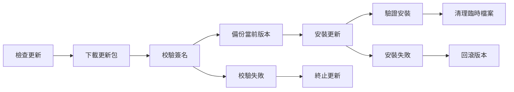

# Update System Documentation

自動更新系統文件，包括更新機制、版本管理和故障恢復。

## 目錄結構

- [Auto Update Flow](auto-update-flow.md) - 自動更新流程和機制
- [Version Management](version-management.md) - 版本控制和釋出策略
- [Update Rollback](update-rollback.md) - 更新失敗回滾機制
- [Changelog Window](changelog-window.md) - 更新日誌視窗詳細文件

## 概述

ColorVision 自動更新系統確保使用者能夠及時獲得最新功能和安全修復：

### 更新流程

### 核心功能

- **版本檢查**: 定期檢查遠端更新伺服器
- **增量更新**: 僅下載差異檔案，減少頻寬使用
- **簽名驗證**: 確保更新包的完整性和安全性
- **自動回滾**: 更新失敗時自動恢復到之前版本
- **靜默更新**: 後臺自動更新，不影響使用者操作

### 更新策略

- **穩定版**: 經過充分測試的正式版本
- **測試版**: 包含最新功能的預覽版本
- **安全更新**: 緊急安全補丁，強制更新

## 相關元件

- `ColorVisionSetup/` - 安裝和更新程式
- `Scripts/update/` - 更新相關指令碼

## 相關文件

- [部署文件](../deployment/README.md)
- [安全與權限控制](../security/README.md)

---

*最後更新: 2024-09-28*