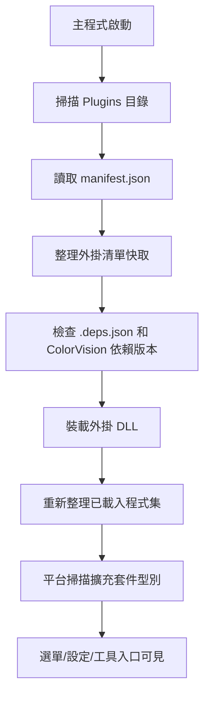

# Plugin Lifecycle

---
**Metadata:**
- Title: Plugin Lifecycle - Discovery, Loading, and Management
- Status: draft
- Updated: 2024-09-28
- Author: ColorVision Development Team
---

## 簡介

本文件詳細描述 ColorVision 外掛系統的完整生命週期，包括外掛發現、裝載、初始化、執行時管理、以及解除安裝過程。還涵蓋了失敗隔離機制和版本相容性策略。

## 目錄
# 外掛生命週期

本頁描述當前倉庫裡可以直接從程式碼確認的外掛執行路徑，不再使用舊版“獨立外掛宿主 + 非同步生命週期介面”的敘述。

## 從啟動到可用的大致過程

## 1. 發現外掛

`PluginLoader.LoadPlugins()` 會掃描執行目錄下的 `Plugins/`。每個子目錄都被視為一個候選外掛目錄。

平台優先尋找：

- `manifest.json`
- 外掛主 DLL
- 可選的 `.deps.json`

如果目錄裡存在 `manifest.json`，平台會讀取外掛 ID、名稱、描述、DLL 路徑等資訊，並把這些資訊同步到內部配置快取。

如果目錄裡沒有清單，平台仍會嘗試按“目錄名同名 DLL”方式裝載，但這只是相容行為，不建議作為正式交付方式。

## 2. 清理和同步外掛列表

在掃描開始時，平台會先把配置裡已經記錄、但磁碟上已經不存在的外掛 ID 從快取中移除。也就是說，外掛目錄的存在狀態會反向影響平台的已知外掛列表。

這也是為什麼刪掉外掛目錄後，下一次啟動時外掛會從管理列表中消失。

## 3. 校驗依賴

如果外掛目錄中帶有一個 `.deps.json`，平台會讀取依賴關係，並重點檢查 `ColorVision.*` 相關程式集：

- 目標 DLL 是否存在於主程式目錄
- 實際版本是否滿足外掛宣告的最低版本

如果版本不滿足，外掛會停止裝載，並給出日誌或提示資訊。

## 4. 裝載程式集

當清單和依賴檢查透過後，平台會：

1. 計算外掛主 DLL 的實際路徑。
2. 使用 `Assembly.LoadFrom(...)` 裝載程式集。
3. 記錄程式集名稱、版本、路徑、建置時間等資訊。
4. 在所有外掛裝載完成後重新整理程式集列表。

當前程式碼路徑裡，外掛裝載是“把程式集加入主程序並參與後續型別掃描”，而不是為每個外掛建立獨立宿主或可回收載入上下文。

## 5. 擴充套件點生效

DLL 被裝載後，平台會在已載入程式集上繼續掃描擴充套件型別。常見結果包括：

- 選單項提供者被發現
- 設定頁或配置項提供者被發現
- 狀態列、工具視窗或其他擴充套件入口被發現

因此，一個外掛是否“看起來可用”，往往不取決於是否單純被裝載，而取決於程式集裡有沒有實現平台期望的 provider 介面。

## 6. 更新與管理

外掛資訊被記錄後，平台可以基於快取中的外掛資訊做管理和更新提示。更新邏輯和外掛市場整合位於 UI 層外掛相關模組中，但它們建立在前面這套掃描和裝載結果之上。

## 發生問題時先查什麼

### 外掛目錄存在，但完全沒有被識別

- 檢查 `manifest.json` 是否存在且可解析
- 檢查 `dllpath` 是否正確
- 檢查 DLL 是否真的複製到了外掛目錄中

### 外掛被識別，但裝載失敗

- 檢查 `.deps.json` 中對 `ColorVision.*` 的版本要求
- 檢查主程式目錄裡是否存在需要的依賴 DLL
- 檢視日誌中的依賴版本不足或 DLL 缺失提示

### 外掛已裝載，但選單或功能沒出現

- 檢查是否實現了對應的 provider 介面
- 檢查入口型別是否滿足非抽象、非開放泛型、公開無參構造等基本要求

## 說明

- 當前文件只描述倉庫中直接可見的裝載路徑。
- 舊文件裡關於 `PluginContext`、權限系統、隔離宿主、可解除安裝上下文等內容，不能作為當前主路徑實現的預設依據。