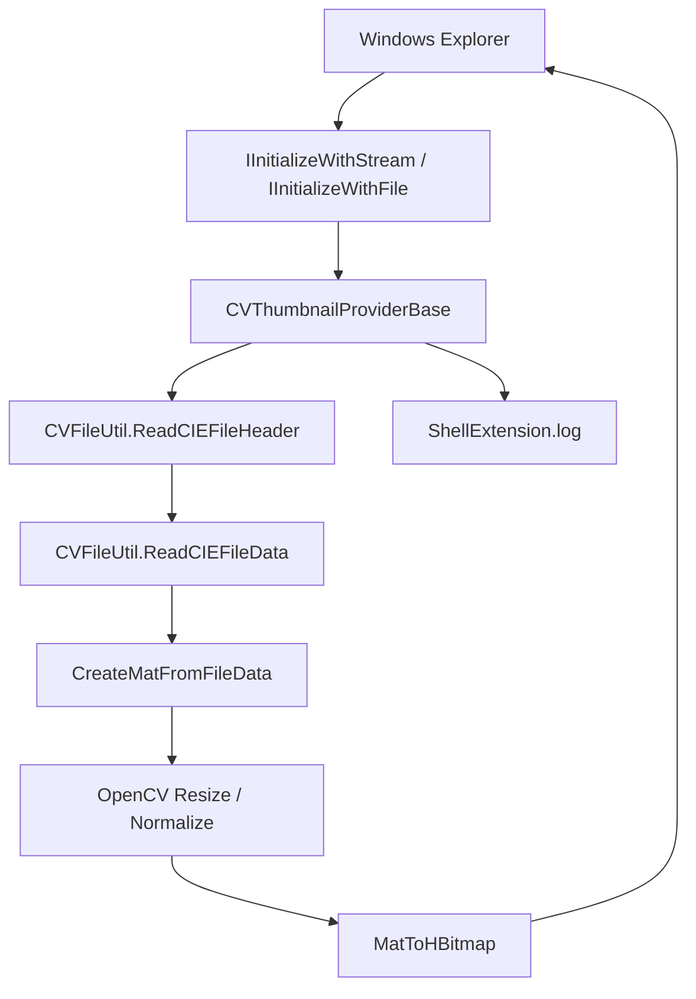

# ColorVision.ShellExtension

`ColorVision.ShellExtension` 是 Windows Explorer 的縮略圖擴充，不屬於主程式裡的 Engine 業務執行鏈。它的作用是讓現場人員在資料夾中直接預覽 `.cvraw` 和 `.cvcie` 檔案。

## 目前定位

| 項目 | 目前狀態 |
| --- | --- |
| 原始碼目錄 | `Engine/ColorVision.ShellExtension/` |
| 工程文件 | `ColorVision.ShellExtension.csproj` |
| 目標平台 | x64 |
| 關鍵建置屬性 | `EnableComHosting=true`、`EnableDynamicLoading=true`、`AllowUnsafeBlocks=true` |
| 輸出重點 | `ColorVision.ShellExtension.comhost.dll`、`ColorVision.ShellExtension.dll`、`ColorVision.FileIO.dll`、OpenCvSharp runtime |
| 支援格式 | `.cvraw`、`.cvcie` |
| 外部宿主 | Windows Explorer |
| 日誌 | `%APPDATA%\ColorVision\Log\ShellExtension.log` |

它依賴 [ColorVision.FileIO](./ColorVision.FileIO.md) 讀取 ColorVision 自訂檔案頭和像素資料，再用 OpenCvSharp 產生 `HBITMAP` 交給 Explorer。

## 呼叫鏈



交接時先看 `CVThumbnailProviderBase.cs`。它統一處理 Explorer 初始化、讀檔、例外保護、OpenCV resize、`HBITMAP` 建立和日誌。

## 關鍵文件

| 文件 | 作用 | 交接重點 |
| --- | --- | --- |
| `ColorVision.ShellExtension.csproj` | COM hosting、dynamic loading、x64 和依賴 | 是否生成 `.comhost.dll`，OpenCvSharp runtime 是否進入輸出 |
| `CVThumbnailProviderBase.cs` | Shell 縮略圖公共基類 | Explorer 初始化、HRESULT 回傳、例外不能拋出 |
| `CVRawShellThumbnailProvider.cs` | `.cvraw` provider，CLSID `{7B5E2A3C-8F1D-4E6A-B9C2-1D3E5F7A8B9C}` | RAW/SRC 資料如何轉成 OpenCV Mat |
| `CVCieShellThumbnailProvider.cs` | `.cvcie` provider，CLSID `{8C6F3B4D-9E2A-5F7B-C3D4-2E4F6A8B9C0D}` | 三通道 XYZ 目前只取第一通道做縮略圖 |
| `Interop/ShellInterfaces.cs` | Windows Shell COM 介面 | GUID 和 `PreserveSig` 不要隨意改 |
| `ShellLog.cs` | Explorer 進程內日誌 | 日誌失敗不能影響 Explorer |
| `Register.ps1` | 註冊 COM server 和檔案副檔名 handler | 需要管理員，會改 HKCR/HKLM、重啟 Explorer、清縮略圖快取 |
| `Unregister.ps1` | 移除 handler 和 COM server | 回退時先執行 |

## 格式行為

`CVRawShellThumbnailProvider` 目前把 `CVType.Raw` 和 `CVType.Src` 當作直接像素資料處理；非 8-bit 資料會 normalize 到 0-255。

`CVCieShellThumbnailProvider` 處理 `CVType.CIE`。三通道 CIE/XYZ 資料目前只取第一通道用於縮略圖顯示。Explorer 縮略圖只是快速辨識，不等同於主程式裡的完整 CIE 顏色分析。

## 註冊與卸載

```powershell
dotnet build Engine/ColorVision.ShellExtension/ColorVision.ShellExtension.csproj -c Release -p:Platform=x64
Engine/ColorVision.ShellExtension/Register.ps1
Engine/ColorVision.ShellExtension/Unregister.ps1
```

`Register.ps1` 會註冊 `ColorVision.ShellExtension.comhost.dll`，寫入 `.cvraw` / `.cvcie` 的 thumbnail provider 註冊表項，嘗試加入 approved shell extension，並重啟 Explorer、清理縮略圖和圖示快取。

## 目前腳本風險

目前 `Register.ps1` 的 `$handlerClsid` 是 `{7B5E2A3C-8F1D-4E6A-B9C2-1D3E5F7A8B9C}`，也就是 `CVRawShellThumbnailProvider` 的 CLSID；腳本把 `.cvraw` 和 `.cvcie` 都綁到這個 CLSID。

交接時要確認 `.cvcie` 是否確實要共用同一 handler。如果要走 `CVCieShellThumbnailProvider`，應把 `.cvcie` 綁到 `{8C6F3B4D-9E2A-5F7B-C3D4-2E4F6A8B9C0D}`，再重新驗證兩種檔案。

## 驗收清單

| 驗收項 | 通過標準 |
| --- | --- |
| 建置輸出 | `bin/x64/Release/net10.0-windows/` 下存在 `.dll`、`.comhost.dll`、`.deps.json`、`.runtimeconfig.json` |
| 依賴輸出 | 有 `ColorVision.FileIO.dll`、OpenCvSharp 和 `runtimes/win-x64/native` |
| 註冊 | 管理員執行成功，`regsvr32` 返回成功 |
| 註冊表 | `.cvraw` 和 `.cvcie` handler 指向預期 CLSID |
| Explorer | 重啟後能顯示縮略圖 |
| 日誌 | `%APPDATA%\ColorVision\Log\ShellExtension.log` 有初始化和 `GetThumbnail` 記錄 |
| 回退 | `Unregister.ps1` 可移除綁定並清快取 |

## 排障

| 現象 | 優先檢查 |
| --- | --- |
| 沒有縮略圖 | COM host 註冊、shellex key、Explorer 重啟、快取清理 |
| 只有 `.cvraw` 正常 | `.cvcie` CLSID 綁定和 CIE provider 是否被呼叫 |
| 沒有日誌 | Explorer 是否載入擴充、日誌目錄是否可寫 |
| header 讀取失敗 | 檔案是否符合目前 [ColorVision.FileIO](./ColorVision.FileIO.md) 支援格式 |
| native DLL 缺失 | OpenCvSharp runtime 和 `runtimes/win-x64/native` 是否在輸出 |
| Explorer 不穩 | 先卸載擴充、清快取，再用小檔案復測 |

主程式內的圖像查看、ROI/POI overlay、Flow、模板、設備、MQTT 和專案輸出都不屬於本模組。主程式結果問題請先看 [結果展示與專案交接鏈路](./result-handoff-chain.md) 或 [ColorVision.ImageEditor](../ui-components/ColorVision.ImageEditor.md)。
