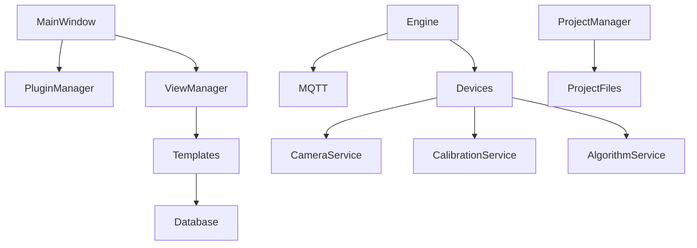
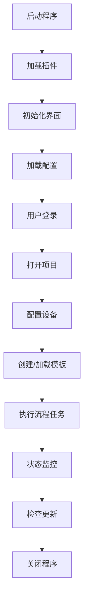

# 概述


# ColorVision Windows WPF 应用项目概述

---

## 1. 项目介绍

### 1.1 项目目的
ColorVision由ColrVision Inc开发，是一款基于Windows WPF技术的应用程序，旨在提供先进的色彩管理和光电技术解决方案。项目聚焦于光电设备的管理与控制，结合色彩处理、流程自动化和灵活的插件架构，满足多设备、多语言及多主题需求。

### 1.2 核心目标与功能
- 支持多物理设备配置与控制：相机、校准设备、算法模块、光谱仪、传感器、电机、文件服务器等。
- 流程引擎任务调度，支持复杂流程自动化执行。
- 模板管理：支持模板的创建、编辑、导入导出、快速检测和数据库管理。
- 多语言多主题支持，符合国际化需求。
- 热键支持，提供窗口和全局两种热键管理模式。
- 插件架构支持第三方功能扩展。
- 工程项目管理，支持归档和数据导出。
- 自动和手动软件更新机制。
- MQTT通信协议提供设备间数据交互。
  
### 1.3 目标用户
- 光电技术研发与应用人员
- 色彩管理专业人员
- 工业自动化流程管理者
- 软件插件开发者
- 跨语言跨地域用户

### 1.4 技术领域
- Windows桌面应用开发（WPF）
- 设备驱动与控制（MQTT通信）
- 图像处理与色彩管理
- 多语言与主题切换实现
- 数据库与文件系统管理
- 任务调度与流程引擎

---

## 2. 技术架构

### 2.1 架构总览
该系统采用模块化分层架构，主要由以下核心模块构成：
- **UI层**：主窗口、菜单、操作区、状态栏、视图窗口、主题与多语言支持、热键管理。
- **Engine层**：核心流程引擎、服务管理模块（设备服务、校准、算法等）、MQTT通信。
- **项目与工程管理**：项目窗口管理、工程文件操作和归档。
- **插件框架**：插件接口定义（IPlugin）及自动加载，支持扩展功能。
- **任务计划模块**：任务调度与计划执行支持。
- **更新模块**：自动及手动软件更新实现。

### 2.2 组件职责
- **主窗口**：作为用户交互入口，包含菜单、状态栏、操作区，管理视图窗口和设置界面。
- **流程引擎**：管理设备配置及自动化执行流程任务，借助MQTT作为交互协议。
- **设备服务**：封装具体设备驱动和参数管理，支持物理相机及其他硬件设备。
- **模板管理**：处理模板数据的创建、保存、导出，结合数据库管理。
- **多语言与主题**：通过资源文件和样式资源实现多语言及主题切换。
- **插件管理**：动态加载目录下符合接口定义的插件。
- **任务计划**：支持定时、重复及多种执行策略的任务管理。
- **升级组件**：负责检查与执行应用程序更新。

### 2.3 设计原则与模式
- 采用模块化设计，降低耦合，方便扩展。
- 使用MVVM设计模式进行UI架构。
- 通过接口抽象支持多语言、主题、设备和插件。
- MQTT消息机制支持异步设备通信。
- 资源管理支持国际化及动态主题切换。
- 插件架构提升系统灵活度。

### 2.4 关键系统关系与边界
- UI依赖Engine层的服务和设备管理接口。
- 流程引擎依赖MQTT及数据库支撑。
- 插件通过接口解耦核心程序，实现动态扩展。
- 外部依赖OpenCV及多种WPF控件库。
- 系统边界主要为Windows桌面操作环境和所支持的外设环境。

### 2.5 架构图示（Mermaid）
```mermaid
graph LR
    UI[用户界面 (WPF)]
    Engine[流程引擎层]
    Devices[设备服务模块]
    MQTT[MQTT通信协议]
    Plugins[插件管理]
    Project[项目与工程管理]
    Tasks[任务计划]
    Update[更新模块]
    DB[数据库]

    UI -->|调用| Engine
    Engine --> Devices
    Devices --> MQTT
    Engine --> DB
    UI --> Plugins
    Engine --> Tasks
    UI --> Project
    UI --> Update
```

---

## 3. 实现细节

### 3.1 主要入口
- 入口主程序为 `ColorVision/MainWindow.xaml.cs`，负责程序启动、UI初始化及插件加载。
```csharp
public partial class MainWindow : Window
{
    public MainWindow()
    {
        InitializeComponent();
        PluginManager.LoadPlugins();
        // 初始化UI及设备服务
    }
}
```

### 3.2 核心模块
- Engine层中的服务管理目录包括设备服务（相机、校准、算法等），核心流程逻辑，数据处理。
- UI层详细划分视图窗口、视图配置、主题及热键控制，实现MVVM架构。
- 模板模块实现模板生命周期管理，包含编辑、检测和数据库交互。
- MQTT通信模块封装设备间消息传递。

### 3.3 配置管理
- 配置集中在App.config及资源文件。
- 日志采用log4net。
- 更新路径配置在外部配置文件。
- 多语言资源通过Resx资源文件管理。

### 3.4 依赖与集成
- 基于.NET 6.0，WPF生态。
- HandyControl、Extended.Wpf.Toolkit等UI组件库。
- OpenCV用于图像处理，涉及多个opencv核心组件。
- spdlog日志库。
- MQTT用于设备消息传递。

### 3.5 组件关联图示（Mermaid）


---

## 4. 关键功能

### 4.1 设备管理
- 多种物理设备支持（LV、BV、CV相机等）。
- 设备配置管理，支持许可证与校准文件配置。
- 使用MQTT异步通信实现设备控制。

代码示例（设备服务初始化）：
```csharp
public class DeviceManager
{
    public void InitializeDevices()
    {
        // 加载设备配置
        // 连接MQTT服务器
        // 初始化物理设备驱动
    }
}
```

### 4.2 模板管理
- 支持模板创建、编辑、导入导出（压缩包格式）。
- 快速检测模板有效性。
- 模板数据存储于数据库。

### 4.3 多语言与主题
- 支持英语、简体中文、繁体中文、日语、韩语等多语言。
- 主题支持深色、浅色及跟随系统。
- 资源文件及样式动态加载实现无缝切换。

### 4.4 任务计划执行
- 任务支持立即执行、延迟执行、多次及重复执行。
- 支持Cron表达式配置执行频率。

### 4.5 插件支持
- 插件接口IPlugin定义。
- 启动时自动加载Plugins目录下有效插件。
- 暂不支持热加载。

---

## 5. 核心流程与机制

### 5.1 流程执行机制
- 用户通过UI配置工程和项目。
- 流程引擎基于模板及参数自动执行任务。
- 任务执行状态通过状态栏反馈。
- 设备间通过MQTT通信，保证命令与数据同步。
- 任务支持多种执行模式和计划配置。

### 5.2 状态栏多实现
- 多种状态栏实现方式，支持扩展接口，显示Mysql、MQTT、RC服务状态以及硬件性能数据。

### 5.3 数据存储策略
- 模板及项目数据存于数据库。
- 支持归档和导出操作。
- 版本控制及数据同步通过数据库管理。

### 5.4 主题与语言切换流程
- 主题通过切换样式资源实现。
- 语言切换需重启程序调整线程文化设置。
- 资源文件统一管理，支持专业翻译团队协作。

流程图示（Mermaid）：


---

## 6. 结论与建议

### 6.1 架构总结
项目整体架构模块划分清晰，设计符合现代WPF应用开发规范。采用MVVM设计模式，逻辑与UI分离良好。流程引擎及设备管理模块功能完备，插件架构设计利于扩展。多语言、多主题、任务调度与更新功能设计成熟。

### 6.2 优势与最佳实践
- 充分模块化，便于维护和扩展。
- 明确接口与实现分离，支持灵活定制。
- 国际化及主题功能增强用户体验。
- 设备服务模块结构合理，支持多物理硬件集成。
- MQTT协议异步通信支持稳定高效。

### 6.3 改进建议
- 插件支持热加载，提升扩展灵活性。
- 语言切换支持运行时动态切换，优化用户便捷性。
- 增强更新模块的可配置性，支持界面动态修改更新地址。
- 优化数据库操作性能，防止模板管理瓶颈。
- 增强异常捕获与日志系统覆盖，提升系统健壮性。

### 6.4 后续发展建议
- 持续完善设备支持，接入更多硬件类型。
- 增强流程引擎扩展，支持更多复杂业务场景。
- 丰富模板管理与操作功能，增加更多检测模式与算法支持。
- 多语言资源管理自动化，提升翻译流程效率。
- 开展单元测试及自动化测试，确保代码质量。

---

## 参考链接
- [项目代码首页](https://github.com/xincheng213618/scgd_general_wpf.git)
- [主窗口MainWindow.xaml.cs](https://github.com/xincheng213618/scgd_general_wpf.git/ColorVision/MainWindow.xaml.cs)
- [插件接口](https://github.com/xincheng213618/scgd_general_wpf.git/UI/ColorVision.Common/Interfaces/IPlugin.cs)
- [流程引擎入口](https://github.com/xincheng213618/scgd_general_wpf.git/Engine/ColorVision.Engine/ColorVision.Engine.csproj)
- [模板管理目录](https://github.com/xincheng213618/scgd_general_wpf.git/Engine/ColorVision.Engine/Templates/)

