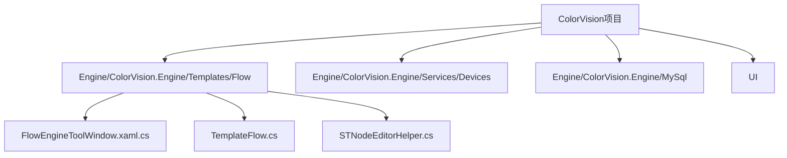
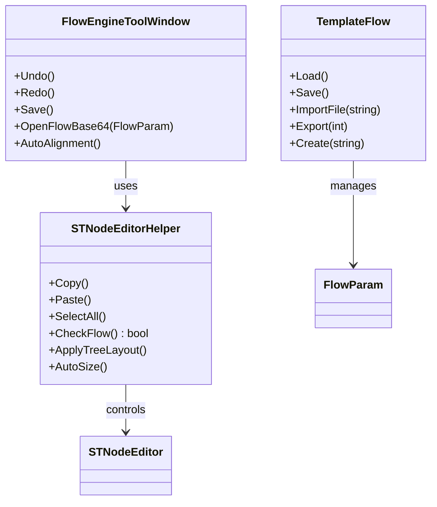
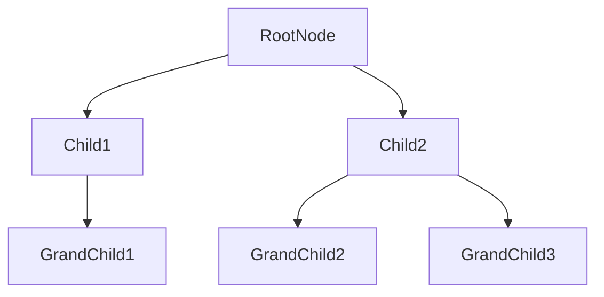

# 流程引擎


# 流程引擎

## 目录
1. [简介](#简介)
2. [项目结构](#项目结构)
3. [核心组件](#核心组件)
4. [架构概览](#架构概览)
5. [详细组件分析](#详细组件分析)
6. [依赖关系分析](#依赖关系分析)
7. [性能考虑](#性能考虑)
8. [故障排除指南](#故障排除指南)
9. [结论](#结论)

## 简介
ColorVision 的流程引擎是一个可视化的流程设计和执行工具，支持通过拖拽节点来设计复杂的测试或分析流程。用户可以通过图形化界面创建、编辑和管理流程，节点代表不同的功能模块或操作，流程参数化支持灵活配置。该引擎旨在简化测试流程的设计，提高自动化和可维护性。

本文件档将详细介绍流程引擎的架构、核心组件及其实现，帮助用户理解其设计理念和使用方法。

## 项目结构

ColorVision 项目采用模块化设计，代码按照功能模块和技术层次划分，主要涉及 UI 层、引擎层、服务层和数据访问层。流程引擎相关代码主要集中在：

```
/Engine/ColorVision.Engine/Templates/Flow/
```

该目录包含流程引擎的核心实现文件，如流程编辑窗口、流程模板管理及节点编辑辅助类。

### 主要目录说明

1. `/Engine/ColorVision.Engine/Templates/Flow/`
   - 该目录是流程引擎的核心实现位置。
   - 包含流程编辑窗口（FlowEngineToolWindow.xaml.cs）、流程模板管理（TemplateFlow.cs）和节点编辑辅助类（STNodeEditorHelper.cs）。
   - 负责实现流程的可视化编辑、流程数据的加载保存及节点管理。

2. `/Engine/ColorVision.Engine/Services/Devices/`
   - 设备服务相关实现，流程节点往往关联不同设备的服务配置。

3. `/Engine/ColorVision.Engine/MySql/`
   - 数据库访问层，负责流程模板及流程数据的持久化存储。

4. `/UI/`
   - 用户界面相关的公共控件和主题，支持流程引擎的界面展示。

5. `/Engine/ColorVision.Engine/`
   - 引擎核心代码，包含流程引擎的主逻辑和辅助工具。

整体架构体现了清晰的分层设计，UI 与引擎逻辑分离，数据访问独立，便于维护和扩展。



## 核心组件

### 1. FlowEngineToolWindow.xaml.cs
- 这是流程引擎的主编辑窗口类，基于 WPF 实现。
- 支持流程的加载、保存、撤销/重做操作。
- 通过 STNodeEditor 控件实现节点的拖拽编辑。
- 绑定命令实现快捷键支持，如 Ctrl+S 保存，Ctrl+R 刷新，Ctrl+L 自动布局。
- 处理画布缩放和平移，支持键盘箭头移动画布或节点。
- 支持流程文件的导入导出，文件格式为 `.stn` 或 Base64 编码流程数据。

### 2. TemplateFlow.cs
- 流程模板管理类，负责流程模板的加载、保存、导入导出和复制。
- 与数据库交互，使用 ModMasterDao 和 ModFlowDetailDao 访问流程模板数据。
- 支持单个或多个流程模板导出为文件或压缩包。
- 支持从文件导入流程模板，并转换为 Base64 数据存储。
- 提供创建新模板的方法，自动关联系统字典和流程详细参数。

### 3. STNodeEditorHelper.cs
- 流程节点编辑辅助类，封装了节点编辑器 STNodeEditor 的操作和事件处理。
- 管理节点的复制、粘贴、选择、删除等操作。
- 负责节点属性面板的绑定和更新，动态根据选中节点类型加载对应的属性模板。
- 实现流程图的自动布局算法，支持树形布局和多父节点布局调整。
- 提供流程合法性检查，确保存在起始节点和结束节点，并且两者间存在有效路径。
- 管理右键菜单，支持节点复制、删除、锁定位置和选项。

## 架构概览

流程引擎基于可视化节点编辑器构建，核心架构包括：

- **UI层**：FlowEngineToolWindow 提供窗口界面，STNodeEditor 控件作为画布展示和编辑流程节点。属性面板和树视图辅助编辑。
- **流程数据层**：TemplateFlow 管理流程模板的加载与保存，支持数据库和文件两种存储方式。
- **节点编辑辅助层**：STNodeEditorHelper 负责节点操作、事件响应及自动布局，实现流程编辑的交互逻辑。
- **数据库访问层**：通过 ORM 模型访问流程模板和流程详细参数，实现持久化存储。
- **命令与操作管理**：支持撤销重做命令栈，保证用户操作的可逆性。

整体架构采用 MVVM 模式，界面与逻辑分离，支持模块化扩展和高内聚低耦合。



## 详细组件分析

### FlowEngineToolWindow.xaml.cs

- **功能说明**：
  - 作为流程编辑器窗口，支持流程的可视化编辑和管理。
  - 初始化时加载流程模板数据，绑定命令，设置键盘快捷操作。
  - 支持撤销和重做操作，维护操作栈。
  - 处理画布的缩放和移动，支持键盘和鼠标交互。
  - 实现流程文件的打开、保存（包括Base64格式）和新建操作。
  - 自动保存功能，关闭窗口时提示保存。

- **关键方法**：
  1. `Undo()` / `Redo()`：管理操作栈，支持撤销和重做。
  2. `OpenFlowBase64(FlowParam flowParam)`：加载Base64编码的流程数据到画布。
  3. `Save()`：保存当前流程到文件或数据库。
  4. `AutoAlignment()`：调用 STNodeEditorHelper 实现自动布局。
  5. 事件处理：键盘事件处理节点或画布移动，鼠标事件处理拖拽等。

- **代码示例**（撤销操作）：

```csharp
public void Undo()
{
    if (UndoStack.Count > 0)
    {
        var undoAction = UndoStack[^1];
        UndoStack.RemoveAt(UndoStack.Count - 1);
        undoAction.UndoAction();
        RedoStack.Add(undoAction);
    }
}
```

- **设计亮点**：
  - 结合 WPF MVVM 设计，界面与逻辑分离。
  - 使用 ObservableCollection 管理操作栈，支持UI自动更新。
  - 通过命令绑定实现快捷键响应，提升用户体验。

### TemplateFlow.cs

- **功能说明**：
  - 管理流程模板集合，支持模板的加载、保存、导入导出。
  - 与数据库交互，支持多租户环境下的模板管理。
  - 支持导出单个模板为 `.stn` 文件，或多个模板打包为 `.zip`。
  - 支持从文件导入流程模板，转换为 Base64 存储。

- **关键方法**：
  1. `Load()`：从数据库加载所有流程模板，更新内存集合。
  2. `Save()`：保存修改的模板到数据库。
  3. `Export(int index)`：导出模板为文件或压缩包。
  4. `ImportFile(string filePath)`：导入模板文件，转换为 Base64。
  5. `Create(string templateName)`：新建流程模板并保存。

- **代码示例**（导出多个模板为zip）：

```csharp
string tempDirectory = Path.Combine(Path.GetTempPath(), Guid.NewGuid().ToString());
Directory.CreateDirectory(tempDirectory);
try
{
    foreach (var kvp in TemplateParams.Where(item => item.IsSelected == true))
    {
        string filePath = Path.Combine(tempDirectory, $"{Tool.SanitizeFileName(kvp.Key)}.stn");
        byte[] fileBytes = Convert.FromBase64String(TemplateParams[index].Value.DataBase64);
        File.WriteAllBytes(filePath, fileBytes);
    }
    using (FileStream zipToOpen = new FileStream(sfd.FileName, FileMode.Create))
    {
        using (ZipArchive archive = new ZipArchive(zipToOpen, ZipArchiveMode.Create))
        {
            foreach (string filePath in Directory.GetFiles(tempDirectory))
            {
                archive.CreateEntryFromFile(filePath, Path.GetFileName(filePath));
            }
        }
    }
}
finally
{
    Directory.Delete(tempDirectory, true);
}
```

- **设计亮点**：
  - 灵活支持单个和多个模板导出。
  - 结合数据库和文件系统，支持多种存储方式。
  - 使用 ObservableCollection 绑定UI，支持动态更新。

### STNodeEditorHelper.cs

- **功能说明**：
  - 辅助管理流程节点编辑器 STNodeEditor。
  - 实现节点的复制、粘贴、选择、删除操作。
  - 动态生成节点属性面板内容，根据节点类型绑定不同模板参数。
  - 实现流程图的自动布局，支持树形结构和多父节点特殊布局。
  - 验证流程结构合法性，确保起始和结束节点存在且连通。
  - 管理节点右键菜单，支持复制、删除及锁定操作。

- **关键方法和功能**：
  1. `Copy()` / `Paste()`：实现节点复制粘贴，复制节点属性并偏移位置。
  2. `ApplyTreeLayout()`：递归布局节点，自动调整节点位置使流程图清晰。
  3. `CheckFlow()`：检查流程中是否存在起始节点和结束节点，且两者间有路径。
  4. `AddStackPanel\<T\>()`：动态生成属性编辑面板，绑定不同设备或模板参数。
  5. 事件绑定：节点添加、激活改变，自动更新界面。

- **自动布局示意**：



- **设计亮点**：
  - 结合 WPF 和 WinForms 控件，灵活实现复杂交互。
  - 使用反射动态复制节点属性，提高复用性。
  - 自动布局算法考虑多父节点情况，保证布局合理。
  - 属性面板支持多种模板参数，方便用户配置节点细节。

## 依赖关系分析

- **模块耦合**：
  - FlowEngineToolWindow 依赖 STNodeEditorHelper 进行节点管理和布局。
  - TemplateFlow 依赖数据库访问层（ModMasterDao、ModFlowDetailDao）进行模板数据持久化。
  - STNodeEditorHelper 依赖多个设备服务集合（DeviceCamera、DeviceSensor 等）动态加载属性模板。
  - 节点类（STNode及其子类）作为流程的基本单元，贯穿编辑和执行流程。

- **接口契约**：
  - TemplateFlow 实现 ITemplate\\<FlowParam\> 接口，规范模板管理行为。
  - STNodeEditorHelper 通过事件和命令绑定与 UI 层交互，保证解耦。

- **潜在优化**：
  - 节点复制粘贴操作中大量使用反射，可能影响性能，后续可考虑缓存属性信息。
  - 自动布局算法递归较多，复杂流程时性能需关注。

## 性能考虑

- 撤销/重做操作使用 ObservableCollection 管理命令栈，支持 UI 实时响应，但栈过大时可能影响性能。
- 自动布局算法采用递归遍历节点，复杂流程图时布局计算可能较慢。
- 节点复制粘贴使用反射复制属性，频繁操作时可能成为性能瓶颈。
- 流程文件采用 Base64 编码保存，文件大小和加载速度受影响，建议合理控制流程复杂度。

## 故障排除指南

- **无法找到起始或结束节点**：
  - 确认流程中包含 MQTTStartNode 和 CVEndNode 节点。
  - 使用流程检查功能（CheckFlow）验证流程连通性。

- **流程保存失败**：
  - 确认流程文件路径有效，数据库连接正常。
  - 检查是否有未保存的操作阻塞。

- **节点无法复制或粘贴**：
  - 确认选中节点有效。
  - 检查是否有权限或锁定限制。

- **自动布局异常**：
  - 确认流程结构合理，无循环依赖。
  - 尝试手动调整节点位置后重新自动布局。

## 结论

ColorVision 的流程引擎通过可视化节点编辑实现复杂流程的设计与执行，具备强大的模板管理和自动布局功能。其架构合理，模块分明，支持多种设备和算法节点，满足多样化测试需求。通过撤销重做、快捷键支持和属性动态绑定，提升了用户体验。未来可在性能优化和界面交互上持续改进，进一步提升系统稳定性和易用性。

本档详细解析了流程引擎的关键代码文件，帮助用户和开发者深入理解其设计与实现，为后续使用、维护和扩展提供坚实基础。

