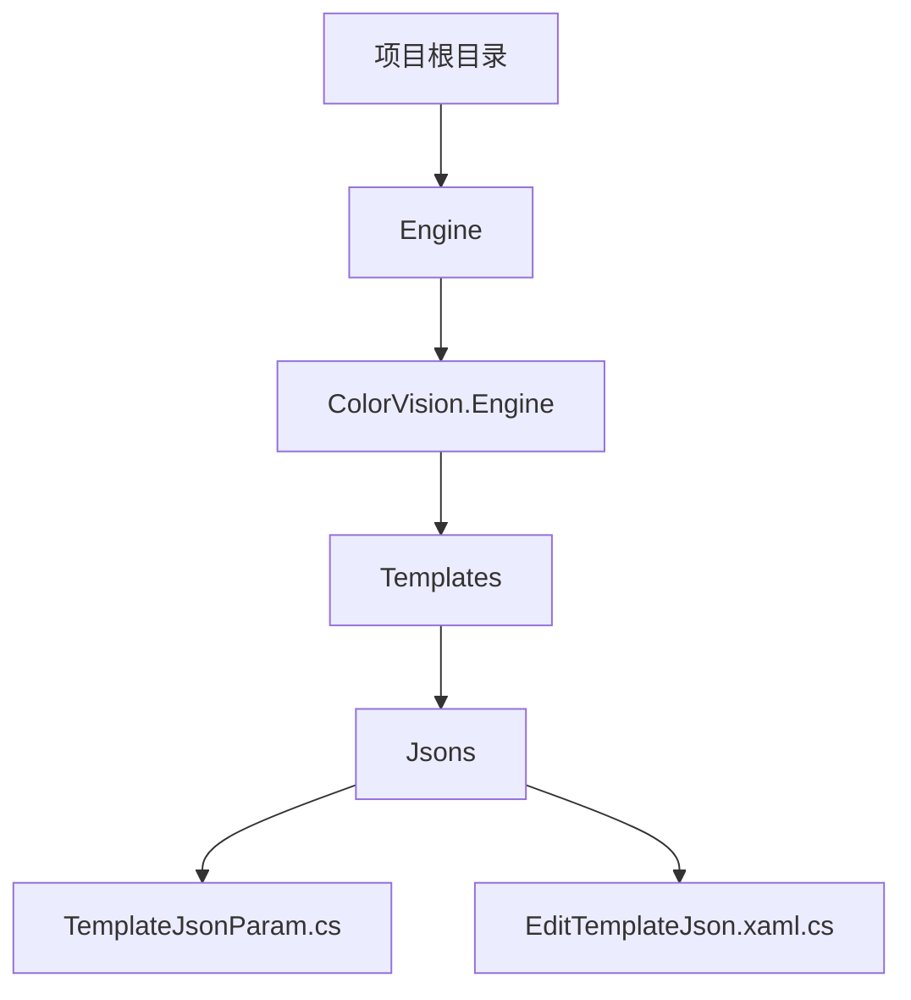
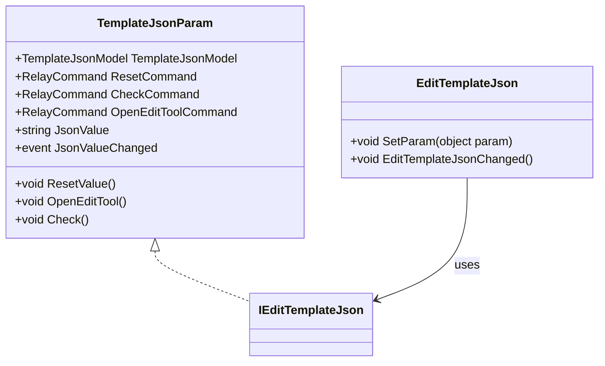

# 基于JSON的通用模板


# 基于JSON的通用模板

## 目录
1. [介绍](#介绍)
2. [项目结构](#项目结构)
3. [核心组件](#核心组件)
4. [架构概览](#架构概览)
5. [详细组件分析](#详细组件分析)
6. [依赖关系分析](#依赖关系分析)
7. [性能考虑](#性能考虑)
8. [故障排查指南](#故障排查指南)
9. [结论](#结论)
10. [附录](#附录)

## 介绍
本项目实现了一个基于JSON配置的通用算法模板框架，支持通过编辑JSON文件灵活定义复杂的算法逻辑和参数，广泛应用于黑斑（BlackMura）、KB等多种场景。该模板极大提升了算法开发的灵活性和可扩展性，使用户无需修改代码即可通过配置JSON实现算法定制。

本文档旨在详细介绍该项目的代码结构、核心组件、架构设计及其功能实现，帮助不同技术水平的用户理解和使用该通用模板。

## 项目结构

项目采用模块化设计，代码按照功能和技术层次划分为多个目录。核心的算法模板及其JSON配置相关代码主要集中在`/Engine/ColorVision.Engine/Templates/Jsons`目录下。项目整体结构包括：



- `/Engine/ColorVision.Engine/Templates/Jsons`：存放基于JSON的算法模板相关代码，实现了JSON配置的读取、编辑和校验功能。
- `/Projects`：包含各个具体项目如BlackMura、KB等，体现了基于通用模板的具体应用。
- `/UI`、`/Plugins`等目录：负责用户界面、插件管理等辅助功能。

该结构清晰，功能分区明确，有助于维护和扩展。

## 核心组件

基于JSON配置的通用模板的关键组件包括：

1. **TemplateJsonParam.cs**  
   - 负责JSON配置参数的封装与操作。
   - 实现了对JSON字符串的校验、格式化、美化。
   - 提供重置配置、打开外部编辑工具的命令接口。
   - 通过事件机制通知JSON内容变更。

2. **EditTemplateJson.xaml.cs**  
   - 提供基于AvalonEdit控件的JSON编辑界面。
   - 支持代码缩进、行号显示、内容变更事件的防抖处理。
   - 绑定到`TemplateJsonParam`，实现UI与数据的双向同步。
   - 提供帮助按钮，链接在线JSON编辑工具。

## 架构概览

整体架构围绕“模板参数-编辑界面-算法执行”流程设计：

- **数据层**：`TemplateJsonParam`封装JSON配置数据，支持数据库关联（通过`DicTemplateJsonDao`访问字典数据）。
- **表示层**：`EditTemplateJson`作为用户控件，提供友好的JSON编辑体验，支持实时预览和校验。
- **服务层**：命令模式（`RelayCommand`）实现用户操作的解耦，方便扩展如重置、校验、打开编辑工具等功能。
- **事件机制**：通过`JsonValueChanged`事件实现数据与界面的同步更新，保证配置变更即时反映。

此架构保证了配置的灵活性和系统的可维护性。

## 详细组件分析

### 1. TemplateJsonParam.cs

此类继承自`ParamBase`，实现接口`IEditTemplateJson`，封装了JSON配置数据及相关操作。

主要成员及功能：

- `TemplateJsonModel TemplateJsonModel`  
  存储JSON配置的模型数据，包含JSON字符串及元信息。

- `RelayCommand ResetCommand`  
  重置JSON配置为数据库中默认值。

- `RelayCommand CheckCommand`  
  触发配置校验事件。

- `RelayCommand OpenEditToolCommand`  
  打开外部JSON编辑器（HTML页面）以辅助编辑。

- `string JsonValue`  
  JSON字符串属性，设置时自动校验格式并美化显示。

- `event EventHandler JsonValueChanged`  
  JSON内容变更事件，供界面监听。

- `void ResetValue()`  
  从数据库加载默认JSON配置，失败时弹窗提示。

- `void OpenEditTool()`  
  复制当前JSON到剪贴板，启动编辑器页面。

示例代码片段：

```csharp
public string JsonValue
{
    get => JsonHelper.BeautifyJson(TemplateJsonModel.JsonVal);
    set
    {
        if (JsonHelper.IsValidJson(value))
        {
            TemplateJsonModel.JsonVal = value;
            NotifyPropertyChanged();
        }
    }
}
```

此设计确保了JSON数据的有效性和格式美观，方便用户编辑和后续解析。

### 2. EditTemplateJson.xaml.cs

该类为WPF用户控件，基于AvalonEdit实现功能丰富的JSON编辑器。

关键点：

- 初始化时设置编辑器宽度、行号显示、缩进策略。
- 文本变更时，使用防抖定时器避免频繁事件触发，提高性能。
- 通过`SetParam`方法绑定`IEditTemplateJson`接口，实现数据与UI同步。
- 提供帮助按钮，链接至在线JSON格式化工具，并复制当前JSON到剪贴板。

示例代码片段：

```csharp
public void EditTemplateJsonChanged()
{
    Application.Current.Dispatcher.Invoke(() =>
    {
        if (IEditTemplateJson != null)
        {
            IEditTemplateJson.JsonValue = textEditor.Text;
        }
    });
}
```

此控件为用户提供了直观、易用的JSON编辑体验，极大提升了配置的灵活性。

## 依赖关系分析

- `TemplateJsonParam`依赖于`TemplateJsonModel`和数据库访问对象`DicTemplateJsonDao`，实现数据持久化和默认配置加载。
- `EditTemplateJson`依赖于`IEditTemplateJson`接口，实现对不同JSON参数对象的通用编辑。
- `RelayCommand`实现命令模式，解耦UI操作和业务逻辑。
- 使用`JsonHelper`进行JSON格式校验和美化，保证配置的正确性。
- 通过`Common.NativeMethods.Clipboard`操作剪贴板，提升交互便捷性。

## 性能考虑

- JSON编辑时采用防抖机制（50ms延迟）减少频繁的事件处理，提升编辑性能。
- JSON字符串的格式化和校验操作在设置时执行，避免无效数据进入系统。
- 启动外部编辑器通过系统默认程序打开HTML文件，轻量且快速。

## 故障排查指南

- 若重置JSON配置失败，提示“无法重置，请检查数据库相关配置”，应检查数据库连接及字典表数据完整性。
- 编辑器显示异常或内容不同步，检查事件订阅是否正确，确认`SetParam`调用是否正确绑定数据。
- 外部编辑器无法启动，确认项目根目录下`Assets/Tool/EditJson/Editjson.html`文件存在且路径正确。

## 结论

本项目通过基于JSON的通用模板设计，实现了灵活且强大的算法配置能力。用户可通过直观的JSON编辑界面快速定义复杂算法参数，无需修改代码即可适配多场景应用，如黑斑检测、KB检测等。该设计极大提升了系统的扩展性和维护性，是工业视觉检测领域的高效解决方案。

## 附录

### 相关源码链接

- [TemplateJsonParam.cs](https://github.com/xincheng213618/scgd_general_wpf/blob/master/Engine/ColorVision.Engine/Templates/Jsons/TemplateJsonParam.cs)
- [EditTemplateJson.xaml.cs](https://github.com/xincheng213618/scgd_general_wpf/blob/master/Engine/ColorVision.Engine/Templates/Jsons/EditTemplateJson.xaml.cs)

### Mermaid 类图示例



