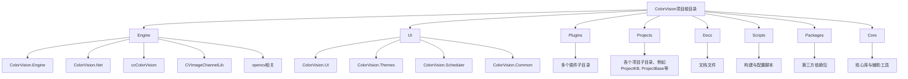
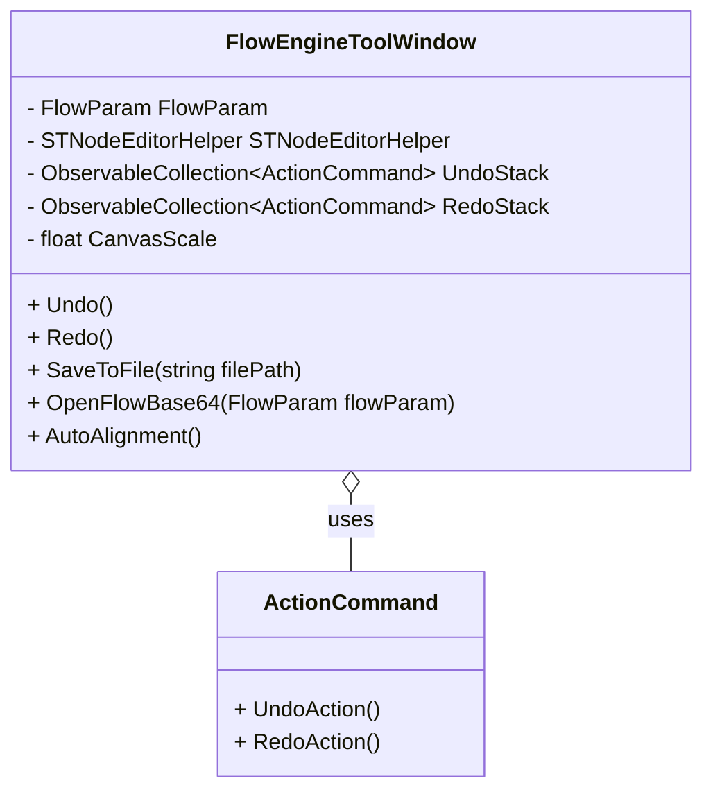

# 算法引擎与模板


# 算法引擎与模板

## 目录
1. [引言](#引言)
2. [项目结构](#项目结构)
3. [核心组件](#核心组件)
4. [架构概览](#架构概览)
5. [详细组件分析](#详细组件分析)
    - [模板管理窗口 (TemplateManagerWindow.xaml.cs)](#模板管理窗口-TemplateManagerWindowxamlcs)
    - [流程引擎工具窗口 (FlowEngineToolWindow.xaml.cs)](#流程引擎工具窗口-FlowEngineToolWindowxamlcs)
6. [依赖分析](#依赖分析)
7. [性能考虑](#性能考虑)
8. [故障排除指南](#故障排除指南)
9. [总结](#总结)

---

## 引言
本文档旨在深入探讨 ColorVision 软件中的算法引擎与模板系统，重点解析如何通过模板进行图像分析与数据处理任务。文中将详细说明模板的创建、管理，以及内置算法流程引擎的工作机制，帮助用户和开发者理解系统架构与实现细节。

---

## 项目结构

ColorVision 项目采用模块化和分层架构，代码按功能和技术划分，便于维护和扩展。主要目录及其职责如下：



- **Engine**：核心算法引擎及相关服务，包含算法实现、模板系统、设备服务、数据库操作等。此目录是算法与模板系统的主要实现区。
- **UI**：用户界面相关，包括主题、调度器、通用控件和界面逻辑。
- **Plugins**：插件系统，支持功能扩展。
- **Projects**：各个具体项目实例或应用，基于引擎和UI构建。
- **Docs**：项目文档。
- **Scripts**：自动化构建、部署脚本。
- **Packages**：第三方依赖库。
- **Core**：核心库和OpenCV相关封装。

此结构体现了“分层”和“模块化”的设计思想，算法核心与UI分离，支持插件扩展和多项目并行开发。

---

## 核心组件

围绕算法引擎与模板系统，核心组件包括：

- **模板管理**（TemplateManagerWindow）：负责模板的浏览、搜索、编辑和管理。
- **流程引擎工具**（FlowEngineToolWindow）：支持基于节点编辑的流程设计，内置Undo/Redo操作，支持流程文件保存与加载。
- **模板定义与实现**：各类模板接口与实现，支持图像分析、数据处理等多种算法。
- **设备服务与算法服务**：算法引擎调用底层设备，执行数据采集与处理。
- **数据库操作层**：模板及结果数据持久化。

---

## 架构概览

ColorVision 算法引擎与模板系统架构采用组件化设计，关键点如下：

- **模板系统**：基于接口（如 `ITemplate`、`ISearch` 等）定义模板行为，支持多种模板类型扩展。
- **流程引擎**：基于节点编辑器（STNodeEditor），实现流程图的可视化编辑与执行。
- **UI层**：使用 WPF 技术，支持模板管理窗口和流程编辑窗口，提供良好用户交互体验。
- **命令模式**：流程编辑器中实现 Undo/Redo 功能，利用命令栈管理操作。
- **数据持久化**：流程数据支持Base64编码存储，模板配置支持数据库存储与文件导入导出。

整体架构确保算法灵活组合，模板可复用，用户可自定义流程，适应多样化图像分析需求。

---

## 详细组件分析

### 模板管理窗口 (TemplateManagerWindow.xaml.cs)

#### 文件作用
该文件实现了模板管理窗口的界面逻辑，允许用户浏览所有模板，搜索模板，并打开模板编辑窗口进行修改。

#### 主要类与方法

1. **MenuTemplateManagerWindow**
   - 继承自 `MenuItemBase`
   - 定义菜单项“模板管理”，点击执行打开模板管理窗口。

2. **TemplateManagerWindow**
   - 继承自 WPF 的 `Window`
   - 维护模板名称集合 `keyValuePairs`
   - `Window_Initialized`：初始化时加载所有模板名称，绑定到列表视图。
   - 搜索框事件处理：
     - `Searchbox_GotFocus`：获得焦点时加载搜索项。
     - `Searchbox_TextChanged`：文本变化时根据关键词过滤模板，更新搜索结果列表。
     - 支持键盘上下选择和回车执行搜索结果命令。
   - 模板列表选择事件 `ListView2_SelectionChanged`：选择模板后打开对应的模板编辑窗口。

#### 代码片段示例

```csharp
private void Searchbox_TextChanged(object sender, TextChangedEventArgs e)
{
    if (sender is TextBox textBox)
    {
        string searchtext = textBox.Text;
        if (string.IsNullOrWhiteSpace(searchtext))
        {
            SearchPopup.IsOpen = false;
        }
        else
        {
            SearchPopup.IsOpen = true;
            var keywords = searchtext.Split(Chars, StringSplitOptions.RemoveEmptyEntries);
            filteredResults = Searches
                .OfType\<ISearch\>()
                .Where(template => keywords.All(keyword =>
                    template.Header.Contains(keyword, StringComparison.OrdinalIgnoreCase) ||
                    template.GuidId.ToString().Contains(keyword, StringComparison.OrdinalIgnoreCase)
                    ))
                .ToList();
            ListView1.ItemsSource = filteredResults;
            if (filteredResults.Count > 0)
            {
                ListView1.SelectedIndex = 0;
            }
        }
    }
}
```

#### 设计特点
- 利用 WPF 数据绑定实现动态列表更新。
- 支持多关键词搜索，提升用户查找模板效率。
- 采用面向接口设计，模板通过 `ITemplateName` 和 `ISearch` 接口统一管理。

---

### 流程引擎工具窗口 (FlowEngineToolWindow.xaml.cs)

#### 文件作用
实现基于节点编辑器的流程设计工具窗口，支持流程的创建、编辑、保存、加载及撤销重做操作。

#### 主要类与成员

- **FlowEngineToolWindow**
  - 继承自 `Window`，实现 `INotifyPropertyChanged` 以支持数据绑定。
  - 属性：
    - `FlowParam`：流程参数数据模型。
    - `STNodeEditorHelper`：节点编辑器辅助类，封装节点操作和布局。
    - `UndoStack` 和 `RedoStack`：命令栈，实现撤销和重做功能。
    - `CanvasScale`：画布缩放比例，支持放大缩小。
  - 方法：
    - 撤销 `Undo()` 和重做 `Redo()` 操作，管理命令栈。
    - `OpenFlowBase64()`：从Base64字符串加载流程。
    - `SaveToFile()`：保存流程到文件。
    - 画布操作支持键盘箭头移动、放大缩小、节点移动与删除。
    - 自动布局和自动保存功能。
  - 事件：
    - 鼠标事件支持画布拖动和平移。
    - 键盘快捷键支持保存、刷新和自动对齐。

#### 代码片段示例

```csharp
public void Undo()
{
    if (UndoStack.Count > 0)
    {
        var undoAction = UndoStack[^1];
        UndoStack.RemoveAt(UndoStack.Count - 1);
        undoAction.UndoAction();
        RedoStack.Add(undoAction);
    }
}
```

#### 设计特点
- 采用命令模式管理用户操作，支持撤销重做。
- 使用第三方节点编辑库（STNodeEditor）实现流程图编辑。
- 支持流程数据的序列化与反序列化，方便存储与传输。
- UI响应灵敏，支持键盘和鼠标多种交互方式。
- 代码结构清晰，职责分明，易于扩展。

#### Mermaid 类图示例



---

## 依赖分析

- **UI层依赖**：模板管理窗口依赖 `ColorVision.UI` 和菜单系统，流程引擎工具窗口依赖 `ST.Library.UI.NodeEditor` 节点编辑库。
- **模板接口依赖**：模板系统基于接口如 `ITemplateName`、`ISearch` 设计，支持多态扩展。
- **日志与异常处理**：利用 `log4net` 进行日志记录，保证流程异常可追踪。
- **数据持久化**：流程数据以Base64形式存储，支持文件保存与数据库同步。
- **命令模式实现**：撤销/重做功能依赖命令栈管理，保证操作的可逆性。

---

## 性能考虑

- 搜索功能通过关键词分割实现多条件过滤，提升搜索效率。
- 流程编辑器采用虚拟化绘图和事件驱动，保证大规模节点编辑时响应速度。
- 撤销重做操作仅保存操作命令，避免重复数据存储，节省内存。
- 流程数据序列化采用二进制形式，节省存储空间与传输带宽。

---

## 故障排除指南

- **模板搜索无结果**：确认搜索关键词正确，避免空格和大小写错误。
- **流程文件加载失败**：检查文件路径和格式，确保Base64数据完整且无损坏。
- **撤销重做失效**：确认操作已加入命令栈，且命令实现了正确的Undo/Redo逻辑。
- **界面卡顿**：避免同时加载大量节点，适当使用自动布局功能优化显示。

---

## 总结

ColorVision 算法引擎与模板系统通过模块化设计，实现了灵活高效的模板管理和流程编辑功能。模板管理窗口支持模板的搜索与编辑，流程引擎工具窗口则提供了强大的流程设计与操作能力。系统采用命令模式、接口编程、数据持久化等设计原则，确保了良好的扩展性和用户体验。本文档详细解读了两个核心窗口的实现，为用户和开发者深入理解和使用提供了有力支持。

