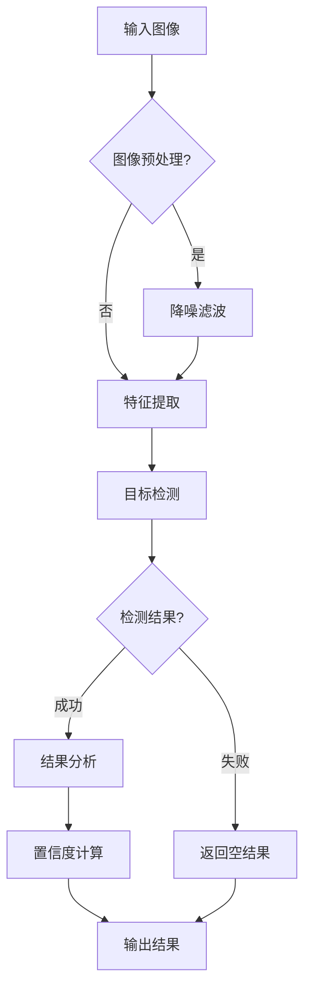
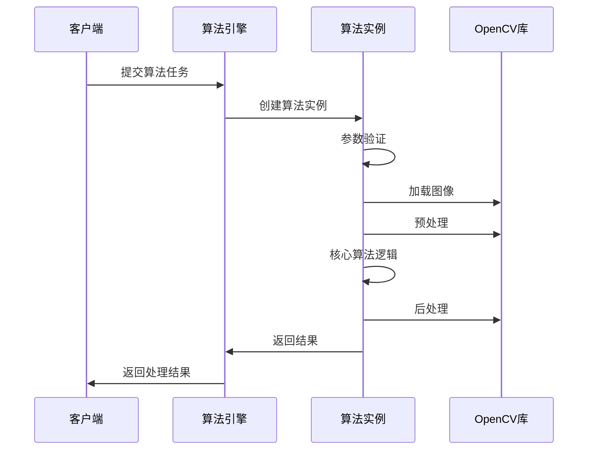

# Algorithm Template

---
**Metadata:**
- Title: [Algorithm Name in English]
- Status: draft | complete | in-progress
- Updated: YYYY-MM-DD
- Author: [Author Name]
- Algorithm ID: [unique-algorithm-id]
---

## 算法名称

**英文标识**: [algorithm-identifier]  
**中文名称**: [算法中文名称]

## 描述

一句话描述算法的主要功能和用途。

## 输入

### 输入参数

| 参数名称 | 类型 | 必选 | 默认值 | 说明 |
|---------|------|------|--------|------|
| inputImage | Mat | ✓ | - | 输入图像，支持 BGR/RGB/Gray 格式 |
| threshold | double | ✗ | 0.5 | 阈值参数，范围 0.0-1.0 |
| regionOfInterest | Rect | ✗ | 全图 | 感兴趣区域 |
| algorithmParams | Dictionary | ✗ | {} | 算法特定参数 |

### 输入约束

- 图像尺寸: 最小 64x64，最大 4096x4096
- 图像格式: 支持 8位/16位深度
- 内存要求: 图像大小 < 100MB
- 特殊要求: [如有特殊输入要求]

## 输出

### 输出结果

| 字段名称 | 类型 | 说明 |
|---------|------|------|
| success | bool | 算法执行是否成功 |
| result | object | 算法处理结果 |
| confidence | double | 结果置信度 (0.0-1.0) |
| executionTime | TimeSpan | 算法执行耗时 |
| metadata | Dictionary | 附加元数据信息 |

### 输出格式示例

```json
{
  "success": true,
  "result": {
    "detected": true,
    "count": 3,
    "locations": [
      {"x": 100, "y": 150, "width": 50, "height": 30},
      {"x": 200, "y": 250, "width": 45, "height": 35}
    ]
  },
  "confidence": 0.87,
  "executionTime": "00:00:01.234",
  "metadata": {
    "algorithm_version": "1.2.3",
    "model_used": "default",
    "preprocessing_applied": true
  }
}
```

## 参数

### 详细参数说明

| 名称 | 类型 | 默认 | 范围 | 说明 |
|------|------|------|------|------|
| threshold | double | 0.5 | 0.0-1.0 | 检测阈值，值越小越敏感 |
| minArea | int | 100 | 1-10000 | 最小检测区域面积（像素） |
| maxArea | int | 5000 | 100-50000 | 最大检测区域面积（像素） |
| enablePreprocess | bool | true | - | 是否启用图像预处理 |
| debugMode | bool | false | - | 调试模式，输出中间结果 |

### 参数组合建议

- **高精度模式**: threshold=0.3, minArea=50
- **高性能模式**: threshold=0.7, enablePreprocess=false
- **平衡模式**: 使用默认参数

## 处理流程

### 算法流程图



### 时序图



## 性能

### 性能指标

| 指标 | 典型值 | 最优值 | 说明 |
|------|--------|--------|------|
| 处理速度 | 500ms | 100ms | 1920x1080 图像 |
| 内存使用 | 150MB | 80MB | 峰值内存占用 |
| 准确率 | 85% | 95% | 基于测试数据集 |
| CPU 使用率 | 60% | 30% | 单核使用率 |

### 性能优化建议

1. **GPU 加速**: 启用 CUDA 支持可提升 3-5 倍性能
2. **图像预处理**: 关闭不必要的预处理步骤
3. **ROI 限制**: 设置合适的感兴趣区域
4. **参数调优**: 根据具体场景调整阈值参数

### 性能测试

```csharp
[Benchmark]
public class AlgorithmPerformanceTest
{
    private readonly Mat testImage;
    private readonly AlgorithmParameters parameters;
    
    [Benchmark]
    public AlgorithmResult ProcessStandardImage()
    {
        return algorithm.Process(testImage, parameters);
    }
    
    [Benchmark]
    public AlgorithmResult ProcessWithGPU()
    {
        parameters.UseGPU = true;
        return algorithm.Process(testImage, parameters);
    }
}
```

## 常见错误

### 错误分类

#### 输入错误
- **图像为空**: 检查输入图像是否正确加载
- **格式不支持**: 转换为支持的图像格式
- **尺寸超限**: 调整图像尺寸至允许范围内

#### 参数错误
- **阈值越界**: threshold 必须在 0.0-1.0 范围内
- **区域无效**: ROI 必须在图像范围内
- **参数类型错误**: 检查参数类型是否正确

#### 运行时错误
- **内存不足**: 释放不必要的资源或使用更小的图像
- **GPU 错误**: 检查 CUDA 驱动和显卡内存
- **算法超时**: 增加超时时间或优化参数

### 错误处理示例

```csharp
public AlgorithmResult ProcessImage(Mat image, AlgorithmParameters param)
{
    try
    {
        // 输入验证
        if (image == null || image.Empty())
        {
            return AlgorithmResult.Error("输入图像为空");
        }
        
        if (param.Threshold < 0 || param.Threshold > 1)
        {
            return AlgorithmResult.Error("阈值参数超出范围 [0,1]");
        }
        
        // 算法处理
        var result = ProcessCore(image, param);
        return AlgorithmResult.Success(result);
    }
    catch (OutOfMemoryException ex)
    {
        return AlgorithmResult.Error($"内存不足: {ex.Message}");
    }
    catch (TimeoutException ex)
    {
        return AlgorithmResult.Error($"算法执行超时: {ex.Message}");
    }
    catch (Exception ex)
    {
        return AlgorithmResult.Error($"未知错误: {ex.Message}");
    }
}
```

## 扩展点

### 算法接口

实现 `IAlgorithm` 接口来创建自定义算法：

```csharp
public interface IAlgorithm
{
    string AlgorithmId { get; }
    string Name { get; }
    string Version { get; }
    
    AlgorithmResult Process(Mat image, AlgorithmParameters parameters);
    Task\<AlgorithmResult\> ProcessAsync(Mat image, AlgorithmParameters parameters);
    
    bool ValidateParameters(AlgorithmParameters parameters);
    AlgorithmInfo GetAlgorithmInfo();
}
```

### 扩展示例

```csharp
[Algorithm("custom-detection", "自定义检测算法")]
public class CustomDetectionAlgorithm : IAlgorithm
{
    public string AlgorithmId => "custom-detection";
    public string Name => "自定义检测算法";
    public string Version => "1.0.0";
    
    public AlgorithmResult Process(Mat image, AlgorithmParameters parameters)
    {
        // 实现具体算法逻辑
        return ProcessCore(image, parameters);
    }
    
    public async Task\<AlgorithmResult\> ProcessAsync(Mat image, AlgorithmParameters parameters)
    {
        return await Task.Run(() => Process(image, parameters));
    }
    
    public bool ValidateParameters(AlgorithmParameters parameters)
    {
        // 参数验证逻辑
        return parameters != null && 
               parameters.Threshold >= 0 && 
               parameters.Threshold <= 1;
    }
}
```

## 示例调用

### C# 代码示例

```csharp
// 基本使用
var algorithm = AlgorithmFactory.Create("ghost-detection");
var image = Cv2.ImRead("test.jpg");
var parameters = new AlgorithmParameters
{
    Threshold = 0.6,
    MinArea = 100,
    EnablePreprocess = true
};

var result = await algorithm.ProcessAsync(image, parameters);
if (result.Success)
{
    Console.WriteLine($"检测完成，置信度: {result.Confidence}");
    Console.WriteLine($"执行时间: {result.ExecutionTime}");
}

// 批量处理
var images = Directory.GetFiles("images", "*.jpg");
var results = new List\\<AlgorithmResult\>();

foreach (var imagePath in images)
{
    var img = Cv2.ImRead(imagePath);
    var res = await algorithm.ProcessAsync(img, parameters);
    results.Add(res);
    img.Dispose(); // 释放资源
}

// 统计结果
var successCount = results.Count(r => r.Success);
var avgConfidence = results.Where(r => r.Success).Average(r => r.Confidence);
```

### 配置文件示例

```json
{
  "algorithm": {
    "id": "ghost-detection",
    "version": "1.2.0",
    "parameters": {
      "threshold": 0.5,
      "minArea": 100,
      "maxArea": 5000,
      "enablePreprocess": true,
      "debugMode": false
    },
    "performance": {
      "useGPU": true,
      "maxMemory": "200MB",
      "timeout": "00:00:30"
    }
  }
}
```

## 变更记录

| 版本 | 日期 | 变更内容 | 作者 |
|------|------|----------|------|
| 1.0.0 | 2024-01-01 | 初始版本 | 开发团队 |
| 1.1.0 | 2024-02-15 | 添加GPU加速支持 | 算法团队 |
| 1.2.0 | 2024-03-20 | 优化性能，添加批处理模式 | 算法团队 |

---

*最后更新: 2024-09-28 | 状态: template*