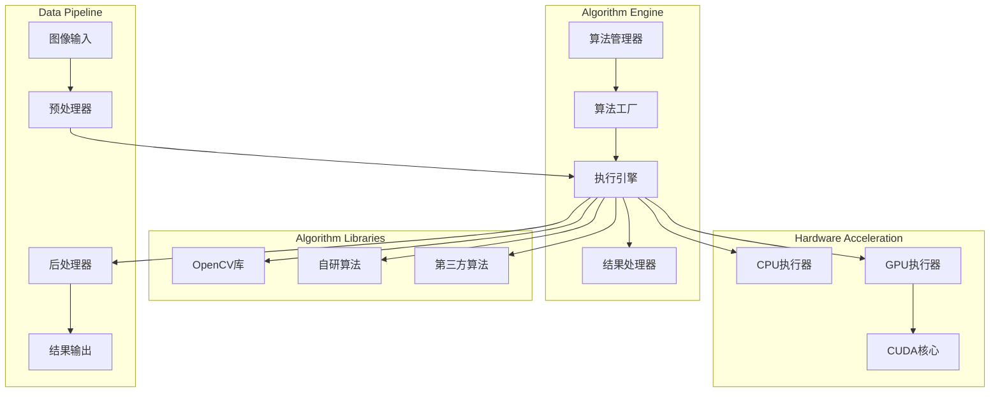
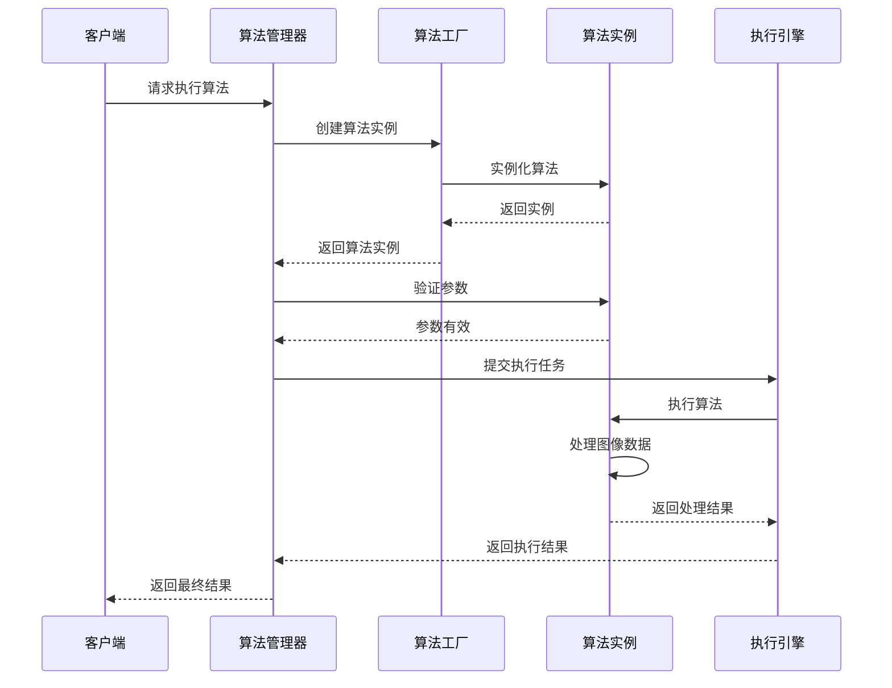

# Algorithms Overview

---
**Metadata:**
- Title: Algorithms Overview - ColorVision Algorithm System
- Status: draft
- Updated: 2024-09-28
- Author: ColorVision Development Team
---

## 简介

ColorVision 算法系统提供丰富的图像处理和分析算法，支持多种应用场景，从基础的图像预处理到复杂的缺陷检测和质量分析。

## 目录

1. [算法分类](#算法分类)
2. [核心算法库](#核心算法库)
3. [算法引擎架构](#算法引擎架构)
4. [性能特性](#性能特性)
5. [扩展机制](#扩展机制)
6. [使用指南](#使用指南)

## 算法分类

### 图像预处理算法

| 算法名称 | 功能描述 | 文档链接 | 状态 |
|---------|----------|----------|------|
| 噪声滤波 | 去除图像噪声，提升图像质量 | [noise-filter.md](noise-filter.md) | ✅ |
| 对比度增强 | 增强图像对比度和清晰度 | [contrast-enhancement.md](contrast-enhancement.md) | ✅ |
| 几何校正 | 图像几何变换和畸变校正 | [distortion.md](distortion.md) | 📝 |
| 色彩空间转换 | RGB、HSV、LAB等色彩空间转换 | [color-space.md](color-space.md) | ✅ |

### 特征检测算法

| 算法名称 | 功能描述 | 文档链接 | 状态 |
|---------|----------|----------|------|
| 边缘检测 | Canny、Sobel等边缘检测算法 | [edge-detection.md](edge-detection.md) | ✅ |
| 角点检测 | Harris、FAST等角点检测 | [corner-detection.md](corner-detection.md) | ✅ |
| 轮廓提取 | 目标轮廓提取和分析 | [contour-extraction.md](contour-extraction.md) | ✅ |
| 纹理分析 | LBP、GLCM等纹理特征提取 | [texture-analysis.md](texture-analysis.md) | 📝 |

### 缺陷检测算法

| 算法名称 | 功能描述 | 文档链接 | 状态 |
|---------|----------|----------|------|
| Mura 检测 | 显示面板 Mura 缺陷检测 | [mura-detection.md](mura-detection.md) | ✅ |
| 划痕检测 | 表面划痕和瑕疵检测 | [scratch-detection.md](scratch-detection.md) | ✅ |
| 重影检测 | 显示重影现象检测 | [ghost-detection.md](ghost-detection.md) | 📝 |
| 污点检测 | 表面污点和异物检测 | [spot-detection.md](spot-detection.md) | ✅ |

### 测量与分析算法

| 算法名称 | 功能描述 | 文档链接 | 状态 |
|---------|----------|----------|------|
| 尺寸测量 | 长度、面积、周长等测量 | [dimension-measurement.md](dimension-measurement.md) | ✅ |
| 形状分析 | 形状特征分析和匹配 | [shape-analysis.md](shape-analysis.md) | ✅ |
| POI 分析 | 关注点识别和分析 | [poi-analysis.md](poi-analysis.md) | 📝 |
| 色差计算 | 颜色差异计算和评估 | [color-difference.md](color-difference.md) | ✅ |

## 核心算法库

### OpenCV 集成

ColorVision 深度集成 OpenCV 库，提供：

- **图像 I/O**: 支持多种图像格式读写
- **基础运算**: 矩阵运算、图像变换
- **高级算法**: 机器学习、深度学习算法
- **GPU 加速**: CUDA 和 OpenCL 支持

```csharp
// OpenCV 使用示例
using OpenCvSharp;

public class ImageProcessor
{
    public Mat ProcessImage(Mat inputImage)
    {
        var output = new Mat();
        
        // 高斯模糊
        Cv2.GaussianBlur(inputImage, output, new Size(5, 5), 0);
        
        // 边缘检测
        Cv2.Canny(output, output, 100, 200);
        
        return output;
    }
}
```

### 自研算法

基于业务需求开发的专用算法：

- **显示质量评估**: 专门针对显示设备的质量检测
- **光学特性分析**: 亮度、色度、均匀性分析
- **缺陷智能识别**: 基于机器学习的缺陷分类

## 算法引擎架构

### 整体架构



### 算法生命周期



## 性能特性

### 并行处理

```csharp
public class ParallelImageProcessor
{
    public async Task<List\\<AlgorithmResult>\> ProcessBatchAsync(
        List\\<Mat\> images, 
        IAlgorithm algorithm)
    {
        var tasks = images.Select(async (image, index) => 
        {
            var result = await algorithm.ProcessAsync(image);
            return new { Index = index, Result = result };
        });
        
        var results = await Task.WhenAll(tasks);
        return results.OrderBy(r => r.Index).Select(r => r.Result).ToList();
    }
}
```

### GPU 加速

```csharp
public class GPUAcceleratedAlgorithm : IAlgorithm
{
    private readonly bool _useGPU;
    
    public GPUAcceleratedAlgorithm(bool useGPU = true)
    {
        _useGPU = useGPU && Cv2.HaveOpenCL();
    }
    
    public AlgorithmResult Process(Mat input, AlgorithmParameters parameters)
    {
        if (_useGPU)
        {
            using var gpuInput = new GpuMat();
            using var gpuOutput = new GpuMat();
            
            gpuInput.Upload(input);
            ProcessOnGPU(gpuInput, gpuOutput, parameters);
            
            var output = new Mat();
            gpuOutput.Download(output);
            return new AlgorithmResult { OutputImage = output };
        }
        else
        {
            return ProcessOnCPU(input, parameters);
        }
    }
}
```

### 性能监控

```csharp
public class AlgorithmPerformanceMonitor
{
    private readonly Dictionary\\<string, PerformanceMetrics\> _metrics = new();
    
    public void RecordExecution(string algorithmId, TimeSpan duration, bool success)
    {
        if (!_metrics.ContainsKey(algorithmId))
        {
            _metrics[algorithmId] = new PerformanceMetrics();
        }
        
        var metrics = _metrics[algorithmId];
        metrics.TotalExecutions++;
        metrics.TotalDuration += duration;
        
        if (success)
        {
            metrics.SuccessfulExecutions++;
        }
        
        metrics.AverageExecutionTime = TimeSpan.FromTicks(
            metrics.TotalDuration.Ticks / metrics.TotalExecutions);
        
        metrics.SuccessRate = (double)metrics.SuccessfulExecutions / metrics.TotalExecutions;
    }
}
```

## 扩展机制

### 自定义算法接口

```csharp
/// \<summary\>
/// 算法基础接口
/// </summary>
public interface IAlgorithm
{
    string AlgorithmId { get; }
    string Name { get; }
    string Version { get; }
    
    AlgorithmResult Process(Mat input, AlgorithmParameters parameters);
    Task\<AlgorithmResult\> ProcessAsync(Mat input, AlgorithmParameters parameters);
    
    bool ValidateParameters(AlgorithmParameters parameters);
    AlgorithmInfo GetAlgorithmInfo();
}

/// \<summary\>
/// 算法注册属性
/// </summary>
[AttributeUsage(AttributeTargets.Class)]
public class AlgorithmAttribute : Attribute
{
    public string AlgorithmId { get; }
    public string Name { get; }
    public string Category { get; set; }
    
    public AlgorithmAttribute(string algorithmId, string name)
    {
        AlgorithmId = algorithmId;
        Name = name;
    }
}
```

### 算法插件开发

```csharp
[Algorithm("custom.edge.detector", "自定义边缘检测")]
public class CustomEdgeDetector : IAlgorithm
{
    public string AlgorithmId => "custom.edge.detector";
    public string Name => "自定义边缘检测算法";
    public string Version => "1.0.0";
    
    public AlgorithmResult Process(Mat input, AlgorithmParameters parameters)
    {
        // 自定义算法实现
        var threshold1 = parameters.GetValue\<double\>("threshold1", 100);
        var threshold2 = parameters.GetValue\<double\>("threshold2", 200);
        
        var output = new Mat();
        Cv2.Canny(input, output, threshold1, threshold2);
        
        return new AlgorithmResult
        {
            Success = true,
            OutputImage = output,
            Metadata = new Dictionary\\<string, object\>
            {
                ["threshold1"] = threshold1,
                ["threshold2"] = threshold2,
                ["edgeCount"] = CountEdgePixels(output)
            }
        };
    }
    
    public async Task\<AlgorithmResult\> ProcessAsync(Mat input, AlgorithmParameters parameters)
    {
        return await Task.Run(() => Process(input, parameters));
    }
}
```

## 使用指南

### 基本使用流程

```csharp
// 1. 获取算法实例
var algorithm = AlgorithmFactory.GetAlgorithm("ghost-detection");

// 2. 设置参数
var parameters = new AlgorithmParameters
{
    ["threshold"] = 0.5,
    ["minArea"] = 100,
    ["maxArea"] = 5000
};

// 3. 加载图像
var image = Cv2.ImRead("test-image.jpg");

// 4. 执行算法
var result = await algorithm.ProcessAsync(image, parameters);

// 5. 处理结果
if (result.Success)
{
    Console.WriteLine($"检测完成，置信度: {result.Confidence}");
    Cv2.ImWrite("result.jpg", result.OutputImage);
}
else
{
    Console.WriteLine($"检测失败: {result.ErrorMessage}");
}
```

### 批量处理示例

```csharp
public async Task ProcessImageBatchAsync(string inputFolder, string outputFolder)
{
    var algorithm = AlgorithmFactory.GetAlgorithm("mura-detection");
    var parameters = new AlgorithmParameters { /* 参数设置 */ };
    
    var imageFiles = Directory.GetFiles(inputFolder, "*.jpg");
    var semaphore = new SemaphoreSlim(Environment.ProcessorCount);
    
    var tasks = imageFiles.Select(async imageFile =>
    {
        await semaphore.WaitAsync();
        try
        {
            var image = Cv2.ImRead(imageFile);
            var result = await algorithm.ProcessAsync(image, parameters);
            
            if (result.Success)
            {
                var outputPath = Path.Combine(outputFolder, 
                    Path.GetFileNameWithoutExtension(imageFile) + "_result.jpg");
                Cv2.ImWrite(outputPath, result.OutputImage);
            }
            
            return result;
        }
        finally
        {
            semaphore.Release();
        }
    });
    
    var results = await Task.WhenAll(tasks);
    
    // 统计结果
    var successCount = results.Count(r => r.Success);
    var avgConfidence = results.Where(r => r.Success).Average(r => r.Confidence);
    
    Console.WriteLine($"处理完成: {successCount}/{results.Length} 成功");
    Console.WriteLine($"平均置信度: {avgConfidence:F2}");
}
```

### 性能优化建议

1. **预热算法**: 首次执行前进行预热
2. **批量处理**: 利用并行处理能力
3. **GPU 加速**: 适当使用 GPU 算法
4. **内存管理**: 及时释放图像资源
5. **参数调优**: 根据具体场景调整参数

---

*最后更新: 2024-09-28 | 状态: draft*