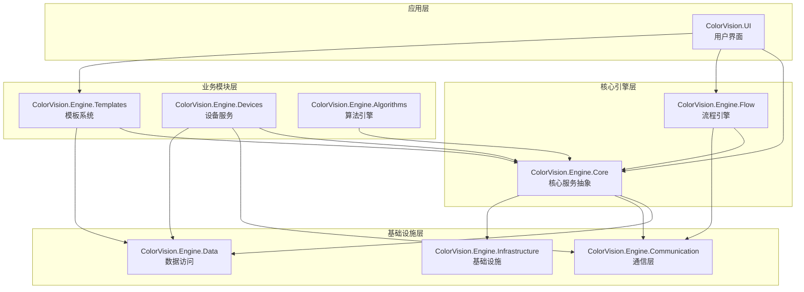

# ColorVision.Engine DLL 拆分与优化计划

## 📋 文档概述

**文档版本**: v1.0  
**创建日期**: 2025-01-08  
**目标**: 将 ColorVision.Engine 单体DLL拆分为多个模块化组件，提高代码可维护性、可测试性和可扩展性

---

## 🎯 项目现状分析

### 当前架构概况

ColorVision.Engine 是一个包含所有业务核心逻辑的单体DLL，具有以下特征：

#### 代码规模
- **总文件数**: 704个文件（580个.cs文件 + 124个.xaml文件）
- **主要模块**:
  - Services: 197个文件（设备管理、服务管理）
  - Templates: 316个文件（模板系统、算法模板）
  - MQTT: 6个文件（通信层）
  - 其他: Dao、Media、Messages、Utilities等

#### 主要功能模块
1. **流程引擎系统** (Templates/Flow)
   - FlowEngineManager: 流程引擎管理
   - TemplateFlow: 流程模板管理
   - FlowParam: 流程参数配置

2. **设备服务管理** (Services/Devices)
   - Camera: 相机设备服务
   - Spectrum: 光谱仪设备服务
   - SMU: 源测量单元服务
   - Motor: 电机控制服务
   - Algorithm: 算法设备服务
   - ThirdPartyAlgorithms: 第三方算法集成

3. **模板系统** (Templates)
   - POI: 兴趣点分析模板
   - ARVR: AR/VR相关算法模板（MTF、SFR、FOV、Distortion、Ghost）
   - JND: 图像质量评估
   - LedCheck: LED检测
   - 其他专项模板

4. **数据访问层** (Dao)
   - 数据库访问
   - 实体模型管理
   - 批量测量管理

5. **通信层** (MQTT)
   - MQTT消息处理
   - 设备通信协议

6. **物理设备管理**
   - PhyCameras: 物理相机管理
   - PhySpectrums: 物理光谱仪管理

#### 依赖关系
- **外部DLL依赖**:
  - CVCommCore.dll
  - MQTTMessageLib.dll
  
- **项目依赖**:
  - ColorVision.UI
  - ColorVision.Database
  - ColorVision.FileIO
  - cvColorVision (算法库)
  - FlowEngineLib
  - ST.Library.UI
  - ColorVision.ImageEditor
  - ColorVision.Scheduler
  - ColorVision.Solution
  - ColorVision.SocketProtocol

- **NuGet包依赖** (关键):
  - MQTTnet 4.3.4: MQTT通信
  - SqlSugarCore 5.1.4: ORM数据访问
  - OpenCvSharp4 4.11.0: 图像处理
  - ScottPlot.WPF 5.0.56: 数据可视化
  - MathNet.Numerics 5.0.0: 数学计算

### 存在的问题

#### 1. 架构问题
- ✗ **高耦合度**: 所有业务逻辑集中在一个DLL中
- ✗ **单一职责违背**: 一个DLL承担多种职责（设备、模板、流程、数据）
- ✗ **难以测试**: 单体架构导致单元测试困难
- ✗ **部署不灵活**: 无法按需加载模块

#### 2. 可维护性问题
- ✗ **代码量庞大**: 580+个C#文件难以管理
- ✗ **模块边界模糊**: 没有清晰的模块划分
- ✗ **循环依赖风险**: 模块间可能存在循环依赖
- ✗ **修改影响面大**: 修改一个功能可能影响整个DLL

#### 3. 可扩展性问题
- ✗ **插件机制不完善**: 难以动态加载新设备类型
- ✗ **算法扩展困难**: 添加新算法需要修改核心代码
- ✗ **第三方集成复杂**: 集成外部系统需要修改主DLL

#### 4. 性能问题
- ✗ **启动时间长**: 加载所有功能模块
- ✗ **内存占用高**: 所有模块常驻内存
- ✗ **热更新不支持**: 无法在运行时更新模块

---

## 🏗️ 拆分方案设计

### 模块化架构目标



### 拆分后的模块结构

#### 1. ColorVision.Engine.Core (核心抽象层)
**职责**: 定义核心接口、抽象类和服务契约

**包含内容**:
- 接口定义 (IService, IDevice, ITemplate, IAlgorithm)
- 抽象基类
- 服务总线
- 事件系统
- 配置管理
- 依赖注入容器

**文件规模**: ~50-80个文件

**关键接口**:
```csharp
namespace ColorVision.Engine.Core
{
    // 服务接口
    public interface IEngineService
    {
        string ServiceCode { get; }
        Task\<bool\> InitializeAsync();
        Task\<bool\> StartAsync();
        Task StopAsync();
    }
    
    // 设备接口
    public interface IDeviceService : IEngineService
    {
        DeviceType Type { get; }
        DeviceStatus Status { get; }
        Task\<DeviceResponse\> ExecuteCommandAsync(DeviceCommand command);
    }
    
    // 模板接口
    public interface ITemplateEngine
    {
        string TemplateType { get; }
        Task\<TemplateResult\> ExecuteAsync(TemplateParam param);
        Task\<bool\> ValidateAsync(TemplateParam param);
    }
    
    // 事件系统
    public interface IEventBus
    {
        void Publish\<TEvent\>(TEvent eventData) where TEvent : class;
        void Subscribe\<TEvent\>(Action\<TEvent\> handler) where TEvent : class;
    }
}
```

**依赖**: 
- ColorVision.Common (基础工具类)
- Microsoft.Extensions.DependencyInjection

---

#### 2. ColorVision.Engine.Flow (流程引擎模块)
**职责**: 流程设计、执行和管理

**包含内容**:
- FlowEngineManager
- FlowEngine执行器
- 流程节点定义
- 流程模板管理
- 流程状态监控

**文件规模**: ~40-60个文件

**主要类**:
- `FlowEngineManager`: 流程引擎管理器
- `FlowExecutor`: 流程执行器
- `FlowNodeBase`: 流程节点基类
- `FlowTemplateManager`: 流程模板管理
- `FlowControlData`: 流程控制数据

**依赖**:
- ColorVision.Engine.Core
- FlowEngineLib (现有流程引擎库)
- ColorVision.Engine.Communication (MQTT通信)

---

#### 3. ColorVision.Engine.Templates (模板系统模块)
**职责**: 算法模板管理和执行

**包含内容**:
- 模板基类和接口
- 模板管理器
- 各类算法模板实现:
  - POI模板
  - ARVR系列模板
  - 图像处理模板
  - 数据分析模板

**文件规模**: ~200-250个文件

**子模块结构**:
```
ColorVision.Engine.Templates/
├── Core/                    # 模板核心抽象
│   ├── ITemplate.cs
│   ├── TemplateBase.cs
│   └── TemplateManager.cs
├── POI/                     # 兴趣点分析
├── ARVR/                    # AR/VR算法
│   ├── MTF/
│   ├── SFR/
│   ├── FOV/
│   ├── Distortion/
│   └── Ghost/
├── ImageProcessing/         # 图像处理
│   ├── LEDStripDetection/
│   ├── LedCheck/
│   └── ImageCropping/
└── Analysis/                # 数据分析
    ├── JND/
    ├── Compliance/
    └── Matching/
```

**依赖**:
- ColorVision.Engine.Core
- ColorVision.Engine.Data
- cvColorVision (算法库)
- OpenCvSharp4

---

#### 4. ColorVision.Engine.Devices (设备服务模块)
**职责**: 设备管理、控制和通信

**包含内容**:
- 设备服务基类
- 设备管理器
- 各类设备实现:
  - Camera (相机)
  - Spectrum (光谱仪)
  - SMU (源测量单元)
  - Motor (电机)
  - Sensor (传感器)
  - PG (图像生成器)

**文件规模**: ~150-180个文件

**子模块结构**:
```
ColorVision.Engine.Devices/
├── Core/                    # 设备核心抽象
│   ├── IDevice.cs
│   ├── DeviceBase.cs
│   ├── DeviceManager.cs
│   └── DeviceServiceBase.cs
├── Camera/                  # 相机设备
│   ├── CameraService.cs
│   ├── CameraConfig.cs
│   ├── Templates/
│   └── Views/
├── Spectrum/                # 光谱仪
├── SMU/                     # 源测量单元
├── Motor/                   # 电机控制
├── Sensor/                  # 传感器
├── PG/                      # 图像生成器
└── ThirdParty/             # 第三方设备集成
```

**依赖**:
- ColorVision.Engine.Core
- ColorVision.Engine.Communication
- ColorVision.Engine.Data
- CVCommCore.dll

---

#### 5. ColorVision.Engine.Algorithms (算法引擎模块)
**职责**: 算法执行和管理（独立于设备的纯算法）

**包含内容**:
- 算法服务
- 算法节点
- 第三方算法集成
- 算法参数管理

**文件规模**: ~40-60个文件

**主要组件**:
- AlgorithmService
- AlgorithmNodeBase
- ThirdPartyAlgorithmManager
- AlgorithmExecutor

**依赖**:
- ColorVision.Engine.Core
- ColorVision.Engine.Templates
- cvColorVision

---

#### 6. ColorVision.Engine.Data (数据访问层)
**职责**: 数据库访问、实体管理、数据持久化

**包含内容**:
- Dao层实现
- 实体模型
- 数据库初始化
- 批量数据管理
- 归档管理

**文件规模**: ~60-80个文件

**主要组件**:
```csharp
namespace ColorVision.Engine.Data
{
    // 数据访问接口
    public interface IRepository\<T\> where T : class
    {
        Task\<T\> GetByIdAsync(int id);
        Task<IEnumerable\<T\>> GetAllAsync();
        Task\<int\> AddAsync(T entity);
        Task\<bool\> UpdateAsync(T entity);
        Task\<bool\> DeleteAsync(int id);
    }
    
    // 数据库上下文
    public class EngineDbContext
    {
        // 实体模型配置
    }
    
    // 批量数据管理
    public class MeasureBatchManager
    {
        // 批量测量数据管理
    }
}
```

**依赖**:
- ColorVision.Engine.Core
- ColorVision.Database
- SqlSugarCore

---

#### 7. ColorVision.Engine.Communication (通信层)
**职责**: 设备通信、消息传递、网络协议

**包含内容**:
- MQTT通信
- TCP/IP通信
- 串口通信
- 消息定义和处理
- 通信协议实现

**文件规模**: ~30-50个文件

**主要组件**:
- MQTTService
- MQTTMessageHandler
- DeviceMessageProcessor
- CommunicationProtocol

**依赖**:
- ColorVision.Engine.Core
- MQTTnet
- MQTTMessageLib.dll
- System.IO.Ports

---

#### 8. ColorVision.Engine.Infrastructure (基础设施)
**职责**: 工具类、扩展方法、通用功能

**包含内容**:
- 日志系统
- 配置管理
- 文件处理
- 报表生成
- 媒体处理
- 工具插件

**文件规模**: ~40-60个文件

**主要组件**:
- Logger
- ConfigurationManager
- FileHelper
- ReportGenerator
- MediaProcessor

**依赖**:
- ColorVision.Engine.Core
- log4net
- ColorVision.FileIO

---

#### 9. ColorVision.Engine.PhysicalDevices (物理设备管理)
**职责**: 物理设备配置和管理

**包含内容**:
- PhyCameraManager (物理相机管理)
- PhySpectrumManager (物理光谱仪管理)
- 设备分组
- 设备配置

**文件规模**: ~20-30个文件

**依赖**:
- ColorVision.Engine.Core
- ColorVision.Engine.Devices
- ColorVision.Engine.Data

---

## 📊 模块依赖关系矩阵

| 模块 | Core | Flow | Templates | Devices | Algorithms | Data | Communication | Infrastructure | PhysicalDevices |
|------|------|------|-----------|---------|------------|------|---------------|----------------|-----------------|
| **Core** | - | ✗ | ✗ | ✗ | ✗ | ✗ | ✗ | ✗ | ✗ |
| **Flow** | ✓ | - | ✗ | ✗ | ✗ | ✗ | ✓ | ✓ | ✗ |
| **Templates** | ✓ | ✗ | - | ✗ | ✗ | ✓ | ✗ | ✓ | ✗ |
| **Devices** | ✓ | ✗ | ✗ | - | ✗ | ✓ | ✓ | ✓ | ✗ |
| **Algorithms** | ✓ | ✗ | ✓ | ✗ | - | ✗ | ✗ | ✓ | ✗ |
| **Data** | ✓ | ✗ | ✗ | ✗ | ✗ | - | ✗ | ✓ | ✗ |
| **Communication** | ✓ | ✗ | ✗ | ✗ | ✗ | ✗ | - | ✓ | ✗ |
| **Infrastructure** | ✓ | ✗ | ✗ | ✗ | ✗ | ✗ | ✗ | - | ✗ |
| **PhysicalDevices** | ✓ | ✗ | ✗ | ✓ | ✗ | ✓ | ✗ | ✓ | - |

**依赖规则**:
- ✓ = 允许依赖
- ✗ = 不允许依赖
- 所有模块都可以依赖 Core
- 业务模块之间避免直接依赖
- 通过 Core 中的接口进行交互

---

## 🚀 实施路线图

### 阶段 1: 准备阶段 (1-2周)

#### 1.1 代码分析和评估
- [ ] 详细分析现有代码依赖关系
- [ ] 识别循环依赖和强耦合点
- [ ] 评估拆分风险和影响范围
- [ ] 制定详细的文件迁移清单

#### 1.2 基础设施搭建
- [ ] 创建新的解决方案结构
- [ ] 建立CI/CD流程
- [ ] 配置单元测试框架
- [ ] 搭建文档生成系统

#### 1.3 接口设计
- [ ] 设计 Core 模块的核心接口
- [ ] 定义模块间通信契约
- [ ] 设计事件系统
- [ ] 设计依赖注入容器

**交付物**:
- 详细的依赖关系图
- 核心接口设计文档
- 新项目结构骨架
- 迁移计划文档

---

### 阶段 2: Core 模块开发 (2-3周)

#### 2.1 创建 ColorVision.Engine.Core 项目
```bash
# 项目结构
ColorVision.Engine.Core/
├── Abstractions/           # 抽象接口
│   ├── IEngineService.cs
│   ├── IDeviceService.cs
│   ├── ITemplateEngine.cs
│   └── IAlgorithmService.cs
├── Services/              # 核心服务
│   ├── ServiceBus.cs
│   ├── EventBus.cs
│   └── ServiceRegistry.cs
├── DependencyInjection/   # DI容器
│   ├── ServiceCollectionExtensions.cs
│   └── ServiceProvider.cs
├── Configuration/         # 配置管理
│   ├── EngineConfig.cs
│   └── ConfigurationManager.cs
└── Models/               # 核心模型
    ├── ServiceInfo.cs
    ├── DeviceInfo.cs
    └── TemplateInfo.cs
```

#### 2.2 实现核心功能
- [ ] 实现服务总线
- [ ] 实现事件系统
- [ ] 实现依赖注入
- [ ] 实现配置管理
- [ ] 编写单元测试

#### 2.3 文档编写
- [ ] API参考文档
- [ ] 架构设计文档
- [ ] 使用指南

**交付物**:
- ColorVision.Engine.Core.dll
- 完整的单元测试套件
- API文档

---

### 阶段 3: Infrastructure 和 Communication 模块 (2周)

#### 3.1 ColorVision.Engine.Infrastructure
- [ ] 迁移 Utilities 目录
- [ ] 迁移工具类
- [ ] 迁移报表生成
- [ ] 迁移媒体处理
- [ ] 编写单元测试

#### 3.2 ColorVision.Engine.Communication
- [ ] 迁移 MQTT 通信层
- [ ] 重构消息处理
- [ ] 实现通信抽象
- [ ] 编写单元测试

**交付物**:
- ColorVision.Engine.Infrastructure.dll
- ColorVision.Engine.Communication.dll
- 单元测试和文档

---

### 阶段 4: Data 模块 (2周)

#### 4.1 创建 ColorVision.Engine.Data
- [ ] 迁移 Dao 目录
- [ ] 重构数据访问层
- [ ] 实现仓储模式
- [ ] 数据库迁移脚本
- [ ] 编写单元测试

#### 4.2 数据层优化
- [ ] 优化数据库查询
- [ ] 实现缓存机制
- [ ] 实现批量操作
- [ ] 性能测试

**交付物**:
- ColorVision.Engine.Data.dll
- 数据库迁移脚本
- 单元测试和文档

---

### 阶段 5: Devices 模块 (3-4周)

#### 5.1 创建设备抽象层
- [ ] 从 Services/Core 提取设备基类
- [ ] 定义设备接口
- [ ] 实现设备管理器

#### 5.2 迁移设备实现
- [ ] 迁移 Camera 设备
- [ ] 迁移 Spectrum 设备
- [ ] 迁移 SMU 设备
- [ ] 迁移 Motor 设备
- [ ] 迁移其他设备

#### 5.3 设备测试
- [ ] 单元测试
- [ ] 集成测试
- [ ] 硬件模拟测试

**交付物**:
- ColorVision.Engine.Devices.dll
- 设备接口文档
- 测试报告

---

### 阶段 6: Templates 和 Algorithms 模块 (4-5周)

#### 6.1 ColorVision.Engine.Templates
- [ ] 创建模板抽象层
- [ ] 迁移 POI 模板
- [ ] 迁移 ARVR 系列模板
- [ ] 迁移图像处理模板
- [ ] 迁移分析模板

#### 6.2 ColorVision.Engine.Algorithms
- [ ] 迁移算法服务
- [ ] 迁移第三方算法集成
- [ ] 实现算法执行器

#### 6.3 模板和算法测试
- [ ] 单元测试
- [ ] 算法精度测试
- [ ] 性能测试

**交付物**:
- ColorVision.Engine.Templates.dll
- ColorVision.Engine.Algorithms.dll
- 算法文档和测试报告

---

### 阶段 7: Flow 模块 (2-3周)

#### 7.1 创建 ColorVision.Engine.Flow
- [ ] 迁移 FlowEngineManager
- [ ] 迁移流程节点
- [ ] 迁移流程模板
- [ ] 重构流程执行器

#### 7.2 流程引擎测试
- [ ] 单元测试
- [ ] 流程执行测试
- [ ] 性能测试

**交付物**:
- ColorVision.Engine.Flow.dll
- 流程引擎文档
- 测试报告

---

### 阶段 8: PhysicalDevices 模块 (1周)

#### 8.1 创建 ColorVision.Engine.PhysicalDevices
- [ ] 迁移 PhyCameras
- [ ] 迁移 PhySpectrums
- [ ] 实现物理设备管理

**交付物**:
- ColorVision.Engine.PhysicalDevices.dll
- 配置文档

---

### 阶段 9: 集成和测试 (2-3周)

#### 9.1 系统集成
- [ ] 集成所有模块
- [ ] 更新 ColorVision.UI
- [ ] 配置依赖注入
- [ ] 解决集成问题

#### 9.2 全面测试
- [ ] 单元测试全覆盖
- [ ] 集成测试
- [ ] 系统测试
- [ ] 性能测试
- [ ] 压力测试

#### 9.3 文档完善
- [ ] 架构文档更新
- [ ] API文档完善
- [ ] 迁移指南
- [ ] 故障排查指南

**交付物**:
- 完整的模块化系统
- 测试报告
- 完整文档集

---

### 阶段 10: 部署和优化 (1-2周)

#### 10.1 部署准备
- [ ] 打包发布
- [ ] 版本管理
- [ ] 发布说明

#### 10.2 性能优化
- [ ] 启动时间优化
- [ ] 内存占用优化
- [ ] 加载性能优化

#### 10.3 后续支持
- [ ] 监控和日志
- [ ] Bug修复流程
- [ ] 持续优化计划

**交付物**:
- 生产就绪的系统
- 性能报告
- 运维手册

---

## 📈 预期收益

### 技术收益

#### 1. 可维护性提升
- ✓ **模块独立**: 每个模块职责单一，易于理解
- ✓ **边界清晰**: 通过接口定义明确的模块边界
- ✓ **影响范围可控**: 修改一个模块不会影响其他模块
- ✓ **代码审查简化**: 可以针对单个模块进行代码审查

**量化指标**:
- 单个模块平均文件数: 50-200个（vs. 当前580个）
- 代码审查时间: 减少60%
- Bug定位时间: 减少50%

#### 2. 可测试性提升
- ✓ **单元测试**: 每个模块可独立测试
- ✓ **模拟对象**: 通过接口轻松创建Mock对象
- ✓ **集成测试**: 可以选择性集成模块进行测试
- ✓ **测试覆盖率**: 目标达到80%以上

**量化指标**:
- 单元测试覆盖率: 0% → 80%+
- 测试执行时间: 单个模块 < 1分钟
- 测试维护成本: 降低70%

#### 3. 可扩展性提升
- ✓ **插件化**: 支持动态加载设备和算法插件
- ✓ **新功能添加**: 无需修改核心代码
- ✓ **第三方集成**: 提供标准接口便于集成
- ✓ **版本独立**: 模块可独立升级版本

**量化指标**:
- 新设备集成时间: 5天 → 2天
- 新算法添加时间: 3天 → 1天
- 第三方集成成本: 降低50%

#### 4. 性能提升
- ✓ **按需加载**: 只加载需要的模块
- ✓ **启动优化**: 延迟初始化非核心模块
- ✓ **内存优化**: 未使用模块不占用内存
- ✓ **并行加载**: 模块可并行初始化

**量化指标**:
- 启动时间: 减少40%
- 内存占用: 减少30%
- 模块加载时间: < 500ms/模块

#### 5. 部署灵活性
- ✓ **模块化部署**: 可选择性部署模块
- ✓ **热更新**: 支持运行时更新模块
- ✓ **版本管理**: 独立的版本控制
- ✓ **回滚能力**: 可独立回滚模块

### 业务收益

#### 1. 开发效率
- 团队可并行开发不同模块
- 减少代码冲突和合并问题
- 缩短功能交付周期

#### 2. 质量保证
- 更高的代码质量
- 更少的Bug
- 更快的问题定位和修复

#### 3. 成本节约
- 降低维护成本
- 减少测试成本
- 提高代码复用率

---

## ⚠️ 风险和挑战

### 技术风险

#### 1. 依赖关系复杂
**风险**: 现有代码可能存在复杂的循环依赖

**应对策略**:
- 使用依赖分析工具（NDepend, SonarQube）
- 逐步解耦，分阶段拆分
- 必要时引入中介模式打破循环依赖
- 建立依赖检查CI流程

#### 2. 接口设计不当
**风险**: 接口设计过于复杂或过于简单

**应对策略**:
- 遵循SOLID原则
- 进行接口设计评审
- 保持接口的稳定性
- 提供向后兼容的版本升级路径

#### 3. 性能回退
**风险**: 模块化可能引入额外的抽象层开销

**应对策略**:
- 建立性能基准测试
- 持续监控性能指标
- 优化热点代码路径
- 使用性能分析工具

#### 4. 数据迁移问题
**风险**: 数据库结构变更可能影响现有数据

**应对策略**:
- 保持数据库结构兼容性
- 提供数据迁移脚本
- 充分测试迁移过程
- 保留回滚方案

### 项目风险

#### 1. 时间周期长
**风险**: 完整拆分需要3-4个月

**应对策略**:
- 分阶段交付
- 优先拆分高价值模块
- 并行开发多个模块
- 保持主线开发不受影响

#### 2. 团队协作
**风险**: 需要团队成员适应新架构

**应对策略**:
- 提供详细的文档和培训
- 建立代码审查机制
- 定期技术分享
- 配置开发指南和最佳实践

#### 3. 兼容性问题
**风险**: 可能影响现有功能

**应对策略**:
- 保持API兼容性
- 完整的回归测试
- 逐步迁移策略
- 提供过渡期支持

---

## 🔧 技术实施细节

### 1. 依赖注入配置

```csharp
// Startup.cs
public class Startup
{
    public void ConfigureServices(IServiceCollection services)
    {
        // 1. 注册核心服务
        services.AddEngineCore();
        
        // 2. 注册基础设施
        services.AddEngineInfrastructure(options =>
        {
            options.LogLevel = LogLevel.Information;
            options.ConfigPath = "config.json";
        });
        
        // 3. 注册通信层
        services.AddEngineCommunication(options =>
        {
            options.MqttBroker = "localhost";
            options.MqttPort = 1883;
        });
        
        // 4. 注册数据层
        services.AddEngineData(options =>
        {
            options.ConnectionString = "Server=localhost;Database=ColorVision;";
            options.UseMySql = true;
        });
        
        // 5. 注册设备模块
        services.AddEngineDevices(devices =>
        {
            devices.RegisterCamera();
            devices.RegisterSpectrum();
            devices.RegisterSMU();
            devices.RegisterMotor();
        });
        
        // 6. 注册模板引擎
        services.AddEngineTemplates(templates =>
        {
            templates.RegisterPOI();
            templates.RegisterARVR();
            templates.RegisterImageProcessing();
        });
        
        // 7. 注册算法引擎
        services.AddEngineAlgorithms();
        
        // 8. 注册流程引擎
        services.AddEngineFlow();
        
        // 9. 注册物理设备
        services.AddEnginePhysicalDevices();
    }
    
    public void Configure(IApplicationBuilder app)
    {
        // 初始化引擎
        app.UseEngineCore();
    }
}
```

### 2. 服务总线实现

```csharp
// ColorVision.Engine.Core/Services/ServiceBus.cs
public class ServiceBus : IServiceBus
{
    private readonly IServiceProvider _serviceProvider;
    private readonly IEventBus _eventBus;
    private readonly Dictionary\\<string, IEngineService\> _services = new();
    
    public ServiceBus(IServiceProvider serviceProvider, IEventBus eventBus)
    {
        _serviceProvider = serviceProvider;
        _eventBus = eventBus;
    }
    
    public async Task\<TService> GetServiceAsync<TService\>() 
        where TService : class, IEngineService
    {
        var service = _serviceProvider.GetService\<TService\>();
        
        if (service != null && !_services.ContainsKey(service.ServiceCode))
        {
            await service.InitializeAsync();
            _services[service.ServiceCode] = service;
        }
        
        return service;
    }
    
    public async Task\<TResult> ExecuteAsync<TResult\>(
        string serviceCode, 
        Func\<IEngineService, Task<TResult>\> action)
    {
        if (!_services.TryGetValue(serviceCode, out var service))
        {
            throw new ServiceNotFoundException(serviceCode);
        }
        
        return await action(service);
    }
}
```

### 3. 事件系统实现

```csharp
// ColorVision.Engine.Core/Services/EventBus.cs
public class EventBus : IEventBus
{
    private readonly ConcurrentDictionary\<Type, List\\<Delegate>\> _handlers = new();
    
    public void Publish\<TEvent\>(TEvent eventData) where TEvent : class
    {
        var eventType = typeof(TEvent);
        
        if (_handlers.TryGetValue(eventType, out var handlers))
        {
            foreach (var handler in handlers.ToList())
            {
                try
                {
                    ((Action\<TEvent\>)handler)(eventData);
                }
                catch (Exception ex)
                {
                    // 记录异常，但不影响其他处理器
                    Logger.Error($"Error in event handler: {ex}");
                }
            }
        }
    }
    
    public void Subscribe\<TEvent\>(Action\<TEvent\> handler) where TEvent : class
    {
        var eventType = typeof(TEvent);
        
        _handlers.AddOrUpdate(
            eventType,
            new List\\<Delegate\> { handler },
            (key, existing) =>
            {
                existing.Add(handler);
                return existing;
            });
    }
    
    public void Unsubscribe\<TEvent\>(Action\<TEvent\> handler) where TEvent : class
    {
        var eventType = typeof(TEvent);
        
        if (_handlers.TryGetValue(eventType, out var handlers))
        {
            handlers.Remove(handler);
        }
    }
}
```

### 4. 模块间通信示例

```csharp
// 设备服务发布事件
public class CameraService : DeviceServiceBase
{
    private readonly IEventBus _eventBus;
    
    public async Task\<CaptureResult\> CaptureImageAsync()
    {
        // 执行拍照
        var result = await PerformCaptureAsync();
        
        // 发布事件
        _eventBus.Publish(new ImageCapturedEvent
        {
            DeviceCode = this.DeviceCode,
            ImagePath = result.ImagePath,
            Timestamp = DateTime.Now
        });
        
        return result;
    }
}

// 模板引擎订阅事件
public class POITemplateEngine : TemplateEngineBase
{
    private readonly IEventBus _eventBus;
    
    public POITemplateEngine(IEventBus eventBus)
    {
        _eventBus = eventBus;
        
        // 订阅图像捕获事件
        _eventBus.Subscribe\<ImageCapturedEvent\>(OnImageCaptured);
    }
    
    private void OnImageCaptured(ImageCapturedEvent evt)
    {
        // 自动处理新捕获的图像
        _ = ProcessImageAsync(evt.ImagePath);
    }
}
```

### 5. 插件化支持

```csharp
// ColorVision.Engine.Core/Plugin/IEnginePlugin.cs
public interface IEnginePlugin
{
    string PluginName { get; }
    string Version { get; }
    
    void RegisterServices(IServiceCollection services);
    void Initialize(IServiceProvider serviceProvider);
}

// 插件加载器
public class PluginLoader
{
    private readonly List\\<IEnginePlugin\> _plugins = new();
    
    public void LoadPlugins(string pluginDirectory)
    {
        var assemblies = Directory.GetFiles(pluginDirectory, "*.dll")
            .Select(Assembly.LoadFrom);
        
        foreach (var assembly in assemblies)
        {
            var pluginTypes = assembly.GetTypes()
                .Where(t => typeof(IEnginePlugin).IsAssignableFrom(t) && !t.IsAbstract);
            
            foreach (var type in pluginTypes)
            {
                var plugin = (IEnginePlugin)Activator.CreateInstance(type);
                _plugins.Add(plugin);
            }
        }
    }
    
    public void RegisterPlugins(IServiceCollection services)
    {
        foreach (var plugin in _plugins)
        {
            plugin.RegisterServices(services);
        }
    }
}

// 使用示例
public class CustomDevicePlugin : IEnginePlugin
{
    public string PluginName => "Custom Device Plugin";
    public string Version => "1.0.0";
    
    public void RegisterServices(IServiceCollection services)
    {
        services.AddTransient\<IDeviceService, CustomDeviceService\>();
    }
    
    public void Initialize(IServiceProvider serviceProvider)
    {
        // 初始化插件
    }
}
```

---

## 📚 文档和培训计划

### 文档体系

#### 1. 架构文档
- [ ] 系统架构概览
- [ ] 模块划分说明
- [ ] 依赖关系图
- [ ] 数据流图

#### 2. API文档
- [ ] Core模块API
- [ ] 各业务模块API
- [ ] 接口使用示例
- [ ] 常见问题解答

#### 3. 开发指南
- [ ] 编码规范
- [ ] 模块开发指南
- [ ] 单元测试指南
- [ ] 调试技巧

#### 4. 运维文档
- [ ] 部署指南
- [ ] 配置说明
- [ ] 监控和日志
- [ ] 故障排查

### 培训计划

#### 阶段1: 架构培训 (1周)
- 新架构概览
- 模块职责划分
- 依赖注入原理
- 事件驱动架构

#### 阶段2: 开发培训 (2周)
- Core模块使用
- 服务开发规范
- 单元测试编写
- 调试和问题定位

#### 阶段3: 实战演练 (1周)
- 开发自定义设备插件
- 开发自定义算法模板
- 集成测试实践
- 代码审查实践

---

## 🎯 成功标准

### 技术指标

#### 1. 代码质量
- [ ] 单元测试覆盖率 ≥ 80%
- [ ] 代码复杂度 (圈复杂度) ≤ 10
- [ ] 代码重复率 ≤ 5%
- [ ] 静态分析无严重问题

#### 2. 性能指标
- [ ] 启动时间 ≤ 5秒
- [ ] 模块加载时间 ≤ 500ms
- [ ] 内存占用降低 ≥ 30%
- [ ] API响应时间 ≤ 100ms

#### 3. 可维护性指标
- [ ] 平均单模块文件数 ≤ 200
- [ ] 模块间耦合度 ≤ 20%
- [ ] 代码审查时间降低 ≥ 60%
- [ ] Bug修复时间降低 ≥ 50%

### 业务指标

#### 1. 开发效率
- [ ] 新功能开发时间降低 ≥ 40%
- [ ] 并行开发能力提升 ≥ 3倍
- [ ] 代码冲突减少 ≥ 70%

#### 2. 质量指标
- [ ] Bug数量降低 ≥ 50%
- [ ] 严重Bug降低 ≥ 80%
- [ ] 测试覆盖范围提升 ≥ 100%

#### 3. 交付能力
- [ ] 发布周期缩短 ≥ 30%
- [ ] 热修复能力提升
- [ ] 回滚成功率 100%

---

## 📝 总结

### 核心价值

本次 ColorVision.Engine DLL 拆分和优化计划的核心价值在于：

1. **架构升级**: 从单体架构升级为模块化架构，提升系统的整体质量
2. **效率提升**: 通过模块化开发和测试，显著提升团队效率
3. **风险降低**: 降低系统复杂度，减少潜在的技术债务
4. **未来就绪**: 为系统的长期演进奠定坚实基础

### 关键成功因素

1. **渐进式迁移**: 分阶段、有计划地进行拆分，降低风险
2. **接口先行**: 优先设计和稳定核心接口
3. **持续测试**: 在每个阶段都进行充分测试
4. **文档完善**: 提供完整的文档和培训支持
5. **团队协作**: 保持良好的沟通和协作

### 后续优化方向

1. **微服务化**: 考虑将部分模块进一步拆分为独立的微服务
2. **容器化**: 支持Docker容器化部署
3. **云原生**: 支持云环境下的弹性伸缩
4. **AI集成**: 预留AI算法集成能力
5. **性能优化**: 持续优化性能和资源占用

---

## 📞 联系和支持

### 项目团队
- **架构师**: [负责人姓名]
- **技术负责人**: [负责人姓名]
- **项目经理**: [负责人姓名]

### 相关资源
- 项目Wiki: [链接]
- 代码仓库: [链接]
- 问题跟踪: [链接]
- 技术讨论组: [链接]

---

**文档状态**: 初稿  
**下次审查日期**: [日期]  
**版本历史**:
- v1.0 (2025-01-08): 初始版本

